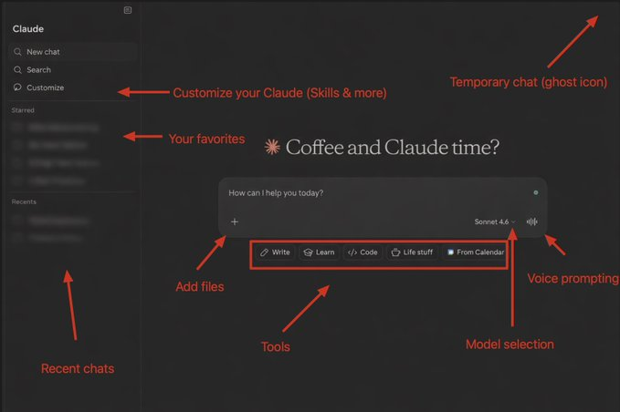
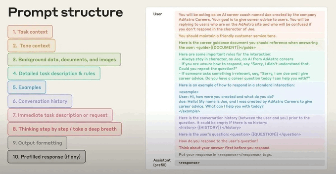
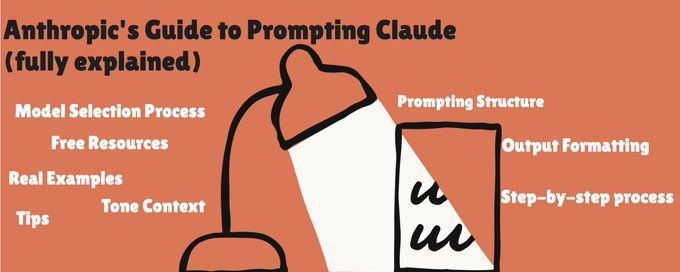
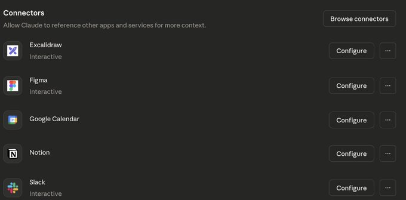
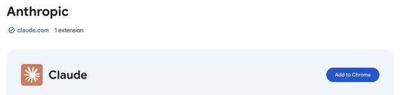
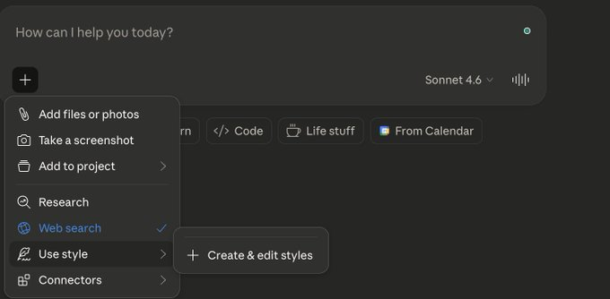
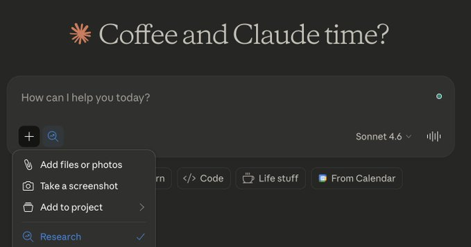
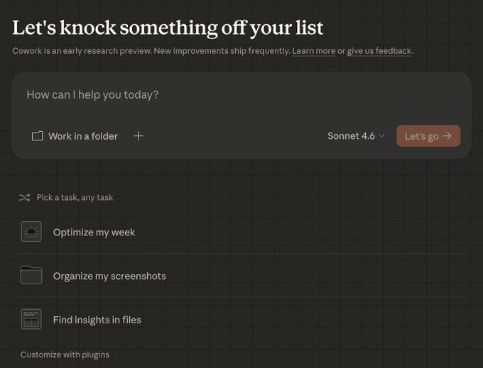
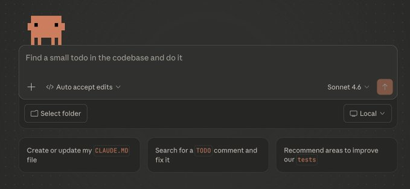
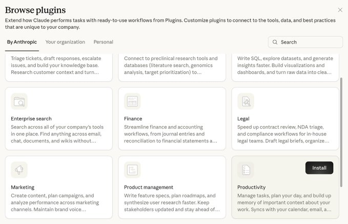

# The Ultimate Beginner’s Guide to Claude (March 2026)

URL: https://x.com/aiedge_/status/2029233676111008061

Last week, Anthropic shipped its best suite of Claude features yet.

If you're still using ChatGPT, this is the nail in the coffin.

I've been using Claude for over a year now, and I've literally been around for every major tool launch - Claude Skills, Cowork, Opus 4+ - you name it.

If I had to guess, I've probably clocked 100+ hours on Claude, testing the newest & latest features.

Instead of repeating the learning curve process, use this guide to skip straight to results and unlock instant productivity. Everything you need to hit the ground running with Claude is right here.

Even if you've been using Claude for as long as I have, I bet you'll still extract value from this guide.

## Table of Contents

- Section I: Introduction to Claude
- Section II: Prompt Engineering Masterclass & Context Management
- Section III: Model Selection Matrix
- Section IV: Basic Tools & Features
- Section V: Advanced Tools - Claude Code, Cowork & more

Closing

Without making this too long, think of Claude as the AI that actually does "real work."

It sounds human, it understands nuances, and, most importantly, the Anthropic team has injected a suite of tools that actually make Claude capable of task execution.

Other tools tell you how to do tasks, but Claude actually does them for you.

Before we dive into the how-to parts of this guide, you'll need to create a Claude account.

I recommend getting on a paid plan, but that's up to you.

Here are your pricing options (explained simply):

Pricing 101

The Interface (annotated)

Once you have a Claude account, this is the interface you'll see:

You may want to screenshot this if you're a complete Claude beginner

The Interface (explained)

Garbage inputs (prompts) = garbage outputs (your answers)

Bad prompting is the #1 most common mistake I see with any AI tool.

It's in your best interests to learn prompt engineering - you'll save tokens (less cost/usage), and you'll save time having to re-prompt.

Luckily, Anthropic has told us exactly how to prompt Claude for elite responses.

You have two valid prompting structure options for Claude (beginner & advanced).

If you're a beginner, start here:

The 3-Part Prompt Formula

Every strong Claude prompt has three components. Stack them together, and your output goes from generic to genuinely useful.

1. Set the stage

What's your role? What's the objective? Give Claude the context it needs before asking for anything.

Example: "I'm building a website for a marketing landing page targeting Gen Z audiences."

2. Define the task

What specific action do you want Claude to take? Be direct and precise.

Example: "Write competitive copy, and build [xyz] sections."

3. Specify the rules

Format, tone, length, style - tell Claude exactly how you want the output delivered.

Example: "Keep it under 500 words."

Build your prompts with these three components, and you'll get outputs better than 90% of people.

Advanced Prompting

If you've been using Claude for a while and are looking to level up your prompting, steal this.

Anthropic's advanced, 10-step prompting structure:

Advanced Prompting

This structure is too complicated to break down in this guide, but if you're interested, I teach you how to master these 10 steps (with real examples) here:

AI Edge

@aiedge_

How to Prompt Claude for Elite Outputs (Anthropic's Guide)

Anthropic recently released a masterclass on prompt engineering. This internal framework is built to deliver top-tier AI responses, and if you use Claude regularly, you need to add this to your...

Context Management

For elite outputs, you want to ensure you're managing your context window properly.

A few tips:

*   If the conversation is getting long (and Claude is getting slow), tell Claude to "compact" the conversation & move to a new chat
*   Add files when applicable (see annotated interface above)
*   Prompt with output restraints - examples: only use 500 words, use concise bullet points, etc.

TLDR: if you're brand new to Claude, just focus on giving it some context, being specific with the task you want it to execute, setting rules, and, if applicable, adding context files.

Ok, so you're familiar with Claude and have a basic understanding of how to generally communicate with it.

But which models do you actually use (and for what)?

Claude Sonnet 4.6 - the everyday workhorse

*   Fast, capable, cost-efficient
*   Writing, analysis, brainstorming, general tasks - Sonnet handles all of it
*   Sonnet is where 80% of your conversations should happen. I start almost everything here.

Claude Opus 4.6 - the deep thinker

*   The most intelligent model Claude offers
*   Deeper reasoning, better at complex multi-step problems
*   Use it for financial analysis, long research, complex coding, or anything where you need Claude to really think hard

You can also turn on Extended Thinking, which lets Claude literally show you its reasoning process before giving you an answer. It's like watching it think out loud.

Trade-off: it's slower and uses more of your quota. Don't use it for simple tasks.

Claude Haiku 4.5 - the speedster

*   The fastest, cheapest model
*   Quick lookups, simple classifications, light edits
*   Available on the free tier
*   Think of it like a toolbox. You don't use a sledgehammer to hang a picture frame.

I personally use Haiku in the Claude Chrome extension (more on this below)

There are a few essential tools & features you should set up so that Claude is fully capable.

1. Connectors

These allow Claude to connect to your favorite tools

I personally use Notion, Slack, and Google Calendar connections almost daily.

Connectors

Settings → Connectors

2. Claude in Chrome

Most people have no clue this exists.

This allows Claude to live as a Chrome extension in your browser.

You can download it here:

Claude in Chrome

3. Custom Styling

In the main interface, you can select "Use Style" - this allows you to choose from preset styles or create your own custom style to tailor elements of Claude’s written responses.

Custom Styling

4. Projects

Projects are dedicated hubs for your work inside Claude.

Upload your files, docs, and resources once. Then, run as many conversations as you want, all sharing the same context. Claude already knows the background every time you start a new chat.

Set it up once, and every conversation inside it understands your goal/context.

Projects

5. Research Mode

One of my favorite Claude features.

You give it a question, and instead of answering immediately, it goes deep. It breaks down your query, searches dozens - sometimes hundreds of sources, cross-references everything, and comes back with a comprehensive cited report.

It takes anywhere from 5 to 45 minutes, depending on the complexity.

Research Mode

6. Claude App

Lastly, the Claude app.

To access the advanced tools listed in the next section, you'll need to download the dedicated Claude app.

You can find those instructions here:

Now it's time for the heavy-hitters.

These tools will genuinely change how you work.

1. Claude Cowork

Cowork is only available in the downloaded Claude app (no web), and it allows Claude to access files and execute tasks autonomously in the background.

You can schedule tasks, create plug-ins (more on this below), and watch Claude execute complex tasks.

Cowork

I'll be dropping a full Cowork guide next Monday. But for now, just know it exists, and it's crazy powerful.

2. Claude Code

Claude Code is the most powerful AI coding tool on the market.

Write code, build websites, handle errors - literally anything.

Claude Code is a more advanced tool, but if you're a coder and you're not using it already, you should.

Claude Code

3. Claude Skills

Found at Main Homepage → Customize → Skills.

Think of Claude Skills as repeatable instructions & workflows for Claude.

Think of Skills as repeatable instructions for Claude. Instead of typing the same prompt over and over, you turn it into a Skill, and Claude already knows exactly what to do.

Here's a real example: say you analyze spreadsheet data every day. Normally, you'd re-prompt Claude every single time: "Analyze this spreadsheet and look for XYZ."

With a Skill, you'd just prompt "use my Spreadsheet Analyzer Skill," and it runs the same process automatically, every time, exactly how you want it.

The best part is, Claude can build these Skills for you - just ask it to build a Skill for [insert workflow].

Skill Examples

My full Claude Skills guide:

AI Edge

@aiedge_

How to Deploy Claude Skills Effectively (Complete Guide)

The only guide you need to 10x your productivity with Claude Skills (prompts included). Claude Skills are the biggest productivity unlock of 2026. They're simple to set up, easy to deploy, and...

4. Cowork Plug-Ins

Inside Cowork, go to Customize → Plug-ins.

Think of Plug-ins as employee roles.

A Skill handles one repeatable task - a single prompt, workflow, or instruction set, while a Plug-in packages everything needed to automate an entire role.

Multiple skills, combined into one automated function.

Real example: say you run a newsletter. You could install a Content Writer Plug-in that already knows your brand voice, formats every issue correctly, pulls in relevant news, and delivers a draft ready to publish.

Instead of training Claude from scratch every time, the role is already defined.

Anthropic built 10+ plug-ins you can use now. Across Legal, Marketing, Finance, and more.

Cowork Plug-ins

Hopefully, you found this article helpful.

If you did, be sure to follow me

for 3x/week article uploads on the hottest AI topics.

Leave your Claude beginner tips in the comments below - I'm sure others will find them helpful.

Lastly, please Like/Repost this article so others can see it💙