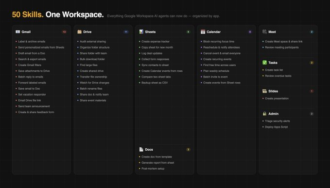
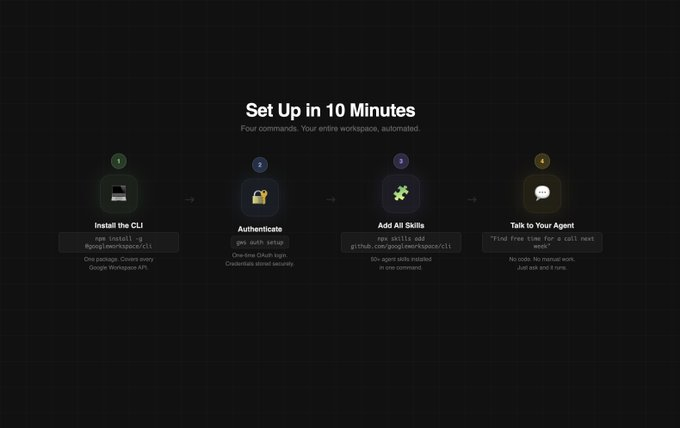
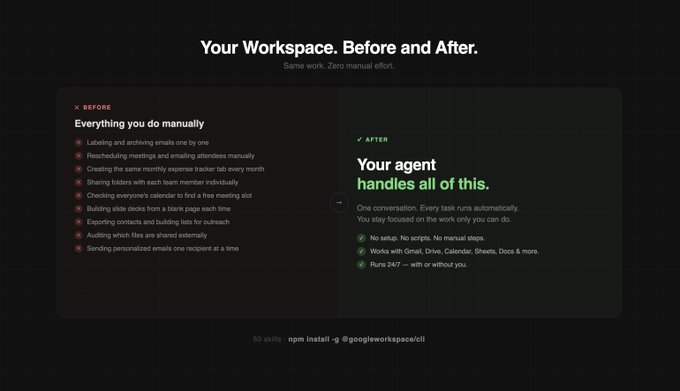

# 你唯一需要的 Google Workspace AI 智能体指南

URL: https://x.com/sharbel/status/2029494091336032686

Google 今天悄悄发布了一个大招。

一个为人类和 AI 智能体（Agents）构建的命令行工具 (CLI)，让你可以通过编程方式直接访问每一个 Google Workspace 应用。Gmail、Drive、Calendar、Sheets、Docs、Meet、Chat、Tasks、Slides、Forms，全部包括在内。

只需一条命令即可安装：

`npm install -g @googleworkspace/cli`

而且它自带了 50 多个预构建的智能体技能 (Skills)。不是演示（demos），而是你今天就能运行的实际自动化工具。

我把它们每一个都仔细看了一遍。以下是它们的功能，更重要的是，你应该如何实际使用它们。

[](https://x.com/sharbel/article/2029494091336032686/media/2029488733939232768)

自动为匹配的邮件打上 Gmail 标签并存档。

→ 如何使用：告诉你的智能体将每封来自客户的邮件标记为“客户”，并每天将新闻通讯（newsletters）存档。无需你动手，收件箱就能保持整洁。

从 Google Sheet 读取收件人数据并向每行发送个性化的 Gmail 消息。

→ 如何使用：你在 Sheet 里有 200 个潜在客户的名单。你的智能体读取“姓名”和“公司”列，并给每个人发送个性化的介绍信。不需要邮件合并工具。

从 Google Doc 读取内容并将其作为 Gmail 草稿的正文。

→ 如何使用：在 Docs 中写你的新闻通讯（让 AI 帮你），然后让你的智能体把它变成准备发送的 Gmail 草稿。

查找匹配查询的 Gmail 消息并将其导出。

→ 如何使用：“导出过去 30 天内包含‘发票 (invoice)’字样的每封邮件。”这对于会计、审计或仅仅是为了快速找东西来说非常棒。

创建一个 Gmail 过滤器以自动标记、加星标或对收到的消息进行分类。

→ 如何使用：让你的智能体设置过滤器，使来自 .xyz 的每封电子邮件进入优先文件夹，任何带有“退订”字样的邮件被自动存档。

查找带有附件的 Gmail 消息并将它们保存到 Google Drive 文件夹中。

→ 如何使用：每个客户都通过电子邮件发送合同。你的智能体自动将每个 PDF 附件按发送者整理好，保存到正确的 Drive 文件夹。

查找匹配查询的 Gmail 消息并向每条消息发送标准回复。

→ 如何使用：你有 30 封未回复的邮件，都需要同样的“感谢您的联系”的回复。一个命令，搞定。

查找具有特定标签的 Gmail 消息并将其转发到另一个地址。

→ 如何使用：自动将标有“新闻/公关 (press)”的每封邮件转发给你的公关联系人。零手动转发。

将 Gmail 消息正文保存到 Google Doc 中以便存档或参考。

→ 如何使用：重要客户简报通过电子邮件发送过来了。智能体将整封电子邮件保存到共享的 Docs 文件夹中，以便你的团队参考。

使用自定义消息和日期范围启用 Gmail 外出自动回复。

→ 如何使用：你告诉你的智能体“我 3 月 10 日至 15 日休假”，它就会为你设置 OOO（外出回复）。你再也不会忘记重新开启它了。

共享 Google Drive 文件并将带有消息的链接通过电子邮件发送给收件人。

→ 如何使用：在 Drive 中完成一份报告后，告诉你的智能体共享它，并附上简短说明将链接通过电子邮件发送给客户。两个任务，一个命令。

同时通过 Gmail 和 Google Chat 空间发送公告。

→ 如何使用：智能体将你的产品发布更新同时群发到团队电子邮件列表和公司聊天空间。

创建一个用于反馈的 Google Form 并通过 Gmail 分发。

→ 如何使用：项目结束时，智能体创建反馈表单并将其通过电子邮件发送到客户列表，无需你亲自构建任何东西。

查找并审查与组织外部共享的文件。

→ 如何使用：每月运行一次。你的智能体准确告诉你哪些文件是公开访问的，或与外部电子邮件共享的。30 秒内完成安全审计。

创建一个文件夹结构并将文件移动到正确的位置。

→ 如何使用：“整理我的下载文件夹：把 PDF 放进‘合同’，把图片放进‘资产’，把电子表格放进‘报告’。”智能体帮你搞定。

与协作者列表共享一个文件夹及其所有内容。

→ 如何使用：新项目开始。智能体创建文件夹，与整个团队共享，搞定。无需逐个人去添加。

列出并下载 Google Drive 文件夹中的所有文件。

→ 如何使用：在本地存档已完成的项目文件夹。一条命令抓取所有东西。

识别占用最多存储配额的文件。

→ 如何使用：你的 Drive 存储空间不足。智能体找出排名前 20 的最大文件，以便你决定删除或移动哪些文件。

创建一个 Google 共享云端硬盘并添加具有适当角色的成员。

→ 如何使用：有新客户加入？智能体几秒钟内就能建立起他们的共享云端硬盘，并以正确的权限把所有人都添加进去。

将文件的所有权从一个用户转移给另一个用户。

→ 如何使用：有员工离职。智能体将其所有文件转移给其经理。不需要 IT 部门开工单。

订阅对文件或文件夹的更改通知。

→ 如何使用：你的智能体盯着客户的交付物文件夹，只要有新东西添加进来，它就马上通知你（ping你）。

重命名符合特定模式的多个文件以遵循一致的命名约定。

→ 如何使用：40 个名为 "image_001.png" 的文件 → "campaign-march-001.png"。批量搞定。

共享具有编辑权限的文档并将链接通过电子邮件发送给协作者。

→ 如何使用：完成一份策略文档，告诉你的智能体将其与团队共享并通知他们。一步搞定原来的三步。

与日历活动的所有参加者共享 Drive 文件。

→ 如何使用：在与客户通话之前，你的智能体自动与每位参加者共享相关的幻灯片和简报。他们会有备而来。

复制模板，填写内容，并与协作者共享。

→ 如何使用：你有一个客户入职文档模板。智能体复制它，填写客户名称和详细信息，并将其与客户团队共享。每次都能自动完成。

从 Google Sheet 读取数据并创建格式化的 Google Docs 报告。

→ 如何使用：你的智能体读取你的每月分析 Sheet 并生成格式化的 Docs 客户报告。你只需审核和发送。节省了几个小时。

创建复盘文档，安排评审会议，并通过 Chat 通知团队。

→ 如何使用：事情出了差错。你告诉智能体“对三月份的活动进行复盘”。它会创建文档、安排会议并通知团队。一气呵成。

设置一个用于跟踪费用的带有标题和初始条目的电子表格。

→ 如何使用：新团队成员加入。智能体在 10 秒内创建他们的费用跟踪表格。

为新一个月的跟踪复制一个模板标签页。

→ 如何使用：智能体在每月 1 日自动创建下个月的预算标签页。再也不需要手动去做了。

向销售跟踪电子表格追加交易状态更新。

→ 如何使用：你完成了一笔交易。告诉你的智能体。它将其记录到 CRM Sheet、阶段、金额、日期、备注。

从 Google Form 检索并审阅响应。

→ 如何使用：智能体拉取最新的表单回复并给你一份总结。无需打开 Sheets。

将 Google Contacts 目录导出到电子表格。

→ 如何使用：为邮件合并、报告或 CRM 导入生成即时联系人列表。按需随时生成。

从 Sheet 中读取事件数据并为每一行创建日历条目。

→ 如何使用：你在 Sheets 中有一个内容日历。智能体根据每一行创建所有的日历事件、标题、时间、参会者。

从两个标签页读取数据以比较并识别差异。

→ 如何使用：将本月的客户列表与上个月的进行比较。智能体告诉你谁是新客户，谁流失了。

将电子表格导出为 CSV 文件以进行本地备份。

→ 如何使用：智能体每个星期五将你的主数据 Sheet 备份为 CSV。如果出了什么问题，你总有一个干净的版本。

创建定期的专注时间块以保护深度工作时间。

→ 如何使用：“在每个工作日上午 9-11 点安排深度工作。”智能体会创建这个重复事件。你的日历会自动保护自己。

将日历活动移至新时间并自动通知所有参加者。

→ 如何使用：“把周二的客户电话移到周四下午 3 点。”智能体会移动它，并将更新后的邀请发给所有人。

删除事件并通过 Gmail 发送取消电子邮件。

→ 如何使用：会议被取消了。智能体取消邀请并向每位参会者发送取消通知，一步到位。

创建一个带有参加者的定期事件。

→ 如何使用：每周站会、每月客户例会、季度回顾，智能体以正确的参会人员和频率设置所有这些。

查询多个用户的空闲/忙碌状态以找到会议空当。

→ 如何使用：“下周找一个1小时的时间空档，我和客户都有空的。”智能体会检查每个人的日历并返回选项。

回顾你的日历周，识别空档，并添加事件以填补它们。

→ 如何使用：每个周一早上，你的智能体回顾你这一周，标记出空余时间，并根据你的优先事项建议安排什么。

向现有的日历事件添加参会者名单并发送通知。

→ 如何使用：扩大网络研讨会的规模。智能体向现有活动添加 50 名新受邀者并向所有人发送邀请。

从 Sheet 中读取事件数据并批量创建日历条目。

→ 如何使用：Sheets 中的内容日历 → 自动在日历中创建的所有事件。

创建一个 Google Meet 空间并共享加入链接。

→ 如何使用：智能体创建 Meet 链接并在 Chat 或 Gmail 中分享。再也不用问“谁有链接？”了。

查看谁参加了会议以及多长时间。

→ 如何使用：客户电话后，智能体提取出勤日志。你清楚地知道谁出席了，谁早退了，谁从未加入。

设置具有初始项目的新任务 (Tasks) 列表。

→ 如何使用：新项目启动。智能体从你的项目简报中创建任务列表并填充首批待办事项。

查找已逾期的任务。

→ 如何使用：每天早上你的智能体扫描逾期任务并发送总结给你。没有事情会被遗漏。

创建一个新的 Slides 演示文稿并添加初始幻灯片。

→ 如何使用：“创建一个 5 页的推介幻灯片，包括介绍、问题、解决方案、案例研究和 CTA。”智能体构建骨架，你来填入内容。

列出并审阅警报中心的 Workspace 安全警报。

→ 如何使用：智能体每天早上检查安全警报，如果需要注意什么就会通知你。不需要打开管理员控制台。

将本地文件推送到 Google Apps Script 项目。

→ 如何使用：智能体无需通过 UI 即可部署你最新的 Apps Script 更改。

安装 CLI：

```bash
npm install -g @googleworkspace/cli
gws auth setup
```

一次性安装所有技能：

`npx skills add https://github.com/googleworkspace/cli`

如果你使用 OpenClaw：

`ln -s $(pwd)/skills/gws-* ~/.openclaw/skills/`

然后只需对你的智能体说：

*   “检查我的 Drive 中是否有外部共享的文件”
*   “下周找个空余时间，与 [姓名] 开 1 小时的会议”
*   “导出本月的所有客户电子邮件并将它们保存到 Doc”
*   “创建下个月的费用追踪器并与团队共享”

这里面的每一条，都是你的智能体现在就能运行的真实指令。

[](https://x.com/sharbel/article/2029494091336032686/media/2029489013027917824)

这个列表上的每一个任务，都是你目前正在手动做的事情。

检查谁拥有什么权限。挪动会议。给邮件打标签。每个月创建同样的追踪表格标签页。

单个看起来是小任务，每周加起来就是好几个小时。

你的 Workspace 刚刚获得了一个智能体团队。问题只在于你是否使用它们。

[](https://x.com/sharbel/article/2029494091336032686/media/2029489156368539648)