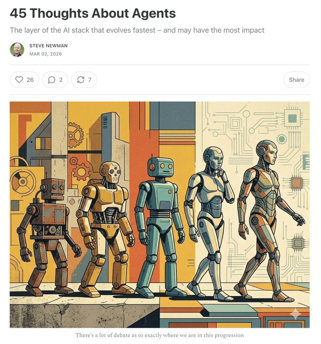

# 推荐这篇「45 Thoughts About Agents」

URL: https://x.com/runes_leo/status/2029081154066723039

推荐这篇「45 Thoughts About Agents」，Google Docs 联合创始人 Steve Newman 写的，信息密度很高。 

几个印象深的点： 
- Agent 是 AI stack 中演化最快的层 — 模型几个月一更新，Claude Code 一天能发好几版； 
- 但比 agent 演化还快的，是用户自己的工作方式。 
- 天真地把任务丢给 agent，生产力反而可能下降。关键是让 agent 能自我验证 — 能自己跑测试证明"做对了"，而不是你去一轮轮检查它。 
- AI 的影响力是 8 个因子的乘积（预训练、后训练、推理算力、agent 脚手架、应用设计、用户能力、工作流重构、采用率），全部在同时推进。 这轮变革才走了 1/3。 

原文链接： http://secondthoughts.ai/p/45-thoughts-about-agents

