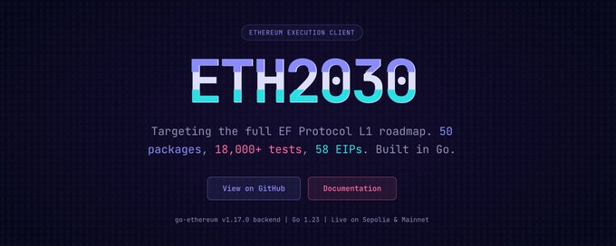
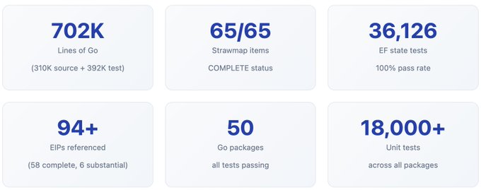
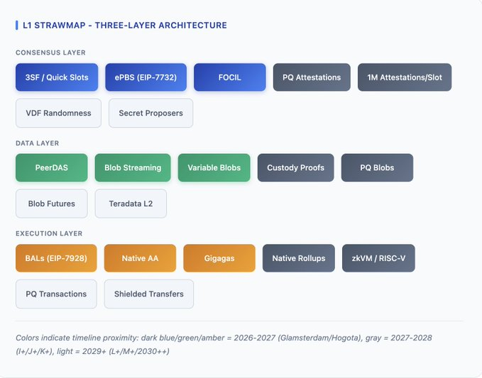
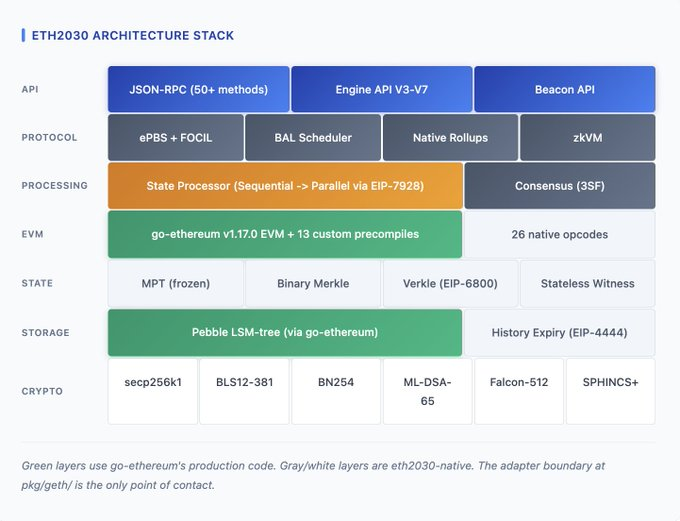
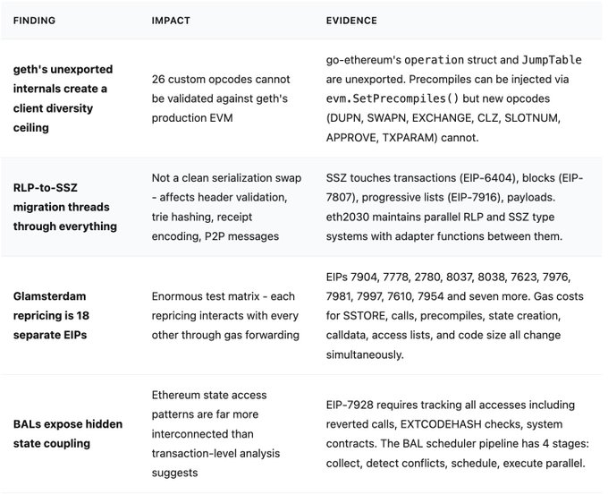
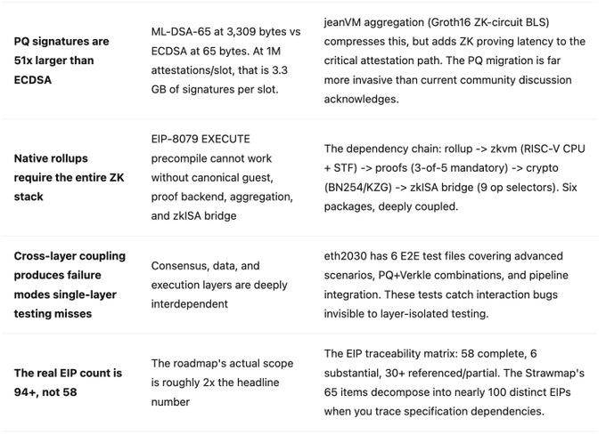
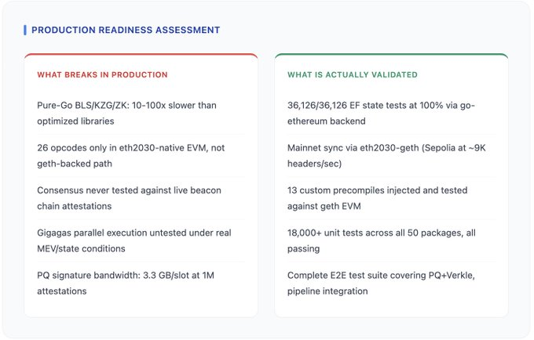
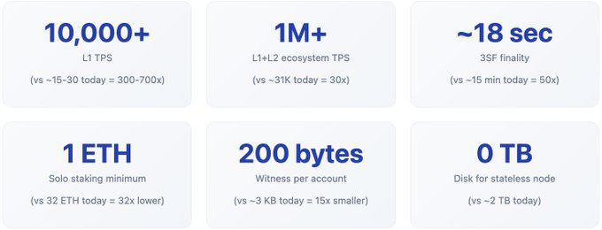
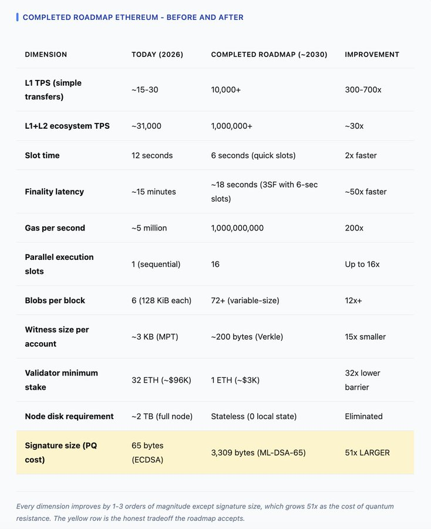
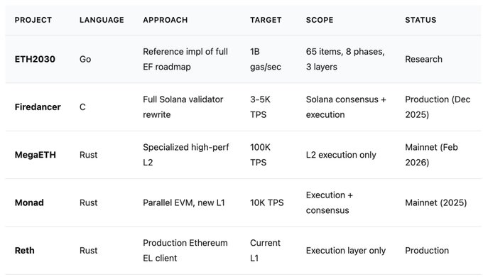

# ETH2030：面向 2030+ 路线图的 Agentic Coding 以太坊客户端

ETH2030: Agentic Coding ETH Client for 2030+ Roadmap

两周前，我和 Vitalik 打了个赌：一个人能否通过 agentic coding，做出一个覆盖整个 2030+ 路线图的以太坊客户端。完成路线图后的以太坊会是一台真正非凡的机器——L1 达到 10,000+ TPS、最终性从 15 分钟缩短到数秒、1 ETH 即可单人质押、7 美元树莓派即可运行无状态节点、L1+L2 总吞吐超过百万 TPS——但这个未来取决于八个阶段中 65 项已规划升级是否真的能拼合在一起。相关规范分散在几十个 EIP 中，许多仍处于草案状态。此前没有人把它们全部放进同一个代码库来验证可组合性。所以我做了。

ETH2030 就是这个结果——一个面向 EF Protocol L1 草案路线图的实验性参考实现。该路线图由以太坊核心协议研究者（Ansgar、Barnabe、Francesco、Justin）整理，是一份从 Glamsterdam（2026 年中）到 Giga-Gas 时代（2030+）的八阶段工作文档。项目使用 agentic coding 构建（Claude Code，Opus 4.6），耗时约 6 天，API 成本 5,750 美元，消耗 27.7 亿 token。它通过了以太坊官方 36,126 个状态测试，内嵌 go-ethereum v1.17.0 以连接主网，并覆盖了从 Block Access Lists 到后量子密码学，再到用于零知识证明的完整 RISC-V CPU。

我们想明确说明：这不是生产级客户端。我们也不是客户端开发者。我们手上的，是一个粗糙草稿——70.2 万行 Go 代码，能编译、能通过测试、能与网络同步。验证这一路线图的竞争压力是现实存在的。Firedancer 已在 Solana 生产运行；MegaETH 已以 100K TPS 为目标启动；Monad 的并行 EVM 已上主网。以太坊路线图比它们都更雄心勃勃，但我们不能等到 2030 年才发现这些部件拼不起来。我们需要真正懂这套系统的人来审视这份代码，指出我们做错的地方，并帮助社区理解：在客户端团队投入多年生产工程之前，哪些部分需要重新思考。

L1 路线图把以太坊升级组织为三层——共识层、数据层、执行层——跨越八个命名升级阶段。其战略框架有五大支柱：Beast Mode（原始吞吐）、Lean Mode（通过 Verkle 与历史过期提升节点效率）、Fort Mode（后量子加固）、Decentralization（1 ETH 单人质押与分布式构建）、Fast Finality（3-slot finality 与 quick slots）。每个阶段都会同时在三层引入特性，这正是路线图既雄心勃勃又在架构上高风险的原因。你无法在没有 BAL 的情况下上线 3SF；无法在没有 gas 重定价的情况下上线 BAL；也无法在不同时调整 blob 调度与 PeerDAS 参数的情况下完成 gas 重定价。耦合是真实存在的。

ETH2030 最干净的设计决策，是它与 go-ethereum 的集成方式。项目没有 fork geth，而是把 go-ethereum v1.17.0 作为 Go module 引入，并通过单一适配器包 `pkg/geth/` 封装——这也是整个 50 个 package 代码库中唯一直接导入 go-ethereum 的位置。这个适配器包含四个文件：`processor.go`（通过 `gethcore.ApplyMessage` 处理区块）、`extensions.go`（通过 `evm.SetPrecompiles()` 注入 13 个自定义预编译）、`statedb.go`（基于 geth 真实 trie DB 的状态创建）、`config.go`（分叉名称映射）。在这一层之上——共识、数据可用性、rollups、zkVM、后量子密码——全部是 eth2030 原生代码。

这种分层是实现 100% EF 状态测试一致性的关键。36,126 个测试向量通过 go-ethereum 生产级 EVM 执行，eth2030 的类型通过适配层映射。`eth2030-geth` 二进制更进一步：它内嵌完整 go-ethereum 节点——Pebble 数据库、RLPx P2P、devp2p 发现、snap 同步——并在 Glamsterdam、Hogota 与 I+ 分叉时间戳注入 13 个自定义预编译。结果是：它可与 Sepolia 测试网同步（实测约 9,000 headers/秒），可连接主网，同时携带完整路线图实现。

有些东西你通过阅读规范能学到；还有些东西只有在真正实现时才会显现。以下八项发现，是在单一代码库中编写、编译并交叉测试 94+ EIP 之后得到的。

最直接的生产差距是密码学性能。ETH2030 在 BLS12-381、KZG、ZK 证明、Verkle IPA、后量子格运算上都使用了纯 Go 实现。生产客户端通常采用优化过的 C（supranational/blst）、Rust（go-eth-kzg）以及 C/Go 混合（gnark）。性能差距通常在 10–100 倍。若验证者使用 ETH2030 的纯 Go BLS，实现将以数量级差距错过见证截止时间。

共识实现在架构上是完整的，但在运行上未经实战验证。3-slot finality、quick slots、PQ attestations、百万级 attestation scaler、jeanVM 聚合等，都有对应 Go 实现和校验函数。但它们从未处理过真实信标链上的一次 attestation。`ValidateAttestation() returns nil` 与“在 MEV 高峰期间抗住重组攻击”之间，隔着的是以年计的工程化差距。

Gigagas 目标尤其值得严格审视。`GigagasConfig` 设定为 10 亿 gas/秒，16 个并行执行槽。当前以太坊整体处理能力约 500 万 gas/秒。BAL 并行执行框架具备冲突检测器、调度流水线与依赖图。从理论上看可行；但在现实状态下并行执行——包含重入保护、跨合约回调、MEV bundle 依赖，以及会强制串行化的 ERC-20 授权模式——本质上比在合成测试中并行执行难得多。

如果路线图中的每一项——八个阶段、共 65 项——都能落地，以太坊会变成什么？ETH2030 实现给出的数据、EF 预测，以及参考客户端中硬编码的规范参数，共同描绘出一台与今天几乎判若两物的机器。几乎所有关键维度都会提升 1 到 3 个数量级，只有一个显著例外会变差——而这个例外恰恰揭示了“真正安全”所需付出的代价。

这个领域里的其他项目大多只构建拼图的一部分。ETH2030 是目前唯一覆盖整个以太坊路线图的实现——八个阶段、三层架构、全部 65 项。这种广度既是它独特的价值，也是它根本性的局限。

有一种认知只能来自“亲手构建”。阅读 EIP-7928 规范，你会知道 Block Access Lists 用于跟踪并行执行中的状态依赖；而在实现中你会发现：revert 调用、空账户上的 `EXTCODEHASH` 查询、系统合约交互，都会产生需要跟踪的状态访问；并且冲突图的稠密程度远超单看交易池时的直觉。参考实现产出的不一定是生产级代码，但会产出生产级问题。

从每秒 500 万 gas 到 10 亿 gas，不只是量变，更是质变：这是“以太坊作为结算层”到“以太坊作为全球执行平台”的距离。这个差距能否在 2030 年前被弥合，取决于四个任何规范或参考实现都无法单独解决的工程现实：在对抗性 MEV 条件下的并行执行（搜索者会故意构造迫使串行化的状态访问模式）；在不破坏向后兼容的前提下，为 2 亿个既有 ECDSA 账户完成后量子迁移；ZK 证明延迟（当前 SOTA 在 24 张 GPU 上为 7.4 秒，而 quick slots 每 6 秒一个）；以及以太坊社区能否在三层上长期保持协同推进，因为这条路线图不是菜单——你不能只要 gigagas 不要 BAL，也不能只要 3SF 不要 quick slots，更不能只要 native rollups 而不要底层 ZK 栈。

ETH2030 在端到端测试中揭示出的耦合关系，也正是路线图对延期高度脆弱的原因。如果 Glamsterdam 延期，Hogota 的多维 gas 就失去地基；如果 PeerDAS 推迟，native rollups 就失去其数据可用性支撑。所有内容按时交付时，这张路线图组合得非常漂亮；而现实中，路线图很少按时交付。

但即便如此：全部 65 项确实能装进同一个代码库。类型对齐、接口可连、三万六千多个状态测试通过、节点可与主网同步。在许多五年技术路线图里，这已经比“开始写代码之前”能达到的状态更进一步。完成路线图后的以太坊——L1 达到 PayPal 级吞吐、数秒最终性、约 3000 美元门槛的单人质押、消费级硬件上的无状态验证、抗量子密码学——是一个真正有吸引力的愿景。它在工程上是可组合的。至于能否按期落地，是另一个问题；而这正是社区现在就该在“代码已摆上台面”时提出的问题，而不是等到 2030 年再以更高成本面对答案。
