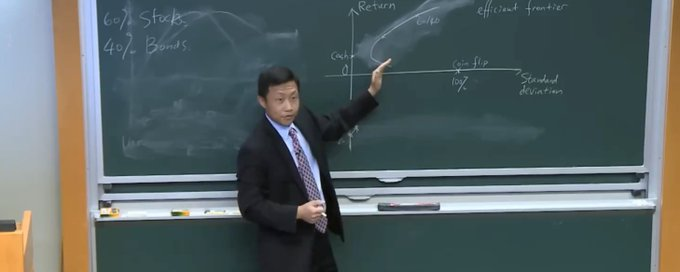
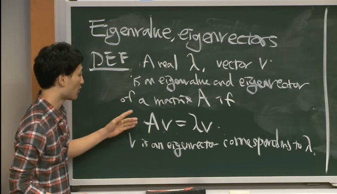
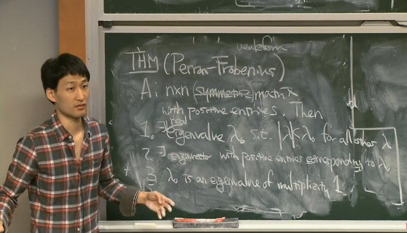
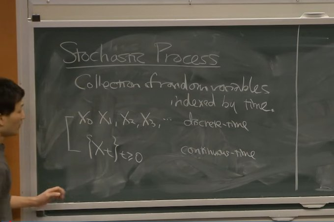
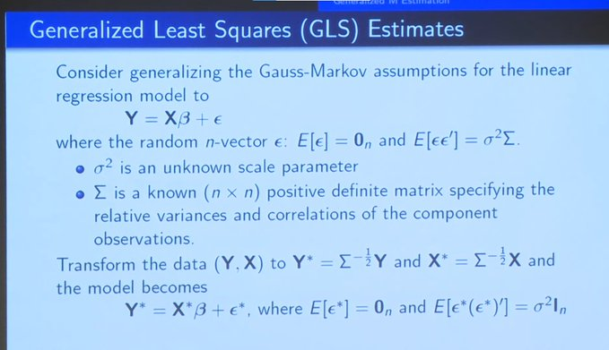
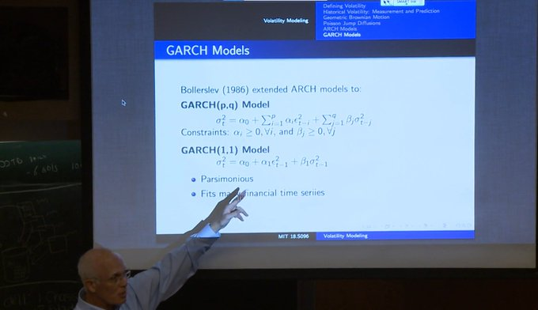

# MIT's Quant Course Decoded for Every Prediction Market Trader

URL: https://x.com/rohonchain/status/2028489070394171427

I'm going to break down every key concept from MIT's 20+ hour Financial Mathematics course and show you exactly how each one applies to trading on Prediction Markets. Let's get straight to it.

> Bookmark This - I'm Roan, a backend developer working on system design, HFT-style execution, and quantitative trading systems. My work focuses on how prediction markets actually behave under load. For any suggestions, thoughtful collaborations, partnerships DMs are open.

Last week I came across an article from titled "40 Hours of Lectures Worth a Degree in Quant Trading." He listed four free university courses from MIT, Yale, Oxford and Columbia that together give you a complete quantitative trading foundation.

The moment I read it, something clicked. I had always known these resources existed. But I had never actually sat down and treated them the way they deserved to be treated. Like a real student. Like someone whose career depends on understanding this material deeply. So I made a decision. I cleared the few days. Pen out. Notebook open. I sat with MIT's Financial Mathematics course and went through the playlist. No skipping. No fast forwarding. When something did not click, I rewound and went again. What came out on the other side was not just notes. It was a completely different way of seeing every price on Polymarket. Every order. Every spread. Learning in public is something I believe in deeply. I could have kept these notes private. Instead I am going to give you everything, because in this space we either bring each other forward together or we all stay stuck. That is the only way I know how to build. By the end of this article you will understand how linear algebra is hiding inside every correlated market on Polymarket, why using the normal distribution alone will destroy your edge, how stochastic processes explain the exact way prediction market prices move, what regression actually looks like inside a real probability model, how volatility clustering costs silent money to every quant who ignores it and how billion dollar hedge fund risk models are built from the same mathematics you will read here today.

This is not a recap. This is MIT's curriculum rebuilt for prediction market quants.

Note: This article is long and intentionally so. If you are looking for quick wins, this is not for you. But if you are serious, grab a pen and a notebook and take notes while you read.

## Phase 1: Structure - Linear Algebra

Most people hear linear algebra and immediately assume it has nothing to do with trading prediction markets. That assumption is exactly what keeps most people at the retail level forever.

MIT opens this course by presenting a matrix in two completely different ways. The first way is simple. A matrix is just a table of data. Stock prices by date. Market prices by contract. Clean and familiar.

The second way is where everything changes. A matrix is also a mathematical operator. It defines a transformation. It takes a vector from one coordinate system and maps it into another.

When I first heard this framing in the MIT lecture, I immediately thought about my Polymarket book. A portfolio of YES tokens across 40 correlated markets is a matrix. Looking at it as a data table tells you your positions. Looking at it as a transformation tells you how risk moves through the entire structure simultaneously.

The lecture then introduces eigenvalues and eigenvectors through the equation:

Eigenvalues and Eigenvectors

> Av = λv

The geometric interpretation is this. Eigenvectors are the special directions where the transformation only scales the vector. It does not rotate it. The eigenvalue λ is simply the scaling factor. Everything else changes direction under the transformation. Eigenvectors do not.

In prediction markets, imagine running a correlation analysis across 100 Polymarket contracts during an election cycle. The first eigenvector of that correlation matrix, the one with the highest eigenvalue, will almost always represent overall political sentiment. One piece of information, one major shift in the news cycle, moves everything simultaneously.

Here is why this should concern you.

If you are running 100 positions and thinking you are well diversified, the eigenvalue decomposition of your correlation matrix might show that 3 eigenvectors explain 80 percent of your total variance. Your diversification is an illusion. Your real exposure is concentrated in 3 underlying risk factors that you probably have not named yet.

The lecture then covers Singular Value Decomposition:

> A = UΣVᵀ

SVD is more general than standard diagonalization. It works on any matrix, not just symmetric ones. It describes how the matrix transforms vectors from one coordinate system into another while scaling them by the singular values in the diagonal matrix Σ.

The practical application here is finding hidden correlations in Polymarket return data. When you load months of contract price changes into a matrix and decompose it with SVD, the singular values tell you how many truly independent sources of movement exist across all your markets. In practice this number is almost always far smaller than the number of contracts suggests.

Perron-Frobenius Theorem

The Perron-Frobenius Theorem closes this lecture. For any matrix with all positive entries, a unique largest real eigenvalue exists and its corresponding eigenvector has all positive entries. This seems abstract until you realize it is the mathematical foundation for something called the Ross Recovery Theorem, which claims you can recover the market's real-world probability beliefs directly from observed derivative prices. I will cover that in full in the Yale and advanced lecture series.

For now, the core takeaway from Phase 1 is this. Every position you hold on Polymarket is not independent. It is a component of a transformation. Understanding that transformation mathematically is the difference between managing a book and understanding a book.

## Phase 2: Belief - Probability

If Phase 1 is about structure, Phase 2 is about belief.

And the first thing MIT does is tell you that your most comfortable assumption about probability is probably wrong.

The normal distribution is elegant. It is symmetric. It is fully described by two parameters. It is everywhere in statistics textbooks. And for modeling raw prediction market prices directly, it is wrong in two fundamental ways.

First, the normal distribution allows negative values. A Polymarket contract can never go below zero. Second, percentage moves are what matter, not absolute moves. A contract moving from 0.10 to 0.15 is a 50 percent change. A contract moving from 0.80 to 0.85 is 6 percent. Treating these as equivalent destroys the accuracy of any model built on raw price changes.

The correct foundation is the log-normal distribution. You model the logarithm of the price as normally distributed. The price itself stays positive by construction. Percentage changes are properly weighted. The MIT lecture derives the full PDF for the log-normal distribution from scratch using the change of variables formula.

The critical warning in the lecture: the parameters μ and σ belong to the underlying log process, not to the price itself. This sounds like a minor technical footnote. In practice, confusing these two will systematically bias every probability estimate your model produces.

The Moment-Generating Function is the next key concept:

> M(t) = E[e^(tX)]

If two distributions have identical MGFs, they are the same distribution. This function uniquely characterizes a probability distribution wherever it exists. They use this to prove convergence results. If the MGFs of a sequence of random variables converge, their distributions converge. This is the mathematical engine that powers the next two results.

The Law of Large Numbers says the average of a large number of independent identically distributed random variables converges to the expected value.

For Polymarket quants this is not abstract philosophy. If your model has genuine edge of 4 percent per trade, the LLN guarantees that edge materializes as profit over enough trades. The variance on any single trade is noise. The expectation over thousands of trades is the signal. This is why having a rigorous edge estimate matters far more than being right on any specific contract.

The Central Limit Theorem says the sum of a large number of i.i.d. random variables, when properly normalized, is approximately normally distributed regardless of the original distribution.

Here is what this means in practice. Individual prediction market trades may not be normally distributed at all. But when you aggregate returns across many trades over time, the distribution of your total returns begins to look normal. Understanding exactly when this aggregation effect kicks in and when it breaks down is the line between a model that backtests cleanly and one that survives live market conditions.

This is where the MIT course stopped feeling like pure mathematics to me and started feeling like a direct description of what I watch happen on Polymarket every single day.

## Phase 3: Stochastic Process

A stochastic process is a collection of random variables indexed by time. Not a single distribution over one number. A distribution over an entire path. Every possible price trajectory that a Polymarket contract could take from now until resolution is a path in the sample space of the stochastic process that governs it.

The price chart you are looking at right now is one realized path. The stochastic process is the invisible object that generated it and every other path that could have happened instead.

MIT introduces three fundamental types and all three matter directly for prediction markets.

The simple random walk is the starting point. Each step is plus one or minus one with equal probability. The key result is that the position at a distant time T is approximately normally distributed with standard deviation proportional to √T.

That square root scaling is not a trivial detail. It means uncertainty grows with time but at a decelerating rate. A Polymarket contract resolving in 28 days carries roughly twice the uncertainty of one resolving in 7 days. Not four times. Twice. If your spread model does not account for this square root scaling across different time horizons, you are systematically mispricing time.

The MIT lecture solves the boundary crossing problem. Given a random walk, what is the probability it hits an upper boundary B before it hits a lower boundary at negative A?

The answer is:

> P(hit B before -A) = A / (A + B)

This is the gambler's ruin formula. On Polymarket it appears directly when you are sizing positions near resolution on contracts approaching extreme probabilities. The boundary problem tells you how likely you are to get stopped out before the trade pays off.

Markov Chains introduce the property that makes most financial models computationally tractable. The Markov property says the future is independent of the past given the present. Only the current state matters. Not how you arrived at it.

For prediction market pricing models, the Markov assumption means the current contract price summarizes everything the market knows. The history of how it got there is irrelevant under this assumption.

But here is the hook that most quants miss.

In reality, order flow patterns on Polymarket do carry predictive information beyond the current price. Sequences of aggressive buys arriving before a major news announcement. Thinning liquidity on one side before a resolution event. These are non-Markovian features that a pure Markov model will never capture. Knowing when to trust the Markov assumption and when to override it is where systematic edge lives in the order book.

Martingales close this phase and they are the most important concept in this entire lecture series for any quant trading derivatives or prediction markets.

A martingale is a stochastic process where the expected future value, given all history up to now, equals the current value:

> E[X(t+1) | X₀, X₁, ..., Xₜ] = Xₜ

No drift. No tendency to go up or down. A perfectly fair game.

The Optional Stopping Theorem says something brutal and important. For a martingale, no stopping strategy that uses only past and present information can change the expected outcome. You cannot beat a fair game by being clever about when you enter and exit.

Under the risk-neutral measure, all properly discounted Polymarket prices are martingales by construction. Real edge does not come from timing a martingale cleverly. It comes from better probability estimation. From knowing that a contract priced at 0.35 should actually be at 0.50 based on information the market has not fully absorbed yet.

That gap between the market's probability and the true probability is the only place where systematic edge actually lives.

## Phase 4: Regression

There is no serious quantitative model for prediction markets that does not use regression somewhere in its foundation. This lecture explains why from first principles and it is worth understanding deeply rather than taking for granted.

The goal of regression is to model the relationship between an outcome variable and a set of explanatory signals. For prediction markets, the outcome is contract resolution. The signals are everything observable: polling data, order flow imbalance, historical base rates across similar event types, market momentum, time to resolution, and correlated market movements.

Ordinary Least Squares minimizes the sum of squared residuals between the model's predictions and the actual outcomes. The closed form solution is:

> β̂ = (XᵀX)⁻¹Xᵀy

The fitted values are an orthogonal projection of the outcome vector onto the column space of the feature matrix. The residuals are perpendicular to this space by construction. This is not just an algebraic result. It has a deep geometric meaning. OLS finds the point in the space of possible predictions that is as close as possible to the actual outcomes, measured by Euclidean distance in that feature space.

The Gauss-Markov Theorem says that under three conditions, zero mean residuals, constant variance, and uncorrelated errors, OLS is the Best Linear Unbiased Estimator. Smallest variance among all linear unbiased estimators. This is what economists mean when they call OLS the gold standard.

Here is where prediction market applications get complicated.

The constant variance assumption is violated almost by definition in prediction markets. Near resolution, variance collapses toward zero because the outcome is nearly determined. Far from resolution, variance is high and noisy. This is called heteroscedasticity and it directly invalidates the Gauss-Markov guarantee. A model that ignores this will systematically misestimate its own uncertainty at different points in a contract's lifecycle. It will appear overconfident near resolution and underconfident far from it.

Generalized Least Squares (GLS) Estimates

The fix is Generalized Least Squares or, more practically, using weighted regression where each observation is weighted by the inverse of its estimated variance. Near-resolution data points get downweighted. Far-from-resolution data points get upweighted. The model's confidence is calibrated correctly across the full contract lifecycle

The lecture closes with Generalized M-estimation. Instead of minimizing squared residuals you minimize a more general loss function. Minimizing absolute deviations gives quantile regression. Using loss functions that down-weight large residuals gives robust regression. For prediction markets, contested resolutions and oracle failures produce massive outlier observations. Standard OLS treats these as highly informative. Robust regression treats them as noise. For a systematic model running across hundreds of contracts, this distinction in how outliers are handled can mean the difference between a stable edge and a model that periodically blows up.

## Phase 5: Risk - Value at Risk

MIT brings in a practitioner from Morgan Stanley for this lecture. The shift in tone is immediate. This is not a professor explaining theory. This is someone who has to answer for losses at the end of every trading day.

VaR answers one specific question: what is the maximum loss I should expect to see over a given time period at a given confidence level?

A 99 percent one-day VaR of $4,200 means there is a 1 percent probability of losing more than $4,200 tomorrow. Formally it is an order statistic of the return distribution. The first percentile of the loss distribution.

Three methods for calculating it and each one has a direct Polymarket application.

Parametric VaR assumes returns are normally distributed. Portfolio variance is calculated as:

> σ²_p = wᵀΣw

Where w is the vector of portfolio weights and Σ is the covariance matrix of all positions. VaR is then 2.33 standard deviations of portfolio volatility for 99 percent confidence. Fast to compute. Theoretically clean. Systematically wrong when returns are fat-tailed.

In prediction markets near resolution, return distributions are not fat-tailed. They are bimodal. Outcomes are binary. The normal distribution assumption here is not just approximate. It is structurally wrong. Parametric VaR near resolution will underestimate your true risk by a factor that is directly related to how binary the outcome has become.

Monte Carlo simulation generates thousands of synthetic return scenarios by sampling from the estimated covariance structure. Run 10,000 scenarios. Calculate P&L on your full Polymarket book for each one. Sort the outcomes. The 100th worst result is your 99 percent VaR estimate. More accurate than parametric for non-normal distributions and far more appropriate for a portfolio of prediction market positions. The trade-off is computational cost, but for a properly built infrastructure this is manageable.

Historical simulation takes actual historical return sequences and applies them directly to your current portfolio to generate possible tomorrow outcomes. No distributional assumptions. Fat tails captured automatically. The limitation is that history only contains events that have already happened. If you are holding a contract on a truly unprecedented event type, historical simulation has no reference data and will understate your risk.

The Morgan Stanley lecturer makes a point that I wrote in large letters in my notebook. "The most dangerous risk is not the risk your model measures. It is the risk your model does not know to look for." Building multiple VaR methods and watching for divergence between them is itself an early warning signal that your assumptions about the return distribution may be breaking down.

## Phase 6: Volatility Clustering

This is the lecture that changed how I look at prediction market price charts.

Every quant learns early that financial returns are difficult to predict. But volatility, which is the magnitude of price moves regardless of direction, is substantially more predictable than the returns themselves. And the pattern of that predictability has a name.

Volatility clustering.

After periods of high volatility, more high volatility tends to follow. After periods of low volatility, more low volatility tends to follow. The variance of tomorrow's return is correlated with the variance of today's return. This pattern appears in equity markets, FX markets, commodity markets, and yes, directly in prediction market price data.

Standard ARMA models assume constant variance across time. They cannot capture volatility clustering by construction. The variance is simply treated as a fixed parameter.

ARCH models, introduced by Robert Engle, solve this. An ARCH(p) model specifies:

> σ²ₜ = α₀ + α₁ε²ₜ₋₁ + α₂ε²ₜ₋₂ + ... + αₚε²ₜ₋ₚ

The conditional variance today is a linear function of the squared residuals from the past p periods. When a major poll drops on a Polymarket election contract and creates a large residual, the ARCH model says the variance in the next period will be elevated as a direct mathematical consequence. The elevated variance then decays according to the α parameters.

GARCH Models

GARCH(1,1) extends this to something more parsimonious and more powerful:

> σ²ₜ = α₀ + α₁ε²ₜ₋₁ + β₁σ²ₜ₋₁

The conditional variance today equals a constant plus yesterday's squared residual plus yesterday's conditional variance. Two lagged terms. Three parameters. The β₁ parameter controls how slowly volatility decays back to its long-run level after a shock.

For a Polymarket market maker this has a direct operational application. After a major information event hits a contract, how long should you maintain widened spreads before returning to normal quoting? The GARCH β₁ parameter gives you that number mathematically. High β₁ means volatility persists for many periods. Low β₁ means it dies out quickly. Instead of guessing when to tighten spreads after a news event, you estimate it from the data.

The MIT lecture fits GARCH(1,1) to real exchange rate data and demonstrates that the model captures the clustering pattern with striking accuracy. I ran the same fitting process on Polymarket price data from major political contracts and the same pattern appeared. High information events create volatility shocks. The GARCH model tracks the decay of those shocks precisely.

This is not a coincidence. The mechanism is the same. Information arrives. Uncertainty spikes. Uncertainty decays as the market absorbs and prices the information. GARCH is a mathematical model of that absorption process.

## Phase 7: Portfolio Theory

Modern Portfolio Theory has been taught in every finance program for 70 years. Most people who have heard of it think they understand it. Most of them have missed the part that actually matters.

The core trade-off is expected return versus risk measured by standard deviation. The efficient frontier is the set of portfolios that achieve the maximum possible expected return for each level of risk. Every portfolio below the frontier is suboptimal. Every portfolio above it does not exist.

For a Polymarket market maker running positions across dozens of correlated contracts, this is not theoretical. Your book is a portfolio. Its expected return is spread capture minus adverse selection losses. Its risk is the variance of outcomes across all your positions simultaneously. The efficient frontier of possible books tells you the optimal allocation of quoting effort and capital across markets.

The Sharpe ratio is:

> Sharpe = (Portfolio Return - Risk-Free Rate) / Portfolio Volatility

It measures return per unit of risk taken. The portfolio that maximizes the Sharpe ratio is called the tangency portfolio. It is the optimal combination of risky positions to hold.

The lecture then introduces Risk Parity, a more modern approach that changes the framing entirely. Instead of allocating capital based on expected returns, you allocate based on equal risk contribution. Each position contributes the same amount to total portfolio variance. Lower volatility positions receive more capital. Higher volatility positions receive less.

On Polymarket, contracts approaching resolution have high short-term variance because binary outcomes are imminent. Contracts far from resolution have lower variance and more predictable pricing dynamics. A risk parity approach to your Polymarket book naturally reduces exposure to near-resolution contracts and increases it to longer-dated ones, automatically managing the binary outcome risk that dominates near-term positions.

But the lecture ends with the part that I think every serious quant needs to internalize.

> The Millennium Bridge story. When the London Millennium Bridge opened, pedestrians began unconsciously synchronizing their steps to maintain balance. The synchronized motion caused the bridge to oscillate dangerously. Individually rational behavior produced a collectively dangerous outcome.

The same mechanism operates in prediction markets. When enough market makers adopt the same VPIN-based withdrawal logic, a single large informed trade triggers all of them simultaneously. Liquidity disappears instantly. Prices gap discontinuously. The model that worked in isolation fails precisely because of how well it worked and how many other participants copied it.

Building strategies that are robust to this synchronization effect is not optional for anyone operating at institutional scale. It requires thinking not just about your own model but about the population of models competing in the same space.

## Phase 8: Factor Models

The final concept I want to cover from the MIT course is one that took me the longest to fully internalize and the one I now use most in how I think about managing a multi-market book.

Factor models compress the complexity of many correlated assets into a small number of underlying drivers.

The linear factor model says:

> Rᵢ = αᵢ + βᵢ₁f₁ + βᵢ₂f₂ + ... + βᵢₖfₖ + εᵢ

Where Rᵢ is the return of asset i, α is the asset-specific alpha, the f terms are common factor returns, the β terms are factor loadings representing each asset's sensitivity to each factor, and ε is the idiosyncratic residual specific to that asset alone.

The key assumption is that idiosyncratic residuals are uncorrelated with each other and with the common factors. This assumption dramatically simplifies the covariance structure. Instead of estimating the full covariance matrix of 100 Polymarket contracts, which requires 5,050 distinct parameters, you estimate the covariance of a small number of factors and 100 individual specific variances. The covariance between any two contracts is then derived entirely from their shared factor exposures.

Observable factor models use known variables as factors. For Polymarket, observable factors include the overall political temperature measured by aggregate movement across all political contracts, category-level factors that move all sports contracts simultaneously during major events, and macroeconomic surprise factors that shift financial prediction markets in correlated ways.

Statistical factor models extract factors from the data itself using PCA. The eigenvectors of the historical return covariance matrix become the factor loadings. The first principal component explains the largest share of variance across all contracts. During election cycles on Polymarket, that first component is consistently the overall political momentum. A single number moving dozens of markets.

Here is the practical implication that changes how you manage risk.

If PCA on your Polymarket book shows that 3 factors explain 80 percent of your total variance, you are not running 100 independent positions. You are running 3 concentrated factor exposures wrapped in 100 individual contracts. Hedging those 3 factors directly rather than managing 100 positions individually is how institutional desks actually operate. It is more capital efficient, more risk-aware, and more honest about where the real exposures sit.

The factor model framework also reveals when apparent diversification is actually concentration. Two contracts that look unrelated on the surface may load heavily on the same underlying political factor. Until you decompose the correlation structure mathematically, you will not see it. And when a shock to that factor arrives, both positions will move together in a way that your intuitive diversification completely failed to anticipate.

This was all about MIT's Financial Mathematics course and honestly what I covered here is not even 30% of what the full course contains. There are entire lectures on derivatives pricing, credit modeling, interest rate theory and advanced risk frameworks that I did not even mentioned here. The depth this course goes into on each concept is insane. This is the kind of content people pay $200,000. It is sitting on YouTube for free and most people will scroll past it tomorrow. I am telling you directly, clear few days, open the playlist, grab your pen and notebook and go through it yourself. Every hour you spend with it will change how you see every single price on Polymarket.

And if this added any real value to how you think about prediction markets, a FOLLOW genuinely means a lot. Every article in this series takes days of deep work to put together and knowing it is landing with the right people is what keeps me going. If you enjoyed this breakdown and want me to cover the remaining topics as well, let me know in the comments for next part.