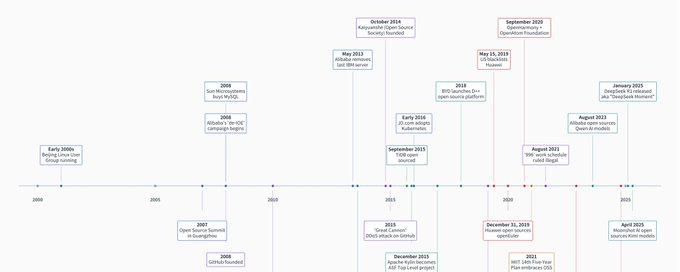
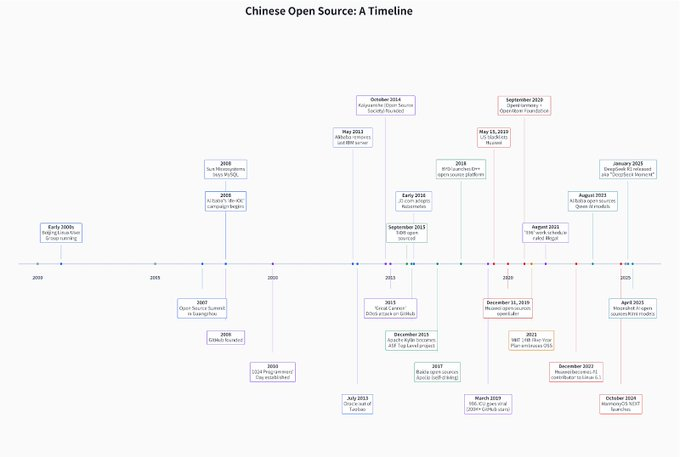
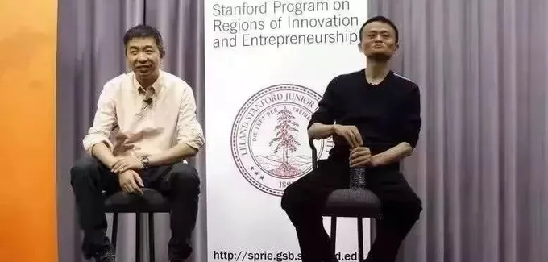
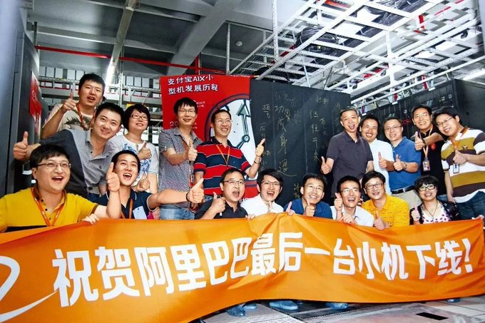
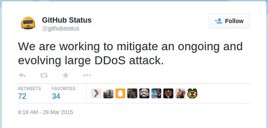
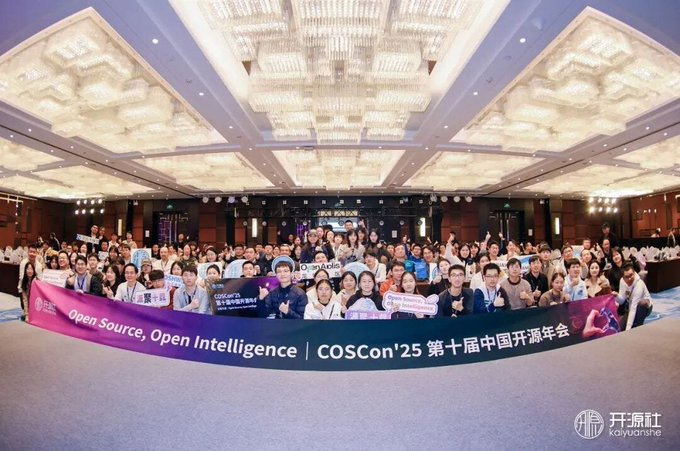
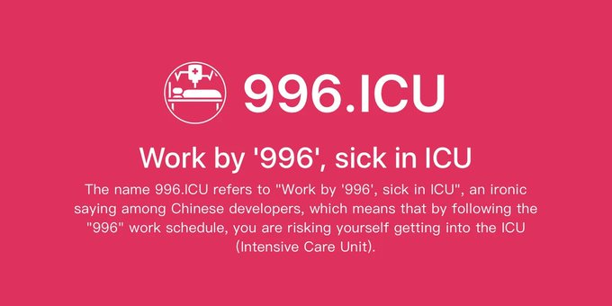
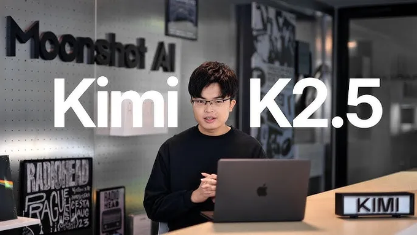
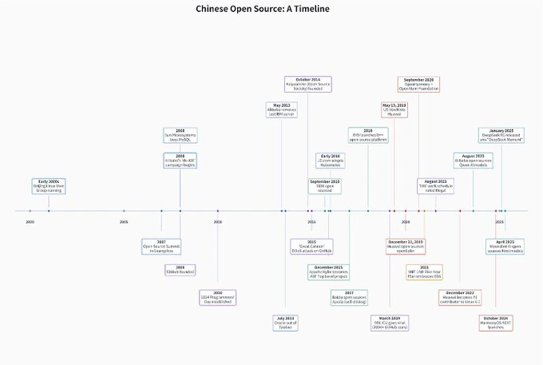

# 中国开源的权威发展史

URL: https://x.com/kevinsxu/status/2029961571296743585

开源曾经是一个相对小众的话题，中国科技也曾经是个小众话题。但得益于 AI 浪潮，“中国开源科技”这二者结合的话题成了当下的热门词汇。从旧金山的黑客之家到华盛顿、布鲁塞尔、新德里甚至北京的决策层，所有人都在试图理解这个故事，并基于此做出决策。

五年多前，我开始在自己的 Newsletter 里将“中国开源”作为一个爱好话题来写。那时，科技界和政策界的很少有人关注中国开发者在 GitHub 上做什么，或者关注那些由科技巨头和新秀公司发起的不同开源项目与社区；更很少有人关注，为什么中国政府对开源的态度会从模棱两可、偶尔抵触，转变为全面拥抱并将其作为国家创新与软实力战略的核心部分。

DeepSeek 改变了一切。与 Qwen（通义千问）、Kimi、GLM、MiniMax、Stepfun（阶跃星辰）甚至 Unitree（宇树科技）等一起，中国的开源权重 (open weight) AI 模型席卷了全球。这种影响力甚至让“开源”在中国总理于两会上的重要讲话中获得了点名，承诺将继续发展开源社区和生态系统，将其作为国家下一个五年计划的一部分。

尽管这一切可能令人惊讶，但中国的开源并非无中生有，它有着悠久的历史。与太阳能、半导体或电池等行业不同，它从未自上而下地被视为“战略性”产业，而在很大程度上是作为科技领域内的一个有机亚文化而存在的，直到 DeepSeek 将它从默默无闻中拉了出来。

许多决策者面临的一个大问题是：中国开源是否会成为全球科技格局的一个永久特征，还是会成为一个尽管对西方资本主义有吸引力，但最终会被西方政府封杀和排斥的短暂现象？在决定如何回答这个问题之前，首先了解中国开源的历史可能是很重要的。

我曾在 GitHub 工作，领导其国际扩张战略，并参与了许多跨越硅谷和中国的开源项目。因此，我得以在前排观察开源是如何成为中国、乃至全球科技生态系统中的一股力量的。DeepSeek 本身可能是一个特例——它源自对冲基金，拥有独特的计算效率，但其他中国 AI 实验室的成长和最佳实践，则是一个成熟的、经过了二十年孕育的开源环境自然且在某种程度上可预测的演变结果。即使是黄仁勋（Jensen Huang）常被引用的那句话——“世界上50%的 AI 人才来自中国”——也不应让人感到震惊，考虑到开源在普及大众技术教育方面一直发挥的不可或缺的作用。

这篇文章试图讲述故事的完整弧线——一段权威的中国开源历史——从它的早期岁月一直讲到现在。我将这段历史划分为六个阶段，每一部分都是一个路标，标志着我认为的关键篇章，以帮助读者跟上并抓住大局。我还寻求了几位长期参与中国开源的专家的帮助，以获取他们最新的观点和反馈。我在文章中刻意加入了一些人物和声音，为了给这个本来枯燥的技术话题带去一点人情味和共鸣，尽管我知道某些细节被一笔带过了。

无论你戴着哪种镜片来阅读这篇文章——投资者、决策者、企业家还是黑客——我都希望你能学到一些新东西。

预览本文内容的时间轴。你可能需要眯着眼睛看，抱歉……

追踪开源软件的传播是不可能的，所以很难确切说出第一行开源代码是何时进入中国的。

Linux，这款无处不在的开源操作系统，于 1994 年夏天首次进入中国。它是由一位名叫宫敏（Gong Min）的中国技术专家带来的。而 Linux 发布其第一个版本是在 1991 年。到了 21 世纪初，一个繁荣的 Linux 用户群已经运转起来。Mozilla 基金会于 2007 年在北京设立了办公室。Linux 基金会也在北京举办了开源软件峰会，该基金会的现任执行董事 Jim Zemlin 在那里与其他全球开源领导者一起发表了演讲。我们可以保守地估计，开源至少在 2000 年代初（甚至可能在 90 年代末）就已经在中国扎下了一些根基，当时一些大型企业为了提高效率和节省成本，开始初步尝试使用 Linux。但就像世界其他地方一样，在一个由微软、IBM 和其他专有软件巨头主导的领域中，开源还是一个小众概念。

## 第一幕：“去 IOE”运动

中国开源故事的第一个重要篇章并非始于某个宏大的政府宣言或有远见的创始人。和大多数开源故事一样，它始于工程师们试图为自己的公司解决棘手的问题。这家公司就是阿里巴巴。

在 2000 年代中期，阿里巴巴的发展势头如同野火燎原。到了 2008 年，它已成为亚洲最大的数据库客户，运行着一个 20 个节点的 Oracle RAC 集群，但依然触及了扩展的极限。阿里巴巴的初代架构建立在所谓的“IOE 堆栈”之上——IBM 提供服务器，Oracle 提供数据库，EMC 提供存储。IOE 堆栈是当时企业级 IT 架构的黄金标准，所以阿里巴巴当时和大多数科技公司一样使用了它。因为公司的高速增长，阿里巴巴的 IOE 账单变得越来越让人望而却步，然而这套堆栈的扩展速度却跟不上淘宝新用户在网上买买买的步伐。

于是，在 2008 年，公司那位众所周知不懂写代码的魅力型创始人马云，从微软亚洲研究院挖来了另一位同样不懂写代码的雄心勃勃的研究员——王坚，来解决这个问题。（王坚拥有心理学博士学位。）在公司内部被称为“博士”的王坚，成为了公司的首席架构师，他的战略后来催生了阿里云。（他的绰号后来升级为“阿里云之父”。）但他上任的第一要务，就是通过拥抱开源技术来摆脱 IOE 堆栈。由此拉开了“去 IOE”运动的序幕。

马云（右）与“博士”王坚（左）

这场运动激怒了许多普通工程师，他们中许多人的职业生涯都是建立在成为 IBM 或 Oracle 认证管理员之上的。许多人以前就在这两家公司工作。但王坚拥有马云的全力支持，每年有 10 亿人民币的预算来完成“去 IOE”，没有回头路可走。阿里巴巴开始使用商用 x86 服务器来替换 IBM。它开始研究构建自己的分布式存储系统以淘汰 EMC。最重要的是，它研究了 MySQL（一个流行的开源关系型数据库项目），以一劳永逸地摆脱 Oracle。（Oracle 后来在 2010 年收购了 Sun Microsystems，将 MySQL 收入囊中，而 Sun 在 2008 年收购了 MySQL。）

经历了五年痛苦的历程后，2013 年 5 月，阿里巴巴拔掉了最后一台 IBM 小型机的电源。两个月后，2013 年 7 月，Oracle 从淘宝的核心广告系统中退役，取而代之的是其自研的 MySQL 实现方案。IT 成本下降了，可扩展性提升了，阿里云的种子播下了，公司的工程能力也随之提升以迎接新的挑战，比如扩展架构以处理“双十一”（世界上最大的网购狂欢节）的极高流量。

阿里巴巴工程师庆祝最后一台 IBM 小型机下线

我之所以详细讲述“去 IOE”的故事，是因为它不仅仅是一个普通的 IT 迁移项目。它是中国开源的创世神话，在这个神话中，一家中国大型科技公司将其整个基础设施的未来押注在开源软件和商用硬件上，忍受了内部多年的质疑，最终变得更加强大。它还培育了一种创造力，促成了一个名为 Oceanbase 的内部数据库项目，这在我们的故事中稍后还会出现。

在很大程度上，“去 IOE”代表了一个时代，在移动互联网繁荣的鼎盛时期，中国科技公司主要是开源软件的获取者和消费者，以满足自身增长的需求。那时并没有民族主义意义上的“自力更生”要求。MySQL 注册于瑞典，后来被正是阿里巴巴当初想摆脱的那家美国数据库巨头所拥有，这在当时并不是什么重大的红线。避开西方技术在当时还不是优先事项。

有了“去 IOE”的先例，更广泛的中国科技生态系统也积极地拥抱了开源。2016 年初，阿里巴巴的电商宿敌京东 (JD.com)，在 Google 将 Kubernetes 开源后不到一年，远在大多数西方科技公司还觉得使用它有风险的时候，就采用了 Kubernetes。使用 Kubernetes（一个后来成为所有云计算平台事实标准的云容器编排软件）这种颇具风险的姿态，是中国互联网疯狂增长的结果（京东需要比沃尔玛更大的可扩展性），也是对获取、消费和为了自身需求定制开源技术日益增长的自信的体现。这种自信是一个重要标志，因为中国公司后来开始创建并贡献开源软件。

但在当时，这个时代的主流心态依然是：“开源能为我做什么”。

## 第二幕：社区建设者与亚文化

到了 2010 年代中期，所有中国大型科技公司都以某种方式参与到了开源领域。其中一些努力是认真的，并对生态系统有所增益。但坦白说，也有一些公司只是把失败的内部项目扔到 GitHub 上开源，然后就撒手不管了，纯粹把这种半吊子的开源当成招聘手段。质量和承诺参差不齐，文档往往只有中文，这让全球的开发者受众无法使用，维护工作也是断断续续的。

要在开源上取得成功，不仅需要优秀的代码。它需要一个协作的平台，一个任何人都能参与的透明流程，以及一套行为准则和规范，这需要的远不只是一个或几个对着键盘猛敲的“10 倍工程师”，它更需要高情商的软技能和极强的团队协调能力。

这就是社区建设者登场的时候了。

在深入了解中国自己的草根开源社区建设者之前，我们必须先向我的老东家 GitHub 致敬。（利益披露：我曾负责 GitHub 的全球扩张战略。）

成立于 2008 年的 GitHub 是一家典型的硅谷初创公司，它构建了一个网络平台，使得 Git（由 Linux 创始人 Linus Torvalds 创建的版本控制系统）对于普通开发者来说变得更容易使用。通过早期向 Ruby 社区靠拢（今天的 GitHub 仍然是最大的 Ruby on Rails 网页应用之一），并部署了个人用户优先的命名空间方案（而不是优先组织或公司），这个平台成了一艘火箭。

很快，每一个拥有稳定互联网连接的程序员都登录了 GitHub，免费下载、协作和创建开源软件。随着 GitHub 成为开源的默认大本营，中国开发者大量涌入。到了 2018 年，按照分叉 (forks)、克隆和贡献量来衡量，中国已成为 GitHub 上的第二大国家。

由于 GitHub 带有社交网络的属性——类似于面向书呆子程序员的 Facebook 或 Twitter——它在中国的处境有些尴尬。2013 年，它的域名曾被防火长城短暂屏蔽。2015 年，它遭遇了一场后来被称为“大炮 (Great Cannon)”的极大规模 DDOS（分布式拒绝服务）攻击。后来，当 GitHub 发布其移动应用时，它在中国区的应用商店里是不可用的。

然而，政府或与政府相关的网络攻击组织每一次试图干扰或屏蔽 GitHub，都会遭到该国不断壮大的开发者社区的集体抗议。如果 GitHub 挂了，谁也别想工作或写代码。就这么简单！直到今天，GitHub 依然存活，可能成为在中国技术上未被屏蔽的最大的西方网站，尽管它的性能还是会时不时受到干扰。

虽然对 GitHub（以及扩展开来的世界上最好的开源软件和开发者）的访问得以保持，但中国缺乏自己的社区重心。就在那时，开源社（Kaiyuanshe）挺身而出。

成立于 2014 年 10 月的开源社 (Kaiyuanshe) 是“Open Source Society”的拼音。它是由几位开源爱好者出于“中国应有自己专门的开源社区”的愿望而创立的。它是志愿者驱动的（所有董事会成员和工作人员在科技公司都有其他的全职工作），供应商中立的（这意味着没有大公司能主导其议程），并且完全由个人成员（而非企业）组成。它的创始原则——“贡献、共识、共治”——可以说是最理想主义的使命宣言。

它蓬勃发展了起来。

在经历了一个草根的起步阶段后，开源社现在每年都会举办“中国开源年会 (COSCON)”，吸引了从 Linux 基金会到 GitHub 首席执行官等各地领先开源组织的演讲者。去年，COSCON 庆祝了它的十周年。

开源社也做着脚踏实地的工作，不仅做举办大型会议这类光鲜亮丽的事，还做着不起眼的教育工作——向外界介绍中国开源的发展，向中国开发者介绍外面的世界。它发布《中国开源年度报告》，使用来自 GitHub 和 Gitee（中国本土的 GitHub 竞争对手）的数据来描绘该国的开源生态系统。它成为了“开源倡议组织 (OSI)”的第一个中国成员，OSI 是一个在“什么是开源、什么不是开源”方面拥有道德权威的组织（这让很多大公司感到懊恼）。2019 年，它协助起草了《木兰宽松许可证》(Mulan Permissive Software License)，这是第一个获得 OSI 批准的中英双语开源许可证。看似一个微不足道的技术官僚注脚，但获得 OSI 批准的木兰许可证意味着，中国开源社区终于有了一个不仅在全世界被法律认可，而且是用他们自己的语言编写的许可证。

开源社在向中国开发者普及开源规范、流程和文化方面发挥了至关重要的作用。中国的许多开发者在技术上非常精通，但对开源协作的社交规范并不熟悉：如何提交一个像样的拉取请求 (Pull Request)，如何进行建设性的代码审查 (Code Review)，如何围绕项目建立可持续的社区。通过研讨会、文档和导师计划，开源社帮助灌输和孵化了诸多最佳实践，这些实践为中国开源权重模型在 AI 时代的成功铺平了道路。DeepSeek、Qwen 和 Kimi 团队在为其模型发放许可、管理社区及在线存在方面所展现出的成熟度和老练，正是开源社志愿者多年来悉心培养的结果。

开源社的成员随着时间的推移变得更加国际化。来自台湾、日本甚至波兰的开发者都加入了这个组织。将他们联系在一起的不是国籍，而是对开源技术的热情，以及一定的中文普通话熟练度（以便能与其他成员讨论技术）。

由开源社主导的本土开源社区孕育出了一种独特的、常常有些古怪、有时又敢于直言的开发者亚文化。有两个例子值得我们大书特书：1024 程序员节 和 996.ICU。

在开源社建立制度层的同时，同样重要且更加丰富多彩的事情正在草根阶层发生。中国开发者正在创造他们自己的亚文化，甚至包括他们自己的节日！

2010 年，一个开发者社区在网上发起投票，确立中国的“程序员节”。获胜的日期是 10 月 24 日，即 1024，在二进制中是 2^10。如果你是一个程序员，这就不用解释了，就像 4 月 20 日（420）对另一种亚文化的意义一样。1024 这个数字同时也是一个身份标识。

俄罗斯其实是第一个拥有类似程序员节的国家。俄罗斯开发者选择了 9 月 13 日，即一年中的第 256 天，也就是二进制的 2^8。它还得到了官方的批准；时任总统梅德韦杰夫于 2009 年签署了将其设为法律的法令。相比之下，中国的程序员节则是完全自下而上的，在民间自发组织尚有生存空间的时候，在当局的视线之外发展起来的。不需要任何政府的印章。北京是否有人注意到或在乎这件事，尚不清楚。

到了 2015 年，这个“人造节日”有了自己的生命力，那些希望支持（或招聘）技术人才的科技公司开始全力拥抱并赞助它，使之成为一个全行业庆祝程序员文化和身份的节日。庆祝的主题有时很严肃，比如争取更多的休息时间和减少加班。它也可以是带有讽刺和自黑的，比如反对穿格子衬衫和发际线后移等刻板印象（大多数程序员是男性）。

不过有一点很清楚，中国程序员有着十足的个性、古怪和自嘲的幽默感。2020 年，CSDN（中国最大的聚焦程序员的媒体网络，也是开源社的共同发起方之一）在长沙发起了一场为期多天的“程序员节”会议和庆祝活动。长沙是一座对年轻专业人士很有吸引力且相对物价较低的酷城。这后来成为了一个年度盛会。

如果说“程序员节”代表着温馨和友爱，那么 996.ICU 运动则表达了对开发者个人权利和福祉的严肃捍卫。2019 年 3 月，在中国科技行业残酷竞争的最高峰，一位中国程序员在 GitHub 上创建了一个名为 996.ICU 的代码仓库。

这个名字是一个地狱笑话：工作 996（早 9 点到晚 9 点，一周 6 天），生病进 ICU（重症监护室）。这个仓库迅速成为 GitHub 历史上获得星标 (Star) 数量第二多的仓库，在几周内累积了超过 20 万颗星。使用 GitHub 作为表达这种对过度加班的集体担忧的地方并非偶然。还记得我说过 GitHub 尽管经历了多次尝试但在中国依然未被屏蔽吗？这意味着网站上的内容基本上也可以免受审查或删除。

GitHub 上的仓库可能是安全的，但中国的大型科技公司试图掩盖它并遏制其病毒式传播。腾讯的 QQ 和阿里巴巴的 UC 浏览器都屏蔽了 996.ICU 的官方网站。马云则为这种严苛的工作时间表辩护，称其是一种福气和特权。

尽管如此，996.ICU 运动还是几乎瞬间席卷了互联网和媒体。它也产生了真正的改变。这场运动催生了所谓的《反 996 许可证》 (Anti-996 License)，它是由伊利诺伊大学法学院的一名法学生起草的。该许可证改编自 MIT 许可证（一种流行的宽松开源许可证，后来被 DeepSeek 使用），它只增加了一条激进的条款：任何使用附带此许可证的软件的公司，都必须遵守当地的劳动法和国际劳工组织的公约。它的设计初衷是保护开发者的权利和健康，同时又能兼容所有主要的开源许可证。

运动开始两年后，2021 年 8 月，中国最高人民法院联合人力资源和社会保障部，裁定“996”工作制违法。据我所知，这是第一次由草根开发者发起的运动利用开源的组织机制，不仅为了执行知识产权规范，更是为了执行劳工权利规范，并最终以法律的胜利告终。

这里的讽刺意味极其浓厚：如今的硅谷正在推崇、期待甚至要求 996 的工作文化，每家初创公司都在吹嘘他们在 AI 时代构建改变世界的技术的过程中有多么“投入 (locked-in)”。然而，同样的有毒文化几年前已经被中国开发者社区使用西方网站 GitHub 和一些明确的自由民主流程，为了保护自己免受苛刻老板的压榨而成功地使其在法律上变为非法。（当然，现实中 996 在中国从未真正消亡。）

将 GitHub、开源社、程序员节、996.ICU 以及中国其他开源成长的萌芽串联起来的脉络，清晰地展现了一个独特的开发者社区的更广泛演变：这个社区已经发展得足够庞大、技能足够娴熟、且足够自信，他们不再仅仅是获取和消费，而是开始创造和贡献。

由此涌现出了一种常被称为“开源情怀”的能量，在这里，对开源能够实现乌托邦式“正和博弈”的纯粹信仰，与渴望在世界舞台上证明自己的强烈工程驱动力完美地融合在一起。这种情怀部分源于一种敏锐的意识：在西方，没有人尊重中国开发者构建的东西，因为中国的一切总是被污名化为“要么是偷来的，要么是抄来的”。反击这种偏见的最佳方式，就是不仅开发出世界级的技术，而且还要通过开源的方式将其贡献并免费分享出去。

如果这听起来有点像 DeepSeek 的风格，那么你现在知道它的根源在哪里了。但这种“开源情怀”以及它所帮助创造的众多技术，比梁文锋的突破早了整整十年。

## 第三幕：生而全球化 (Going Global from Day One)

当大型科技公司利用开源为其迅猛发展提供燃料，而像开源社这样的组织为普通开发者培养并系统化了“开源情怀”时，2010 年代中期也标志着源自中国、怀揣着驱动世界野心的独立开源项目和初创公司的黎明。

那也是中国风险投资极其充裕的时代，恰逢硅谷日益认可通过开源来建立大型公司的模式。GitHub 项目上区区几千颗星星，就能轻松吸引数百万美元的种子资金。向来紧跟硅谷潮流的中国 VC 们，为了赶上这波浪潮，积极投资了顶级的中国开源项目。

以下是几个值得一提的、获得了丰厚融资并成长为初创公司的杰出项目：

Apache Kylin（麒麟），成立于 2015 年，是首批在 Apache 软件基金会达到“顶级 (Top Level)”成熟度状态的中国项目之一。这在当时（即使现在也是）是对任何新开源项目的一大认可和合法性背书。该团队出自 EBay 中国研发实验室，其软件旨在解决大数据分析难题，与 Apache Spark 有些类似。Kylin 团队后来围绕他们的项目创办了一家名为 Kyligence 的初创公司，获得了风险投资的支持，这很像 Spark 团队后来创立了数据仓库巨头 Databricks 一样。

TiDB，同样成立于 2015 年，成为当时中国成长最快的 GitHub 项目之一。它是一个分布式、类似 MySQL 的数据库，灵感来源于 Google Spanner（由 Jeff Dean 等 AI 泰斗共同撰写论文）。它的三位创始人都有来自中国快速增长的互联网领域的数据库和基础设施经验，包括那个冒险采用 Kubernetes 的京东团队。围绕 TiDB 成立的初创公司叫 PingCAP，吸引了数亿美元的风险投资。到了 2018 年，PingCAP 被认为已经足够优秀，可以在中国替代 Oracle 数据库。

（利益披露：我曾为 Kyligence 的美国扩张战略提供建议。我也曾在 PingCAP 工作，负责领导其在中国以外市场的走向市场、社区和增长战略。）

在那个时期，还有许多其他开源项目获得了融资并成为初创公司。PingCAP 和 Kyligence 绝不是个例，尽管它们确实引领了这股潮流。中国的科技巨头们也注意到了这些在 VC 支持下独立项目的高速增长和吸引力，感受到了压力，觉得仅仅把开源技术拿来自己用是不够的。

Oceanbase，这个我们早前故事中提到的、源于阿里巴巴“去 IOE”运动的内部数据库项目，一直在持续开发。它最终在 2019 年打破了一项名为 TPC-C 的数据库行业基准测试的世界纪录。所以，在狭义的、基准测试的意义上，Oceanbase 成为了世界上最快的数据库！但作为一个隐居在阿里巴巴金融科技子公司蚂蚁金服内部、与这家科技巨头绑定得过紧的闭源项目，它的吸引力是有限的，而与此同时 TiDB 却在开放的环境中大放异彩。为了与 TiDB 等对手竞争，Oceanbase 于 2020 年从蚂蚁金服剥离出来，并在 2021 年实现了开源。

这种自下而上的、对开发者友好的开源增长引擎，早已蔓延出了像数据库这样的小众基础设施软件领域。

搜索引擎巨头百度在 2017 年开源了其自动驾驶平台 Apollo，立志成为“自动驾驶界的 Android”。今天，Apollo 层仍在为百度的自动驾驶出租车 (robotaxis) 提供动力，这些出租车在全球累计完成了 2000 万次出行。

阿里巴巴进一步将开源推向了它的硬件野心。它的芯片设计子公司平头哥 (T-Head)，利用了开源半导体指令集架构 RISC-V，并在 2021 年推出了名为玄铁 (Xuantie) 的开源处理器项目。平头哥现在构建了世界上最快的基于 RISC-V 的处理器内核之一。该部门正准备于今年晚些时候在香港进行 IPO。

甚至连电动汽车巨头比亚迪也不想在开源的浪潮中掉队。2018 年，比亚迪举办了一场发布会，推出了其 D++ 开源平台，允许开发者免费下载并构建在控制其汽车传感器和控制器的软件堆栈之上。它还与百度的 Apollo 进行了集成，因为开源项目往往倾向于交叉授粉和相互操作，以创建一个更广阔的平台。如果说百度的野心是成为“自动驾驶界的 Android”，那么比亚迪也同样有着通过开源成为“电动汽车界 Android”的野心。

这些无论是来自独立新秀还是科技巨头的项目，从未获得过后来 DeepSeek 所获得的头条新闻和巨大名气。但他们构建了“肌肉记忆”——工程文化、社区管理技能、以及在宽松的开源许可证与商业化期望之间巧妙走钢丝的老练——当大型语言模型席卷世界时，这些经验将被证明是至关重要的。

## 第四幕：华为的冲击

谈论中国开源，或者任何与中国科技相关的话题，都不可能绕开华为。然而，这家“国家队冠军”企业直到现在才在中国开源历史的叙述中出场。那是因为它进入开源游戏的时间相对较晚。如果世界没有向坏的方向转变，华为原本很乐意保持原状。

和其他中国科技机构一样，华为在二十多年前就开始获取和消费开源软件。随着其技术的进步，华为也成为了一个积极的贡献者，其中最著名的是对 Linux 内核的贡献（Linux 是运行世界上大多数计算平台的开源操作系统）。到了 2018 年，华为已跻身 Linux 内核的顶级贡献者之列。但它满足于在别人的生态系统中玩耍，而不是投资去创建自己的生态系统。

这一切在 2019 年 5 月 15 日改变了，那一天，美国商务部将华为列入了“实体清单”黑名单。

如果说“去 IOE”运动向中国科技公司展示了如何利用开源来实现增长和扩展，那么华为对美国制裁的反应则展示了更关乎生死存亡的一面：拥抱开源事关企业的生存，甚至是国家的生存。

“黑名单”带来的直接影响是毁灭性的。华为被切断了与整个由谷歌领导的 Android 生态系统的联系，尽管 Android 本身也是开源的。这让其智能手机产品线陷入困境，而在此之前，华为的某些机型在特定市场上的销量已经开始超越苹果的 iPhone。它也被切断了从英特尔到高通的美国芯片供应。这些限制最终通过“外国直接产品规则”延伸到了台积电，因此华为将很难在世界上最好的晶圆厂生产其自主设计的芯片。整个美国及美国盟友的技术供应链正在迅速切断。

华盛顿传达的信息很明确：它想彻底干掉华为。

华为必须在工程能力允许的范围内，尽快重新造出所有的“轮子”。它倒不必完全从零开始。早在 2012 年，公司就启动了几个内部的“B 计划”项目，旨在为那些依赖西方技术的核心技术构建替代方案。华为的操作系统 HarmonyOS（鸿蒙）项目始于 2015 年。HongMeng 内核——一个从零开始设计、不基于 Linux 的微内核——始于 2016 年。到了 2017 年，一个可运行的 HarmonyOS 版本展示给了华为的创始人兼家长任正非。

任正非谈论开源

但是，当“B 计划”变成“A 计划”时，仍然需要一些调整。华为必须迅速倾注其全部资源来开发这些还未成熟的替代方案。对我们的故事更重要的是，公司决定将其尽可能多地开源。到那时，华为和大多数中国科技公司已经深刻认识到：拥有优秀的代码和能用的技术固然好，但如果没有一个开放的生态系统和开发者的认同，它们的潜力将是非常有限的。

以典型的华为作风，它在开源方面全力以赴，毫无保留。2019 年的最后一天，它开源了 openEuler，一个在其云上运行的服务器端操作系统。在整个 2020 年，当全世界都在努力度过新冠疫情时，它开源了 openGauss（一个类似于 Oceanbase 和 TiDB 的分布式数据库）、openLooKeng（一个数据虚拟化引擎）和 MindSpore（一个后来在 AI 时代变得更加突出的 AI 计算框架）。2020 年 9 月，它不仅开源了基于 HarmonyOS 的移动操作系统 OpenHarmony，还利用它作为种子孵化了一个新的开源基金会，名为开放原子开源基金会 (OpenAtom Foundation)。这个基金会成为了中国第一个有政府背景的本土开源基金会。（这与如今依然由志愿者和草根驱动的开源社形成了一个重要的区别。）为了生存，华为试图重塑的不仅仅是技术堆栈的每一层，还包括开源的社区结构。

在所有这一切发生的同时，公司仍然大量使用并向 Linux 贡献代码，以维持业务运转。以至于在 2022 年 12 月 Linux 发布其 6.1 版本时，华为——不是英特尔，不是红帽，而是华为——成为了排名第一的最大贡献者！

到了 2024 年 10 月，当华为发布 HarmonyOS NEXT（纯血鸿蒙）时，它已经删除了每一行 Android 代码，用自己的 HongMeng 微内核取代了 Linux 内核，并开始用自己的代码驱动其庞大生态系统中的每一个应用。不再有 Android。不再有谷歌的血统。与西方技术的“离婚”已彻底完成。

## 第五幕：国家队入场

在中国开源历史的大部分时间里，政府扮演的角色微乎其微。它的增长和演变完全局限在私营企业的业务需求（如阿里巴巴的“去 IOE”运动）和草根社区的热情（如开源社）的范围内。可能有一些基层官员在其早期听说过并试图研究开源，但这种技术开发模式并没有达到任何优先或突出的级别。如果说有什么不同的话，那就是开源固有的社会组织机制——与来自世界各个角落的开发者聊天和协作——对中国筑有围墙的互联网花园构成了风险。

这种默默无闻的状态在 2021 年发生了改变。当时，作为中国科技行业主要官僚机构和监管者的工业和信息化部（MIIT），在其规划文件中正式将开源作为国家“十四五”规划的一部分。“开源”一词被点名了 27 次。由华为牵头创建的 OpenAtom 基金会被作为一个重大成就和学习的榜样被特别提及。工信部设定了一个目标，即到 2025 年建立并培育两到三个具有“全球影响力”的开源社区。

政府的这种拥抱，和任何政府的拥抱一样，是一把双刃剑。

从积极的一面来看，在像中国这样的经济体中，站在政府支持的一边总比站在对立面要好。去问问几年前在教育科技 (EdTech) 或高端金融行业工作的任何人就知道了。这也意味着地方政府将分配更多的资源来响应中央政府的号召。这些新资源中，有些最终会被浪费，或与雄心勃勃的官员的晋升计划绑定在一起，但有些也确实办成了实事。这种模式在中国反复上演——在半导体、太阳能、电池领域——这几乎成了中国式产业政策不可避免的“经商成本”。但这种类型的浪费总比站错队要好得多。

从消极的一面来看，政府的明确关注也意味着强硬的手段，比如“挑选赢家”。这甚至在工信部的五年计划文件发布之前就发生了：2020 年 8 月，工信部将 Gitee（一个本土基于 Git 的 GitHub 克隆产品）钦定为首选的源代码托管公司（即“国家队冠军”），作为培育更多国内开源增长的平台。然而，开源在定义上就是全球化的；从来没有哪项优秀的开源技术是局限在一个国家之内创造出来的。从阿里巴巴到 PingCAP 的每一家中国科技公司，在进行了高水平的开源实践后，当然早就深知这一点。为了遵守规定，每一个知名的中国开源项目都被在 Gitee 上重新创建并做了 GitHub 的镜像——这成了一个额外的副本，变成了额外的工作量和额外的维护负担。与此同时，随着开源 AI 的起飞，大部分的活动仍然发生在 GitHub 上，后来又转移到了 HuggingFace（一个托管开源权重模型和数据集的类似协作平台）。

人们有一种夸大中国政府在各个经济部门中的作用和影响力的倾向。对于某些行业来说，这种影响是真实且有效的。但至少对于开源而言，政府是后来才介入的。在这个案例中，是官僚们跟随了代码和社区的脚步，而不是相反。

## 第六幕：DeepSeek 与开源权重 (Open Weight) AI

当 DeepSeek 在 2025 年 1 月突然出现在所有人的雷达上时，让我觉得其 R1 推理模型的发布显得与众不同的，并不是它那（多少有些争议的）性价比极高、甚至让英伟达股价暴跌的性能，而是它的发布方式。采用 MIT 许可证，允许无任何限制地用于所有用例。完整的思维链 (chain-of-thought) 全部公开，供所有人查看（和蒸馏）。紧接着是一个“开源周”，在这个星期里，DeepSeek 每天开源更多他们工具链的组件，以进一步激发社区的参与度和生态系统的活力。

这是一个被完美执行的经典开源发布剧本（而且其成功可能远超 DeepSeek 团队的预期）。这是一个关于如何以“正确方式”进行开源的成熟范例，而这种成熟度是经过了整整二十年的酝酿才达成的。而且，DeepSeek 并非孤军奋战。

阿里巴巴的 Qwen（通义千问）团队甚至比 DeepSeek 更早开源了他们的模型权重，同样使用了极度宽松的 Apache 2.0 许可证。当 Kimi 发布其 Kimi 2.5 开源权重模型时，其创始人杨植麟和核心团队的其他成员在 Reddit 上举办了 AMA（Ask Me Anything，问答活动），并直接用英语与社区互动。如果在几年前，这样的举动和自信释放对于一个中国开源创始人来说是很难做到的。后来，杨植麟甚至在 X/Twitter 上通过面对镜头的视频直接发布了 Kimi 2.5。

智谱 AI 的团队每次发布其采用 MIT 许可证的 GLM 模型的新版本时，也会在 Reddit 上举办多次 AMA 问答。

杨植麟直面镜头发布产品。

除了日益成熟的社区建设策略和用英语与主要为西方的在线受众进行互动的自信不断增强之外，中国开源 AI 实验室还拥有越来越敏锐的商业嗅觉。几周前，当开源 AI Agent 框架 OpenClaw 席卷互联网时，Kimi 和 MiniMax 成了首批在其平台上提供全托管 OpenClaw 解决方案且无需任何设置的公司。这种开源商业化剧本——为难以设置的流行开源工具提供云托管解决方案——已被 AWS 等云巨头和 MongoDB 等独立软件供应商反复验证过。这个剧本已经被每一位中国开源创始人、维护者、贡献者和运营者深深内化，就等着在 AI 世界里大显身手。

中国新一代的开源建设者所驱动的 AI 浪潮，可以说是 2025 年最大的 AI 新闻。模型的进展、发布的速度、以及那些既相互竞争又似乎在互相打气的众多 AI 实验室的数量，来得既快又猛，且没有丝毫放缓的迹象。我不打算在这里重述许多关于基准测试的比较分析或 AI 蒸馏的伦理问题。我希望描绘的是一幅生动的画卷：许多代中国开源从业者，他们“蒸馏”（不是 AI 训练意义上的蒸馏）出了一个坚实的知识基础，而当前的这一代 AI 建设者们正是站在这个基础之上。

DeepSeek 的梁文锋有没有去凑过 1024 程序员节的热闹？
月之暗面 (Moonshot AI) 的杨植麟有没有参加过开源社关于社区建设最佳实践的网络研讨会？
创立了人形机器人新秀 Unitree 的王兴兴，在他年轻的时候有没有吸收过一些“开源情怀”？这绝对可以解释为什么 Unitree 决定开源其自己的 `unitree_rl_gym`（其机器人的大脑），并保持着活跃的 GitHub 更新，这在中美两国的机器人初创公司中都是独一无二的。

这些在 AI 领域的开源贡献行为，经常被归结为中国试图增加产能过剩、以其创造物充斥世界的“邪恶计划”的又一部分——只不过这次用的是软件和模型权重。如你所见，这种观念在历史上是不准确的。更别提中国目前正刻意努力遏制产能过剩并消除“内卷”，这其中的讽刺意味有多深了。

真实情况是，中国科技企业家目前很难找到跨越中国市场实现增长的途径，而开源则是向海外扩张的关键战略。国内经济表现平平，两会设定的 GDP 增长目标创下 1991 年以来新低就是明证，因此国内增长的天花板很低。但走向海外同样充满障碍，从“中国”这个标签带有的“有毒”色彩，到打造吸引不同市场和口味的产品的固有挑战，无处不在。

开源给了潜在的用户、开发者和客户一个机会，让他们可以免费、没有许可负担、没有法律后果（至少目前还没有）地体验你的技术能力，同时让技术仅仅基于其性能和价值接受评判。采用这种方法可能会放弃一些前期的、短期的收入，但如果技术能够立足，那么品牌效应和口碑带来的商誉绝对物超所值。开源已经成为了任何海外增长战略中不可或缺的、而不仅仅是锦上添花的一部分。

当谈到中国时，黄仁勋最常被引用的两个观点是：1) 中国拥有世界上 50% 的 AI 人才；2) 来自中国的开源 AI 令人印象深刻。让我觉得好笑的是，他从来没有把这两点作为一个相互关联的点一起来提。因为开源是每位工程师教育旅程的核心，无论你是一开始是个青少年黑客，还是经历了名牌大学的课程，抑或是在职业生涯中期参加了训练营接受培训。

如果没有对开源的接触和积极拥抱，就不会有技术人才储备。每一个技术教育项目都在使用开源技术。这不仅仅是因为开源是免费的且大多数教育机构资金匮乏。更是因为，对每一个技术细节的开放和透明是教与学的核心。

如果你看不到也改不了代码（或模型权重），你又怎么能教学生某个东西是如何工作的，并让他们去学习、探索和修补呢？作为一个国家或社会，如果你不推广开源（哪怕只是出于培养自己的人民去与其他国家竞争的自私目的），你又怎么能指望对 AI 及其不断增长的能力施加任何程度的控制或主权呢？

中国开源的故事，从根本上说是一个在压力下吸收、适应并最终创新的故事。它是一个有机的、组织松散的部落，他们偏爱开放和透明——这些价值观通常被认为与西方相关并在西方得到实践。如今，为了回应自力更生的压力和对全球认可的渴望，它已经发展出了自己独特的风格和特权。

既然它的历史已经被记录下来了（我敢说，是权威地记录了），它的未来仍在书写之中。这个未来将如何展开？作为一个在开源领域浸淫多年的人，我的经验法则是：永远跟随开发者。因为现在由中国开发者在开放环境下构建的技术，比以往任何时候都要多。

特别感谢那些给了我宝贵而慷慨的反馈意见的人。

温馨提示：这就是你刚刚读到的所有内容的时间轴。