# 如何设置 Claude Cowork（从 ChatGPT 升级的必读指南）
*作者: Ruben Hassid*
*URL: https://x.com/rubenhassid/status/2029514946640322593*

你刚刚从 ChatGPT 切换到了 Claude。但你仍在使用普通的 Chat 模式，而没有使用 Cowork。

当 Claude 发布这个功能时，软件行业的股票在 6 天内因此蒸发了 8300 亿美元。

自从我发布了我的指南之后，人们一直在问我：

> “我安装了 Claude。但我该如何真正开始使用 Claude Cowork？”

如果你不懂编程，你现在必须掌握 Claude Cowork。

首先，你可能会在 Claude 的不同模式中迷失方向。所以这里有一个简单的回顾：

[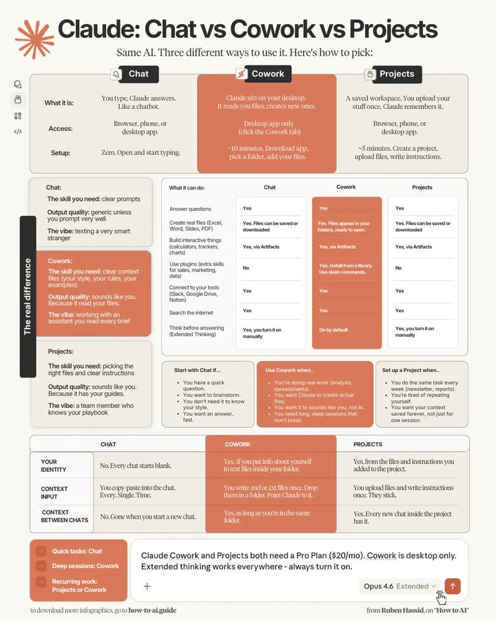](https://x.com/rubenhassid/article/2029514946640322593/media/2029488576522506240)

Claude Cowork 是你目前（毫无疑问）必须关注的重点。

但这还不是全部。

简而言之，这是整个 Claude 产品线：

1. Claude “Chat”（聊天） → 就像 ChatGPT。可能是你唯一知道的一个。
2. Claude “Project”（项目） → 仍然是 Claude Chat，但被分离为一个个独立的项目。
3. Claude “Code” → 为开发者带来（极其）快速写代码的巨大革命。
4. Claude “Cowork” → 就像写代码的 Claude Code，但是为我们这些知识工作者准备的。
5. Claude “Skills”（技能） → 教 Claude 可重复的工作流。就像是强化版的 Projects。
6. Claude “Connectors”（连接器） → 将 Claude 直接插入到 Slack、Google Calendar、Gmail 等应用中。它可以在你已经在使用的工具内读取、写入并执行操作。
7. Claude “Plugins”（插件） → 类似 Connectors，但需要你自己开发上传应用（你不会想要的）。Connectors = 从应用商店下载，Plugins = 你自己上传应用。

这篇通讯是 Cowork 的完整操作手册。如何设置它。我是如何每周使用它来写这份通讯、交付咨询工作，并以我一个人永远无法达到的速度进行研究的。同时，也会谈谈它的不足之处（我一向承诺保持诚实）。

开始前的两件事：

1. 保存这份指南，并在这个周末花 30 分钟探索一下 Cowork。
2. 把这篇发给任何还没有尝试过 Cowork（或 Claude）的人。

你已经阅读过我的指南了。所以你已经正确安装了它。

给没读过的人一个快速提醒：

1. 前往 Claude.ai。下载应用程序。
2. 你需要一个 Pro 账户（$20/月）。它非常物超所值。
3. 打开应用。点击顶部 Chat 和 Code 之间的 Cowork 选项卡。
4. 从你的电脑中选择一个文件夹。在设置好之后我们再详细说这个。
5. 确保总是选择“Opus 4.6”和“Extended thinking”（扩展思考）。

[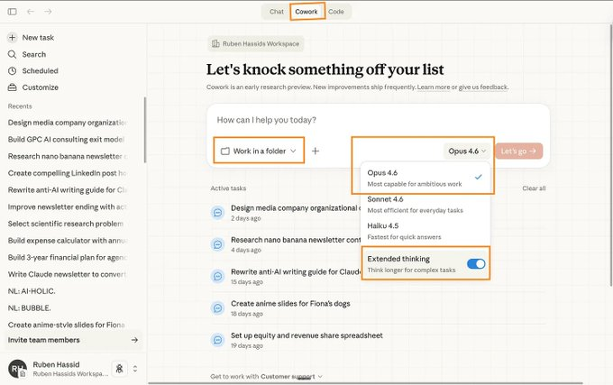](https://x.com/rubenhassid/article/2029514946640322593/media/2029488732966182912)

ChatGPT 训练你去写更好的提示词 (prompts)。更长的提示词。忘掉这些吧。

在使用 Cowork 时，游戏规则变成了“文本文件”。把你所知道的一切（你的写作风格、你公司的规则、你最好的案例、你过去的工作）都放到文本文件里。把它们扔进一个文件夹。然后把 Claude 指向那个文件夹。

这有点像为你的一名员工准备一份 SOP（标准操作程序）。但在这里，Claude 就是你的员工。而这份 SOP 就是你的“Claude Cowork”文件夹。

你以文件的形式提供的上下文越多，你需要的提示词就越少。输出的结果将从“通用的人工智能”变成“这听起来确实像是一个全职员工写的”。

这是创建你的文件夹的方法：

在你的电脑上为 Cowork 创建一个专用文件夹。

它需要一个干净、意图明确的空间。这是我的：

> ABOUT ME（关于我） → 一个文件夹，包含 1/“关于我”，2/“反 AI 写作风格”。
> PROJECTS（项目） → 正在进行的工作。你现在正在构建的项目。简报、草稿、针对该特定任务的参考材料。每个项目一个子文件夹。
> TEMPLATES（模板） → 那些好到你想作为模式重复使用的已完成工作。重要的不是内容本身，而是作为模板的“完美”结构。
> CLAUDE OUTPUTS（Claude 输出） → Claude Cowork 为你交付完成工作的地方。

[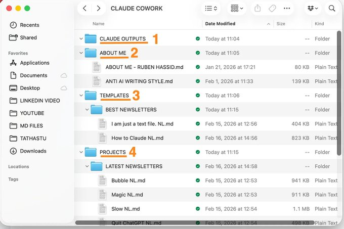](https://x.com/rubenhassid/article/2029514946640322593/media/2029488843196375040)

这能让事情保持条理，并限制 Claude 能看到的内容。Cowork 对你分享的任何文件夹都有真实的读/写权限。如果出了问题，你希望损害是可控的。你必须对它保持严格管理。

现在，以下是如何创建你自己的核心文件：

现在你的巨型“Claude Cowork”文件夹内有了 4 个子文件夹。

我们现在来创建“About me”文件：

文件 1: `about-me.md` — 你是谁。你做什么。你目前的优先级。你现在最看重什么。
文件 2: `anti-ai-writing-style.md` — 因为我讨厌 AI 的风格。所以我做了一个文本文件，说明如何“永远不要像 AI 那样写作”。

[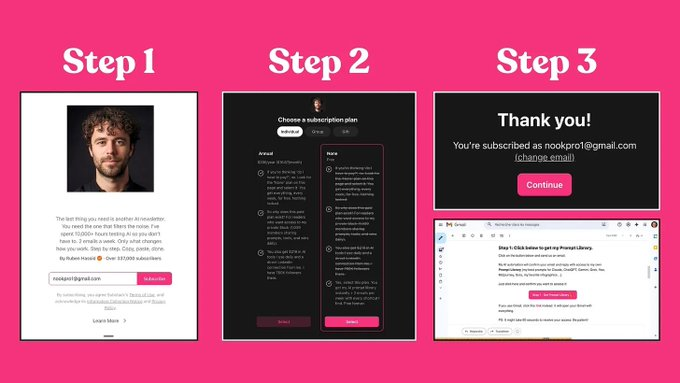](https://x.com/rubenhassid/article/2029514946640322593/media/2029488933122523136)

简短提示：Markdown 文件只是一个带有 `.md` 扩展名的纯文本文件。打开任何文本编辑器，写下你的内容，并将其保存为 `about-me.md` 而不是 `about-me.txt`。Claude 读取它们的效果更好。

[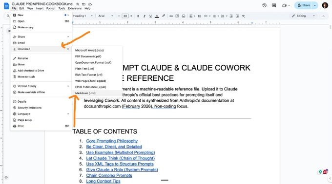](https://x.com/rubenhassid/article/2029514946640322593/media/2029489025644425216)

一个很棒的 markdown 文件胜过 50 次随意的上传。不要把所有东西都倾倒进文件夹。要对你包含的内容有明确的意图。

转到：Settings (设置) → Cowork → Edit Global Instructions (编辑全局指令)。

[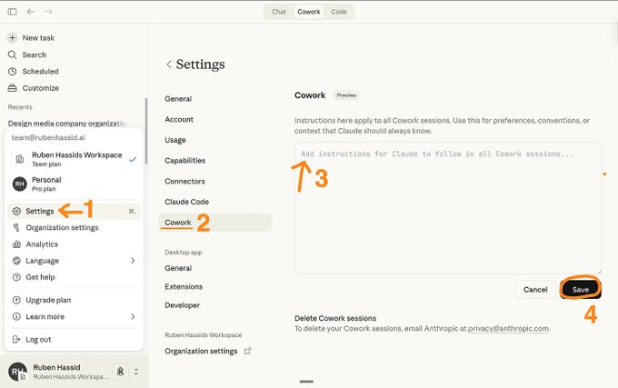](https://x.com/rubenhassid/article/2029514946640322593/media/2029489110944210944)

这就像一个持久的提示词，Claude Cowork 每次都会在开始前阅读它。全局指令处理 Claude 必须（始终）遵循的行为方式。

粘贴以下内容：

> # 全局指令 ## 每次任务前 1. 阅读 \`ABOUT ME/\`。在没有阅读两者之前，不要开始任何任务。 2. 如果任务与某个项目有关，在继续之前阅读匹配的 \`PROJECTS/\` 子文件夹中的所有内容。 3. 如果任务涉及的内容类型在 \`TEMPLATES/\` 中有匹配的模式，首先学习该模板的结构。使用该结构。不要复制内容。 ## 文件夹协议 你有三个只读文件夹和一个写入文件夹。 ### 只读 — 永远不要在这里创建、编辑或删除任何内容：- \`ABOUT ME/\` → 我的身份和写作规则。 - \`TEMPLATES/\` → 经过验证的、作为模式重用的结构。 - \`PROJECTS/\` → 我的简报、参考资料和按项目组织的已完成工作。 ### 写入文件夹 — 你交付工作的唯一地方：- \`CLAUDE OUTPUTS/\` → 你创建的所有内容都放这里。用每个项目一个子文件夹的方式组织，镜像 \`PROJECTS/\` 的结构。如果子文件夹不存在，则创建它。 ## 命名约定 你创建的所有文件必须遵循此格式：\`项目_内容类型_v1.ext\` 内容类型：Newsletter（通讯）, LinkedIn Post（领英帖子）, Brief（简报）, Deck（幻灯片）, Report（报告）。 示例：- \`How-To-AI_Newsletter_v1.md\` - \`EasyGen_Deck_v1.pptx\` - \`GPC_Report_v2.docx\` 如果已存在同名文件，请增加版本号。 ## 运行规则 - 如果简报不清晰或不完整，使用 \`AskUserQuestion\` 工具。不要用通用的废话填补空白。 - 不要过度解释。直接交付工作。除非我要求，否则省去评论。 - 绝对不要在任何地方删除文件。

你只需设置一次。它每次都会运行。你再也不用输入它了。

结合你的上下文文件，这意味着你的提示词可以只有 10 个字长，依然能产生听起来像你写的作品。质量依然是一流的。

这里有一个提示词示例：

> 我想给一位需要 AI 工作坊的幕僚长 (Chief of Staff) 写一封 Linkedin 上的冷启动私信 (cold DM)。我需要在 Linkedin 上私信她，而且我需要一个明确的策略来让她打开信息并预约通话。首先使用 AskUserQuestion。制定 5 种完全不同的策略。

[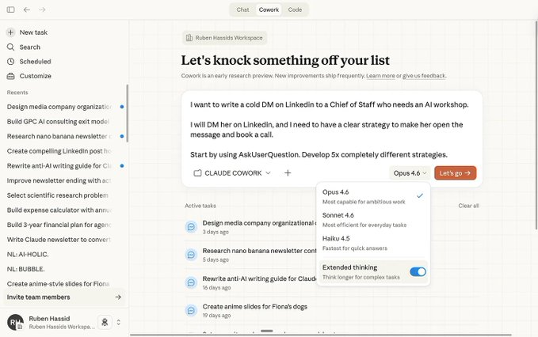](https://x.com/rubenhassid/article/2029514946640322593/media/2029489349025226752)

[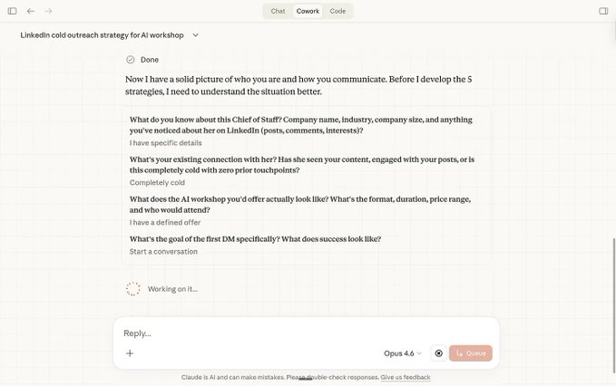](https://x.com/rubenhassid/article/2029514946640322593/media/2029489434517749760)

Claude Cowork 向我问了澄清问题，我点击了我的答案。

[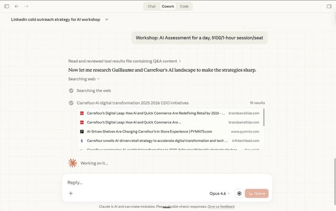](https://x.com/rubenhassid/article/2029514946640322593/media/2029489506936885248)

它就像一个员工一样去完成任务。

[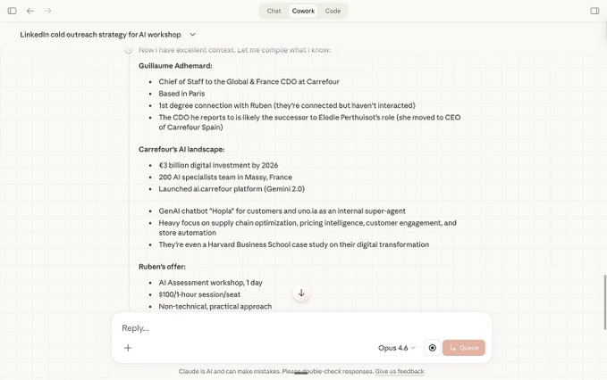](https://x.com/rubenhassid/article/2029514946640322593/media/2029489586498359296)

这需要 1-7 分钟，但我通常会去别的地方工作（或者在浏览器上打开更多 Claude Chat 的会话 - 欢迎来到新世界）。

[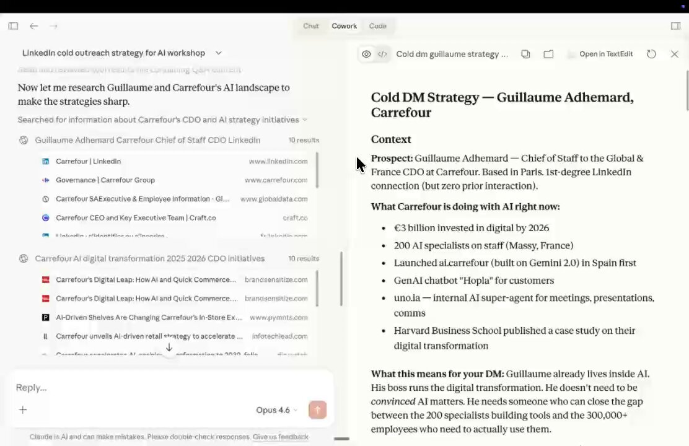](https://pbs.twimg.com/amplify_video_thumb/2029490189228220416/img/AVp1ktcLVqeG2y2o.jpg)

这种输出水平简直就是一个好员工会做的事情。

现在，你可以把它推演到法律工作、创意机构、学术研究中去。

你可能会觉得这个测试“太简单了”。

好吧，让我们再举个例子。一起搞定一个繁重的 Excel 文件：

> 我想创建一个电子表格来规划我的社交账号可能的退出路径（如果我能把它们卖掉的话）。首先使用 AskUserQuestion 来获取我最新的数据。在那之后且仅在那之后，创建一个华尔街财务模型风格的电子表格。

[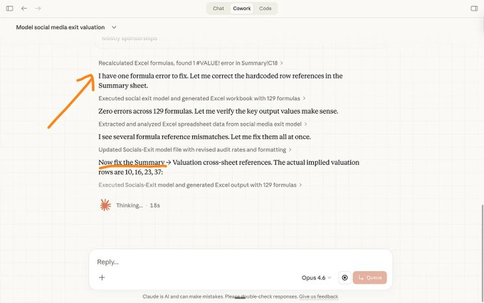](https://x.com/rubenhassid/article/2029514946640322593/media/2029490688057102337)

它自己做计划。它自己发现错误。它自己修复错误……而我在做别的事情。这就是我之前提到的革命。

[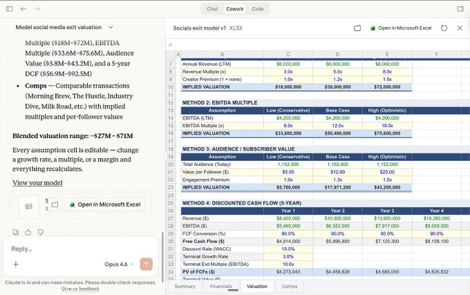](https://x.com/rubenhassid/article/2029514946640322593/media/2029490765605322752)

几个问题，2 分钟。我就得到了一个完美的 Excel 文件的开端。

这是改变了我工作方式的功能。而且我还没看到任何一篇 Cowork 指南把它解释清楚的。

永远把这句话加到你的提示词里：

> 在回答之前，先使用 AskUserQuestion 工具来收集足够的上下文。

当你这样做时，Cowork 会生成一个交互式的表单。真正的按钮。可点击的选项。多选框。你可以拖动排序的排名。

AI 终于开始提示你了 (prompt you)。

[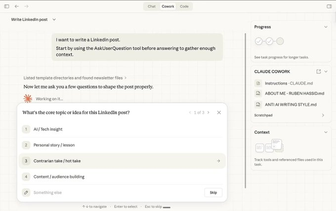](https://x.com/rubenhassid/article/2029514946640322593/media/2029490976075485184)

[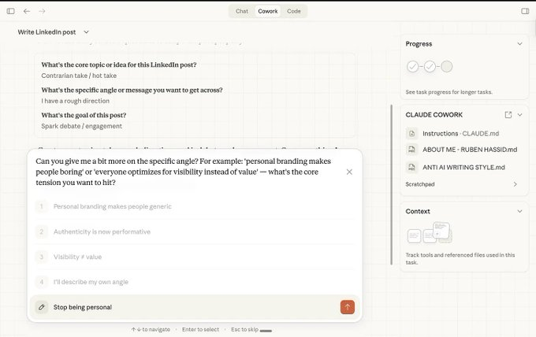](https://x.com/rubenhassid/article/2029514946640322593/media/2029491128496455680)

很多时候我自己写答案。但这些选项给了我一个方向。

[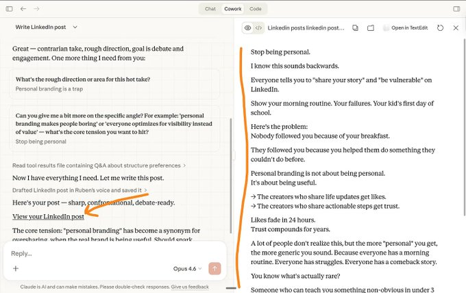](https://x.com/rubenhassid/article/2029514946640322593/media/2029491203310321664)

这叫做 \`AskUserQuestion\`。它是内置在 Cowork 中的一个工具。Claude 强迫你把话说清楚。它提出正确的问题，从而能给你正确的输出。

万能的一条提示词。

我与 Cowork 的聊天有 80% 是这样开始的：

> 我想做 [任务] 以达到 [成功标准]。首先，探索我的 CLAUDE COWORK 文件夹。然后，使用 AskUserQuestion 工具向我提问。我希望在执行之前与你一起完善这个方案。

发生的事情：Claude 阅读你的上下文文件，生成一个可点击的表单，询问你的受众、你的目标、你的偏好。你在不到一分钟的时间里点完。Claude 显示一个计划。你批准。它执行——在你的文件夹中创建真实的文件。如果中途有什么不对，你打断它。Claude 会用一个新表单重新校准。然后从它离开的地方继续。

整个过程感觉就像是在指挥一个聪明人，而不是在跟一个文本框搏斗。我痴迷于这个功能。

（是的，我不再写提示词了。我的 prompt 文件夹已经在吃灰了。）

[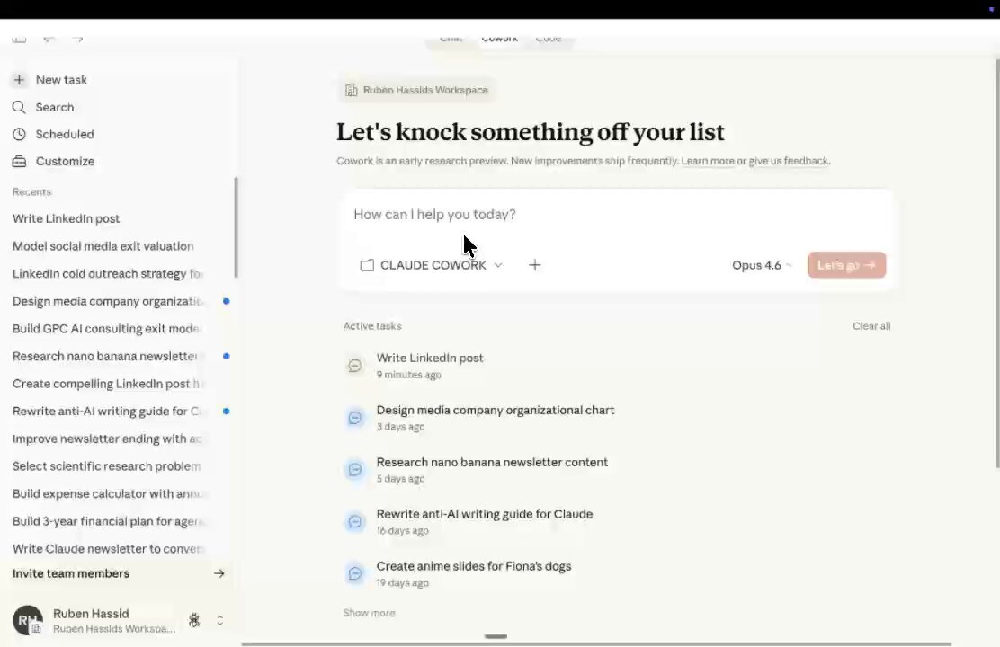](https://pbs.twimg.com/amplify_video_thumb/2029491530441060353/img/4qh8T8LTuK-VAWMe.jpg)

还记得我开篇提到的 8300 亿美元的股市崩盘吗？

Anthropic 发布了 11 个官方插件。销售、营销、法务、财务、数据分析、产品管理、客户支持。每一个都赋予了 Claude 特定于该职能的技能、工作流和斜杠命令 (slash commands)。

法律软件之所以蒸发了这么多市值，是因为 Claude 能做这份工作。而坐在你 Cowork 侧边栏里的插件，是引发这一反应的很大一部分原因。

你不需要懂技术也能安装它。我保证。

1. 打开 Cowork。
2. 点击左侧栏的 Customize（自定义） → Browse plugins（浏览插件）。
3. 挑选一个匹配你工作的插件。安装。
4. 在聊天中输入 \`/\` 即可查看可用的斜杠命令。

[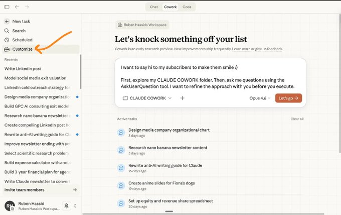](https://x.com/rubenhassid/article/2029514946640322593/media/2029491767507099649)
[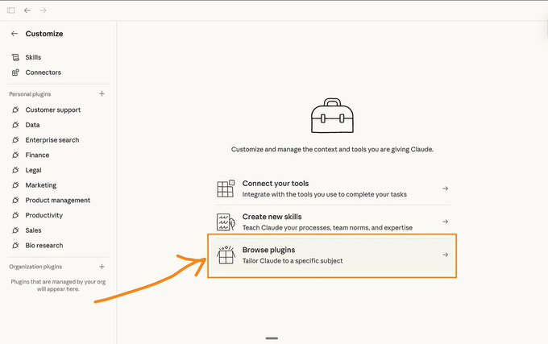](https://x.com/rubenhassid/article/2029514946640322593/media/2029492304621289472)
[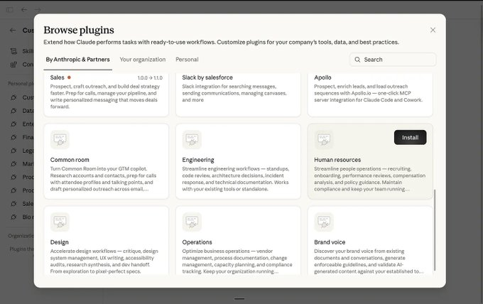](https://x.com/rubenhassid/article/2029514946640322593/media/2029492192167735297)
[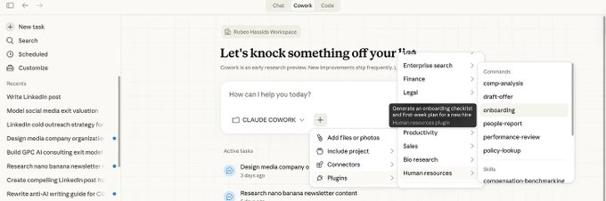](https://x.com/rubenhassid/article/2029514946640322593/media/2029492366566977536)
[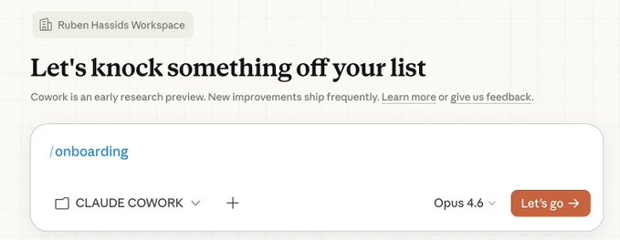](https://x.com/rubenhassid/article/2029514946640322593/media/2029492472544481280)
[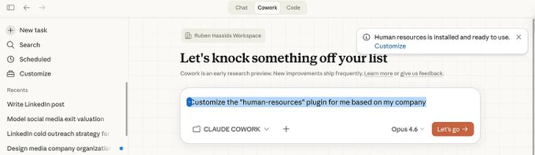](https://x.com/rubenhassid/article/2029514946640322593/media/2029492576714440704)

**Marketing plugin (营销插件)**
提示词: \`/marketing:draft-content\` → “写一篇关于 [主题] 的 LinkedIn 帖子。使用我的声音档案。目标受众是 [受众]。”
发生的事情: Claude 读取你的 about-me.md，起草一篇听起来真的像你写的帖子，并建议不同的开头变体。你选一个，修改，发布。原本需要三十分钟，现在只需五分钟。

**Data plugin (数据插件)**
提示词: \`/data:explore\` → 把一个 CSV 文件拖进文件夹。
发生的事情: Claude 总结每一列，标记异常，建议分析方案，甚至能构建一个交互式仪表盘。它用通俗易懂的英语写 SQL。你根本不用碰一行公式。

**Legal plugin (法务插件)**
提示词: “审核这个文件夹里的 NDA。标记任何不寻常或单边偏袒的条款。”
发生的事情: Claude 阅读合同，高亮高风险条款，用通俗英语解释每一条，并建议替代的措辞。这就是让股票市场蒸发 2850 亿美元的东西。

Cowork 还可以连接到你现有的工具。Slack、Google Drive、Notion、Figma 等 50 多种。它们被称为 Connectors。
它们是免费的。

我最近只用这个：

设置：我的文件夹里有我的 \`about-me.md\`，我的 \`anti-AI-writing-guide.md\`，过去表现不错的新闻通讯，来自其他创作者的参考指南，以及来自公司的官方文档。

提示词：
> 我想写下一篇通讯，关于使用新的 Nano Banana 2 制作信息图表并在 Linkedin 上增长。首先，探索我的 CLAUDE COWORK 文件夹。然后，使用 AskUserQuestion 工具向我提问。我希望在执行之前与你一起完善这个方案。

发生的事情：Claude 阅读每一个文件。生成一个表单询问我的受众、语气、长度，以及其他指南遗漏了哪些角度。我点击回答。它生成一个大纲。我要求重写薄弱的部分。它进行调整。然后它开始写作——并且因为它有我的声音档案和反 AI 写作指南，输出的内容听起来真的像我写的。

我进行编辑。但繁重的工作已经完成了。

设置：客户发来一份简报。我把它扔进文件夹，放在我的模板和过去的交付物旁边。

提示词：
> 一个客户刚发来一份 2026 年 AI 采用战略的简报。简报在 \`/projects/client-x/\` 里。阅读简报、我的交付物模板以及我过去的案例。创建一个 .docx 格式的初稿。先问我问题 (AskUserQuestion)。

发生的事情：Claude 阅读简报。将其与我的模板格式进行对比。然后它问我一些我没想到过的事情——“这应该包含一个时间表，还是仅仅是建议？”以及“你想要竞争对手的例子，还是保持内部视角？”我点击答案。它直接在我的文件夹里创建了一个 .docx 文件。

设置：我把 3-5 篇竞争对手的文章或报告扔进一个子文件夹。

提示词：
> 我上传了 4 篇来自其他创作者关于 Claude Cowork 的通讯。阅读所有的文章。创建一个对比表：他们每个人涵盖了什么，遗漏了什么，以及我在哪里能成为唯一一个说出新东西的人。先问我问题。

发生的事情：这在过去是我公司初级员工的工作。现在它成了一个提示词。

这个有点不同。Cowork 甚至可以在你不在场的时候工作。

设置：你创建一个名为 \`/weekly-briefings/\` 的文件夹。

提示词（结合 \`/schedule\` 插件）：
> 每周一早上 7 点，研究 [竞争对手的名字] 的新闻、产品更新或定价变化。将总结保存为 markdown 文件到 \`/weekly-briefings/\` 中。只包含过去 7 天的项目。

发生的事情：只要你的电脑没有休眠且应用是打开的，Cowork 每周一都会自动运行。你醒来就能看到一份准备好供你阅读的简报文档。这就是终极玩法。

在这四个用例中，模式是相同的。我从不写很长的提示词。我写一个简短的任务，指向我的文件夹，然后说“问我问题”。

工作流始终是一致的。变化的只有上下文。

它消耗额度很快。如果 Cowork 成为你的主要工作流，考虑升级到 Max（$100/月）。

它仍然是研究预览版。你需要审查它产生的东西。不要在未读过的情况下直接将交付物发给客户。

它需要应用保持开启。

它不是用来问简单问题的。使用 Chat。Cowork 是用来执行任务的，它专为多步工作而设计。

Agents 有时会发挥失常。大多数情况下，它快速且准确。但有时一个 agent 会走偏。

Cowork 并非在所有方面都是最好的。但它每周都在变得更好。
如果这就是 Claude Opus 4.6 + Cowork，我无法想象 Claude 5, Claude 6 会怎样……

→ 创建一个专用的工作文件夹。
→ 设置全局指令。
→ 提供高质量的 \`.md\` 格式的上下文文件。
→ 使用 \`AskUserQuestion\`。
→ 尝试各种插件和连接器。

一步一步来，复制，粘贴，搞定。