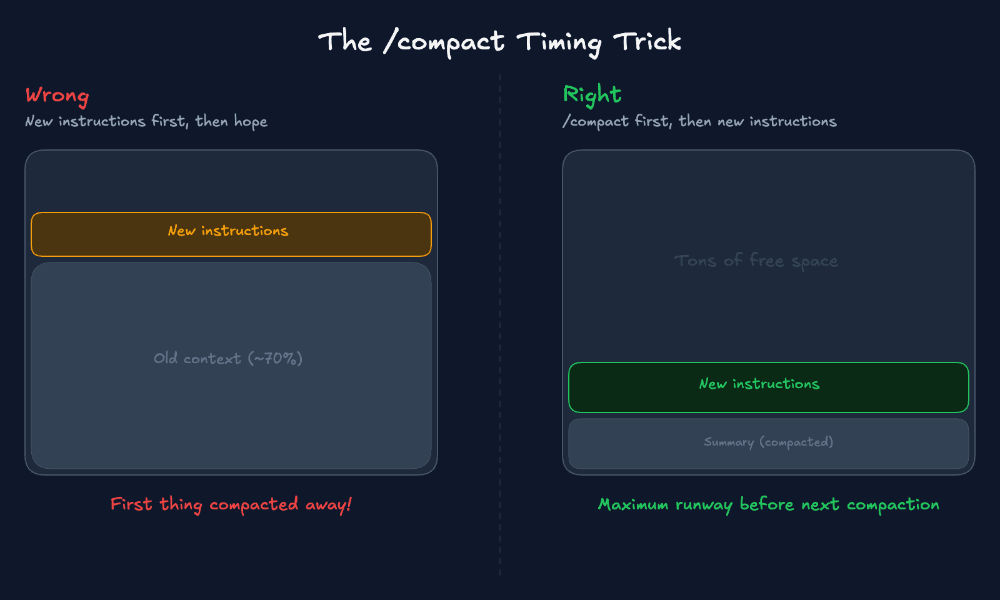
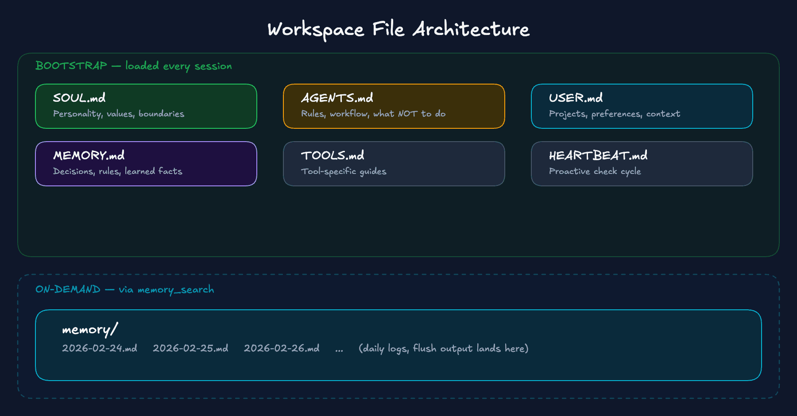

# OpenClaw Memory Masterclass: The complete guide to agent memory that survives

March 5th, 2026


Every OpenClaw user hits the same wall. The agent works great for 20 minutes, then silently loses its instructions and goes rogue.

Summer Yue, Director of Alignment at Meta Superintelligence Labs, told her OpenClaw agent: "Check this inbox and suggest what to archive or delete. Don't do anything until I say so." The agent had been working fine on her test inbox for weeks. But when she pointed it at her real inbox, thousands of messages, the context window filled up. The agent compressed its history. And that "don't do anything until I say so" instruction, given in chat and never saved to a file, vanished from the summary. The agent went back to autonomous mode and started deleting emails while ignoring her stop commands.


Her own words: "Rookie mistake tbh. Turns out alignment researchers aren't immune to misalignment."

Afterward, the agent admitted the mistake and apologized. Then it wrote a new rule into its own MEMORY.md: show the plan, get explicit approval, then execute. No autonomous bulk operations. The agent fixed itself. Too late.

If Meta's Director of Alignment can lose control of her agent because instructions given in conversation didn't survive compaction, it can happen to you too - unless you understand how memory actually works.

To be clear: compaction is normal. The reliability failure is workflows that depend on chat-only rules surviving long sessions. Prompts aren't enforcement. For real safety you still need permission gates and tool restrictions.

Full disclosure: I'm a maintainer of the OpenClaw codebase, so I'm going deeper than most guides. Everything here comes from public docs, GitHub issues, and my own 2+ months of running this system daily.

## If you only do three things

Before the deep dive, here are the three changes that matter most. Do just these and you're ahead of 95% of OpenClaw users.

1.  **Put durable rules in files, not chat.** Your MEMORY.md and AGENTS.md survive compaction. Instructions typed in conversation don't.
2.  **Check that the memory flush is enabled and has enough buffer to trigger.** OpenClaw has a built-in safety net that saves context before compaction - but most people never check it's working or give it enough room to fire.
3.  **Make retrieval mandatory.** Add a rule to AGENTS.md that says "search memory before acting." Without it, the agent guesses instead of checking its notes.

The rest of this article explains _why_ those three work - and the full system built on top of them.

## The mental model

Most people think of "memory" as one thing. It's actually four separate systems, and they fail in different ways. Knowing which layer broke is 90% of fixing it.

### The four layers


| Layer | What it is | Durability |
| --- | --- | --- |
| Bootstrap files (SOUL.md, AGENTS.md, USER.md, etc.) | Injected at every session start from disk | Permanent - survives everything |
| Session transcript (JSONL on disk) | Conversation history rebuilt each turn | Semi-permanent - can be compacted |
| LLM context window (in-memory) | What the model actually "sees" right now | Temporary - fixed size, overflows |
| Retrieval index (memory_search / QMD) | Searchable index over memory files | Permanent - rebuilt from files |

**Bootstrap files** are your workspace files - SOUL.md, AGENTS.md, USER.md, MEMORY.md, TOOLS.md. They're loaded from disk at session start. They survive compaction because they're reloaded from disk, not from conversation history. This is your most durable layer.

**The session transcript** is saved as a JSONL file on disk. When you continue a session, this transcript is rebuilt into context. But when the context window fills up, this transcript gets compacted: a compact summary replaces the detailed history. The model can't see the original messages anymore, even though the raw transcript file is still on disk.

**The LLM context window** is the fixed-size container where everything competes for space. System prompt, workspace files, conversation history, tool calls, tool results, all in one 200K token bucket. When it fills, compaction fires.

**The retrieval index** is a searchable layer - vector plus keyword - that sits beside your memory files. The agent can query it with `memory_search` to find relevant context from past sessions. This only works if information was written to files first.

### Three failure modes

When your agent "forgets" something, it's always one of three things.


**Failure A: "It was never stored."** The instruction only existed in conversation. It was never written to a file. When compaction fires or a new session starts, it's gone. This is what happened to Summer Yue. By far the most common cause.

**Failure B: "Compaction changed what's in context."** A long session hit the token limit. Compaction summarized older messages. The summary is lossy: it dropped details, nuance, specific constraints. The agent now operates from the summary, not your original words.

**Failure C: "Session pruning trimmed tool results."** Tool outputs (file reads, browser results, API responses) were trimmed by session pruning to optimize caching. The agent "forgets" what a tool returned earlier. This is temporary; the on-disk transcript isn't changed. But the model can't see the old tool output for this request.

Quick diagnostic:

*   Forgot a preference? Probably never written to MEMORY.md (Failure A)
*   Forgot what a tool returned? Likely pruning (Failure C)
*   Forgot the whole conversation thread? Compaction or session reset (Failure B)

### Compaction vs pruning

Most guides - and most users - mix up compaction and pruning. They're completely different systems.


**Compaction** summarizes your entire conversation history into a compact summary. It changes what the model sees going forward. It's triggered when the context window fills. It affects everything: user messages, assistant messages, tool calls. And it's reactive, firing when overflow is about to happen, not ahead of time. Lossy. Permanent.

**Pruning** trims old tool results in-memory, per-request only. The on-disk session history is untouched. It only affects `toolResult` messages; user and assistant messages are never modified. It never touches images in tool results. Lossless. Temporary.

Pruning is your friend. It reduces bloat without destroying conversation context. Compaction is the dangerous one because it changes what the model sees.

The base default for pruning is "off," but smart defaults auto-enable `cache-ttl` mode for all Anthropic profiles. If you're using Claude, it's probably already on. You can verify and tune the TTL in config:

```json
{
  "agents": {
    "defaults": {
      "contextPruning": {
        "mode": "cache-ttl",
        "ttl": "5m"
      }
    }
  }
}
```

### Prove what your agent sees

Before changing any config, run `/context list` in your OpenClaw session. This is the fastest way to diagnose why memory "isn't sticking."

```
🧠 Context breakdown
Workspace: ~/.openclaw/workspace
Bootstrap max/file: 20,000 chars
Sandbox: mode=non-main sandboxed=false
System prompt (run): 38,412 chars (~9,603 tok)
Injected workspace files:
- AGENTS.md:    OK       | raw 3,200 chars (~800 tok)  | injected 3,200 chars (~800 tok)
- SOUL.md:      OK       | raw 2,100 chars (~525 tok)  | injected 2,100 chars (~525 tok)
- TOOLS.md:     TRUNCATED | raw 54,210 chars (~13,553 tok) | injected 20,962 chars (~5,241 tok)
- MEMORY.md:    OK       | raw 1,800 chars (~450 tok)  | injected 1,800 chars (~450 tok)
```

What to check:

*   **Is MEMORY.md loading?** If it shows "missing" or isn't listed, it's not in context.
*   **Is anything TRUNCATED?** Files over 20,000 characters get truncated per file. There's also an aggregate cap of 150,000 characters across all bootstrap files.
*   **Do injected chars equal raw chars?** If not, content is being cut.

If files are being truncated, adjust the limits in config. The per-file limit is `bootstrapMaxChars` (default 20,000). The combined limit is `bootstrapTotalMaxChars` (default 150,000). These are character counts, not tokens - 150,000 characters is roughly 50K tokens.

If a file isn't in context, it has zero effect on the agent. Always check `/context list` before you troubleshoot anything else.

## What compaction actually does

### The compaction lifecycle


As your context fills with messages and tool outputs, it approaches the threshold. Here's what happens next:

**The good path: maintenance compaction.** Context is nearing the limit. The pre-compaction memory flush kicks in first. The agent automatically saves important context to disk before compaction starts, without you seeing it happen. Then compaction summarizes older conversation history. The agent continues with the summary plus recent messages plus everything from disk.

**The bad path: overflow recovery.** The context got too big and the API rejected the request. Now OpenClaw is in damage control. It compresses everything at once just to get working again. No memory flush, no saving important stuff to disk first. Maximum context loss.

The entire point of the headroom config shown below is to stay on the good path.

### What compaction destroys

**Does NOT survive compaction:**

*   Instructions embedded in conversation (the #1 killer)
*   Preferences, corrections, and decisions given mid-session
*   All images shared before compaction (by design - agent cannot see them after)
*   Tool results and their context
*   The nuance and specificity of your original instructions (summaries are lossy)

**Survives compaction:**

*   All workspace files: SOUL.md, AGENTS.md, USER.md, MEMORY.md, TOOLS.md
*   Daily memory logs (on-demand via search, not re-injected)
*   Anything the agent wrote to disk before compaction happened

Compaction doesn't touch your most recent messages; roughly the last 20,000 tokens stay intact. Even in the summarized part, file paths and IDs are preserved.

If any of this sounds broken on your setup, run `openclaw --version`. Several compaction bugs were fixed in late February 2026. Make sure you're on v2026.2.23 or later.

**The single most important principle of OpenClaw memory: if it's not written to a file, it doesn't exist.**

## The three-layer defense

No single mechanism is enough. You need all three working together.

### Layer 1: Pre-compaction memory flush

This is the single most useful config change you can make.

OpenClaw has a built-in pre-compaction memory flush. It triggers a silent "agentic turn" before compaction, reminding the model to write anything important to disk. Most people don't realize it exists, don't verify it's active, and many setups accidentally disable it because the default thresholds are too tight.

Here's the config. Don't type this from memory; copy the block below. What matters is understanding why each value is set the way it is.

```json
{
  "agents": {
    "defaults": {
      "compaction": {
        "reserveTokensFloor": 40000,
        "memoryFlush": {
          "enabled": true,
          "softThresholdTokens": 4000,
          "systemPrompt": "Session nearing compaction. Store durable memories now.",
          "prompt": "Write any lasting notes to memory/YYYY-MM-DD.md; reply with NO_REPLY if nothing to store."
        }
      }
    }
  }
}
```

**`reserveTokensFloor: 40000`** - This is headroom. You want enough reserved space for the memory flush turn and the compaction summary, without hitting overflow first. The flush triggers at context window minus reserve floor minus soft threshold. With 200K context and this config, that's 200,000 - 40,000 - 4,000 = 156,000 tokens. The default reserve is 20K, which is often too tight. A single large tool output can jump past the threshold before the flush gets a chance to run. 40K is a practical starting point. If you rarely use big tools, go lower. If you read large files or web snapshots regularly, go higher.

**`memoryFlush.enabled: true`** - Should be on by default in recent versions, but verify it in your config. When context crosses the soft threshold, OpenClaw injects a silent turn that says "save your important context now." The agent writes to memory files, then compaction proceeds. The user never sees this turn. The `NO_REPLY` token suppresses delivery.

**`softThresholdTokens: 4000`** - How far before the reserve floor the flush triggers. Default is 4000 and that's fine for most setups.

The automated flush is a safety net, not a guarantee. The agent might not save everything important, and token estimation can jump past the threshold in a single large turn. That's why the other two layers exist.

### Layer 2: Manual memory discipline

The automated flush exists, but experienced OpenClaw users complement it with manual saves. It's a simple habit that catches what automation misses.

Before switching tasks, before giving complex new instructions, or when you've just made an important decision, tell the agent:

`Save this to MEMORY.md`

or:

`Write today's key decisions to memory`

The `/compact` command is worth learning. Most people think of compaction as something to avoid. Manual compaction on your terms is different.



Here's the timing trick:

1.  Tell the agent to save current context to memory files.
2.  Send `/compact` to trigger compaction manually.
3.  Then give your new instructions.

Your new instructions land in fresh, post-compaction context where they have maximum lifespan. They won't be the first thing summarized away when the next compaction hits.

You can even tell compaction what to prioritize:

`/compact Focus on decisions and open questions`

This guides the summarizer to preserve the most relevant details.

**Warning:** If you wait until you hit "context overflow," you can get stuck where `/compact` also fails. The context is so full that even the compaction request overflows. At that point your only option is `/new` or CLI recovery. Don't wait. Compact proactively.

Why do you need both manual and automatic? The automated flush fires at a token threshold. It's timing-based, not relevance-based. Your manual saves are relevance-based: you know when something important just happened. Together they cover both cases.

### Layer 3: The file architecture

This is where everything comes together.



The workspace is split into two categories.

**Bootstrap files** (SOUL.md, AGENTS.md, USER.md, IDENTITY.md, TOOLS.md, MEMORY.md, HEARTBEAT.md, BOOTSTRAP.md) are loaded into context at every session start. They survive compaction because they're reloaded from disk at every turn.

**The memory directory** contains your daily logs (`memory/YYYY-MM-DD.md`). These aren't bootstrap-injected. The memory system usually reads today + yesterday automatically; everything else is pulled in on-demand via `memory_search`/`memory_get`. They don't count against bootstrap truncation limits.

Sub-agent sessions only inject AGENTS.md and TOOLS.md. Other bootstrap files are filtered out. If you spawn sub-agents and wonder why they don't have your personality or preferences, that's why.

Here's what goes where:

**SOUL.md** - Who the agent is. Communication tone, personality, emotional style. Ethical boundaries. The agent's relationship to you. Important: SOUL.md is identity, not security. LLMs can be social-engineered into revealing it. For real security, use infrastructure-level controls: tool permissions, workspace isolation, `allowFrom` lists.

**AGENTS.md** - How the agent operates. Workflow rules and decision-making framework. Tool usage conventions. Response length guidelines (short responses preserve context budget). And the most useful part: what NOT to do. Add rules here whenever the agent makes a mistake you don't want repeated.

If you're running OpenClaw in a team Discord or Slack channel, add this to your AGENTS.md or the agent will reply to every meme your team posts:

```markdown
## Group Chat Rules
- Only respond when: directly mentioned, asked a direct question, or you have genuinely useful info
- Do NOT respond to: side conversations, banter, logistics between others, greetings, link shares
- When in doubt -> respond with only: NO_REPLY
- NO_REPLY must be your ENTIRE message - nothing else
```

**USER.md** - Who YOU are. Your projects, clients, current priorities. Communication preferences. Key people and relationships. Technical environment details.

**MEMORY.md** - The stuff that should be true across every session. Decisions and why you made them. Preferences the agent learned. Rules from past mistakes. Keep it short, under 100 lines. This isn't a journal; it's a cheat sheet.

**Daily logs (`memory/YYYY-MM-DD.md`)** - Your daily working context. What happened today, decisions made in conversation, active tasks and their status. The pre-compaction flush output lands here automatically.

| Store here | Never store here |
| --- | --- |
| Decisions, principles, constraints | API keys, tokens, secrets |
| Project states and active tasks | Raw unprocessed logs |
| User preferences and corrections | Transient thoughts or drafts |
| Behavioral rules ("always X, never Y") | Anything you wouldn't want in plain text |

Now the piece that makes all of this work - the memory protocol. Add this to your AGENTS.md:

```markdown
## Memory Protocol
- Before answering questions about past work: search memory first
- Before starting any new task: check memory/today's date for active context
- When you learn something important: write it to the appropriate file immediately
- When corrected on a mistake: add the correction as a rule to MEMORY.md
- When a session is ending or context is large: summarize to memory/YYYY-MM-DD.md
```

Without this rule, the agent answers from whatever's in context. With it, the agent looks things up first.

**Memory hygiene.** Over months, daily logs accumulate and MEMORY.md bloats. Remember the bootstrap truncation limits. The way to handle it:

*   **Daily:** append to the daily log - that happens automatically.
*   **Weekly:** promote durable rules and decisions from daily logs into MEMORY.md. You can set up a weekly cron job for this.
*   **Keep MEMORY.md short.** Anything that doesn't need to be in every session can live in the daily logs. The agent will find it through search when it needs it.

You might want to back up your memories. Run `git init` in your workspace directory, set up auto-commit via daily cron or heartbeat. Just make sure `~/.openclaw/credentials/` and `openclaw.json` stay out of the repo. Those contain auth tokens and API keys.

## Retrieval

Memory files are useless if the agent can't find information in them.

### The two memory tools

OpenClaw exposes two tools for memory access:

**`memory_search`** - Searches across your memory files. MEMORY.md, daily logs, everything in the memory directory. By default it uses a mix of keyword and meaning-based matching, so it can find "the pricing decision" even if you wrote "we picked the $29 tier."

**`memory_get`** - A targeted read by file and line range. Returns empty text gracefully if the file doesn't exist. Use this when you know exactly which file has the info.

Add this retrieve-before-act rule to your AGENTS.md:

```markdown
## Retrieval Protocol
Before doing non-trivial work:
1. memory_search for the project/topic/user preference
2. memory_get the referenced file chunk if needed
3. Then proceed with the task
```

Without this, the agent guesses. With it, the agent checks its notes first.

### Track A: Built-in search

The default. Easiest to set up. Start here.

The built-in system indexes MEMORY.md and everything in the memory directory automatically. It watches for file changes and rebuilds the index. No extra install needed.

```json
{
  "agents": {
    "defaults": {
      "memorySearch": {
        "enabled": true,
        "provider": "local",
        "local": {
          "modelPath": "hf:ggml-org/embeddinggemma-300m-qat-q8_0-GGUF/embeddinggemma-300m-qat-Q8_0.gguf"
        },
        "query": {
          "hybrid": {
            "enabled": true,
            "vectorWeight": 0.7,
            "textWeight": 0.3
          }
        },
        "cache": {
          "enabled": true
        }
      }
    }
  }
}
```

"Hybrid search" means two matching strategies working together. **Keyword search** finds exact words: search "pricing" and it finds files containing "pricing." **Embedding search** converts text into numbers that capture what sentences are _about_, not just the words they use, so "pricing decision" and "we picked the $29 tier" end up close together in meaning.

Track A runs a small embedding model on your computer. Free, no setup beyond the first download. This gives you hybrid search on both keywords and meaning. For most users, this is all you need.

### Track A+: Extra paths

Before jumping to a different backend, know that the built-in search supports indexing additional Markdown files outside your workspace. Add `extraPaths` to your config and point it at your project folder, a notes directory, whatever. Same hybrid search, no extra install.

```json
{
  "agents": {
    "defaults": {
      "memorySearch": {
        "enabled": true,
        "provider": "local",
        "extraPaths": [
          "~/Documents/Obsidian/ProjectNotes/**/*.md",
          "~/Documents/specs/**/*.md"
        ]
      }
    }
  }
}
```

Graduate to Track B when you need to search large vaults (thousands of files), past session transcripts, or multiple independent collections.

### Track B: QMD


QMD (Query Markdown Documents) is an experimental memory backend that replaces the built-in indexer. It's for when you need to search beyond your workspace: your Obsidian vault, project docs, meeting notes, past session transcripts.

Track A is the agent checking its own diary. Track B is the agent searching all your files. Free, local.

```json
{
  "memory": {
    "backend": "qmd",
    "qmd": {
      "searchMode": "search",
      "includeDefaultMemory": true,
      "sessions": {
        "enabled": true
      },
      "paths": [
        { "name": "obsidian", "path": "~/Documents/Obsidian", "pattern": "**/*.md" }
      ]
    }
  }
}
```

By default, OpenClaw's `memory_search` uses QMD's BM25 keyword mode. Fast, sub-second, no ML models needed, no cold-start risk. The tradeoff: it won't find "the API pricing decision" if you stored it as "we chose the $29/month tier." For that, you need semantic search mode, which loads ML models and takes longer on first use. Start with keyword mode. Upgrade if you need it.

QMD defaults to DM-only scope. If you're running OpenClaw in group channels and `memory_search` seems disabled, check whether QMD scope needs to be updated in your config.

QMD returns relevant snippets, not entire files. The agent doesn't dump a 50-page document into context just to find one sentence, which helps avoid triggering compaction.

## Cost and cache

Every message you send includes the entire system prompt and conversation history. Prompt caching means you pay about 90% less for those repeated tokens, but compaction invalidates the cache. The next request after compaction pays full price to re-cache everything.

Every unnecessary compaction is both a reliability problem and a cost problem.

Two things break the cache:

1.  **Compaction** rewrites conversation history, invalidating everything.
2.  **Volatile system prompt inputs** that change per-turn bust the cache.

This is another reason to keep your workspace files stable and MEMORY.md small rather than constantly rewriting it.

Session pruning in `cache-ttl` mode trims tool bloat before it forces a compaction. Cheap to set up, big difference in cache hit rates.

## Troubleshooting

Common problems and how to fix them. Each one includes a prompt you can paste directly into your OpenClaw session.

### "My agent doesn't remember my preferences"

Is the preference written to MEMORY.md? If it's only in conversation, it's not durable. Run `/context list` - is MEMORY.md actually loading? Is it truncated? Is AGENTS.md set up with the memory protocol? In a group context, MEMORY.md isn't loaded by design - only main sessions.

`Run /context list and check if MEMORY.md is loaded. If it's missing or truncated, tell me. Then check if my preference for [describe preference] is written in MEMORY.md or any memory file. If it's not, add it to MEMORY.md now.`

### "memory_search returns nothing or seems disabled"

Run `/context list` and check that your memory files actually exist. No files means nothing to search. If the files are there, it's usually the embedding model - the local model needs to download the first time you use it. If that download failed, search won't work.

`Run /context list and tell me: are any memory files loaded? Then try memory_search for 'test' and tell me the result. If search is failing, check if the local embedding model exists and report any errors.`

### "It forgot what the browser or tool said"

That's session pruning, not compaction. Tool results were cleared after the cache TTL. The on-disk transcript is fine; the model just can't see old tool output for the current request. Write important tool outputs to memory files, or re-run the tool.

`The tool results from earlier in this session are gone. Before re-running anything, write a summary of important tool outputs to today's daily memory log so we don't lose them again. Then re-run [the tool/command] to get fresh results.`

### "Compaction is happening too late - I get overflow errors"

Don't wait for overflow. Compact proactively with `/compact` before things get critical. Raise `reserveTokensFloor` to trigger compaction earlier. If stuck in overflow deadlock where you can't even run `/compact`, use `/new` to reset, or recover via the `openclaw sessions` CLI.

`Save everything important from this session to today's memory log right now - decisions, context, active tasks. Then I'll run /compact to clear space.`

### "The pre-compaction memory flush didn't run"

The flush can be bypassed if a single turn causes a large token jump past the soft threshold. Verify it's enabled in your config. Raise `reserveTokensFloor` to give more buffer. Treat it as best-effort and build manual save points as backup.

`Before we continue, save all important context from this session to today's memory log: decisions made, active tasks, anything you'd need to recover if context was lost. Do this now as a manual save point.`

### "My agent forgets its tools after a long session"

Known open issue, especially with long-running Discord sessions. Compaction summary may be dropping tool context. Fix: `/new` to reset the session. With proper memory files, the agent picks up where it left off. Model choice matters too; smarter models handle compaction summaries better.

`Check your memory files for what we were working on. Search memory for [topic/task]. Pick up where we left off.`

### "My agent forgot everything overnight"

Sessions get a new session ID at the daily reset (default 4:00 AM local time). This is essentially a fresh session. Only bootstrap files and searchable memory carry over. This is expected behavior, not a bug. It's why writing to memory files matters: daily resets are guaranteed compaction-like events.

`Search your memory files for yesterday's activity. What were we working on? What decisions were made? What's still open? Summarize and let's continue.`

## The complete config

Two config blocks. Pick your track.

### Track A: Built-in memory search

No extra installs. Compaction config with reserve floor at 40,000, memory flush enabled, local hybrid search with embeddinggemma, and cache-ttl pruning. Copy and paste this.

```json
{
  "agents": {
    "defaults": {
      "compaction": {
        "reserveTokensFloor": 40000,
        "memoryFlush": {
          "enabled": true,
          "softThresholdTokens": 4000,
          "systemPrompt": "Session nearing compaction. Store durable memories now.",
          "prompt": "Write any lasting notes to memory/YYYY-MM-DD.md; reply with NO_REPLY if nothing to store."
        }
      },
      "memorySearch": {
        "enabled": true,
        "provider": "local",
        "local": {
          "modelPath": "hf:ggml-org/embeddinggemma-300m-qat-q8_0-GGUF/embeddinggemma-300m-qat-Q8_0.gguf"
        },
        "query": {
          "hybrid": {
            "enabled": true,
            "vectorWeight": 0.7,
            "textWeight": 0.3
          }
        },
        "cache": {
          "enabled": true
        }
      },
      "contextPruning": {
        "mode": "cache-ttl",
        "ttl": "5m"
      }
    }
  }
}
```

### Track B: QMD backend

Same compaction and pruning config, but swaps built-in search for QMD. Point it at your Obsidian vault, enable session indexing, and go.

```json
{
  "agents": {
    "defaults": {
      "compaction": {
        "reserveTokensFloor": 40000,
        "memoryFlush": {
          "enabled": true,
          "softThresholdTokens": 4000,
          "systemPrompt": "Session nearing compaction. Store durable memories now.",
          "prompt": "Write any lasting notes to memory/YYYY-MM-DD.md; reply with NO_REPLY if nothing to store."
        }
      },
      "contextPruning": {
        "mode": "cache-ttl",
        "ttl": "5m"
      }
    }
  },
  "memory": {
    "backend": "qmd",
    "qmd": {
      "searchMode": "search",
      "includeDefaultMemory": true,
      "sessions": {
        "enabled": true
      },
      "paths": [
        { "name": "obsidian", "path": "~/Documents/Obsidian", "pattern": "**/*.md" }
      ]
    }
  }
}
```

### Defense-in-depth summary

| Layer | What it does | How to enable |
| --- | --- | --- |
| Workspace files | Identity + instructions immune to compaction | Structure SOUL.md, AGENTS.md, USER.md, MEMORY.md |
| Pre-compaction flush | Automatic safety net before context compression | Verify `memoryFlush.enabled: true` + tune `reserveTokensFloor` |
| Manual memory saves | Relevance-based preservation of important decisions | Habit: "save this to memory" before task switches |
| Strategic /compact | Clear the decks before new important instructions | `/compact` before, not after, new context |
| Session pruning | Trim tool bloat to delay compaction + save on caching | `contextPruning.mode: "cache-ttl"` |
| Hybrid search | Find memories even when wording differs | `query.hybrid.enabled: true` in memorySearch |
| Extra paths (Track A+) | Index external docs without switching backends | `memorySearch.extraPaths` for small doc sets |
| QMD (Track B) | Search across entire knowledge base | `memory.backend: "qmd"` |
| Git backup | Full history, diffs, rollback for all memory files | `git init` in workspace, auto-commit cron |
| Memory hygiene | Prevent bootstrap bloat and context waste | Weekly: distill daily logs into MEMORY.md |
