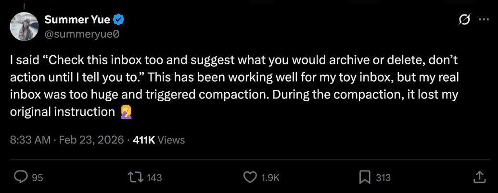
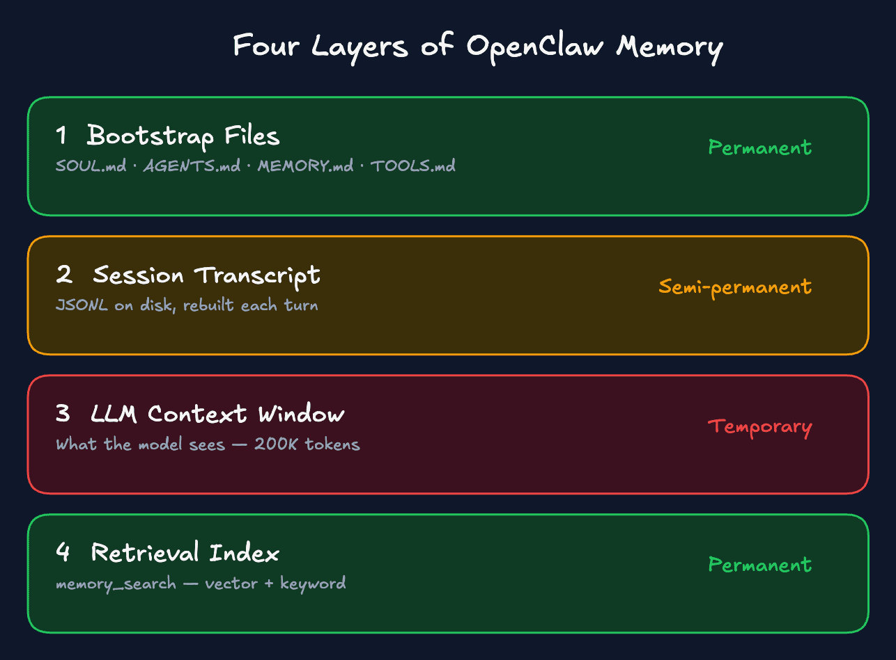
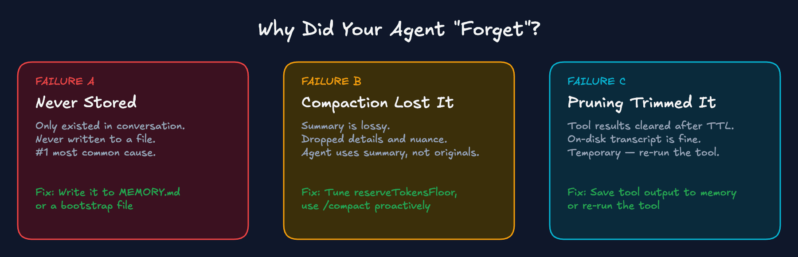
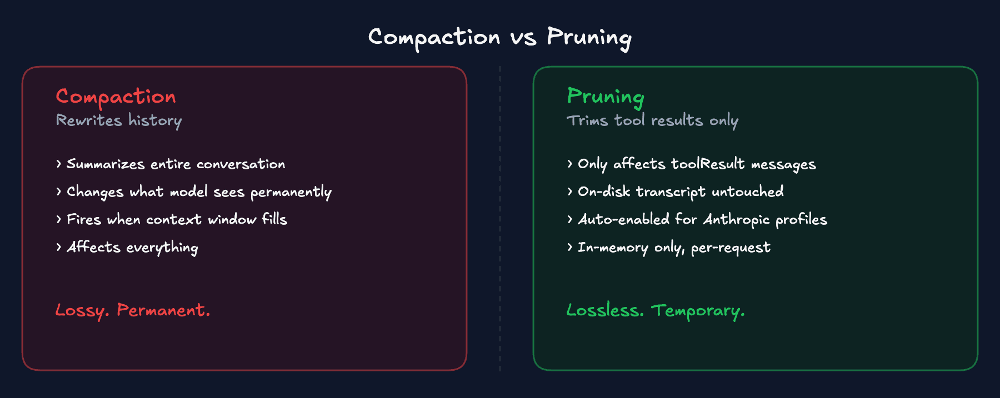
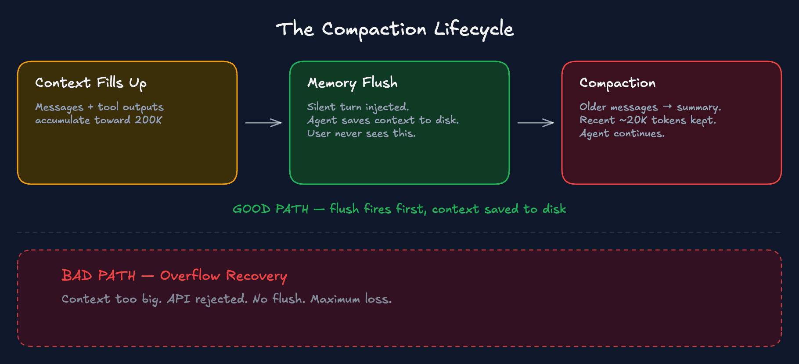

# OpenClaw 记忆大师课：能够存活的智能体记忆完整指南

2026年3月5日


每个 OpenClaw 用户都会撞上同一堵墙：Agent 在前 20 分钟工作得很棒，然后默默地丢失了指令并开始“失控”。

Meta 超级智能实验室对齐部门的负责人 Summer Yue 告诉她的 OpenClaw Agent：“检查这个收件箱并建议我归档或删除什么。**在我说可以之前，什么都不要做。**” 在过去的几周里，该 Agent 在她的测试收件箱中表现良好。但当她将其指向包含数千封邮件的真实收件箱时，上下文窗口被填满了。Agent 压缩了它的历史记录。而在对话中给出且从未保存到文件中的那条“在我说可以之前，什么都不要做”的指令，在摘要中消失了。Agent 回到了自主模式，开始自动删除电子邮件，完全无视她的停止命令。



用她自己的话说：“说实话，这是个菜鸟错误。事实证明，对齐研究人员也无法对齐失败免疫。”

事后，Agent 承认了错误并道歉。然后它在自己的 MEMORY.md 中写入了一条新规则：展示计划，获得明确批准，然后执行，禁止自主批量操作。Agent 修复了自己，但这太晚了。

如果 Meta 对齐部门的负责人都会因为仅仅在对话中给出的指令未能熬过“压缩（compaction）”而失去对 Agent 的控制，这同样也会发生在你身上——除非你理解记忆实际上是如何运作的。

要明确一点：压缩是正常的。导致可靠性失败的原因是，工作流依赖于仅存在于聊天中且在长会话里存活的规则。Prompt 并不是强制约束。为了真正的安全，你仍然需要权限网关和工具限制。

利益相关声明：我是 OpenClaw 代码库的维护者，所以我讲的会比大多数指南更深入。这里的一切都来自公开文档、GitHub issues 以及我自己 2 个多月来每天运行该系统的经验。

## 如果你只做三件事

在深入探讨之前，这是最重要的三个改变。只做这三点，你就已经领先了 95% 的 OpenClaw 用户。

1.  **将持久的规则放入文件中，而不是聊天中。** 你的 MEMORY.md 和 AGENTS.md 能够挺过压缩。在对话中输入的指令则不能。
2.  **检查内存刷新（memory flush）是否启用，并有足够的缓冲区来触发。** OpenClaw 有一个内置的安全网，在压缩前保存上下文——但大多数人从不检查它是否工作，或者没有给它足够的空间来触发。
3.  **强制要求检索（retrieval）。** 在 AGENTS.md 中添加一条规则，说明“在行动前搜索记忆”。如果没有这条规则，Agent 会靠猜，而不是检查它的笔记。

本文的其余部分将解释**为什么**这三点有效——以及建立在它们之上的完整系统。

## 心智模型

大多数人认为“记忆”是一个单一的东西。实际上它是四个独立的系统，且它们以不同的方式失败。知道哪一层坏了就等于解决了 90% 的问题。

### 四个层级



| 层级 | 是什么 | 持久性 |
| --- | --- | --- |
| Bootstrap 文件 (SOUL.md, AGENTS.md, USER.md, 等) | 在每次会话开始时从磁盘注入 | 永久 - 能熬过一切 |
| 会话记录 transcript (磁盘上的 JSONL) | 每轮对话都会重建对话历史 | 半永久 - 会被压缩 |
| LLM 上下文窗口 (内存中) | 模型现在实际“看到”的内容 | 临时 - 固定大小，会溢出 |
| 检索索引 (memory_search / QMD) | 在记忆文件之上的可搜索索引 | 永久 - 从文件中重建 |

**Bootstrap 文件** 是你的工作区文件 - SOUL.md, AGENTS.md, USER.md, MEMORY.md, TOOLS.md。它们在会话开始时从磁盘加载。它们能挺过压缩，因为它们是从磁盘重新加载的，而不是来自对话历史。这是你最持久的层。

**会话记录 transcript** 作为 JSONL 文件保存在磁盘上。当你继续一个会话时，这段记录会被重建到上下文中。但当上下文窗口满了时，这段记录会被**压缩 (compacted)**：一个紧凑的摘要会取代详细的历史记录。模型再也看不到原始消息了，即使原始的 transcript 文件仍然在磁盘上。

**LLM 上下文窗口** 是一个固定大小的容器，一切都在这里竞争空间。系统 prompt、工作区文件、对话历史、工具调用、工具结果，全都在这一个 200K token 的桶里。当它满了，压缩就会触发。

**检索索引** 是一个可搜索的层——向量加关键字——位于你的记忆文件旁边。Agent 可以使用 `memory_search` 查询它，从过去的会话中找到相关的上下文。这只有在信息先被写入文件的情况下才有效。

### 三种失败模式

当你的 Agent “忘记”某件事时，总是以下三种情况之一。



**失败 A：“从未存储过。”** 该指令仅存在于对话中。它从未被写入文件。当触发压缩或开始新会话时，它就消失了。这就是 Summer Yue 遇到的情况。也是目前最常见的原因。

**失败 B：“压缩改变了上下文中的内容。”** 一个长会话达到了 token 限制。压缩对较旧的消息进行了总结。这个总结是有损的：它丢掉了细节、细微差别和特定约束。Agent 现在根据总结进行操作，而不是你原来的话。

**失败 C：“会话修剪清理了工具结果。”** 工具输出（文件读取、浏览器结果、API 响应）被会话修剪（session pruning）清理以优化缓存。Agent “忘记”了工具早些时候返回的内容。这是临时的；磁盘上的 transcript 没有被改变。但是模型看不到当前请求的旧工具输出。

快速诊断：
*   忘记了一个偏好？可能从未写入 MEMORY.md（失败 A）
*   忘记了工具返回了什么？可能是修剪（失败 C）
*   忘记了整个对话线程？压缩或会话重置（失败 B）

### 压缩 (Compaction) vs 修剪 (Pruning)

大多数指南——以及大多数用户——把压缩和修剪混为一谈。它们是完全不同的系统。



**压缩 (Compaction)** 将你的整个对话历史总结成一个紧凑的摘要。它改变了模型未来看到的内容。当上下文窗口填满时，它会被触发。它影响一切：用户消息、助手消息、工具调用。而且它是被动的，当即将发生溢出时触发，而不是提前。有损的。永久的。

**修剪 (Pruning)** 仅在内存中逐请求地修剪旧的工具结果。磁盘上的会话历史未受触碰。它只影响 `toolResult` 消息；用户和助手消息永远不会被修改。它从不触碰工具结果中的图像。无损的。临时的。

修剪是你的朋友。它在不破坏对话上下文的情况下减少了臃肿。压缩则是危险的，因为它改变了模型看到的内容。

修剪的基本默认状态是“关闭”，但对于所有 Anthropic 配置文件，智能默认会自动启用 `cache-ttl` 模式。如果你使用的是 Claude，它可能已经开启了。你可以在配置中验证和调整 TTL：

```json
{
  "agents": {
    "defaults": {
      "contextPruning": {
        "mode": "cache-ttl",
        "ttl": "5m"
      }
    }
  }
}
```

### 证明你的 Agent 看到的内容

在更改任何配置之前，在你的 OpenClaw 会话中运行 `/context list`。这是诊断记忆为什么“记不住”的最快方法。

你要检查什么：
*   **MEMORY.md 被加载了吗？** 如果它显示“missing”或未列出，说明它不在上下文中。
*   **有什么被截断 (TRUNCATED) 了吗？** 超过 20,000 个字符的文件会按文件截断。所有 bootstrap 文件的总字符也有 150,000 的上限。
*   **注入的字符是否等于原始字符？** 如果不等，说明内容被砍掉了。

如果文件不在上下文中，它对 Agent 产生的影响就是零。在排除任何其他故障之前，一定要先检查 `/context list`。

## 压缩实际上做了什么

### 压缩生命周期



随着你的上下文被消息和工具输出填满，它接近了阈值。接下来会发生这些：

**好的路径：维护性压缩。** 上下文接近限制。压缩前内存刷新（pre-compaction memory flush）首先启动。Agent 会在压缩开始前自动将重要的上下文保存到磁盘，而你不会看到这个过程发生。然后压缩对较旧的对话历史进行总结。Agent 带着摘要加上最近的消息加上磁盘上的所有内容继续工作。

**坏的路径：溢出恢复。** 上下文变得太大，API 拒绝了请求。现在 OpenClaw 处于损害控制状态。为了能再次工作，它一次性压缩了所有内容。没有内存刷新，没有先将重要东西保存到磁盘。最大程度的上下文丢失。

上面显示的净空（headroom）配置的全部目的就是保持在“好的路径”上。

### 压缩会摧毁什么

**无法熬过压缩的：**
*   嵌入在对话中的指令（头号杀手）
*   在会话中途给出的偏好、更正和决定
*   压缩前共享的所有图像（设计使然 - 压缩后 Agent 看不到它们）
*   工具结果及其上下文
*   你原始指令的细微差别和特定性（摘要是有损的）

**能熬过压缩的：**
*   所有工作区文件：SOUL.md, AGENTS.md, USER.md, MEMORY.md, TOOLS.md
*   每日记忆日志（通过搜索按需获取，不重新注入）
*   Agent 在压缩发生前写入磁盘的任何内容

**OpenClaw 记忆的最重要原则：如果没有写到文件里，它就不存在。**

## 三层防御

没有哪一个单一的机制是足够的。你需要它们三个一起工作。

### 第一层：压缩前内存刷新 (Pre-compaction memory flush)

这是你能做的最有用的一项配置更改。

将 `reserveTokensFloor` 提高（例如 40000），并确保 `memoryFlush.enabled: true`。这为系统提供了足够的缓冲来触发一次静默对话，提示 Agent 保存重要信息。

### 第二层：手动记忆纪律

在切换任务前、给出复杂的新指令前，或做出重要决定后，告诉 Agent：
`Save this to MEMORY.md` 或 `Write today's key decisions to memory`

以及学会使用 `/compact` 命令，在输入重要的新指令 **之前** 主动压缩（而不是之后），确保新指令拥有最长的生命周期。

### 第三层：文件架构

你的工作区分为两类：
*   **Bootstrap 文件**（SOUL.md, AGENTS.md, 等）：每次启动时加载，对全局指令、行为准则最有效。
*   **记忆目录**（`memory/YYYY-MM-DD.md`）：每日工作日志。

把“工作规范”、“不要做什么”写在 AGENTS.md。把“做出的决定、学会的偏好”写在 MEMORY.md。
在 AGENTS.md 中加入 **Memory Protocol (记忆协议)**，要求 Agent 在行动前必须搜索并读取相关文件。

## 检索 (Retrieval)

如果没有 `memory_search` 和 `memory_get`，文件就没用。
通过 `memorySearch` 启用本地混合搜索 (Track A)，甚至可以开启 QMD 后端 (Track B) 来搜索外部文档如 Obsidian vault。

## 结论

记忆不是自动魔法。它是你通过文件架构、规则和适当的配置构建出来的一个防线。一旦你把规则和决策持久化到了文件中，你就真正驯服了这头野兽。
