# 构建了自身的自我改进 AI 系统

我试图运送得更快

我有一个代码库，有一堆积压的东西要构建，而且一天的时间不够。因此，我开始并行运行人工智能编码代理——给每个代理一个任务，让他们编写代码、审查 PR、合并、重复。我一开始有两三个。然后是五个。然后十个。

代理商的速度很快。问题出在我身上。我跟不上他们。我是负责检查 CI 是否通过、阅读审阅评论、复制粘贴错误的人。我已经从编写代码变成了照顾编写代码的人。那没有规模。

因此，我编写了一些 bash 脚本来自动化协调 - 大约 2,500 行来管理 tmux 会话、git 工作树和选项卡切换。每个代理都有自己独立的 tmux 会话和工作树。编排器可以生成它们，查看它们在做什么，将 CI 故障转发回去，并让我只需询问“带我到 PR #1121 的选项卡”即可在会话之间跳转。勉强奏效了。

然后我将代理指向 bash 脚本本身。他们构建了 v1 版合适的编排器。 v1 管理构建 v2 的代理。从那时起，v2 就一直在不断改进。

[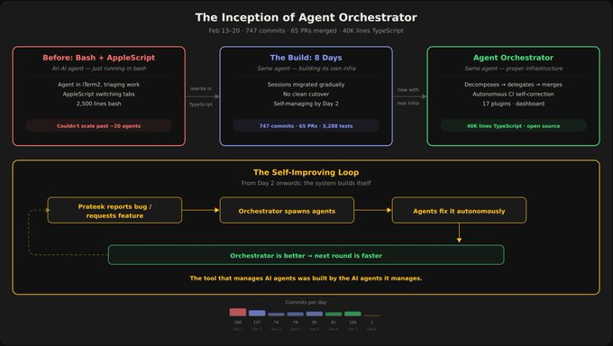](https://x.com/agent_wrapper/article/2025986105485733945/media/2025981847025713152)

从 bash 脚本到自我改进系统

结果是：40,000 行 TypeScript、17 个插件、3,288 项测试——在 8 天内构建，大部分由系统协调的代理完成。每个提交都有一个 git 预告片，标识是哪个 AI 模型编写的。人类所做的事情与特工所做的事情之间没有任何歧义。我们已经开源它：Agent Orchestrator (

）。要理解的关键是：编排器本身就是一个人工智能代理。不是仪表板。不是一个 cron 作业。不是轮询 GitHub 的脚本。它是一个代理 - 它读取您的代码库，了解您的待办事项，决定如何将功能分解为可并行的任务，将每个任务分配给编码代理，并监控其进度。当 CI 失败时，它将故障注入到代理会话中——代理读取日志并修复它。当收到评论评论时，它会将其路由到具有上下文的正确代理会话。没有人工管道。这就是它与每个“并行运行代理”设置的不同之处。管理代理的东西本身就是智能的。

[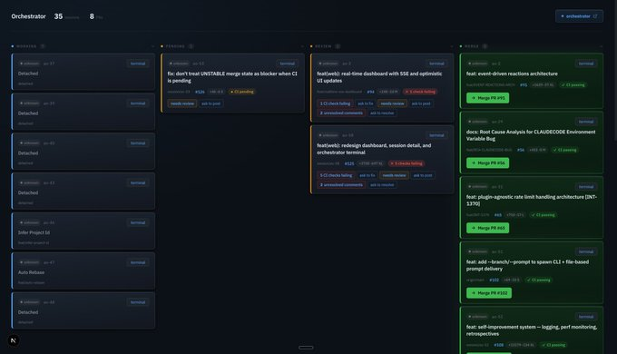](https://x.com/agent_wrapper/article/2025986105485733945/media/2025982239675478016)

大多数人对人工智能编码代理问题的理解是错误的。代理可以编码。这不是瓶颈。你是。

您生成五个任务，去喝咖啡，20 分钟后回来，现在您只需刷新 GitHub 选项卡 - 等待 PR、检查 CI、阅读评论。恭喜，您已经实现了工程自动化并用项目管理取代了它。糟糕的项目管理。

协调器代理会在该循环中取代您。不是使用脚本，而是使用实际的 AI 代理，该代理具有每个活动会话、每个开放 PR、每个 CI 运行的上下文。它跟踪一切，监视失败，将审查意见转发回编码代理，并且仅在某些事情确实需要人工决定时才向您发出通知。一旦这个瓶颈——你的注意力——消失，事情就会开始快速复杂化。

您打开仪表板以查看状态。但协调器代理已经开始工作了——它会查看您的所有工作流，并告诉您：“此 PR 阻碍了其他三个任务，此 CI 失败是一项不稳定的测试，而此评论评论才是真正重要的。”它没有向您显示数据。它给你决定。

[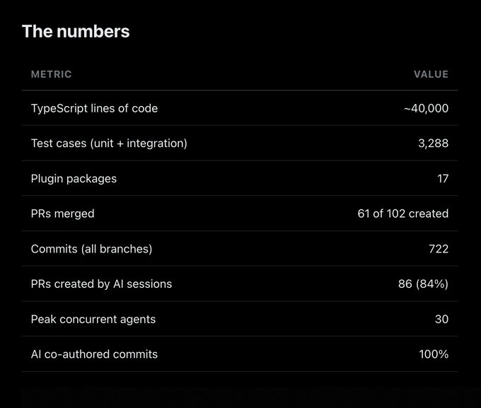](https://x.com/agent_wrapper/article/2025986105485733945/media/2025983426160156672)

[](https://x.com/agent_wrapper/article/2025986105485733945/media/2025983228377743360)

另一件重要的事情是：插入任何东西。不同的代理运行时？不同的问题跟踪器？不同的通知渠道？交换一下吧编排器并不关心你使用 Claude Code 还是 Aider、tmux 还是 Docker、GitHub 还是 Linear。八个插件插槽，全部可更换

人们看到“8 天 40K 行”并假设我进入了一个山洞。我有一份日常工作。这可能是大约 3 天的实际集中工作，分散在 8 天中，由代理填补空白。

[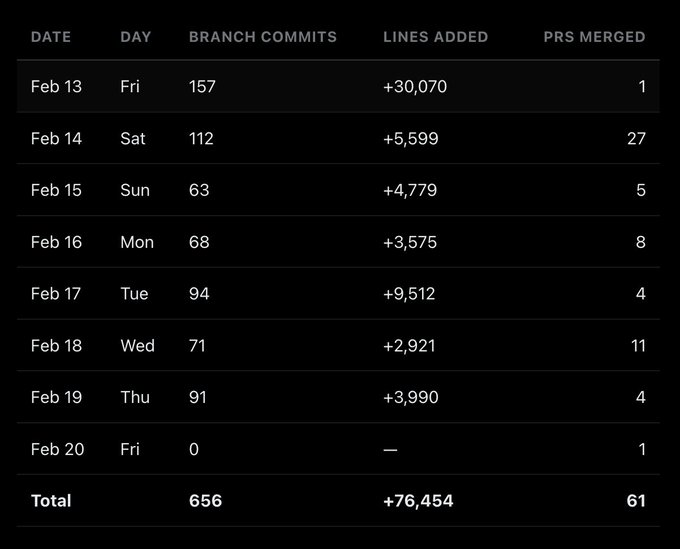](https://x.com/agent_wrapper/article/2025986105485733945/media/2025983806960967680)

模式很简单：睡前设置会话，代理通宵工作，早上上班前进行审查和合并，设置新会话，重复。

最精彩的一天：2 月 14 日星期六。一天内合并了 27 个 PR。整个平台已交付 — 核心服务、CLI、Web 仪表板、所有 17 个插件、npm 发布。我审查和合并 PR 的速度比我阅读它们的速度还要快，但每个 PR 都首先通过了 CI 和自动代码审查。

[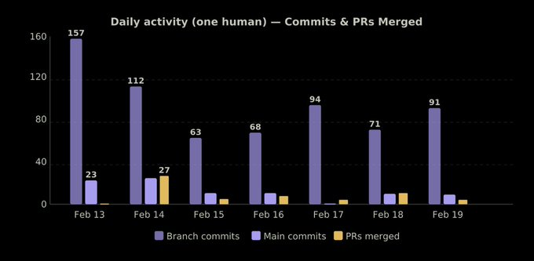](https://x.com/agent_wrapper/article/2025986105485733945/media/2025984517765570562)

日常活动 - 8 天内合并的提交和 PR

每次提交都通过 git 预告片跟踪模型：

[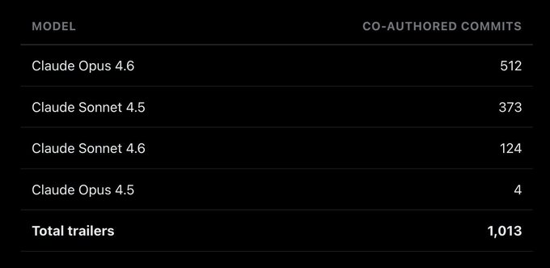](https://x.com/agent_wrapper/article/2025986105485733945/media/2025984634157498368)

总数超过 722 次提交，因为某些提交是由一个模型编写并由另一个模型审核/修复的。 Opus 4.6 处理了困难的事情——复杂的架构、跨包集成。 Sonnet 处理量——插件实现、测试、文档。

代理不只是编写代码然后将其扔出墙外。有一个完整的自动审核周期：

1. Agent创建PR并推送代码

2. Cursor Bugbot 自动评论并发布内嵌评论

3. Agent读取评论，修复代码，再次推送

4. Bugbot 重新审查

[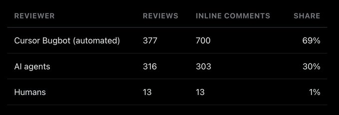](https://x.com/agent_wrapper/article/2025986105485733945/media/2025984890546900992)

700 条自动代码审查评论。 Bugbot 捕获了真实的东西——通过 exec() 进行 shell 注入、路径遍历、未封闭的间隔、缺少空检查。特工立即修复了约 68%，解释说约 7% 是故意的，并将约 4% 推迟到未来的 PR。

[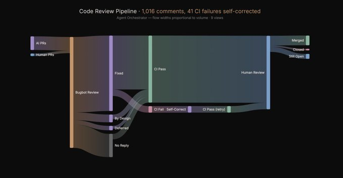](https://x.com/agent_wrapper/article/2025986105485733945/media/2025984966509940736)

代码审查流程——从代理 PR 到发布

最引人注目的例子：PR #125，仪表板重新设计。它经历了 12 个 CI 故障→修复周期。每次，代理都会获取失败输出，诊断问题（类型错误、lint 失败、测试回归）并推送修复。没有人碰过它。

12轮。零人为干预。干净地运送。

[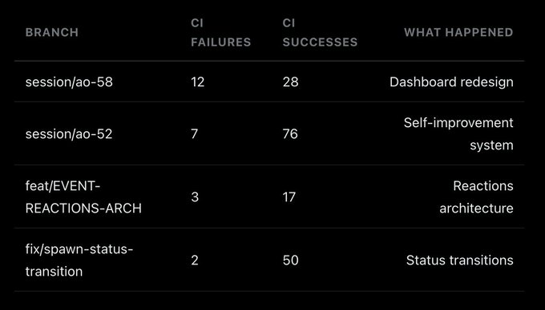](https://x.com/agent_wrapper/article/2025986105485733945/media/2025985118519861249)

9 个分支机构的所有 41 起 CI 故障最终均由代理自行纠正。总体 CI 成功率：84.6%。

[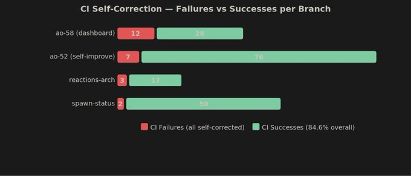](https://x.com/agent_wrapper/article/2025986105485733945/media/2025985185297379328)

Orchestrator 使用具有 8 个可交换插槽的插件系统：

[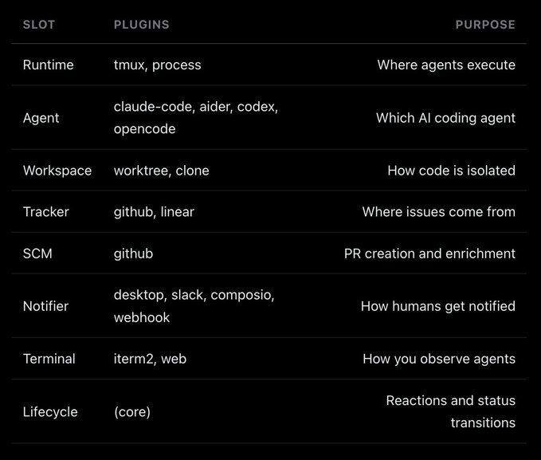](https://x.com/agent_wrapper/article/2025986105485733945/media/2025985270169161729)

会话生命周期：

1. Tracker 拉取问题（GitHub 或 Linear）

2. Workspace创建一个隔离的工作树或克隆

3.运行时启动一个tmux会话或进程

4. Agent（Claude Code、Aider等）自主工作

5. 终端可让您通过 iTerm2 或 Web 仪表板实时观察

6. SCM 创建 PR 并通过上下文丰富它们

7. 对 CI 失败或评论评论自动重新生成代理的反应

8.通知程序仅在需要人工判断时才向您发出通知

[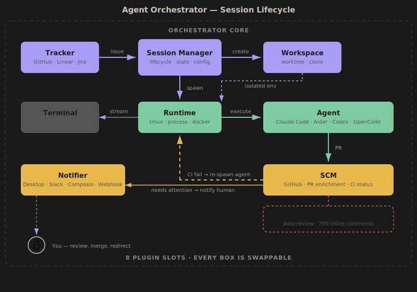](https://x.com/agent_wrapper/article/2025986105485733945/media/2025985361395220480)

会话生命周期——从问题到合并 PR

不使用 tmux 吗？使用进程运行时。不使用 GitHub？使用线性。不使用克劳德代码吗？插入 Aider 或 Codex。交换任意一块。

最有用的功能。自动响应 GitHub 事件：

yaml

```
reactions:
  ci_failed:
    action: spawn_agent
    prompt: "CI failed on this PR. Read the failure logs and fix the issues."

  changes_requested:
    action: spawn_agent
    prompt: "Review comments have been posted. Address each comment and push fixes."

  approved:
    action: notify
    channel: slack
    message: "PR approved and ready to merge."
```

CI失败？代理捡起来。审稿人要求修改？代理阅读评论并修复代码。公关批准了吗？您会收到 Slack 通知。这就是这 41 个 CI 故障自我纠正的方式——反应系统只是自动将故障转发回代理。

我有 30 个并发代理在 Agent Orchestrator 上工作。当我使用 bash 脚本版本来管理它们时，他们正在构建 TypeScript 替代品。正在建造的东西是管理自己建造的东西。

我实际上做了什么：

* 架构决策（插件槽、配置模式、会话生命周期）

* 生成会话和分配问题

* 审查 PR（主要是架构，而不是逐行）

* 解决跨代理冲突（两个代理编辑同一个文件）

* 判断力（拒绝这种方法，尝试那种方法）

代理商做了什么：

* 所有实现（40K 行 TypeScript）

* 所有测试（3,288 个测试用例）

* 所有 PR 创建（102 个 PR 中的 86 个）

* 所有评论评论修复

* 所有CI失败解决

我从未直接致力于某个功能分支。每行代码都经过 PR。

[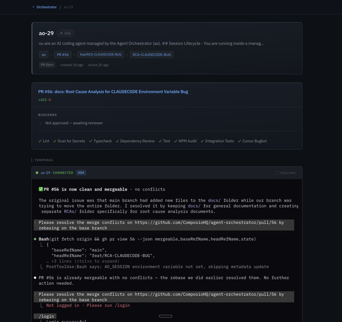](https://x.com/agent_wrapper/article/2025986105485733945/media/2025985682469249024)

更棘手的问题之一是：在不询问的情况下弄清楚代理实际上在做什么。

Claude Code 在每个会话期间写入结构化 JSONL 事件文件。协调器不依赖代理自我报告（他们撒谎，或者至少感到困惑），而是直接读取这些文件：

* 代理是否主动生成代币？

* 是否正在等待工具执行？

* 是否闲置？

* 结束了吗？

agent-claude-code 插件知道如何解析 Claude 的会话文件。未来的代理辅助插件将读取 Aider 的等效项。

Next.js 15，用于实时更新的服务器发送事件。没有投票。

* 注意区域——按需要注意的内容分组的会话（未通过 CI、等待审核、运行良好）

* 实时终端——浏览器中的xterm.js，实时显示代理的实际终端输出

* 会话详细信息 — 当前正在编辑的文件、最近的提交、PR 状态、CI 状态

* 配置发现 — 自动查找您的 ao.config.yaml 并显示可用会话

每个代理会话都会生成信号。哪些提示导致了干净的 PR？哪些会陷入 12 个 CI 失败周期？哪些模式导致了合并冲突？

大多数代理设置都会丢弃此信号。会话结束，您继续，下一个会话从零开始。

Agent Orchestrator 有一个自我改进系统（ao-52 — 本身由代理构建），用于记录性能、跟踪会话结果并进行回顾。它了解哪些任务第一次尝试就成功，哪些任务需要更严格的保护。

代理构建功能 → 协调器观察哪些内容有效 → 调整其管理未来会话的方式 → 代理构建更好的功能。循环复合。

由于代理构建了协调器，而协调器使代理更加有效，并且这些代理不断改进协调器 - 这是递归的。该工具正在通过其管理的代理来改进自身。

我认为这就是为什么编排比任何单个代理的改进更重要的原因。天花板不是“Claude Code 在 TypeScript 上有多好”。它是“一个系统在部署、观察和改进并行工作的数十个代理方面能有多好。”这个上限要高得多。每次循环运行时它都会上升。

随时随地与您的代理交谈。现在你需要坐在办公桌前。当您在散步时，您应该能够通过 Telegram 或 Slack 向协调器发送消息 - 检查状态、批准合并、重定向代理。

更严格的中期反馈。特工们随波逐流。他们开始解决错误的问题，过度设计一个简单的解决方案，然后陷入兔子洞。协调者需要根据最初的意图检查代理的工作，并在他们花 20 分钟的时间走向错误的方向之前注入路线修正。

自动升级。代理不能解决问题吗？升级为协调器。协调者需要判断力吗？升级给你。你只会看到真正需要人类决定的事情。其他一切都会自行解决。

除此之外：用于并行代理之间自动冲突解决的协调器、长期运行分支的自动变基、用于云部署的 Docker/K8s 运行时以及用于社区贡献的插件市场。

巴什

```
git clone https://github.com/ComposioHQ/agent-orchestrator.git
cd agent-orchestrator
pnpm install && pnpm build
ao init --tracker github --agent claude-code --runtime tmux
ao start
```

启动协调器，打开仪表板，然后与其交谈。告诉它要构建什么。它处理剩下的事情——生成代理、创建 PR、监视 CI、转发评论评论。你只需做出决定。

我们正在寻找贡献者：新插件（代理运行时、跟踪器、通知器）、Docker/K8s 运行时、自动冲突检测的协调器以及更好的升级规则。

该仓库已上线：

完整的指标报告：

构建数据的交互式可视化：

我正在 Composio 构建 Agent Orchestrator 和开发人员工具层。如果开发自我改进的人工智能系统听起来像你的问题——我们正在旧金山和班加罗尔招聘：
