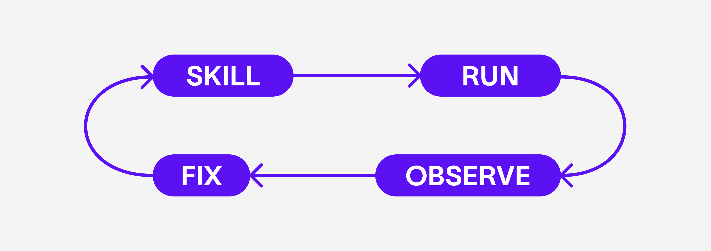
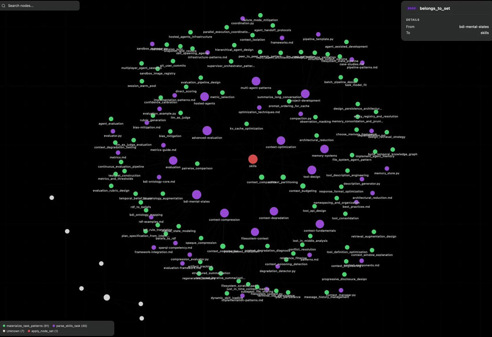
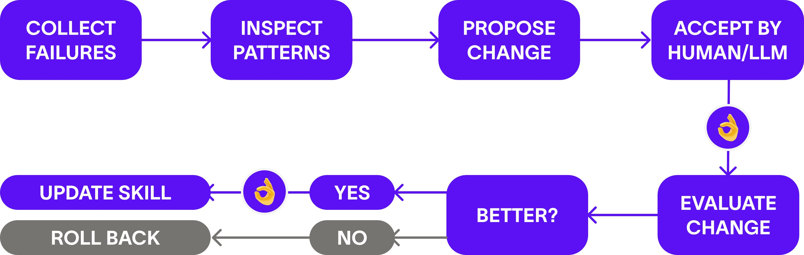

“Not just agents with skills, but agents with skills that can improve over time.”

Agent skills are here to stay, but a core problem remains unsolved: skills are often static while the environment keeps changing.

A skill that worked a few weeks ago can silently fail when the codebase changes, model behavior shifts, or user task patterns evolve. In many systems, these failures remain invisible until output quality degrades or things break completely.

The missing piece is to treat skills as living system components, not fixed prompt files.

This is the core idea: not only better skill storage and routing, but making skills improve when they fail or underperform.

[](https://x.com/tricalt/article/2032179887277060476/media/2032166214189916161)

Until now, skills were mostly:

1. Writing a prompt
2. Saving it in a folder
3. Calling it when needed

This works for demos, but eventually the same issues appear:

- One skill gets selected too often
- Another looks good but fails in practice
- A specific instruction repeatedly fails
- A tool call breaks because the environment changed

The hardest part is that teams often cannot tell whether the issue is routing, instructions, or tool execution. That leads to manual debugging and constant maintenance.

What changes with this approach is a closed loop that enables skills to self-improve over time.

A typical skill folder may look like:

```text
my_skills/
  summarize/
  bug-triage/
  code-review/
```

With cognee, skills can be represented with richer structure and semantics (task patterns, summaries, relationships), improving search and routing quality. This is stored through cognee’s `Custom DataPoint`.



A skill cannot improve if the system has no memory of what happened during execution. After each run, the system stores:

- What task was attempted
- Which skill was selected
- Whether it succeeded
- What error occurred
- User feedback (if any)

With this observation layer, failure becomes analyzable. As failed runs accumulate, the system can inspect connected history (runs, feedback, tool failures, task patterns), identify recurring factors, and propose targeted skill improvements.

`runs → repeated weak outcomes → inspection`

Once evidence shows underperformance, the system can propose an amendment to instructions. A human can review it, or it can be applied automatically.

Possible amendments include:

- Tightening triggers
- Adding missing conditions
- Reordering steps
- Changing output format

At this stage, skills stop behaving like static prompt files and start behaving like evolving components. Instead of editing `SKILL.md` by guesswork, the system proposes patches grounded in observed behavior.

Still, self-modification must be controlled. Any amendment should be evaluated:

- Did outcomes improve?
- Did failures decrease?
- Did it cause regressions elsewhere?

So the loop should be:

- `observe → inspect → amend → evaluate`

If improvement is not measurable, roll back. Because each change is tracked with rationale and results, original instructions are preserved, and self-improvement remains auditable rather than uncontrolled.

When evaluation confirms gains, the amendment becomes the next skill version.

[](https://x.com/tricalt/article/2032179887277060476/media/2032172060462436352)

Skills cannot remain static while models, codebases, and user tasks keep evolving. This approach offers a practical path to automated skill improvement while preserving control and oversight.
