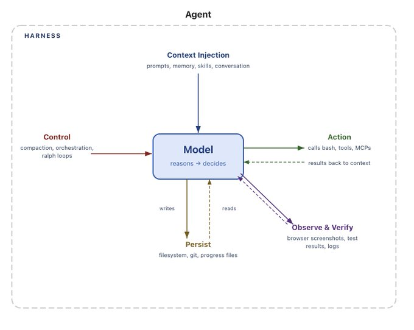
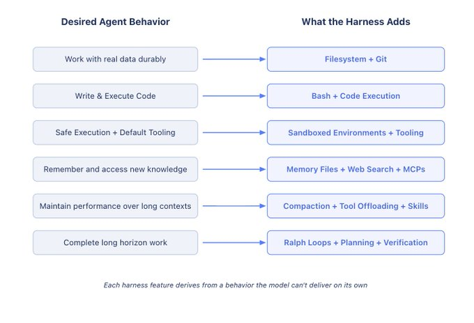
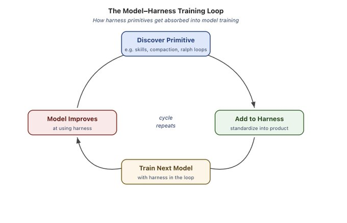

# Agent Harness 的剖析

**太长不看 (TLDR)：** Agent = Model + Harness (模型 + 治理框架/脚手架)。Harness engineering 是指我们如何围绕模型构建系统，从而将它们转化为工作引擎。模型包含智能，而 Harness 则让这些智能变得有用。我们定义了什么是 Harness，并推导出了当今和未来 Agent 所需的核心组件。

## Agent = Model + Harness

如果你不是模型，那你就是 Harness。

Harness 是所有不是模型本身的代码、配置和执行逻辑的总和。一个原始模型并不能称之为 Agent。但当 Harness 为其提供状态、工具执行、反馈循环和可强制执行的约束等能力时，它就变成了一个 Agent。

具体来说，Harness 包含以下内容：

*   System Prompts (系统提示词)
*   Tools、Skills、MCPs 及其描述
*   捆绑的基础设施 (如文件系统、沙盒、浏览器)
*   编排逻辑 (如生成 subagent、交接、模型路由)
*   用于确定性执行的 Hooks/Middleware (如上下文压缩、任务延续、lint 检查)

将一个 Agent 系统的边界划分给模型和 Harness 有许多模糊的方式。但在我看来，这是最清晰的定义，因为它迫使我们思考如何围绕模型智能来设计系统。

本文的其余部分将带你走遍 Harness 的核心组件，并从模型这一核心原语出发，反向推导为何需要这些组件。

有些事情是我们希望 Agent 能做，但模型开箱即用却做不到的。这就是 Harness 发挥作用的地方。

模型 (大多数情况下) 接收文本、图像、音频、视频等数据，并输出文本。仅此而已。开箱即用时，它们无法：

*   在交互之间维持持久的状态
*   执行代码
*   访问实时知识
*   设置环境并安装包来完成工作

这些都是 Harness 级别的特性。LLMs 的结构需要某种包装它们的机制才能完成有用的工作。

例如，为了获得诸如“聊天”这样的产品用户体验，我们将模型包装在一个 `while` 循环中，以追踪之前的消息并追加新的用户消息。阅读本文的每个人都已经使用过这种 Harness。其核心思想是，我们希望将一种期望的 Agent 行为转化为 Harness 中的一个实际特性。

Harness Engineering 帮助人类注入有用的先验知识来引导 Agent 行为。随着模型变得越来越强大，Harness 已被用于精准地扩展和修正模型，以完成以前不可能完成的任务。

我们不会详尽地列出 Harness 的每一个特性。我们的目标是从“帮助模型完成有用工作”这一起点出发，推导出一组特性。我们将遵循以下模式：

**我们期望的行为 (或想要修复的问题) → 帮助模型实现这一目标的 Harness 设计。**

**我们希望 Agent 拥有持久化存储，以便与真实数据交互，卸载无法容纳在上下文中的信息，并跨会话持久保存工作。**

模型只能直接操作其上下文窗口内的知识。在文件系统出现之前，用户必须手动将内容复制/粘贴给模型，这种用户体验很笨拙，而且不适用于自主 Agent。现实世界已经在利用文件系统来工作，因此模型自然就在数十亿的 token 中训练了如何使用它们。自然而然的解决方案变成了：

**Harness 随附文件系统抽象和用于 fs-ops (文件系统操作) 的工具。**

文件系统可以说是最基础的 Harness 原语，因为它解锁了以下能力：

*   Agent 获得了一个工作区来读取数据、代码和文档。
*   工作可以被增量添加和卸载，而不是把所有东西都保留在上下文中。Agent 可以存储中间输出并维持跨越单个会话的状态。
*   文件系统是一个天然的协作界面。多个 Agent 和人类可以通过共享文件进行协调。像 Agent Teams 这样的架构就依赖于此。

Git 为文件系统增加了版本控制，这样 Agent 就可以追踪工作、回滚错误并建立分支实验。我们在下面会再次探讨文件系统，因为它也是我们所需其他特性的一个关键 Harness 原语。

**我们希望 Agent 能够自主解决问题，而不需要人类预先设计好每一个工具。**

当今主要的 Agent 执行模式是 ReAct 循环，模型在 `while` 循环中进行推理、通过工具调用采取行动、观察结果，然后重复。但是 Harness 只能执行它们内部有逻辑定义的工具。与其强迫用户为每一个可能的动作构建工具，更好的解决方案是给 Agent 一个通用工具，比如 `bash`。

**Harness 随附一个 bash 工具，因此模型可以通过编写和执行代码来自主解决问题。**

bash + 代码执行是迈向“给模型一台计算机并让它们自主解决其余问题”的一大步。模型可以通过代码即时设计自己的工具，而不必受限于一组固定的预配置工具。

Harness 仍然会附带其他工具，但代码执行已成为自主解决问题的默认通用策略。

**Agent 需要一个具有正确默认值的环境，以便它们能够安全地行动、观察结果并取得进展。**

我们赋予了模型存储和执行代码的能力，但所有这些都需要在某个地方发生。在本地运行 Agent 生成的代码是有风险的，而且单一的本地环境无法横向扩展以适应大规模的 Agent 工作负载。

沙盒 (Sandboxes) 为 Agent 提供了安全的操作环境。Harness 可以连接到一个沙盒来运行代码、检查文件、安装依赖并完成任务，而不是在本地执行。这就创建了安全、隔离的代码执行环境。为了提高安全性，Harness 可以将命令加入白名单并强制实施网络隔离。沙盒也解锁了扩展性，因为环境可以按需创建、散布到许多任务中，并在工作完成后销毁。

优秀的环境自带优秀的默认工具。Harness 负责配置工具，以便 Agent 能够完成有用的工作。这包括预装语言运行时和包，用于 git 和测试的 CLI，以及用于网络交互和验证的浏览器。

浏览器、日志、截图和测试运行器等工具为 Agent 提供了观察和分析其工作的方法。这有助于它们建立自我验证循环，在这里它们可以编写应用代码、运行测试、检查日志并修复错误。

模型开箱即用时并不会配置自己的执行环境。决定 Agent 在哪里运行、有哪些工具可用、它可以访问什么以及它如何验证其工作，这些都是 Harness 级别的设计决策。

**Agent 应该记住它们见过的内容，并访问它们在训练时不存在的信息。**

除了权重和当前上下文中的内容，模型没有任何额外的知识。在无法编辑模型权重的情况下，唯一“增加知识”的方法是通过上下文注入 (context injection)。

对于记忆来说，文件系统再次成为一个核心原语。Harness 支持像 `MEMORY.md` 这样的记忆文件标准，这些文件在 Agent 启动时会被注入到上下文中。当 Agent 添加和编辑这个文件时，Harness 会将更新后的文件加载到上下文中。这是一种持久记忆的形式，Agent 将一个会话中的知识持久化存储，并将其注入到未来的会话中。

知识截止日期意味着，如果没有用户直接提供，模型无法直接访问像更新的库版本这样的新数据。为了获取最新知识，Web Search 和 MCP 工具可以帮助 Agent 访问超出其知识截止日期的信息，例如新的库版本或训练停止时尚未出现的当前数据。

Web Search 和查询最新上下文的工具是内置在 Harness 中的实用原语。

**Agent 的性能不应该在工作过程中下降。**

Context rot (上下文腐化) 描述了随着上下文窗口填满，模型在推理和完成任务方面变得越来越差的现象。上下文是一种宝贵且稀缺的资源，因此 Harness 需要策略来管理它。

如今的 Harness 很大程度上是优良 Context Engineering (上下文工程) 的交付机制。

压缩 (Compaction) 解决了当上下文窗口即将填满时该怎么办的问题。如果没有压缩，当对话超出上下文窗口时会发生什么？一种情况是 API 报错，这并不好。Harness 必须针对这种情况采取策略。因此，压缩会智能地卸载并总结现有的上下文窗口，以便 Agent 可以继续工作。

工具调用卸载 (Tool call offloading) 有助于减少大型工具输出的影响，这些输出可能会在不提供有用信息的情况下嘈杂地弄乱上下文窗口。Harness 保留高于阈值 token 数量的工具输出的首尾 token，并将完整输出卸载到文件系统，以便模型在需要时可以访问。

Skills (技能) 解决了 Agent 启动时加载到上下文中的工具或 MCP server 过多，导致 Agent 开始工作前性能就下降的问题。Skills 是一种 Harness 级别的原语，通过渐进式披露 (progressive disclosure) 来解决这个问题。模型本身并未选择在启动时将 Skill 的 front-matter 加载到上下文中，但 Harness 可以支持这样做，从而保护模型免受上下文腐化的影响。

**我们希望 Agent 能够在较长的时间跨度内，自主且正确地完成复杂的工作。**

自主软件创建是编码 Agent 的终极目标。但如今的模型受困于过早停止、分解复杂问题困难，以及当工作跨越多个上下文窗口时出现的不连贯。一个优秀的 Harness 必须围绕这些问题进行设计。

这就是之前的 Harness 原语开始产生复合效应的地方。长周期工作需要持久状态、计划、观察和验证，才能在跨多个上下文窗口时保持工作继续进行。

利用文件系统和 git 来追踪跨会话的工作。Agent 在长周期任务中会产生数百万个 token，因此文件系统能持久地捕获工作以追踪随时间推移的进展。添加 git 允许新的 Agent 快速熟悉项目的最新工作和历史。对于协同工作的多个 Agent，文件系统也充当了工作的共享账本，Agent 可以在这里进行协作。

用于继续工作的 Ralph Loops。这是一种 Harness 模式，它通过 hook 拦截模型的退出尝试，并在干净的上下文窗口中重新注入原始 prompt，强制 Agent 继续其工作以达到完成目标。文件系统使这成为可能，因为每次迭代都以全新的上下文开始，但读取的是上一次迭代的状态。

依靠计划和自我验证来保持正轨。规划 (Planning) 是指模型将一个目标分解为一系列步骤。Harness 通过良好的 prompt 和注入如何使用文件系统中的计划文件的提示来支持这一点。在完成每个步骤后，Agent 可以通过自我验证检查其工作的正确性而受益。Harness 中的 hooks 可以运行预定义的测试套件，并在失败时带着错误信息循环回到模型；或者可以提示模型独立自我评估其代码。验证将解决方案锚定在测试上，并为自我改进创建了反馈信号。

如今像 Claude Code 和 Codex 这样的 Agent 产品，是在模型和 Harness in-the-loop (环路中) 的情况下进行后训练 (post-trained) 的。这有助于模型在 Harness 设计者认为它们原生就该擅长的动作上表现得更好，例如文件系统操作、bash 执行、规划，或与 subagent 并行工作。

这就形成了一个反馈循环。有用的原语被发现，添加到 Harness 中，然后在训练下一代模型时使用。随着这个循环的重复，模型在它们被训练的 Harness 内变得越来越强大。

但这种共同演化对泛化能力产生了有趣的副作用。它表现在诸如改变工具逻辑会导致模型性能下降等方面。一个很好的例子是用 `apply_patch` 工具逻辑编辑文件的情况。一个真正智能的模型应该能毫不费力地在补丁方法之间切换，但在带有 Harness in-the-loop 的训练会产生这种过拟合 (overfitting)。

但这并不意味着最适合你任务的 Harness 就是模型进行后训练时所用的那个。Benchmark 是一个很好的例子。在 Claude Code 中的 Opus 4.6 得分远远低于在其他 Harness 中的 Opus 4.6。我们展示了如何通过仅仅改变 Harness，就将我们的编码 Agent 在 Terminal Bench 2.0 上的排名从 Top 30 提升到 Top 5。在为你的任务优化 Harness 方面，还有很多潜力可挖。

随着模型变得越来越强大，今天存在于 Harness 中的一些东西将会被吸收到模型中。模型将原生擅长规划、自我验证和长周期的连贯性，从而例如需要更少的上下文注入。

这似乎表明 Harness 的重要性会随着时间的推移而降低。但就像 prompt engineering 在今天仍然很有价值一样，Harness engineering 很可能也会继续对构建优秀的 Agent 大有裨益。

诚然，今天的 Harness 是在修补模型的缺陷，但它们同时也围绕模型智能工程化构建系统，使其更加有效。一个配置良好的环境、合适的工具、持久的状态以及验证循环，能使任何模型变得更高效，无论其基础智能水平如何。

Harness engineering 是一个非常活跃的研究领域，我们以此来改进我们在 LangChain 的 Harness 构建库。以下是我们今天正在探索的一些开放且有趣的问题：

*   编排数百个 Agent 在共享代码库上并行工作
*   Agent 分析其自身的 traces 以识别并修复 Harness 级别的故障模式
*   Harness 能够针对给定任务在恰当的时机动态组装正确的工具和上下文，而不是预先配置好

这篇博客旨在定义什么是 Harness，以及我们期望模型所做的工作如何塑造了它。

模型包含智能，而 Harness 则是使该智能发挥作用的系统。

致敬更多的 Harness 构建、更好的系统，以及更强大的 Agent。