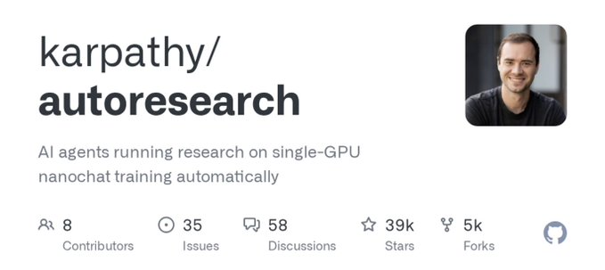

# 如何将你的 Claude Skills 提升 10 倍（使用 Karpathy 的 autoresearch 方法）

你的 Claude skills 可能有 30% 的概率会失败，而你甚至都没有注意到。

我构建了一种方法，可以让任何 skill 在自动驾驶模式下自我改进。在本文中，我将向你确切展示如何自己运行它。

你只需启动它，Agent 就会一遍又一遍地测试和优化 skill，而你什么都不用碰。

我的“落地页文案” (landing page copy) skill 的质量检查通过率从 56% 提高到了 92%。完全零手工操作。

Agent 只是自己不断地测试和收紧 prompt（提示词）。

以下是该方法以及我构建的确切 skill，以便你可以在自己的东西上运行它：

Andrej Karpathy（OpenAI 联合创始人，前特斯拉 AI 负责人，创造了“vibe coding”一词的人）发布了一种名为 **autoresearch** 的方法。

这个想法很简单：与其让你手动改进某样东西，不如让 AI Agent 在循环中为你做这件事。

它尝试做一个小小的改变。检查结果是否变好。如果变好就保留，如果没有变好就丢弃。

然后再做一次。一次又一次。

他将其用于机器学习代码。但这种方法适用于任何你可以衡量和改进的事物。

包括你在 Claude 中构建的 skills。

我采用了他的方法，并将其变成了一个可以在 Claude Code 和 Cowork 中工作的 skill。我只需在我的设置中针对任何其他 skill 运行它。

我说：“在我的落地页 skill 上运行 autoresearch”，它就会处理整个过程。

这样来想吧。

你有一个食谱，10 次中有 7 次做出来很棒。另外 3 次则不太对劲。可能是酱汁太淡，也可能是调料不对。

与其从头重写整个食谱，你不如改变一种成分。你带着这个改变做 10 次。

*   变好了吗？保留这个改变。
*   变差了吗？把原来的成分换回来。

然后你改变下一件事。再做 10 次。更好还是更坏？保留还是还原。

经过 50 轮这样的操作，你的食谱 10 次中有 9.5 次都能成功。

这正是 autoresearch 对你的 skills 所做的事情。

*   “食谱”就是你的 skill prompt。
*   “烹饪”就是运行 skill。
*   “品尝”就是对输出进行评分。

你唯一需要提供的就是评分标准。

你给 Agent 一个关于什么是“好”的简单检查清单 (checklist)。这是你在这个整个过程中的唯一工作。

你用一个包含“是/否”问题的简单检查清单来完成。

每个问题检查输出的一个特定方面。通过或失败。仅此而已。

Agent 使用这个检查清单对每个输出进行评分，这些分数告诉它其所做的更改是有帮助还是有害的。

把它想象成一个老师拿着检查清单给论文打分。

但不是“给写作质量打分 1-10”（这很模糊，每次都不一样），而是检查清单上的每一项都是一个明确的“是”或“否”：

*   学生包含主题句了吗？是或否。
*   每个来源都引用了吗？是或否。
*   少于 5 页吗？是或否。

你可以用那个检查清单给 100 篇论文打分，每次都能得到一致的结果。

这里也是同样的想法。对于一个落地页文案 skill，你的检查清单可能如下所示：

*   “标题是否包含具体的数字或结果？”（用于捕获像“发展你的业务”这样模糊的标题）
*   “文案是否不含‘革命性’、‘协同效应’、‘前沿’、‘下一级’等流行语？”
*   “CTA (行动呼吁) 是否使用了特定的动词短语？”（用于捕获像“了解更多”或“点击这里”这样软弱的 CTA）
*   “第一句话是否指出了具体的痛点？”（用于捕获像“在当今快节奏的世界中……”这样通用的开场白）
*   “总文案是否少于 150 个字？”（用于捕获那些会让读者流失的臃肿页面）

你不需要自己想出这些。当你开始 autoresearch 时，Agent 会引导你完成。

它会问你什么是“好”，帮助你把你的感觉转化为具体的“是/否”问题，如果你有现成的风格指南，它甚至主动提出从中提取。

3-6 个问题是最佳范围。比这更多，skill 就会开始钻检查清单的空子（就像一个学生死记硬背答案却不理解材料一样）。

**第 1 步：下载 skill。** 获取它。将其放入 Claude Code 或 Cowork 的 skills 文件夹中。

**第 2 步：选择一个要改进的 skill。** 说“在我的 [skill 名称] skill 上运行 autoresearch”。选择最让你烦恼的那个。就是那个一半时间输出很棒，另一半时间输出垃圾的那个。

**第 3 步：** Agent 会问你 3 件事。要优化哪个 skill。使用什么测试输入（比如“为一个 AI 生产力工具写落地页文案”）。以及你的检查清单问题是什么。

**第 4 步：** 它运行你的 skill 并显示你的初始分数。这是基准。我的落地页 skill 从 56% 开始。模糊的标题，流行语堆砌，软弱的 CTA。一半以上的检查都失败了。

**第 5 步：** 它在你的浏览器中打开一个实时仪表板。随时间推移上升的分数图表。每个检查清单问题的通过/失败明细。它尝试的每一次更改的日志。每 10 秒自动刷新。

**第 6 步：走开。** Agent 进入循环。分析失败的地方。对 skill prompt 做出一个小小的改变。再次测试。如果分数上升则保留更改，如果分数下降则撤销。

然后再做一次。一次又一次。它会自主持续运行，直到你停止它，或者它连续三次达到 95% 以上。

你可以看着仪表板，也可以完全走开。它在没有你的情况下运行。它会将改进后的版本保存为一个单独的文件，因此你的原始 skill 保持原样。

我在我的落地页文案 skill 上运行了它。以下是返回的结果：

56% → 92%。4 轮修改。3 次保留，1 次撤销。

以下是 Agent 实际在我的 skill prompt 中更改的内容：

*   针对最常见的失败添加了具体规则：“你的标题必须包含具体的数字或结果。绝对不要使用像‘改造你的业务’这样模糊的承诺。”
*   添加了禁用流行语列表：“绝对不要使用：革命性、前沿、协同效应、下一级、改变游戏规则、利用、解锁、改造。”
*   添加了一个经过验证的、强调痛点开场白和 CTA 的强大落地页部分的示例，这样 skill 就能看到什么是“好”，而不是靠猜。
*   尝试了更严格的字数限制，但随后撤销了它，因为文案变得太单薄，CTA 受到了影响。（系统会捕获那些孤立来看像是改进，但却损害了整体输出的更改。）

完成后，我得到了：

*   **改进后的 skill**，单独保存（原版保持不动以防你想还原）
*   **结果日志**，显示每一轮的分数
*   **更新日志 (changelog)**，解释它尝试的每一个更改，Agent 为什么尝试它，以及它是否有帮助
*   **我原始 skill 的备份**，以防我以后想换回来

那个更新日志可能是最有价值的部分。它是针对该特定 skill 什么有效、什么无效的完整记录。

当将来有更聪明的模型问世时，你把那个更新日志交给它们，它们就能从上一个 Agent 停止的地方继续。

这种方法适用于任何你可以评分的事物。

*   **网站速度：** 有人将其用于页面加载时间。改变一件事，测量速度，保留或还原。在 67 轮中从 1100 毫秒降至 67 毫秒。
*   **冷发外联 (Cold outreach)：** 定义你的检查清单：“它是否提到了潜在客户的公司？是否少于 75 个字？是否以具体问题结尾？”让 Agent 运行 50 个变体。
*   **新闻简报开场白：** “开场白是否包含个人细节？”以及“它是否不含陈词滥调？”让 Agent 在自动驾驶模式下精炼你的写作。
*   **任何你反复使用的 prompt**

如果你能对它进行评分，你就能对它进行 autoresearch。

挑选你表现最差的 skill。开始 autoresearch。回来时你将得到真正有效的东西。