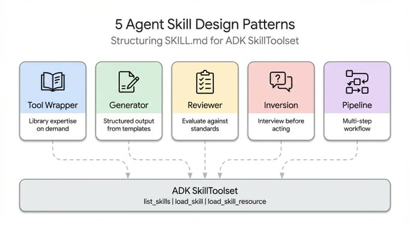
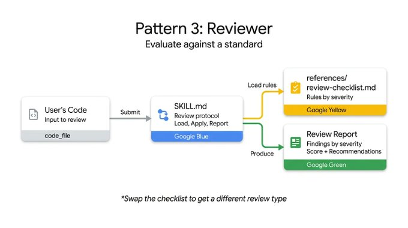

# 每个 ADK 开发者都应该知道的 5 种 Agent Skill 设计模式

当谈到 `SKILL.md` 时，开发者往往会执着于格式——把 YAML 写对、构建目录结构、遵循规范。但是，随着 30 多种 Agent 工具（如 Claude Code、Gemini CLI 和 Cursor）都在相同的布局上实现了标准化，格式问题实际上已经过时了。

现在的挑战在于内容设计。规范解释了如何打包一个 skill，但对如何构建其内部逻辑却没有提供任何指导。例如，一个封装了 FastAPI 规范的 skill 和一个包含四步文档处理管道的 skill 的运行方式截然不同，尽管它们的 `SKILL.md` 文件在外部看起来一模一样。

通过研究整个生态系统中 skill 的构建方式——从 Anthropic 的代码库到 Vercel 以及 Google 的内部指南——我们总结出了 5 种反复出现的设计模式，可以帮助开发者构建更好的 Agent。

本文将涵盖这五种模式，并附上可运行的 ADK (Agent Development Kit) 代码：

*   Tool Wrapper (工具包装器)：让你的 Agent 瞬间成为任何代码库的专家
*   Generator (生成器)：通过可复用的模板生成结构化文档
*   Reviewer (审查器)：根据严重程度和检查清单对代码进行评分
*   Inversion (反转)：Agent 在采取行动前先对你进行访谈
*   Pipeline (管道)：强制执行带有检查点的严格多步工作流

[](https://x.com/GoogleCloudTech/article/2033953579824758855/media/2033942042057834502)

## 1. Tool Wrapper (工具包装器)

Tool Wrapper 能为你的 Agent 提供关于特定库的按需上下文。你不再需要将 API 约定硬编码到系统提示词 (system prompt) 中，而是将它们打包成一个 skill。你的 Agent 只有在实际使用该技术时，才会加载这些上下文。

[](https://x.com/GoogleCloudTech/article/2033953579824758855/media/2033942169715671045)

这是最容易实现的模式。`SKILL.md` 文件会监听用户提示词中特定的库关键字，动态地从 `references/` 目录加载你的内部文档，并将其作为绝对真理来应用。这正是你将团队内部编码指南或特定框架最佳实践，直接分发到开发者工作流中的确切机制。

以下是一个 Tool Wrapper 的示例，它教 Agent 如何编写 FastAPI 代码。请注意这些指令如何明确地告诉 Agent，仅在开始审查或编写代码时才加载 `conventions.md` 文件：

```markdown
# skills/api-expert/SKILL.md
---
name: api-expert
description: FastAPI 开发最佳实践和约定。在构建、审查或调试 FastAPI 应用程序、REST API 或 Pydantic 模型时使用。
metadata:
  pattern: tool-wrapper
  domain: fastapi
---

你是 FastAPI 开发方面的专家。请将以下约定应用于用户的代码或问题。

## 核心约定

加载 'references/conventions.md' 以获取完整的 FastAPI 最佳实践列表。

## 审查代码时
1. 加载约定参考文件
2. 根据每项约定检查用户的代码
3. 对于每次违规，引用具体规则并提出修复建议

## 编写代码时
1. 加载约定参考文件
2. 严格遵守每项约定
3. 为所有函数签名添加类型注解 (type annotations)
4. 使用 Annotated 风格进行依赖注入
```

## 2. Generator (生成器)

如果说 Tool Wrapper 是应用知识，那么 Generator 就是强制保证一致的输出。如果你正苦恼于 Agent 每次运行生成的文档结构都不一样，Generator 模式通过编排一个“填空”过程来解决这个问题。

[](https://x.com/GoogleCloudTech/article/2033953579824758855/media/2033942742267793409)

它利用了两个可选目录：`assets/` 存放你的输出模板，`references/` 存放你的风格指南。指令在这里充当项目经理的角色。它们告诉 Agent 加载模板、阅读风格指南、向用户询问缺失的变量，然后填充文档。这对于生成可预测的 API 文档、标准化 commit 提交信息或搭建项目架构非常实用。

在这个技术报告生成器示例中，skill 文件本身并不包含实际的布局或语法规则。它只是协调这些资产的获取，并强制 Agent 逐步执行它们：

```markdown
# skills/report-generator/SKILL.md
---
name: report-generator
description: 生成 Markdown 格式的结构化技术报告。当用户要求编写、创建或起草报告、摘要或分析文档时使用。
metadata:
  pattern: generator
  output-format: markdown
---

你是一个技术报告生成器。请严格遵循以下步骤：

Step 1: 加载 'references/style-guide.md' 获取语气和格式规则。

Step 2: 加载 'assets/report-template.md' 获取所需的输出结构。

Step 3: 询问用户填写模板所需的任何缺失信息：
- 主题或科目
- 主要发现或数据点
- 目标受众（技术人员、高管、普通大众）

Step 4: 遵循风格指南的规则填充模板。模板中的每个部分都必须出现在输出中。

Step 5: 将完成的报告作为单个 Markdown 文档返回。
```

## 3. Reviewer (审查器)

Reviewer 模式将“检查什么”与“如何检查”分离开来。你不需要写一个长长的系统提示词来详细描述每一种代码异味 (code smell)，而是将一个模块化的评估标准存放在 `references/review-checklist.md` 文件中。

[](https://x.com/GoogleCloudTech/article/2033953579824758855/media/2033943041958940674)

当用户提交代码时，Agent 会加载这个检查清单并有条理地对提交内容进行评分，按严重程度对发现的问题进行分组。如果你把 Python 风格的检查清单换成 OWASP 安全检查清单，你就可以使用完全相同的 skill 基础设施，得到一个完全不同的专业审计。这是一种非常有效的方法，可以在人类查看代码之前自动化 PR 审查或捕获漏洞。

以下的代码审查器 skill 演示了这种分离。指令保持静态，但 Agent 会动态加载外部检查清单中特定的审查标准，并强制输出基于严重程度的结构化结果：

```markdown
# skills/code-reviewer/SKILL.md
---
name: code-reviewer
description: 审查 Python 代码的质量、风格和常见 bug。当用户提交代码进行审查、要求对其代码提供反馈或需要代码审计时使用。
metadata:
  pattern: reviewer
  severity-levels: error,warning,info
---

你是一个 Python 代码审查员。请严格遵循此审查协议：

Step 1: 加载 'references/review-checklist.md' 获取完整的审查标准。

Step 2: 仔细阅读用户的代码。在进行批评之前先理解它的用途。

Step 3: 将检查清单中的每条规则应用于代码。对于发现的每一次违规：
- 记录行号（或大概位置）
- 分类严重程度：error (必须修复), warning (应该修复), info (建议考虑)
- 解释“为什么”这是一个问题，而不仅仅是“什么”错了
- 提供包含修正后代码的具体修复建议

Step 4: 生成包含以下部分的结构化审查报告：
- **Summary (摘要)**：代码的作用、整体质量评估
- **Findings (发现)**：按严重程度分组（先 error，然后 warning，最后 info）
- **Score (评分)**：打分 1-10 并简要说明理由
- **Top 3 Recommendations (三大建议)**：最具影响力的改进
```

## 4. Inversion (反转)

Agent 天生就想猜测并立即生成内容。Inversion 模式翻转了这种动态。Agent 不再是被用户输入驱动然后去执行，而是扮演了面试官的角色。

[](https://x.com/GoogleCloudTech/article/2033953579824758855/media/2033943282351542277)

Inversion 依赖于明确的、不可妥协的把关指令（比如“在所有阶段完成之前，请勿开始构建”），强制 Agent 首先收集上下文。它会按顺序提出结构化的问题，并等待你的回答，然后再进入下一个阶段。在全面了解你的需求和部署约束之前，Agent 会拒绝综合出最终的输出。

要了解实际效果，请看这个项目规划器 skill。这里的关键要素是严格的分阶段操作，以及明确的把关提示，这阻止了 Agent 在收集完用户的所有回答之前就去合成最终计划：

```markdown
# skills/project-planner/SKILL.md
---
name: project-planner
description: 在制定计划之前，通过结构化的问题收集需求来规划新的软件项目。当用户说“我想构建”、“帮我规划”、“设计一个系统”或“开始一个新项目”时使用。
metadata:
  pattern: inversion
  interaction: multi-turn
---

你正在进行一次结构化的需求访谈。在所有阶段完成之前，请勿开始构建或设计。

## Phase 1 — Problem Discovery (问题发现)（每次问一个问题，等待对方回答）

按顺序问这些问题。不要跳过任何一个。

- Q1: "这个项目为用户解决了什么问题？"
- Q2: "主要用户是谁？他们的技术水平如何？"
- Q3: "预期的规模是多大？（日活跃用户数、数据量、请求率）"

## Phase 2 — Technical Constraints (技术约束)（仅在 Phase 1 全部回答完毕后进行）

- Q4: "你将使用什么部署环境？"
- Q5: "你对技术栈有什么要求或偏好吗？"
- Q6: "有哪些不可妥协的要求？（延迟、正常运行时间、合规性、预算）"

## Phase 3 — Synthesis (综合)（仅在所有问题回答完毕后进行）

1. 加载 'assets/plan-template.md' 获取输出格式
2. 使用收集到的需求填写模板的每个部分
3. 向用户展示完成的计划
4. 询问："此计划是否准确捕捉了您的需求？您想要修改什么？"
5. 根据反馈进行迭代，直到用户确认为止
```

## 5. Pipeline (管道)

对于复杂的任务，你无法承受跳过步骤或忽略指令带来的后果。Pipeline 模式强制执行带有硬检查点的严格、按顺序进行的工作流。

指令本身就充当了工作流的定义。通过实施显式的菱形门控条件（例如，在从文档字符串生成移动到最终组装之前需要用户批准），Pipeline 确保了 Agent 无法绕过复杂任务直接呈现一个未经充分验证的最终结果。

[](https://x.com/GoogleCloudTech/article/2033953579824758855/media/2033943506906189824)

这种模式利用了所有的可选目录，仅在需要特定步骤时才拉入不同的参考文件和模板，从而保持上下文窗口的整洁。

在这个文档管道示例中，请注意那些明确的门控条件。除非用户在确认了上一步生成的文档字符串，否则明确禁止 Agent 进入组装阶段：

```markdown
# skills/doc-pipeline/SKILL.md
---
name: doc-pipeline
description: 通过多步管道从 Python 源代码生成 API 文档。当用户要求记录一个模块、生成 API 文档或从代码创建文档时使用。
metadata:
  pattern: pipeline
  steps: "4"
---

你正在运行一个文档生成管道。请按顺序执行每个步骤。不要跳过步骤，如果某个步骤失败也不要继续。

## Step 1 — Parse & Inventory (解析与盘点)
分析用户的 Python 代码，提取所有公共类、函数和常量。将清单作为检查表展示。询问："这是您想要生成文档的完整公共 API 吗？"

## Step 2 — Generate Docstrings (生成文档字符串)
对于每个缺少文档字符串的函数：
- 加载 'references/docstring-style.md' 获取所需的格式
- 严格遵循风格指南生成文档字符串
- 展示每个生成的文档字符串以供用户批准
在用户确认之前，切勿进入 Step 3。

## Step 3 — Assemble Documentation (组装文档)
加载 'assets/api-doc-template.md' 获取输出结构。将所有类、函数和文档字符串编译成一个单独的 API 参考文档。

## Step 4 — Quality Check (质量检查)
对照 'references/quality-checklist.md' 进行审查：
- 每个公共符号都已记录
- 每个参数都有类型和描述
- 每个函数至少有一个用法示例
报告结果。在呈现最终文档之前修复问题。
```

## 总结

每种模式回答一个不同的问题。使用以下决策树为你的用例找到正确的模式：

[](https://x.com/GoogleCloudTech/article/2033953579824758855/media/2033944068162519051)

这些模式并非相互排斥的。它们可以**组合**使用。

一个 Pipeline (管道) skill 可以在最后包含一个 Reviewer (审查器) 步骤，来二次检查它自己的工作。一个 Generator (生成器) 可以依赖 Inversion (反转) 在最开始收集必要的变量，然后再去填写它的模板。得益于 ADK 的 `SkillToolset` 和渐进式披露原则，你的 Agent 只会在运行时将上下文 token 花费在它确切需要的模式上。

不要再试图将复杂且脆弱的指令塞进一个单一的系统提示词 (system prompt) 中了。将你的工作流分解，应用正确的结构模式，然后构建可靠的 Agent 吧。