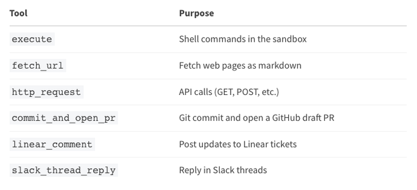
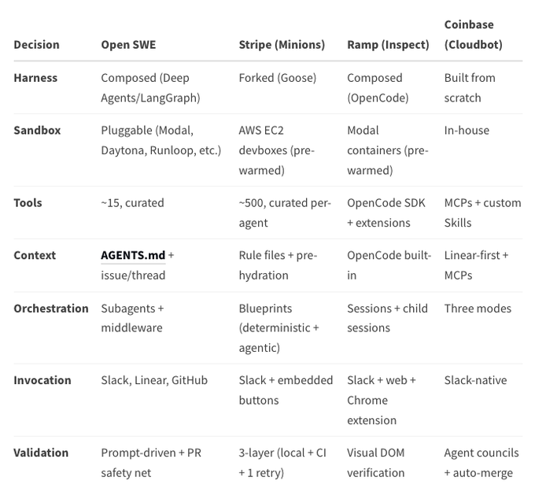

# Open SWE：用于内部编码 Agent 的开源框架

在过去的一年里，我们观察到几家工程组织构建了内部编码 Agent（Coding Agents）来与他们的开发团队协同工作。Stripe 开发了他们的系统，Ramp 构建了他们的系统，Coinbase 也创建了他们自己的系统。这些系统融入了现有的工作流（可通过 Slack、Linear 和 GitHub 访问），而不需要工程师去适应新的界面。

尽管这些系统是独立开发的，但它们在架构模式上殊途同归：隔离的云端沙盒、精选的工具集、子 Agent 编排，以及与开发者工作流的深度集成。这种趋同现象表明，在生产工程环境中部署 AI Agent 存在一些共同的需求。

今天，我们发布 **Open SWE**，这是一个开源框架，它以可定制的形式捕捉了这些模式。Open SWE 构建在 Deep Agents 之上，提供了我们在这些实现中观察到的核心架构组件。如果你的组织正在探索内部编码 Agent，这可以作为一个起点。

当我们审视 Stripe、Ramp 和 Coinbase 如何构建他们的编码 Agent 时，我们注意到他们做出了类似的架构决策。以下是这些系统的共同点：

*   **隔离的执行环境 (Isolated execution environments)：** 任务在专用的云端沙盒中运行，在严格的边界内拥有完全权限。这隔离了任何错误对生产系统造成的爆炸半径，同时允许 Agent 执行命令，而无需对每个操作进行审批提示。
*   **精选的工具集 (Curated toolsets)：** 他们的 Agent 可以访问大约 500 个工具，但这些工具都是经过精心挑选和维护的，而不是随时间随意积累的。工具的精选似乎比数量更重要。
*   **Slack 优先调用 (Slack-first invocation)：** 所有三个系统都集成了 Slack 作为主要界面，在开发者现有的沟通工作流中迎接他们，而不是要求他们切换上下文到新的应用程序中。
*   **启动时提供丰富的上下文 (Rich context at startup)：** 这些 Agent 在开始工作之前，会从 Linear issue、Slack 线程或 GitHub PR 中拉取完整的上下文，减少了通过工具调用来发现需求的开销。
*   **子 Agent 编排 (Subagent orchestration)：** 复杂的任务会被分解并委派给专门的子 Agent，每个子 Agent 都有隔离的上下文和专注的职责。

这些架构选择在多个生产部署中已被证明是有效的，尽管组织可能需要使特定组件适应其自己的环境和需求。

Open SWE 提供了类似架构模式的开源实现。以下是该框架如何映射到我们观察到的情况：

## 1. Agent 脚手架：基于 Deep Agents 组合

Open SWE 没有分叉 (forking) 现有的 Agent 或从头开始构建，而是在 Deep Agents 框架上进行组合构建。这种方法类似于在 OpenCode 之上构建。

组合带来了两个优势：

*   **升级路径 (Upgrade path)：** 当 Deep Agents 改进时（更好的上下文管理、更高效的规划、优化的 token 使用），你可以整合这些改进，而无需重建你的定制内容。
*   **无需分叉的定制 (Customization without forking)：** 你可以将组织特定的工具、提示词和工作流作为配置来维护，而不是修改核心的 Agent 逻辑。

```python
create_deep_agent(
    model="anthropic:claude-opus-4-6",
    system_prompt=construct_system_prompt(repo_dir, ...),
    tools=[
        http_request,
        fetch_url,
        commit_and_open_pr,
        linear_comment,
        slack_thread_reply
    ],
    backend=sandbox_backend,
    middleware=[
        ToolErrorMiddleware(),
        check_message_queue_before_model,
        ...
    ],
)
```

Deep Agents 提供了支持这些模式的基础设施：通过 `write_todos` 实现的内置规划、基于文件的上下文管理、通过 `task` 工具实现的内置子 Agent 生成，以及用于确定性编排的中间件 Hook (middleware hooks)。

## 2. 沙盒：隔离的云环境

每个任务都在自己隔离的云沙盒中运行，这是一个拥有完整 shell 访问权限的远程 Linux 环境。代码库被克隆进去，Agent 获得完整的权限，并且任何错误都被包含在该环境中。

Open SWE 开箱即用支持多个沙盒提供商。你也可以实现自己的沙盒后端。

这遵循了我们观察到的一种模式：首先隔离，然后在边界内授予完整权限。

核心行为：
*   每个对话线程都有一个持久的沙盒，在后续消息中重复使用。
*   如果沙盒变得不可达，它们会自动重新创建。
*   多个任务并行运行，每个任务都在自己的沙盒中。

## 3. 工具：精选而非堆砌

Open SWE 附带了一个专注的工具集：

[](https://x.com/LangChain/article/2033959303766512006/media/2033956752568553474)

加上 Deep Agents 内置的工具：`read_file`（读文件）、`write_file`（写文件）、`edit_file`（编辑文件）、`ls`（列出目录）、`glob`（文件匹配）、`grep`（文本搜索）、`write_todos`（写待办事项）和 `task`（生成子 Agent）。

更小、精选的工具集更容易测试、维护和推理。当你需要为你的组织添加额外的工具（内部 API、自定义部署系统、专门的测试框架）时，你可以显式地添加它们。

## 4. 上下文工程：AGENTS.md + 源上下文

Open SWE 从两个来源收集上下文：

*   **AGENTS.md 文件：** 如果你的代码库根目录包含一个 `AGENTS.md` 文件，它将从沙盒中读取并注入到系统提示词中。此文件可以编码约定、测试需求、架构决策以及每次 Agent 运行都应遵循的团队特定模式。
*   **源上下文 (Source context)：** 在 Agent 启动前，完整的 Linear issue（标题、描述、评论）或 Slack 线程历史会被组装并传递给它，无需额外的工具调用即可提供特定于任务的上下文。

这种双层方法平衡了代码库范围的知识与特定任务的信息。

## 5. 编排：子 Agent + 中间件

Open SWE 的编排结合了两种机制：

*   **子 Agent (Subagents)：** Deep Agents 框架支持通过 `task` 工具生成子 Agent。主 Agent 可以将独立的子任务委托给隔离的子 Agent，每个子 Agent 都有自己的中间件栈、待办事项列表和文件操作。
*   **中间件 (Middleware)：** 确定性的中间件 Hook 围绕 Agent 循环运行：
    *   `check_message_queue_before_model`：在下一次模型调用之前，注入后续消息（如在运行中途到达的 Linear 评论或 Slack 消息）。这允许用户在 Agent 工作时提供额外的输入。
    *   `open_pr_if_needed`：充当安全网，如果 Agent 没有完成此步骤，它会自动提交并打开 PR。这确保了关键步骤能够可靠地发生。
    *   `ToolErrorMiddleware`：优雅地捕获和处理工具错误。

这种 Agent 式（模型驱动）和确定性（中间件驱动）编排之间的分离有助于平衡可靠性与灵活性。

## 6. 调用：Slack、Linear 和 GitHub

我们观察到，许多团队将 Slack 作为主要的调用入口。Open SWE 也遵循了类似的模式：

*   **Slack：** 在任何线程中提及机器人（Bot）。支持 `repo:owner/name` 语法来指定要在哪个代码库上工作。Agent 在线程内回复状态更新和 PR 链接。
*   **Linear：** 在任何 issue 上发表评论。Agent 会读取完整的 issue 上下文，用 👀 表情回应以示确认，并将结果作为评论发回。
*   **GitHub：** 在 Agent 创建的 PR 的评论中 Tag 它，让它处理审查反馈，并将修复推送到同一分支。

每次调用都会创建一个确定性的线程 ID，因此在同一个 issue 或线程上的后续消息会路由到同一个正在运行的 Agent。

## 7. 验证：Prompt 驱动 + 安全网

Agent 被指示在提交之前运行 linter、格式化工具和测试。`open_pr_if_needed` 中间件充当了最后一道防线——如果 Agent 完成任务但没有打开 PR，中间件会自动处理它。

你可以通过添加确定性的 CI 检查、视觉验证或审查门控（review gates）作为额外的中间件来扩展此验证层。

Deep Agents 提供了使这种架构可组合和可维护的基础。

*   **上下文管理：** 长时间运行的编码任务会产生大量的中间数据（文件内容、命令输出、搜索结果）。Deep Agents 通过基于文件的内存来处理这个问题，卸载庞大的结果，而不是将所有内容保留在对话历史记录中。这有助于防止在处理大型代码库时发生上下文溢出（context overflow）。
*   **规划原语：** 内置的 `write_todos` 工具提供了一种结构化的方法来分解复杂的工作、跟踪进度，并在新信息出现时调整计划。我们发现这对于跨越较长时间的多步任务特别有帮助。
*   **子 Agent 隔离：** 当主 Agent 通过 `task` 工具生成一个子 Agent 时，该子 Agent 会获得自己隔离的上下文。不同的子任务不会污染彼此的对话历史，这可以使在处理复杂的、多层面的工作时推理更清晰。
*   **中间件 Hook：** Deep Agents 的中间件系统允许你在 Agent 循环的特定点注入确定性逻辑。这就是 Open SWE 实现消息注入和自动创建 PR（这些需要可靠发生的行为）的方式。
*   **升级路径：** 因为 Deep Agents 是作为一个独立的库积极开发的，所以对上下文压缩、提示词缓存、规划效率和子 Agent 编排的改进可以流入 Open SWE，而不需要你重建你的定制。

Open SWE 旨在作为一个可定制的基础，而不是一个成品。每个主要组件都是可插拔的：

*   **沙盒提供商：** 在 Modal、Daytona、Runloop 或 LangSmith 之间切换。如果你有内部基础设施需求，可以实现你自己的沙盒后端。
*   **模型：** 使用任何 LLM 提供商。默认是 Claude Opus 4，但你可以为不同的子任务配置不同的模型。
*   **工具：** 为你的内部 API、部署系统、测试框架或监控平台添加工具。移除你不需要的工具。
*   **触发器：** 修改 Slack、Linear 和 GitHub 集成逻辑。添加新的触发面，如电子邮件、Webhooks 或自定义 UI。
*   **系统提示词：** 定制基础提示词和引入 `AGENTS.md` 文件的逻辑。添加组织特定的指令、约束或约定。
*   **中间件：** 添加你自己的中间件 Hook 用于验证、审批关卡、日志记录或安全检查。

以下是 Open SWE 与 Stripe、Ramp 和 Coinbase 的内部系统的对比：

[](https://x.com/LangChain/article/2033959303766512006/media/2033956913214623744)

核心模式是相似的。区别在于实现细节、内部集成和特定于组织的工具——这正是你在将框架适应不同环境时所期望的。

该框架采用 MIT 许可证。你可以分叉它、定制它，并在内部部署它。几家工程组织已经成功地在生产环境中部署了内部编码 Agent。Open SWE 提供了类似架构模式的开源实现，旨在为不同的代码库和工作流进行定制。虽然我们仍在学习在不同环境中什么是有效的，但这个框架为探索这种方法的团队提供了一个起点。