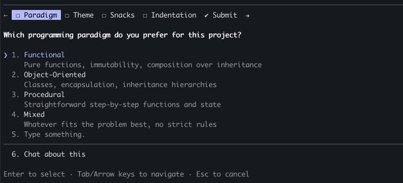
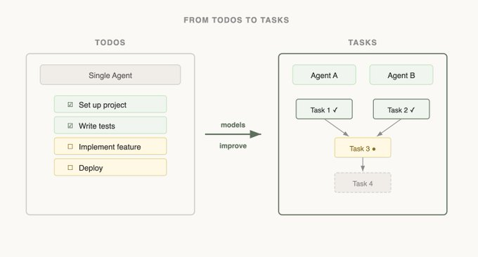

# 构建 Claude Code 的经验教训：像 Agent 一样思考

构建 Agent 脚手架（harness）最困难的部分之一就是构建其动作空间（action space）。

Claude 通过工具调用（Tool Calling）采取行动，但是在 Claude API 中构建工具的方式有很多种，比如基于原语（primitives）的 bash、skills，以及最近引入的代码执行功能。

面对这些选项，你该如何设计你的 Agent 的工具？你只需要像代码执行或 bash 这样的单个工具吗？如果你的 Agent 可能会遇到 50 种使用场景，你需要提供 50 个工具吗？

为了设身处地地站在模型的角度思考，我喜欢想象自己面临一道困难的数学题。为了解开它，你会想要什么工具？这取决于你自己的技能！

纸张是最低配置，但你会受限于手动计算。计算器会更好，但你需要知道如何操作更高级的选项。最快、最强大的选项是一台电脑，但你必须知道如何使用它来编写和执行代码。

这是一个设计 Agent 时非常有用的框架。**你想要提供符合其自身能力的工具。** 但是你如何知道这些能力是什么呢？你需要持续关注、阅读它的输出、并进行实验。你要学会**像 Agent 一样思考（See like an agent）**。

以下是我们在构建 Claude Code 时，通过观察 Claude 学到的一些经验教训。

当我们构建 `AskUserQuestion` 工具时，我们的目标是提高 Claude 提问（通常称为激发，elicitation）的能力。

虽然 Claude 可以直接用纯文本提问，但我们发现回答这些问题感觉浪费了不必要的时间。我们如何才能降低这种摩擦，并增加用户和 Claude 之间的沟通带宽？

我们尝试的第一件事是给 `ExitPlanTool` 添加一个参数，以便在计划旁边附带一个问题数组。这是最容易实现的，但它让 Claude 感到困惑，因为我们同时要求它提供一个计划和一组关于该计划的问题。如果用户的回答与计划内容冲突怎么办？Claude 是否需要调用两次 `ExitPlanTool`？我们需要另一种方法。

接下来，我们尝试修改 Claude 的输出指令，让它输出一种略微修改过的 markdown 格式，以用于提问。例如，我们可以要求它输出一个带有括号中备选项的项目符号问题列表。然后我们可以解析这种格式，并将其作为 UI 呈现给用户。

虽然这是我们能做出的最通用的更改，并且 Claude 似乎也很擅长输出这种格式，但这并不能保证百分百成功。Claude 经常会附加额外的句子、省略选项，或者使用完全不同的格式。

最终，我们决定创建一个 Claude 可以随时调用的工具，特别是在计划模式下鼓励它调用。当工具触发时，我们会显示一个模态框（modal）来展示问题，并阻塞 Agent 的运行循环，直到用户回答。

这个工具允许我们提示 Claude 提供结构化的输出，这有助于确保 Claude 给用户提供多个选项。它也为用户提供了组合此功能的方法，例如在 Agent SDK 中调用它，或在 skills 中引用它。

最重要的是，Claude 似乎很喜欢调用这个工具，我们发现它的输出效果很好。**如果 Claude 不理解如何调用它，再好的工具设计也是徒劳的。**

这是 Claude Code 中提问（elicitation）功能的最终形态吗？我们不确定。正如你在下一个例子中将看到的，对一个模型有效的方案，对另一个模型来说未必是最好的。

当我们刚推出 Claude Code 时，我们意识到模型需要一个待办事项列表（Todo list）来保持在正确的轨道上。Todos 可以在开始时编写，并在模型完成工作时勾选。为此，我们给 Claude 提供了 `TodoWrite` 工具，它可以编写或更新 Todos 并显示给用户。

但即便如此，我们仍然经常看到 Claude 忘记了它必须做的事情。为了适应这种情况，我们每隔 5 轮就会插入系统提醒，以提醒 Claude 其目标。

但是随着模型的改进，它们不仅不需要 Todo 列表的提醒，甚至会发现它具有限制性。接收 todo 列表的提醒会让 Claude 认为它必须死守该列表，而不是去修改它。我们还看到 Opus 4.5 变得非常擅长使用子 Agent (subagents)，但是子 Agent 之间如何协调共享的 Todo 列表呢？

看到这一点，我们将 `TodoWrite` 替换为了 `Task`（任务）工具。Todos 主要是为了让模型保持在正轨上，而 Tasks 更多是为了帮助 Agent 相互沟通。Tasks 可以包含依赖关系，跨子 Agent 分享更新，而且模型可以更改和删除它们。

**随着模型能力的增强，曾经对模型必需的工具现在可能会成为它们的束缚。** 不断重新审视之前关于需要哪些工具的假设至关重要。这也是为什么建议只支持一组能力特征相当接近的少数模型是非常有用的。

对于 Claude 来说，一组特别重要的工具是用于构建其自身上下文的搜索工具。

当 Claude Code 刚问世时，我们使用 RAG 向量数据库为 Claude 寻找上下文。虽然 RAG 强大且快速，但它需要建立索引和设置，在许多不同的环境中可能显得脆弱。更重要的是，上下文是被“喂”给 Claude 的，而不是它自己去寻找的。

但是，如果 Claude 能在网络上搜索，为什么不能搜索你的代码库呢？通过给 Claude 提供 `Grep` 工具，我们允许它自己搜索文件并构建上下文。

我们看到的一个模式是：**随着 Claude 变得越来越聪明，如果给予正确的工具，它构建自身上下文的能力会越来越强。**

当我们引入 Agent Skills 时，我们正式确定了**渐进式披露（progressive disclosure）** 的概念，它允许 Agent 通过探索逐步发现相关的上下文。

Claude 可以读取 skill 文件，这些文件又可以引用其他文件，模型可以递归地读取这些文件。事实上，skills 的一个常见用途就是为 Claude 添加更多搜索能力，比如给它指示如何使用某个 API 或查询数据库。

在一年多的时间里，Claude 从不太能构建自己的上下文，演变到能够在多个文件层级中进行嵌套搜索，从而找到它确切需要的上下文。

渐进式披露现在是我们用来**在不添加新工具的情况下增加新功能**的一种常用技术。

Claude Code 目前有大约 20 个工具，我们经常问自己是否真的需要所有这些工具。添加新工具的门槛很高，因为这给了模型多一个需要思考的选项。

例如，我们注意到 Claude 并不足够了解如何使用 Claude Code 自身。如果你问它如何添加一个 MCP 或者某个斜杠命令是做什么的，它将无法回答。

我们本可以把所有这些信息放进系统提示词里，但考虑到用户很少问及此事，这会导致上下文腐烂（context rot），并干扰 Claude Code 的主要工作：编写代码。

相反，我们尝试了一种渐进式披露的形式。我们给了 Claude 一个指向其文档的链接，它可以加载该链接来搜索更多信息。这行得通，但我们发现 Claude 会将大量结果加载到上下文中以寻找正确答案，而实际上你只需要那个答案本身。

因此，我们构建了 `Claude Code Guide` 子 Agent。当被问及自身问题时，Claude 会被提示调用这个子 Agent。该子 Agent 拥有关于如何很好地搜索文档以及应返回什么的详细说明。

虽然这并不完美，当你问 Claude 如何配置它自己时，它仍然可能会感到困惑，但已经比以前好多了！我们成功地向 Claude 的动作空间添加了功能，而没有添加新工具。

如果你希望得到一套关于如何构建工具的严格规则，很遗憾，本文并不是这样的指南。为你使用的模型设计工具，既是一门科学，也是一门艺术。它很大程度上取决于你正在使用的模型、Agent 的目标以及它所运行的环境。

经常做实验、阅读模型的输出、尝试新事物。**学会像 Agent 一样思考。**