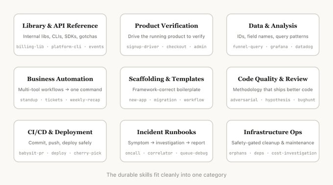
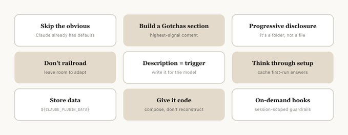
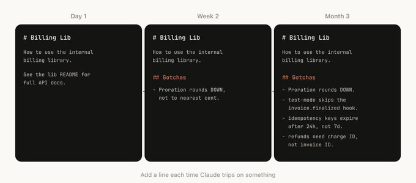
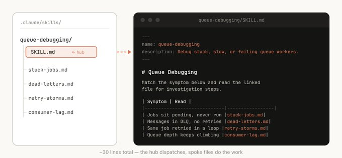
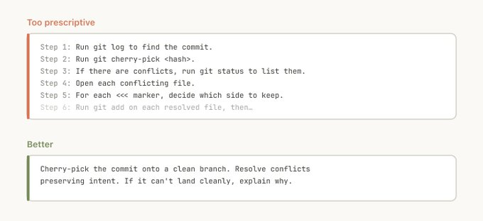
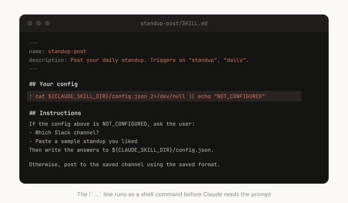
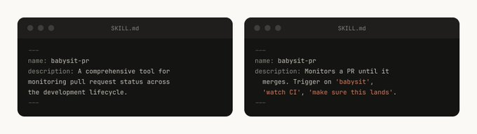
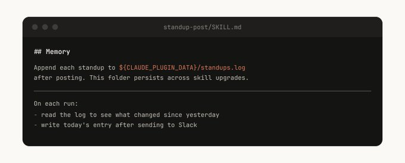
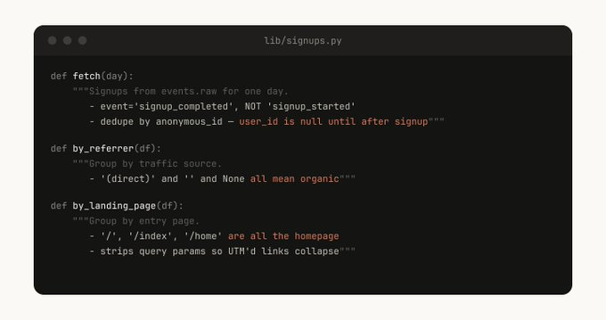
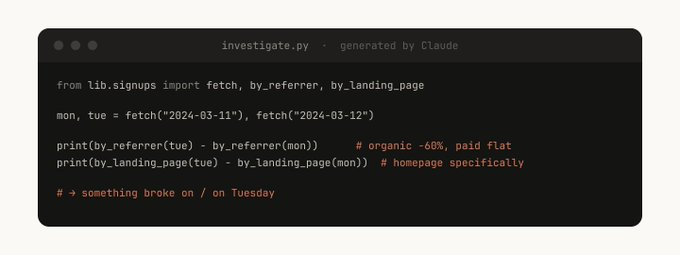

# 构建 Claude Code 的经验教训：我们如何使用 Skills

Skills 已经成为 Claude Code 中最常用的扩展点之一。它们灵活、易于制作，且分发简单。

但这种灵活性也导致很难知道哪种方式最有效。哪些类型的 skill 值得制作？编写一个优秀 skill 的秘诀是什么？你何时与他人分享它们？

在 Anthropic，我们在 Claude Code 中广泛使用了 skills，活跃使用的有数百个。以下是我们利用 skills 加速开发所学到的经验教训。

关于 skills，我们常听到的一个误解是，它们“只是 Markdown 文件”。但 skills 最有趣的部分恰恰在于它们**不仅仅是文本文件**。它们是**文件夹**，里面可以包含脚本、静态资源、数据等，Agent 可以发现、探索并操作它们。

在 Claude Code 中，skills 也有一个配置文件，包括注册动态 Hook（钩子）。

我们发现，Claude Code 中一些最有趣的 skills 就是创造性地利用了这些配置选项和文件夹结构。

在对我们所有的 skills 进行分类后，我们注意到它们聚集在几个重复出现的类别中。最好的 skill 能干净利落地归入其中一类；那些令人困惑的 skill 往往跨越多个类别。这并不是一个绝对的清单，但它是思考你的组织内部是否缺少某些功能的绝佳方式。

*   **API / Library Instructors (API/库 指导)**
    解释如何正确使用某个库、CLI 或 SDK 的 skills。这既可以针对内部库，也可以针对 Claude Code 有时会遇到困难的公共库。这些 skills 通常包含一个装有参考代码片段的文件夹，以及一个让 Claude 在编写脚本时避坑的 "gotchas"（陷阱）列表。
    *例子：*
    *   `billing-lib` — 你们的内部计费库：边缘情况、容易踩坑的地方等。
    *   `internal-platform-cli` — 内部 CLI 包装器的每个子命令及其使用场景示例。
    *   `frontend-design` — 让 Claude 更懂你们的设计系统。

*   **Verification / Testing (验证 / 测试)**
    描述如何测试或验证你的代码是否正常工作的 skills。它们通常与外部工具（如 Playwright, tmux 等）配合使用来进行验证。
    验证 skills 对于确保 Claude 的输出正确极其有用。让一名工程师花一周时间专门把你们的验证 skills 做到极致是非常值得的。
    考虑使用一些技巧，比如让 Claude 录制其输出的视频，以便你能准确看到它测试了什么，或者在每个步骤对状态强制执行编程式的断言。这通常通过在 skill 中包含各种脚本来实现。
    *例子：*
    *   `signup-flow-driver` — 在无头浏览器中跑通“注册 → 邮件验证 → 新手引导”流程，并带有在每步断言状态的 Hooks。
    *   `checkout-verifier` — 使用 Stripe 测试卡驱动结账 UI，验证发票确实落入正确状态。
    *   `tmux-cli-driver` — 用于交互式 CLI 测试，当你验证的东西需要 TTY 时。

*   **Data / Observability (数据 / 可观测性)**
    连接到你们的数据和监控技术栈的 skills。这些 skills 可能包含带有凭证的库来获取数据、特定的仪表板 ID，以及有关常见工作流或获取数据方式的说明。
    *例子：*
    *   `funnel-query` — “我应该联接（join）哪些事件来查看 注册 → 激活 → 付费” 以及实际包含规范用户 ID 的表格。
    *   `cohort-compare` — 比较两个群组的留存率或转化率，标记出具有统计学显著性的差异，链接到受众定义。
    *   `grafana` — 数据源 UID，集群名称，从问题到仪表板的查找映射表。

*   **Workflow Automation (工作流自动化)**
    将重复性工作流自动化为一条命令的 skills。这些 skills 通常包含相当简单的指令，但可能对其他 skills 或 MCP 具有更复杂的依赖关系。对于这些 skills，将之前的结果保存在日志文件中，有助于模型保持一致性，并反思该工作流先前的执行情况。
    *例子：*
    *   `standup-post` — 汇总你的工单追踪器、GitHub 活动以及之前的 Slack 发言 → 格式化的站会汇报，仅包含增量变化。
    *   `create-<ticket-system>-ticket` — 强制执行结构规范（有效的枚举值，必填字段）以及创建后的工作流（通知审查者，在 Slack 中放链接）。
    *   `weekly-recap` — 已合并的 PR + 已关闭的工单 + 部署记录 → 格式化的每周回顾帖子。

*   **Generators / Scaffolding (生成器 / 脚手架)**
    为代码库中的特定功能生成框架样板代码的 skills。你可以将这些 skills 与可组合的脚本结合起来。当你的脚手架有自然语言需求，无法纯粹通过代码满足时，它们尤其有用。
    *例子：*
    *   `new-<framework>-workflow` — 搭建带有你的注释的新服务/工作流/处理程序。
    *   `new-migration` — 你的数据库迁移文件模板加上常见的陷阱。
    *   `create-app` — 新的内部应用程序，已预先连接好你们的身份验证、日志记录和部署配置。

*   **Quality Checkers (质量检查器)**
    强制执行组织内部代码质量并帮助审查代码的 skills。为了获得最大的稳健性，它们可以包含确定性的脚本或工具。你可能希望将这些 skills 作为 Hooks 的一部分或在 GitHub Action 中自动运行。
    *例子：*
    *   `adversarial-review` — 生成一个拥有“全新视角”的子 Agent 进行批评，实施修复，不断迭代直到发现的问题降级为吹毛求疵。
    *   `code-style` — 强制执行代码风格，尤其是那些 Claude 默认表现不佳的风格。
    *   `testing-practices` — 有关如何编写测试以及测试什么的指南。

*   **Operations (运维操作)**
    帮助你在代码库内部获取、推送和部署代码的 skills。这些 skills 可能引用其他 skills 来收集数据。
    *例子：*
    *   `babysit-pr` — 监控 PR → 重试不稳定的 CI → 解决合并冲突 → 启用自动合并。
    *   `deploy-<service>` — 构建 → 冒烟测试 → 渐进式流量上线并进行错误率比较 → 发生退化时自动回滚。
    *   `cherry-pick-prod` — 隔离的工作树 → cherry-pick → 解决冲突 → 使用模板创建 PR。

*   **Investigation / Debugging (调查 / 调试)**
    接收一个症状（例如 Slack 线程、警报或错误签名），带领进行多工具的调查，并生成一份结构化报告的 skills。
    *例子：*
    *   `<service>-debugging` — 将症状映射到工具，针对你高流量服务的查询模式。
    *   `oncall-runner` — 获取警报 → 检查常见嫌疑项 → 格式化发现的问题。
    *   `log-correlator` — 给定一个请求 ID，从每一个可能接触过它的系统中提取匹配的日志。

*   **Maintenance / Cleanup (维护 / 清理)**
    执行日常维护和操作程序的 skills——其中一些涉及破坏性操作，能受益于护栏（guardrails）保护。这使得工程师更容易在关键操作中遵循最佳实践。
    *例子：*
    *   `<resource>-orphans` — 找到孤立的 pods/volumes → 发布到 Slack → 等待确认期 → 用户确认 → 级联清理。
    *   `dependency-management` — 你们组织的依赖关系审批工作流。
    *   `cost-investigation` — “为什么我们的存储/出口账单激增”，包含特定的存储桶和查询模式。

一旦你决定了要制作的 skill，你该如何编写它？以下是我们发现的一些最佳实践、提示和技巧。

**聚焦于改变 Claude 的想法**
Claude Code 对你的代码库了解很多，而 Claude 对编程了解很多，包括许多默认的观点。如果你要发布一个主要关于知识的 skill，尽量**聚焦于那些能把 Claude 推出其常规思维模式的信息**。

例如 Tailwind 设计 Skill 这是一个很好的例子——它是 Anthropic 的一位工程师通过与客户不断迭代，旨在提高 Claude 设计品味而构建的，使其避开像 Inter 字体和紫色渐变这类老套的模式。

**“Gotchas (踩坑点)”是信号最强的上下文**
任何 skill 中最具价值的内容就是 Gotchas 部分。这些部分应该基于 Claude 在使用你的 skill 时遇到的常见故障点来构建。理想情况下，你将随着时间的推移更新你的 skill，以捕捉这些踩坑点。

**充分利用整个文件系统**
正如我们前面所说，一个 skill 是一个文件夹，不仅仅是一个 markdown 文件。你应该将整个文件系统视为一种“上下文工程（context engineering）”和“渐进式披露（progressive disclosure）”的形式。告诉 Claude 你的 skill 中有哪些文件，它会在适当的时候去读取它们。

渐进式披露最简单的形式是指出供 Claude 使用的其他 markdown 文件。例如，你可以将详细的函数签名和使用示例拆分到 `references/api.md` 中。

另一个例子：如果你的最终输出是一个 markdown 文件，你可以在 `assets/` 文件夹中包含一个模板文件供它复制和使用。

你可以建立包含参考资料、脚本、示例等的文件夹，这能帮助 Claude 更有效地工作。

**不要过度规定 (Don't overprescribe)**
Claude 通常会尽量遵循你的指示，由于 Skills 具有极高的可重用性，你会希望小心，不要在你的指令中规定得过于死板。给 Claude 它所需要的信息，但同时赋予它适应情况的灵活性。

**使用用户输入配置 Skills**
某些 skills 可能需要使用来自用户的上下文进行设置。例如，如果你正在制作一个将你的站会汇报发布到 Slack 的 skill，你可能希望 Claude 询问应该发布到哪个 Slack 频道。

一个好的模式是将此设置信息存储在 skill 目录下的 `config.json` 文件中。如果配置尚未设置，Agent 可以向用户询问信息。如果你希望 Agent 提出结构化的、多项选择题，你可以指示 Claude 使用 `AskUserQuestion` 工具。

**撰写优秀的描述 (Descriptions)**
当 Claude Code 启动一个会话时，它会建立一个包含所有可用 skill 及其描述的列表。这个列表就是 Claude 用来扫描并决定“针对这个请求是否有合适的 skill？”的地方。这意味着 **description 字段不是一个摘要——它是关于何时应该触发该 skill 的描述。**

**带有记忆的 Skills**
一些 skills 可以通过在内部存储数据来包含一种形式的记忆。你可以将数据存储在像纯文本追加日志文件或 JSON 文件这样简单的东西中，或者像 SQLite 数据库那样复杂的东西中。

例如，一个 `standup-post` skill 可能会保留一个 `standups.log`，记录它写过的每一篇帖子。这意味着下次你运行它时，Claude 会读取自己的历史记录，并能分辨出与昨天相比发生了哪些变化。

存储在 skill 目录中的数据可能会在你升级 skill 时被删除，所以你应该将其存储在一个稳定的文件夹中。目前，我们提供 `${CLAUDE_PLUGIN_DATA}` 作为每个插件存放数据的稳定文件夹。

**代码是最好的上下文**
你能给 Claude 的最强大的工具之一就是代码。提供脚本和库能让 Claude 将它的轮次花在组合编排上，决定下一步做什么，而不是重建枯燥的样板代码。

例如，在你的数据科学 skill 中，你可能有一个包含从事件源获取数据的函数的库。为了让 Claude 进行复杂的分析，你可以为它提供一组辅助函数：

然后，Claude 可以动态生成脚本来组合此功能，以执行更高级的分析。

**挂载到运行循环中 (Hook into the loop)**
Skills 可以包含 Hook，这些 Hook 仅在调用 skill 时才被激活，并在整个会话期间持续存在。将其用于那些你不想让它一直运行，但在特定时候非常有用、带有主观倾向的 Hook。

例如：
*   `/careful` — 通过 Bash 上的 PreToolUse 匹配器，拦截阻止 `rm -rf`、`DROP TABLE`、`force-push`、`kubectl delete`。你只希望在明确知道自己在接触生产环境时开启它——如果一直开着，会把你逼疯的。
*   `/freeze` — 拦截不在特定目录中的任何编辑/写入操作。在调试时非常有用：“我想加点日志，但我总是无意中‘修复’了不相关的代码。”

Skills 最大的好处之一是，你可以与团队的其他人分享它们。

*   将你的 skills 提交到代码库中（放在 `./.claude/skills` 下）。
*   制作一个插件，并拥有一个 Claude Code Plugin 市场，用户可以在那里上传和安装插件。

对于在较少代码库上工作的小型团队，将 skills 提交到代码库中效果很好。但每个提交的 skill 也会稍微增加模型的上下文。随着你的扩张，一个内部插件市场允许你分发 skills，并让你的团队决定安装哪些。

你如何决定哪些 skills 进入市场？人们如何提交它们？我们没有一个集中决策的团队；相反，我们尝试有机地找到最有用的 skills。一旦一个 skill 获得了关注度，所有者就可以提交 PR 将其移入市场。

这更像是一个我们见证过有效的实用技巧大杂烩，而不是一份确定的指南。理解 skills 的最好方法是开始动手，进行实验，看看什么对你有用。我们的大多数 skills 都是从几行代码和一个 Gotcha 开始的，并随着 Claude 遇到新的边缘情况，人们不断向其添加内容而变得更好。