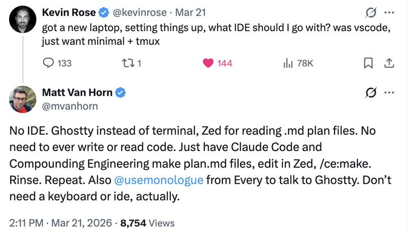
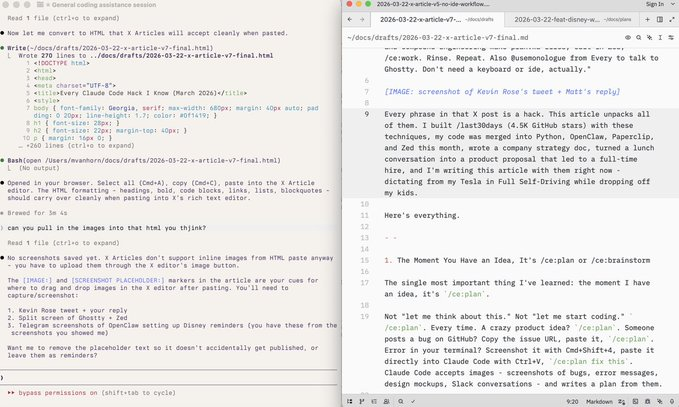
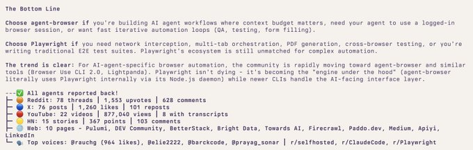
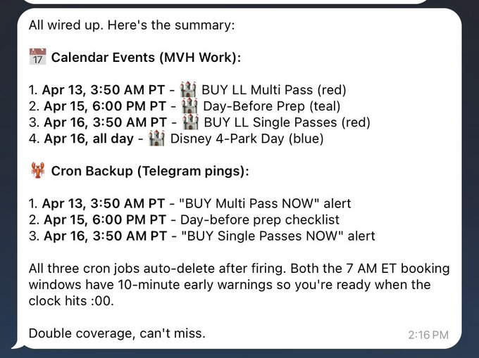

# 我所知道的每一个 Claude Code 技巧 (2026年3月)

有人问我该用什么 IDE（集成开发环境）。在 128 个回答中，我的回复获得了最多的互动：“不用 IDE。只需要 plan.md 文件和语音。” 以下就是我这句话的全部含义。

[](https://x.com/mvanhorn/article/2035857346602340637/media/2035845781425643520)

## /ce:plan 循环

我学到的最重要的一件事：每当我有了一个想法，第一反应就是 `/ce:plan`。

不是“让我考虑一下”。不是“让我开始写代码”。而是 `/ce:plan`。每一次都是。一个疯狂的产品想法？`/ce:plan`。有人在 GitHub 上提了个 Bug？复制 issue 链接，粘贴，`/ce:plan`。终端里报错了？用 Cmd+Shift+4 截图，用 Ctrl+V 直接粘贴到 Claude Code 里，`/ce:plan fix this`（制定计划修复这个）。Claude Code 接受图片——Bug 截图、错误信息、设计草图、Slack 对话——并能根据这些图片编写计划。

当你运行它时，底层会发生这些事情。`/ce:plan` 会并行启动多个研究 Agent。一个 Agent 分析你的代码库——阅读你的文件，寻找模式，检查你的代码规范。另一个 Agent 搜索你的文档/解决方案，从过去的 Bug 中提取经验。如果主题需要，还会有更多 Agent 去研究外部的最佳实践和框架文档。所有这些都是同时进行的。

然后，它会将这些信息整合，并写出一份结构化的 `plan.md`：哪里出了问题，该采取什么方法，需要修改哪些文件，带有复选框的验收标准，以及从你自己代码中提取的应遵循的模式。这不是泛泛而谈的建议，而是扎根于你的代码库、你的规范、你的历史记录。

`/ce:work` 则会拿到这份计划并开始构建。将计划拆分为具体任务，逐个实现，运行测试，并勾选验收标准。上下文丢失了？开启一个新会话，将其指向这份计划，从上次中断的地方继续。这份计划是能在任何情况中存活下来的“检查点（checkpoint）”。

传统的开发是 80% 写代码，20% 做计划。这个流程将其反转了。正如有人所说：“如果你花 80% 的时间用 Opus 做计划，然后让子 Agent 群去执行……” 思考的过程发生在做计划时，执行的过程则变成机械式的了。

Compound Engineering 是让这一切成为现实的插件：

```bash
/plugin marketplace add EveryInc/compound-engineering-plugin
```

我成了它的超级粉丝。然后我成了贡献者，在 GitHub 上排名第三的贡献者，提交了 21 次 commit，仅次于核心团队。

在我的 `/last30days` 记录里，我有 70 个 plan 文件和 263 次 commit。中间的差距是我在养成这个纪律之前的早期提交。我现在给自己定的规矩是：除非它真就是只改一行代码的事，否则一定要先有 `plan.md`。

## 语音输入

在大语言模型（LLM）出现之前，我根本无法忍受语音备忘录。苹果自带的听写功能常让我有摔手机的冲动。但“语音到 LLM”不一样了。转录不需要完美，因为 Claude Code 理解上下文。它能猜出麦克风听错了什么。你可以含糊其辞，可以说到一半没声音，可以重新开始一个句子。语音输入终于变得好用了，因为倾听者足够聪明，能够填补空白。

Monologue（来自 Every —— 也是制作 Compound Engineering 的那家公司）能将语音直接输入到当前聚焦的应用程序中。你说话，它就在 Claude Code 里打字。WhisperFlow 也非常棒。挑一个用就行。我在办公室买了一个鹅颈麦克风。

此刻我正坐在开启了全自动驾驶（FSD）的特斯拉里，在送孩子上学的路上口述这段话。这一段是说出来的，不是打出来的。

## 并行会话

这其实就是我一整天的工作方式。四到六个 Ghostty 窗口，每个窗口运行一个独立的 Claude Code 会话。一个在写计划。一个在根据另一份计划写代码。一个在运行 `/last30days` 研究。还有一个在修复我在测试上一个功能时发现的 Bug。

当 `/ce:plan` 在一个窗口中启动研究代理时，我切换到另一个窗口，对一份已经写好的计划执行 `/ce:work`。当它在构建时，第三个窗口会贴入一个新的 Bug。等我循环回到第一个窗口时，计划已经完成并在 Zed 编辑器中等我了。

这就是为什么“绕过权限（bypass permissions）”（下一节会讲）是不可妥协的。如果每个会话在执行每个操作时都问你“是否允许？”，你就无法进行上下文切换。它们都需要自主运行。你只需要查看、反应、然后继续。如果你弄坏了什么或者把一切都搞砸了，反正还有 GitHub 兜底。

这也是为什么我的 MacBook 续航只有大概一小时。六个 Claude 会话并行运行。刚下单了新款 MacBook Pro。

## 三个配置更改

Claude Code 的默认模式会对每一次编辑、每一个命令都请求权限。你需要修改三个配置。

1. “危险地跳过权限”（是的，它实际上就叫这个名字）。修改 `~/.claude/settings.json`：

```json
{ 
  "permissions": { 
    "allow": [ "WebSearch", "WebFetch", "Bash", "Read", "Write", "Edit", "Glob", "Grep", "Task", "TodoWrite" ], 
    "deny": [], 
    "defaultMode": "bypassPermissions" 
  }, 
  "skipDangerousModePermissionPrompt": true 
}
```

`skipDangerousModePermissionPrompt: true` 是关键。没有它，Claude 在每个会话中都会要求你确认。你也可以按 Shift+Tab 来切换它。当我在帮朋友设置 Claude Code 时，AI 会主动尝试阻止他开启这个功能。你必须非常强硬，这是你的电脑。

2. 当 Claude 完成时播放声音。在同一个文件中添加：

```json
{ 
  "hooks": { 
    "Stop": [ 
      { "hooks": [ { "type": "command", "command": "afplay /System/Library/Sounds/Blow.aiff" } ] } 
    ] 
  } 
}
```

去干点别的，听到声音再回来。当有四到六个会话同时运行时，你需要知道刚才是哪一个完成了。

3. Zed 自动保存。在 Zed 设置（Cmd+,）中：

```json
{ "autosave": { "after_delay": { "milliseconds": 500 } } }
```

这是一个类似 Google Docs 的技巧。Zed 每 500 毫秒保存一次。Claude Code 会监控文件系统。当 Claude 编辑文件时，更改会立即显示在 Zed 中。当你在 Zed 中打字时，Claude 也能在一秒内看到。屏幕一半是 Ghostty，另一半是 Zed，两者都看着同一个文件。感觉就像是在 Google Doc 上协作，只不过其中一个协作者是 AI。

[](https://x.com/mvanhorn/article/2035857346602340637/media/2035847470350278656)

## /last30days 研究循环

在运行 `/ce:plan` 之前，我通常会先跑一遍 `/last30days`。

当时我正在 Vercel 的 agent-browser 和 Playwright 之间做选择。我没有去读文档，而是运行了 `/last30days Vercel agent browser vs Playwright`。几分钟内：找出了 78 个 Reddit 帖子，76 篇 X 推文，22 个 YouTube 视频，15 篇 Hacker News 报道。Agent-browser 消耗的上下文 token 减少了 82-93%。而 Playwright 光是工具定义就会消耗 13,700 个 token。

我把整个输出结果喂给 `/ce:plan integrate agent-browser`（制定计划集成 agent-browser）。出来的计划是基于社区当前真正了解的情况，而不是六个月前的训练数据。

`/last30days` 是开源的（拥有 4.5K 颗星）。它会并行搜索 Reddit、X、YouTube、TikTok、Instagram、Hacker News、Polymarket 以及整个网络。我做任何事情都会用它。在选择库之前，在构建功能之前，在写这篇文章之前。我运行了 `/last30days Compound Engineering` 来获取第一节中最新的社区引言。研究、计划、构建。这才是真正的循环。

[](https://x.com/mvanhorn/article/2035857346602340637/media/2035838382522400769)

## 从会议记录到产品提案

我和一位潜在的求职候选人吃了午饭。我们讨论了一个公司尚未进行的新产品想法。我们也聊了食物、餐厅、孩子。一个半小时的普通对话，穿插着产品头脑风暴。

我一直开着 Granola。午餐后，我把完整的逐字稿——九十分钟包含讨论寿司等各种跑题内容的对话——粘贴到 Claude Code 中：`/ce:plan turn this into a product proposal`（制定计划，把这个变成产品提案）。

这里的奇妙之处在于：Claude Code 已经知道我们的产品代码在 GitHub 的什么位置。它还能访问我公司的战略文件夹——也就是我写过的每一个之前的战略 `plan.md`。所以当它处理 Granola 的逐字稿时，它不仅仅是从午餐对话中提取想法。它是在与我们实际的代码库和我之前做过的每一个战略决策进行交叉对比。Granola 上下文 + 代码库 + 之前的战略计划 = 黄金。

一次就生成了一份令人惊叹的提案。包含目标、用户故事、技术方案、里程碑。忽略了关于餐厅的部分。当天晚上我就把提案发给了那位候选人。他现在已经在我们公司全职负责那个产品了。

Granola 现在支持了 MCP，所以我可以直接在 Claude Code 内部使用它。不再需要复制粘贴。每次会议的上下文都会直接流入计划中。

## 写作工作流

我当时在为公司写一份战略文档。Claude Code 和 markdown 文件并排打开。我对着 Monologue 说：“给我三个推向市场（GTM）的策略。列出每个策略的优缺点。”

Zed 中出现了三个选项。“第二个选项最接近，但第一个选项的措辞更好。把它们结合起来。”它瞬间更新了。“现在，加入最大的风险。”添加了。“第二段太长了。”缩短了。

Claude Code 会拉取我们的 GitHub，所以它了解当前的产品。它也有权限访问我之前所有的战略 `plan.md` 文件。当我在写新的产品定位时，它拥有我以前做过的每一个战略决策的完整上下文。这种不断复利的上下文，使得每一个计划都比上一个更好。

战略文档、产品规格说明书、竞品分析、甚至这篇文章。用的都是同一个工作流。对话、计划、迭代。

## Mac Mini 设定

我有一台专为 OpenClaw 设置的 Mac Mini，但除此之外我还用它做了两件事：

1. **在手机上使用 Telegram**。Claude Code 有 Telegram 集成。我通过手机上的 Telegram 给我的 Mac Mini 发消息。在吃晚饭时想到一个 Bug，在 Telegram 里输入 `/ce:plan fix the timeout issue`。等我回到屏幕前时，计划已经在 Zed 里等我了。当我不在电脑前时，Claude Code 甚至会使用我的 OpenClaw AgentMail 把计划文件邮件发给我。

2. **在飞机航班上使用 tmux**。Claude Code 处理飞机 Wi-Fi 的效果很差。连接断开，会话死亡，它甚至都不会告诉你。但如果先通过 tmux 连接到你的 Mac Mini，会话就会在那台机器上运行。你的笔记本只是一块显示屏。飞越大西洋时 Wi-Fi 断了 20 分钟？重新连接。会话就在你离开的地方，而且它确实在工作。我在从欧洲回来的整个航班上都在发布新功能。

## 最终产出

如果你看我的 GitHub 主页，以下是我最近被合并的一些项目，所有这些项目在写任何一行代码之前都有 `plan.md` 文件：
*   Python - defaultdict repr 无限递归问题，man page 文本换行
*   OpenCV - HoughCircles 返回类型，YAML 解析器堆溢出问题
*   Vercel Agent Browser - Appium v3 供应商前缀，WebSocket 降级处理，批量命令工作流（排名第5的贡献者）
*   OpenClaw - browser relay，限流用户体验，iMessage 投递，Codex 沙盒检测，语音通话
*   Zed - _LANGUAGE task 变量，在访达中显示选项卡上下文菜单，git 面板 starts_open 设置
*   Paperclip - SPA 路由，插件领域事件，promptfoo 评估框架（排名第3的贡献者）
*   Compound Engineering - 计划门控机制，串行审查模式，skills 迁移，NTFS 冒号处理（排名第3的贡献者）

## 妻子的问题

我走到哪都带着笔记本电脑。开着四到六个 Ghostty 标签页和 Zed。我妻子对此很不满。Mac Mini + Telegram 确实有所帮助。但当我希望多个计划实时并行演进时，我需要这台笔记本。她真的非常希望我别在送孩子上学时也带着它。

抱歉啦，亲爱的。

这是 Zed 里的一个 markdown 文件。Claude Code 正在 Ghostty 中运行。我对着 Monologue 说：“主题不对，重写开头。”“加上 Granola 的故事。”“不要把 Zed 叫做我的 IDE。” Claude 进行重写。更改出现在 Zed 中。我给出反馈。经历了七次彻底的重写。

这就是我所知道的全部。一个语音应用，一个计划文件插件，三个配置更改，四到六个并行会话，一台 Mac Mini，以及能变成产品提案的会议。不需要 IDE。不需要写代码。对话、计划、构建。无论是在办公桌前，沙发上，还是在车里。

## 双套餐配置

这种效率会迅速耗尽你 $200/月 的 Claude Max 套餐额度。一整天运行四到六个并行的 Opus 会话，消耗累积得很快。

解决方案是：同时购买 $200/月 的 Codex 套餐。安装 Codex CLI，然后 Compound Engineering 就可以使用 Codex 的额度进行构建了。我刚刚向 Compound Engineering 提交了 `/ce:work --codex` 功能——今天刚合并——当 Claude 额度不足时，它可以将实现任务委托给 Codex。

一些朋友使用 Codex 来对 Claude Code 的工作进行代码审查，反之亦然。另一些人更喜欢 Codex 的代码输出，但从 Claude Code 中调用它来进行编排。这两个套餐互为补充。Claude 用于做计划，Codex 用于繁重的代码实现。

## “非代码”示例：迪士尼世界

为了从头到尾展示这个工作流在非代码领域的应用，这里有一个今天的真实例子。我在足球场看孩子比赛。另一位家长和我在聊去迪士尼世界的旅行。我拿出笔记本电脑展示给她看。

**第 1 步：** `/last30days Disney World`。两分钟后，全貌就出来了。66 个 Reddit 帖子（11,804 次点赞），34 篇 X 推文，8 个 YouTube 视频。“价格震惊”是主要的讨论话题——r/DisneyPlanning 上一篇花费 $8,500 的游记获得了 183 条评论。仅 3 月份就有六个游乐设施关闭。巴斯光年星际历险将于 4 月 8 日带着新激光枪重新开放。摇滚过山车变成了布偶家族主题。恐龙世界已经被拆除。

**第 2 步：** “具体来说，4月16日 Pairl（拼写错误）会有什么开放/不开放”（错字连篇——CC 根本不在乎）。Claude 查看了翻新日历，与 last30days 的数据交叉比对，给了我完整的开放/关闭清单。

**第 3 步：** `/ce:plan 我要在迪士尼世界待一天。我想至少玩三个乐园，也许四个……` 加上：“怎样规划能买到所有的 Genie Plus…… 帮我设置提醒。”
Claude 的研究代理运转起来，与 last30days 的数据交叉比对，写出了一份结构化的 `plan.md`：游园顺序（动物王国 -> 好莱坞影城 -> 艾波卡特 -> 魔法王国），精确的 Lightning Lane 预订策略，针对 4 月 13/14/15 日早上 7:00 的三个闹钟提醒，哪些设施需要 Single Pass（每个 $14-22）以及哪些需要 Multi Pass，孩子们的最低身高要求。

**第 4 步：** 在 Zed 中打开这份计划进行检查。然后为了帮另一位家长做计划，我说道：“我要去迪士尼世界旅行，要在乐园待三天。告诉我最高效的路线……” Claude 写了一份 305 行的新计划，包含骑士轮流（Rider Switch）协议、每日行程，以及一条“这周记得量一下你 5 岁孩子穿鞋的身高”的警告。

**第 5 步：** “csn you push你能把最后这个发布在 Vercel 网站上并设为浅色模式吗？” Claude 构建了一个干净的 HTML 页面并将其部署了上去。

**第 6 步：** 通过 Telegram 把 `.md` 文件拖入 OpenClaw。说“你能做个计划把这些提醒全加给你自己吗，并且加上双重保险……” OpenClaw 读取了计划，在我的工作日历上设置了事件，并在后台设置了 cron 定时任务通过 Telegram 提醒我。每个关键预订窗口都有双重保障。4 月 13 日太平洋时间凌晨 3:50：“现在立刻买 Multi Pass。” 4 月 16 日凌晨 3:50：“现在立刻买 Single Passes。” 两个都在美东时间早上 7 点抢票窗口开启前 10 分钟触发。触发后自动删除。

[](https://x.com/mvanhorn/article/2035857346602340637/media/2035838219712135168)

从语音输入，到研究，到制定计划，到生成网站，再到自动提醒。这一切都在一个足球场上完成。

这就是那个工作流。它适用于写代码、制定战略、开源项目、写文章，显然也适用于迪士尼世界。