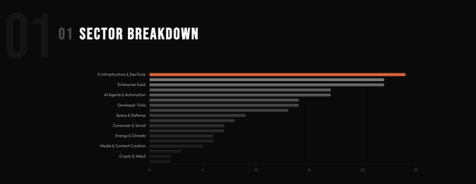
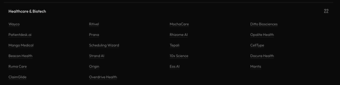

# Chris Lu on X: "I analyzed all YC W26 companies: Here's what it tells us about the future."

I just analyzed all the companies in YC's W26 batch: every pitch, every sector, every founding team.

85% are AI-first. a third are building agents. and 3 separate startups are literally calling themselves "Claude Code for X."

here's what this batch tells us about where the world is actually heading:

56 out of 198 companies are building AI agents. not chatbots. not copilots. fully autonomous agents that do the job.

AI sales reps that run outbound (Cardinal). AI SRE engineers that fix production incidents alone (IncidentFox). AI accountants that close books without human touch (Balance, FullSeam). AI law firms staffed entirely by models (General Legal, Vector Legal).

the pattern is obvious: every $50k-$150k/yr knowledge worker role is getting an AI agent pointed at it.

and the companies aren't shy about it. their pitches don't say "AI-assisted" or "AI-powered." they say "AI employee." "AI teammate." "AI operator."

the copilot era lasted about 18 months. we're in the replacement era now.

22 companies. more than any other sector. and they're attacking from every angle:

*   AI primary care doctors in your pocket (Prana)

*   AI medical billing that replaces entire rev cycle teams (Overdrive Health)

*   AI surgical planning from CT scans (Mango Medical)

*   AI that simulates human biology to discover drugs (CellType)

*   AI voice agents handling every patient call

*   digital twins of human bodies (Mantis)

healthcare has always been "the next big thing" for tech. but this batch feels different. these aren't EHR wrappers or appointment booking apps. they're going after the clinical work itself.

the unlock: LLMs can finally read, reason about, and generate medical-grade text. that wasn't true 2 years ago.

3 companies explicitly position as "Claude Code for Mechanical Engineers" (Aurorin CAD, REV1) and "Claude Code for Science" (Synthetic Sciences).

but zoom out and you see the deeper pattern — the entire batch is "vertical AI coding agent for [industry]."

Avoice is "Harvey for Architecture." Polymath is "Applied Intuition for AI agents." Terminal Use is "Vercel for background agents."

the formula: take a horizontal AI breakthrough → compress it into a vertical workflow → own the domain.

this is the most reliable company-building pattern in the batch. it works because:

*   domain expertise creates moats that pure AI labs won't cross

*   vertical agents can own the full workflow, not just one step

*   customers pay for outcomes, not technology

if you're starting a company right now, the question is "what $200B industry has clunky software and expensive humans?"

13 robotics companies. and they're deploying.

robot cowboys herding cattle with AI drones (GrazeMate). robots running autonomous depots (RoboDock). manipulation robots in warehouses (Remy AI). robots deployed in factories (Servo7).

there's also a full ecosystem forming around them:

*   human movement data for training humanoid robots (Asimov)

*   world models for robot evaluation (One Robot)

*   multimodal data infrastructure for robotics (Human Archive)

the picks-and-shovels play for physical AI is happening in parallel with the applications. that's how you know it's real.

9 space and defense companies. not the usual satellite plays.

*   space solar arrays the size of football fields (Beyond Reach Labs)

*   "the intergalactic construction company of earth" (GRU Space)

*   AI drone systems for defense (Seeing Systems)

*   drone detection tech (DroneTector)

*   autonomous drone networks for earth observation (Voltair)

space + defense + drones is becoming a single category. and the companies entering aren't government contractors — they're startups moving at startup speed.

there's a meta-layer forming around AI agents that mirrors what happened with cloud:

*   identity: Okta for agents (Agentic Fabriq)

*   security: enterprise-grade security for AI agents (Clam)

*   guardrails: validate agent actions before execution (Salus)

*   monitoring: production monitoring for AI agents (Sentrial, Moda)

*   orchestration: the reliability layer agents need (Cascade)

*   payments: financial infrastructure for the agent economy (Sponge)

when you need identity, security, monitoring, and payments for a new category of software

27 solo founders in the batch building:

*   AI-powered uranium exploration (Terranox AI)

*   an AI primary care practice (Eos AI)

*   foundation model interpretability research (Envariant)

*   an AGI lab (Ndea, founded by François Chollet)

*   global file upload infrastructure (Byteport)

Ambitious projects: one person with the right tools can now build what took a team of 10 three years ago.

17 fintech companies. but almost none of them look like traditional fintech.

*   AI mortgage loan officers (Copperlane)

*   AI that closes books for high-volume payments companies (End Close)

*   agentic payments for APIs (Orthogonal)

*   payments infrastructure specifically for voice agents (Maven)

*   financial infrastructure for the agent economy (Sponge)

the common thread: fintech is rebuilding itself around the assumption that AI agents are the primary users, not humans.

payments for agents. lending by agents. accounting by agents. the financial stack is being redesigned from scratch.

here's what this batch is really telling us:

the AI agent is becoming the default unit of software. not an API. not a dashboard. not a SaaS tool. an agent that does the work.

168 out of 198 companies are AI-first. 56 are building agents specifically. and even the "non-AI" companies are building infrastructure that agents will use.

5 years from now, we'll look back at YC W26 the way we look back at the early cloud batches: the moment it became obvious that every company would be rebuilt around a new primitive.

the companies in this batch are betting that AI agents are the new employees, the new co-founders, and the new customers.

and based on what i'm seeing, they're right.