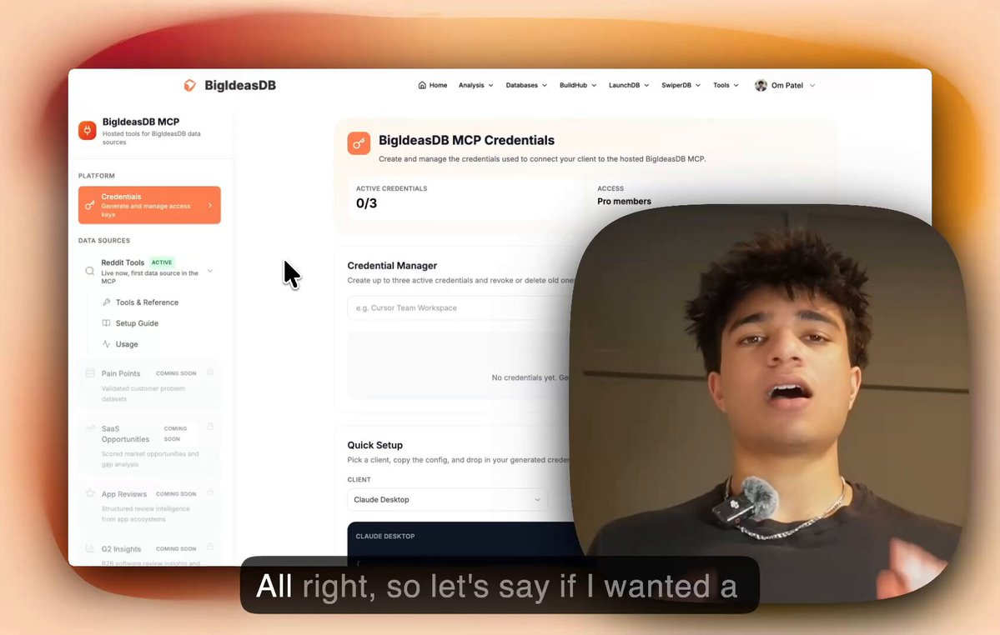
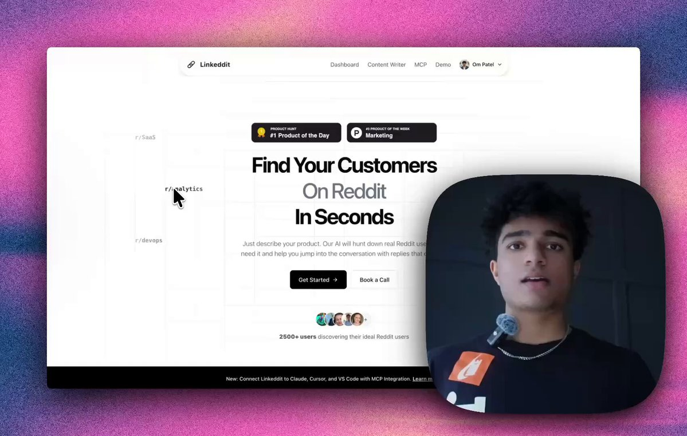

# Om Patel on X: "How I Find $10K MRR Startup Ideas With a Single MCP "

Every successful founder says the same thing: "build something people want."

Here's the exact process I use. It takes 10 minutes. And it's how I've found every idea I've built into a paying product.

Most founders brainstorm. They sit in the shower and think "wouldn't it be cool if..."

Cool for who? Who's paying?

Others use AI to generate ideas. They ask ChatGPT for "10 startup ideas in the fitness niche" and get back generic garbage that 10,000 other people also generated that same week.

Both approaches have the same flaw: you're guessing.

The founders actually making money aren't guessing. They're reading complaints from users across the internet.

Reddit has 500+ million monthly active users posting their unfiltered thoughts about every product, workflow, and frustration they experience.

When someone posts "I'm managing 40 clients through WhatsApp groups and it's complete chaos" in r/personaltrainers, that's a person who is actively frustrated and probably willing to pay for a better solution.

When 50 people across different subreddits complain about the same thing, that's a market signal that you're looking for.

The problem was always access. Reddit killed their free API in 2023 (and made it $12,000 annually).

If you wanted to search Reddit at scale you API keys, rate limit management, or expensive tools.

Not anymore.

I built a Reddit MCP (Model Context Protocol) server that gives any AI client direct access to Reddit search.

No Reddit API key. No PRAW. No code. No local server to run.

It's hosted. You paste one URL into your AI client settings and you're connected in 30 seconds.

It works with Claude Code, Claude Desktop, Cursor, ChatGPT, VS Code, Windsurf, JetBrains, Replit, and any MCP-compatible client.

Four tools available:

1.   search_reddit — keyword search across all of Reddit
2.   fetch_subreddit — pull top posts from any community
3.   fetch_post_comments — extract full comment threads
4.   fetch_reddit_json — raw Reddit data for any URL

Here's how to set it up and get it running in less than 4 minutes:

Om Patel
@om_patel5

HOW TO FIND A VALIDATED STARTUP IDEA IN UNDER 4 MINUTES most people brainstorm ideas in their head or AI generate them and that's why most people build things nobody wants. here's what actually works: step 1: pick a niche go to any subreddit in the niche that you're building

Now let me show you exactly how I use it to find validated startup ideas.

Don't overthink this. Pick any industry where software exists and people pay for it.

Some starting points:

*   r/marketing (complaints about marketing tools)
*   r/smallbusiness (workflow frustrations)
*   r/freelance (pain points freelancers face daily)
*   r/ecommerce (Shopify/Amazon seller problems)
*   r/realestateinvesting (investor workflow gaps)
*   r/accounting (software complaints)
*   r/fitness (app frustrations)

The more specific the subreddit, the more specific the pain points, the better the idea.

This is where the MCP does the heavy lifting.

Open Claude Code, Claude Desktop, Cursor, or whatever AI client you use. Make sure the MCP is connected (takes 30 seconds).

Then run prompts like:

"Search Reddit for complaints about project management tools in r/smallbusiness. Find posts where users are frustrated with existing solutions."

"Pull the top posts from r/marketing this month and identify recurring pain points."

"Search Reddit for 'wish there was a tool' and 'looking for a tool' in r/freelance."

"Fetch the comments from this thread and analyze what users are actually asking for."

The MCP searches Reddit in real time and brings back actual posts, comments, upvote counts, and discussion threads.

You're reading real users venting about real problems with real money on the table. It'll find problems that people are actually willing to pay for.

Now you have a pile of Reddit data. Posts, comments, complaint threads.

Now, ask AI to:

*   Find recurring pain points across all the threads
*   Identify which complaints show up in 5+ different posts (validation)
*   Give you startup ideas based on problems real users described
*   Link back to every post and comment it used as evidence
*   Estimate willingness to pay based on the language users use

The AI doesn't just summarize. It cross-references complaints across different posts, different subreddits, different users who don't know each other. When 50 strangers all describe the same frustration independently, that's a validated problem.

Not every complaint is a business. Here's how to filter:

The Validation Formula:

Complaints + Frequency + Willingness to Pay = Validated Idea

Your checklist:

*   30+ people with the same complaint = real problem
*   Already paying for alternatives = money on the table
*   Existing solution has an obvious flaw = your opening

Search for the tools people mention in their complaints. Go read the 1-star reviews on G2 and Capterra. If hundreds of people are paying for something they hate, that's your opening.

I ran the MCP on r/marketing and r/influencermarketing.

Asked Claude to search for pain points around managing brand deals and creator campaigns.

It came back with dozens of threads. Agency managers, creators, and brand operators all complaining about the same thing:

*   "Most of our tracking is still spreadsheets and endless email chains"
*   "Deals start in DMs or email and then just get messy"
*   "Everything breaks down once deals live in DMs/email and payment follow-up gets messy"

The same complaint across different subreddits, different users, different contexts.

Claude analyzed every thread and gave me 5 validated startup ideas with direct links to every post and comment. I picked the strongest one and had a full product plan with features, ICP, pricing strategy, and a 90-day roadmap in under 30 minutes.

The idea: an agency-first creator operations platform that centralizes briefs, approvals, assets, and payment tracking. Starting price $299-499/month for agencies.

I didn't brainstorm that. I didn't ask AI to generate it. Real users told me exactly what they needed. I just listened at scale.

When you spot a pattern, move fast. Others are reading the same complaints (but not like how you're reading them).

*   Week 1: Validate with 10 potential customers (DM the people who posted the complaints)
*   Week 2: Build the MVP
*   Week 3: Launch to the people who complained
*   Week 4: Iterate on their feedback

The people who posted those complaints on Reddit are your first beta users. They already told you what they want. Now go give it to them.

All those Reddit posts and comments you scraped to find the idea? Those are your first customers.

Every person who posted "our tracking is still spreadsheets and endless email chains" is someone you can DM the second your MVP is ready.

Here's the process:

1.   Save every relevant post and comment URL from your research
2.   Build the MVP (one weekend, keep it ugly. Focus only on one main feature and launch)
3.   Go back to every single person who complained and DM them:

"hey, saw your post about managing brand deals being chaos. i actually built something for this. would you be down to try it free and give me honest feedback?"

4.   Put every person who says yes on a free trial
5.   Onboard each one manually. get on a call. watch them use it. ask what's missing.

But here's where it gets even more powerful.

Use the MCP to run a weekly search for new people posting about the same problem:

"Search Reddit for agency owners complaining about managing creator campaigns, brand deal tracking, or influencer approvals"

Every week you get a fresh list of people who just described your exact product without knowing it exists.

DM every single one. Free trial. Manual onboarding. Repeat.

This is how you go from 0 to 50 paying customers without spending a dollar on ads. The people who complained on Reddit are the easiest customers you'll ever close. They already told you they have the problem. You just have to show up and hand them the solution.

I explained exactly how to set this system up in less than 5 minutes:

Om Patel
@om_patel5

HOW TO GET PAID USERS FOR YOUR STARTUP IN UNDER 5 MINUTES there are people on Reddit RIGHT NOW asking for exactly what you built. here's how to find them: step 1: pick the subreddits where your customers hang out r/smallbusiness, r/marketing, r/freelance, r/ecommerce,

Here are the exact prompts I run regularly to find new opportunities:

For pain point discovery: "Search r/[niche] for posts where users complain about [category] tools. Find recurring frustrations."

For competitor weakness analysis: "Search Reddit for '[competitor name] alternative' and '[competitor name] sucks'. What are users saying?"

For idea validation: "Pull every complaint about [tool category] across r/SaaS, r/smallbusiness, and r/entrepreneur. Cross-reference the complaints and give me validated product ideas."

For customer discovery: "Search Reddit for 'looking for a tool that' and 'is there a tool' in r/[niche]. Find people actively searching for a solution."

For content research: "Pull the top posts from r/[niche] this month. What topics are getting the most engagement? What questions keep coming up?"

Every complaint is someone saying "I'd pay for this to not suck."

Every negative review is a product spec written by your future customer.

Every "I wish" is an invoice waiting to be sent.

Stop brainstorming in the shower. Stop asking AI to generate ideas. Start reading what real people hate about real products.

Reddit is screaming what to build. A single MCP makes it possible to listen at scale.

Your next $10K MRR idea is sitting inside someone else's frustrated Reddit comment.

You just have to find it.