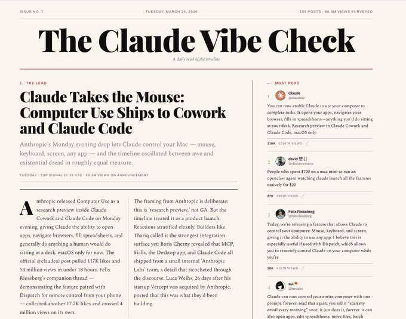
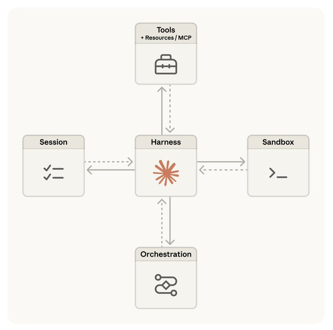

# 发布 Claude 托管智能体 (Launching Claude Managed Agents)

TL;DR – Claude Managed Agents (Claude 托管智能体) 是一个预先构建的、可配置的智能体运行框架 (agent harness)，在托管的基础设施中运行。你可以将智能体定义为一个模板——工具、技能、文件/仓库等。智能体框架和基础设施均由系统为你提供。该系统旨在跟上 Claude 快速增长的智能，并支持长周期任务。一些有用的链接：

* 使用模式和客户案例
* Claude Managed Agents 的设计
* 引导入门、快速入门、CLI 和 SDK 的概述

[](#)

## 为什么需要 Claude Managed Agents

Claude API 是通往模型的直接网关：它接收消息并返回内容块。基于 messages API 构建的智能体使用一个框架 (harness) 将 Claude 的工具调用路由到处理程序 (handlers) 并管理上下文 (context)。这带来了一些挑战：

* **框架需要跟上 Claude 的步伐** – 我最近写了一篇博客，重点介绍了如何使用 Claude API 原语构建智能体来处理工具编排和上下文管理。但是，智能体框架编码了关于 Claude “做不到什么”的假设。随着 Claude 变得更加强大，这些假设会变得过时，甚至可能成为 Claude 性能的瓶颈。框架需要不断更新以跟上 Claude 的步伐。
* **Claude 的运行时间越来越长** – Claude 的上下文窗口巨大，在 METR 基准测试上已经超过了 10 个人类工作小时。这给智能体周围的基础设施带来了压力：它必须是安全的、对长周期任务中发生的基础设施故障具有弹性，并且支持扩展（例如，扩展到许多智能体团队）。

解决这些挑战非常重要，因为我们期望未来的 Claude 能够连续数天、数周甚至数月地运行，以解决人类面临的重大挑战。Model Context Protocol (MCP) 是第一步，它提供了一个出色的通用智能体框架。Claude Managed Agents 是这一进程的下一步：一个包含框架和托管基础设施的系统，旨在支持在我们期望 Claude 工作的整个时间跨度内进行安全、可靠的执行。

## 如何开始使用

一个简单的入门方法是使用我们的开源技能 (skill)，它在 Claude Code 中开箱即用。获取最新版本的 Claude Code 并运行以下子命令，即可完成 Claude Managed Agents 的入门引导。我对使用技能作为熟悉新功能的方式感到非常兴奋，并且我自己也广泛使用了这个技能：

```bash
$ claude update
$ claude
/claude-api managed-agents-onboarding
```

也可以查看我们的文档，了解使用 SDK 或 CLI 进行快速入门的方法，以及查看原型智能体仓库。

## 使用场景 (Use cases)

你可以在我们的 Cookbook 中看到许多有趣的示例。在这些示例和我自己的工作中，我注意到了一些常见的模式：

* **事件触发 (Event-triggered)**：由服务触发托管智能体执行任务。例如，系统标记了一个 bug，托管智能体会编写补丁并开启 PR (Pull Request)。在标记和采取行动之间没有人工干预。
* **计划调度 (Scheduled)**：安排托管智能体执行任务。例如，我和许多其他人使用这种模式进行定期的每日简报（例如，X 或 Github 上的活动，或一个智能体团队正在做什么）。这里有一个我使用的每日 X 活动简报的例子。

[](#)

* **触发即遗忘 (Fire-and-forget)**：人类触发托管智能体去执行任务。例如，通过 Slack 或 Teams 将任务分配给托管智能体，并获取交付物（电子表格、幻灯片、应用程序等）。
* **长周期任务 (Long-horizon tasks)**：长时间运行的任务是我认为托管智能体会特别有用的领域。我通过复刻 Auto-Research 的 `auto-research` 仓库并探索一些不同的想法来研究这一点。例如，最近我拿了一篇出色的研究论文，让托管智能体探索如何将其应用于我们的工程博客内容。


## 核心概念 (Key concepts)

在入门时，有三个核心概念需要理解：

* **智能体 (Agent)** — 一个具有版本控制的配置，包含智能体的身份信息：模型、系统提示词、工具、技能、MCP 服务器等。你只需创建一次，并可以通过 ID 引用它。
* **环境 (Environment)** — 一个模板，描述了如何配置智能体的工具运行所在的沙箱（例如，运行时类型、网络策略和包配置）。
* **会话 (Session)** — 使用预先创建的智能体配置和环境进行的一次有状态的运行。它会根据环境模板配置一个全新的沙箱，挂载任何每次运行需要的资源（文件、GitHub 仓库），并将身份验证信息存储在安全的保管库中（MCP 凭证）。

你可以将智能体视为一种配置，将环境视为一个描述你希望智能体访问以执行代码的沙箱模板，将会话视为任何一次智能体的执行。一个智能体可以有许多个会话。

## 使用方法 (Usage)

请参阅此处的文档：

* **SDKs** – 这些是面向代码的：在你的应用程序中导入它们，以在运行时驱动会话。有六种语言支持 Managed Agents：Python、TypeScript、Java、Go、Ruby、PHP。
* **CLI** – 面向终端的：每一个 API 资源（agents, environments, sessions, vaults, skills, files）都作为子命令暴露出来。
* **常见模式 (Common patterns)** – 使用 CLI 进行设置，使用 SDK 进行运行。智能体模板是持久化的：你创建一个模板并保存它（例如，将包含模型、系统提示词、工具、MCP 服务器、技能的 YAML 文件保存在 git 中），然后让 CLI 在你的部署流水线中应用它。

## 工作原理 (How it works)

我和团队一起写了一篇关于构建 Claude Managed Agents 过程的 Anthropic 工程博客文章：我们在文章中分享的一个经验是，构建能够随着 Claude 的智能扩展的智能体是一个基础设施挑战，而不仅仅是框架设计的问题。

[](#)

考虑到这一点，我们没有设计一个特定的智能体框架；我们期望智能体框架会不断演进。相反，我们将我们认为是“大脑”（Claude 及其框架）的部分，与“双手”（沙箱和执行动作的工具）以及“会话”（会话事件的日志）解耦。

每一个部分都变成了一个接口，并且尽量少地对其他部分做假设，而且每一个部分都可以独立地失败或被替换。我们分享了这如何赋予系统可靠性、安全性，以及添加未来框架、沙箱或容纳会话的基础设施的灵活性。

## 结论 (Conclusion)

我对探索多智能体编排或长时间运行任务的不同模式的项目感到非常兴奋。构建智能体时的挫折之一是如何让智能体框架跟上模型的能力。Claude Managed Agents 为你处理了智能体框架和基础设施，让你可以在作为 Claude API 新核心原语的智能体之上进行更多的探索。