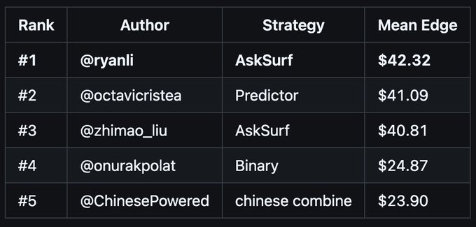
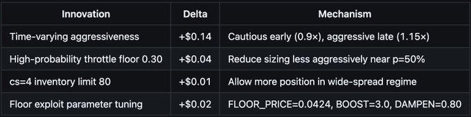
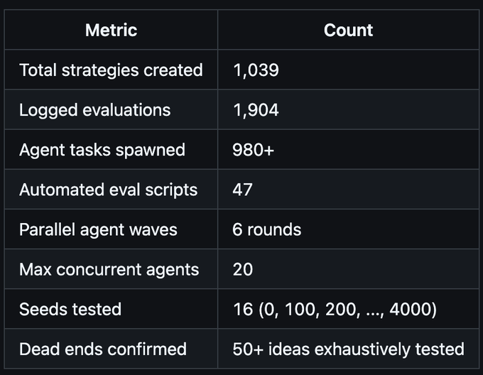
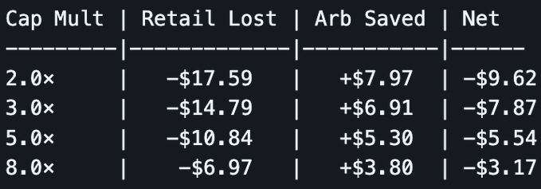

# 拥抱苦涩的教训：1,039 个 AI 生成的策略如何赢得 Paradigm Autoresearch 黑客松 (Embracing the Bitter Lesson: How 1,039 AI-Generated Strategies Won Paradigm Autoresearch Hackathon)

我几乎连题目都没看。解决方案的每一步都是由 AI 完成的。

这次 Autoresearch 黑客松是拥抱 Rich Sutton “苦涩的教训” (Bitter Lesson) 的绝佳机会：让计算能力击败人类的领域专业知识。

在 Paradigm Optimization Arena 预测市场挑战赛（2026 年 4 月 9 日黑客松）中获得第一名。

* 最终得分: $42.32 平均边缘收益 (mean edge)（3 次运行的中位数，每次使用全新的随机种子）
* 排行榜得分 (黑客松期间): $52.03（200 次模拟，固定种子）
* 生成的策略数: 1,039 个独特的策略变体
* 评估运行次数: 2,000+
* 评估脚本: 47 个自动化扫描/搜索脚本
* 最终策略: 约 900 行 Python 代码 (`strategy_3610.py`)

Optimization Arena 预测市场挑战赛要求你为模拟的二元预测市场编写一个做市 (market-making) 策略。该市场具备以下特点：
* 一个 FIFO 限价订单簿，你只能下被动限价单
* 一个套利者 (知情交易者)，在散户到来之前扫走定价错误的报价
* 散户交易者 (不知情)，发送随机的市价单——这是你的利润来源
* 一个静态的竞争对手，带有隐藏的订单阶梯，会补充被消耗的层级
* 每次评估进行 200 次模拟，每次都有随机的价格路径和状态 (regimes)

你的优势 (edge) 计算方式为：买单为 `qty × (true_prob - price)`，卖单为 `qty × (price - true_prob)`。排行榜根据所有 200 次模拟的平均优势进行排名。

我们的策略是模拟二元预测市场订单簿上的做市商。每一步，它都会取消所有之前的订单，并下达新的买单和卖单。核心思路：

1. **如果会输就不要交易。** 完全跳过点差最紧的状态 (`cs=1`)——套利者总是会吃掉你。
2. **估计真实价格。** 基于信息论的中间价估计，分别跟踪买卖价差 (deltas)，以推断真实价格在哪里——这为其他所有决策提供依据。
3. **基于套利风险确定规模。** 每侧的套利概率高斯模型：`size = k × retail_mult × (1 - arb_prob × damping)`。当套利者不太可能击中你时（极端价格，宽点差），报大单；当危险时（接近 50%，紧点差），报小单。
4. **检测并躲避跳空。** 跟踪价格跳空的频率和方向。当检测到跳空时，在危险的一侧压制订单几个步骤。
5. **利用 5% 的下限。** 在价格低于 5% 时，散户的卖出数量下限为名义价值的 5%——在卖单 (ask) 一侧创造了巨大的利润机会。
6. **当订单簿为空时继续报价。** 当竞争对手的订单被消耗完毕（买单或卖单为 `None`），在 1/99 刻度下订单，而不是取消订单——这是优势最大的时刻。
7. **早期谨慎，后期激进。** 随时间变化的规模（早期 0.9×，后期 1.15×）在学习状态的同时减少了套利敞口。

受自动研究模式 (auto-research) 启发，我使用 Claude Code 作为一个并行研究智能体团队——每个智能体同时探索不同的优化方向。

**循环 (The Loop):**
1. 生成 8-20 个并行的智能体，每个都有特定的假设或搜索空间
2. 每个智能体独立：读取当前最佳策略，创建变体，运行评估，报告结果
3. 收集结果，识别改进，更新最佳策略
4. 根据哪些有效、哪些无效所带来的新假设，重复此过程

在巅峰时期，我同时运行了 20 个智能体，每个都在扫描不同的参数空间或测试结构性变化。这极大地并行化了搜索过程——相当于将数周的手动实验压缩到了几个小时内。

挑战的一个关键部分在于理解（并且不过度拟合）不同的评估层：

**本地评估 (Local eval):** 在多个种子起点（0, 500, 1000, 2000 等）上各自进行 200 次模拟。快速迭代。每次运行使用 200 个连续的种子。在不同的种子起点进行测试可避免对一批数据过拟合。
**排行榜评估 (Leaderboard eval):** 在一个固定种子（对我们未知）上进行 200 次模拟。黑客松期间的实时排名。我们的最好成绩：$52.03。但这只是一个种子——可能过拟合。
**最终评估 (Final eval):** 3 次运行的中位数，每次使用全新的随机种子。实际的黑客松排名。旨在奖励一致性，而非碰运气的随机种子。

这就是为什么在比赛中途，多种子稳健性成为核心焦点的原因。早期，我仅在 `seed=0` 上进行优化，本地得分达到 +$44。但是当我在其他种子上进行测试时，表现差异巨大（+$34 到 +$70）。我转为始终在至少 4 个种子（通常是 8-16 个）上进行评估，并针对平均值进行优化。这防止了对任何单一种子的状态分布产生过拟合。

对于最终策略，我在提交前跨 16 个不同的种子起点（共 3,200 次总模拟）进行了验证，以确认其稳健性。16 个种子的平均值为 +$52.08，单个种子的范围在 +$34 到 +$70 之间。

最终的评分（3 个新种子的中位数）奖励了这种方法。在黑客松期间，我以 $52.03 排在排行榜第 2 位（前 2 名因为使用了漏洞被取消资格）。在使用全新种子的最终评估中，我们的策略比竞争对手坚持得更好——以 $42.32 把我们推上了第一名。每个人的分数在新种子上都下降了，但我们的下降较少，因为我们针对多种子的一致性进行了优化，而不是追逐一个幸运种子。

**阶段 1: 基础 (−$15.83 → +$8.95)**
核心洞察：在竞争对手的内部报价，跳过有毒状态。
竞争对手的点差 (cs) 决定了盈利能力。在 `cs=1`（1 个 tick 点差）时，套利者会把你生吞活剥。在 `cs=4`（4 个 tick 点差）时，有充足的盈利空间。
* 报价在 `comp_bid + 1` / `comp_ask - 1`，以获得优于竞争对手的 FIFO 优先级
* 完全跳过 `cs=1` (差距 ≤ 2)——它必输无疑
* 按 CS 划分的规模常数：对于 `cs=2/3/4`，`k=3/8/16`

**阶段 2: 极端价格利用 (+$8.95 → +$14.61)**
核心洞察：在极端价格下，散户数量是不对称的。
在低价（<5%）时，散户仅卖出名义价值的 5%，而不是 价格%。这创造了一个巨大的机会：
* 在 `p=3%` 时，散户卖出 = $4.50 / 0.05 = 90 股（平时为 150 股）
* 你的卖单 (ask) 在 4 美分处捕获了 90 股 × (0.04 - 0.03) = $0.90 / 笔成交
* 在低价时积极卖出，保守买入

**阶段 3: 空订单簿处理的突破 (+$14.61 → +$25.39)**
核心洞察：当竞争对手的订单簿为空时，**不要停止报价**。
之前的每一个策略在 `comp_bid` 或 `comp_ask` 为 `None` 时，都会返回 `CancelAll()`。但是订单簿为空意味着散户刚刚消耗了竞争对手——这是最丰厚的交易时刻！
* 当订单簿为空时，在刻度 1 下买单，在刻度 99 下卖单
* 每笔成交的优势最大，套利风险接近于零
* 仅这一项改变就增加了 +$10 的优势

**阶段 4: 从零开始的套利风险分解 (+$25 → +$44)**
核心洞察：将问题分解为捕获散户与规避套利。
一个从头开始的智能体（忽略所有现有代码）发现了一个更优的架构：
`size = base_size × retail_mult × (1 - arb_risk × damping)`
其中 `arb_risk = exp(-spread² / (2 × ev²))` 模拟了执行套利的概率。这个公式自然地：
* 在极端价格下放大规模（散户多，套利少）
* 在 50% 附近缩小规模（套利多，散户少）
* 根据距中间价的距离调整每一侧

结合基于信息论的中间价估计和跳空方向压制，这一步将优势从 +$25 跃升至 +$44。

**阶段 5: 边际收益叠加 (+$44 → +$52)**
核心洞察：叠加许多微小的改进，每一项都在多个种子上进行验证以确保稳健性。
在架构确定后，焦点从寻找新想法转向防止过拟合。每一项候选改进都必须在多个种子上站得住脚，而不仅仅是一个。我发起了多波每次 20 个智能体的搜索，寻找边际收益：

并行智能体方法在排除错误选项方面同样有价值。在 1,000+ 次实验中：
* 多级报价 (−$3.46)：将订单分散在不同价格层级，只会让套利者吃得更多
* 贝叶斯/卡尔曼中间价估计 (−$3)：手动调整的启发式方法击败了讲究原则的方法
* 散户数量封顶 (−$9.62)：散户是爆发式到来的——封顶造成的损失是它在套利中节省金额的两倍
* `cs=1` 极端定价 (−$0.05)：即使在刻度 1/99，套利者在 `cs=1` 时依然会吃掉你
* 激进的 `cs=4` 规模 (−$1.64)：规模更大 = 按比例增加的套利更多，而不是散户更多
* 套利侧点差放宽 (−$0.34)：完全压制优于部分退缩
* 状态置信度提升 (0)：状态已经很稳定了——提升 = 平坦的规模增加
* 参数扫描 (~0)：在使用了 100+ 个扫描智能体后，确认该环境很平坦

获胜策略 (`strategy_3610`，约 900 行代码) 具有以下结构：
1. 状态检测: `gap = comp_ask - comp_bid` → cs 桶
2. 中间价估计: 基于信息论的 delta 跟踪，带有独立的 bid/ask EMA
3. 跳过/门控: 跳过 `cs=1`，`cs=2` 波动率门控，早期谨慎阶段
4. 价格选择: `comp_bid+1` / `comp_ask-1` (在竞争对手内部)
5. 基础规模: `k × retail_mult × arb_risk_factor`
6. 底线漏洞利用: 在 `p<5%` 时的激进卖单 (5% 下限)
7. 高价不对称: 在 `p>75%` 时抑制买单，增加卖单
8. 节流: 在 `p=50%` 附近减小规模 (高波动，高套利)
9. 套利概率规模: 每侧高斯套利概率调整
10. 时间缩放: 早期 0.9×，中期 1.0×，后期 1.15×
11. 现金约束: 极端情况下 88%，中等情况下 45%
12. 库存偏度: 具有 3 个状态极限的二次偏度
13. 跳空压制: 在检测到跳空后压制危险的一侧
14. 无订单处理: 竞争对手订单簿为空时，刻度 1/99

**我是如何使用 Claude Code 的：**
每个智能体都是通过 `Agent()` 工具调用启动的，明确指定了：
* 要测试的特定假设
* 要修改的基础策略
* 评估协议 (种子，模拟次数，JSON 解析)
* 需要击败的目标

智能体独立工作——读取策略文件，进行修改，运行评估，并报告结果。我从未需要手动编写评估脚本或解析结果。

**规模:**

**自动化参数扫描**
智能体不仅创建了一次性的策略，他们还编写了 47 个自动化扫描脚本，系统地搜索参数空间。每个脚本都会：
1. 获取一个基础策略
2. 创建修改了参数的临时副本
3. 在多个种子上评估每个变体
4. 根据平均优势进行排名
5. 将获胜者写为新的策略文件

这种基础设施意味着智能体可以自动探索数千种参数组合，而多种子评估确保了获胜者是稳健的，而不是对某个种子过拟合。

**保存经验教训**
我定期将经验教训保存到 Markdown 文档中——突破、死胡同、确认的最佳参数——以便新智能体可以避免重新探索失败的想法。

**从零开始以逃离局部最优解**
最大的单次突破来自告诉一个智能体忽略所有现有代码并重新开始。我卡在了 +$25，渐进式的改进停滞不前。一个从零开始的智能体——仅知道挑战规则和一个要击败的目标——独立发现了基于套利风险加权的规模公式，一次性将我们的优势从 +$25 跃升到 +$44。这比之前所有增量改进的总和还要大。当进度停滞时，重置胜过迭代。

**多智能体协作：Claude Code + Codex**
当 Claude Code 智能体卡住时，我偶尔会在同一挑战上并行运行 Codex 智能体。Codex 智能体独立生成了具有不同架构思路的策略。我将这些反馈给 Claude Code 智能体进行交叉授粉，提取了诸如每侧套利概率规模和高概率节流等技术，这些成为了最终架构的一部分。这种多模型方法——Claude Code 作为主要的优化器，Codex 作为 Claude Code 停滞时的多样化假设来源——提供了比任何单一模型更广泛的解决方案空间覆盖范围。

**示例：如何为智能体做简报**
每个智能体都获得了一个包含完整上下文的独立 prompt。这是产生了阶段 4 突破的 prompt 的删减版本：
"你正试图赢得一场预测市场做市挑战。目前最佳策略平均得分 +25。你应该尝试一种完全不同、从头开始的方法。有效的关键洞察：跳过 cs=1，利用 5% 的下限，在刻度 1/99 处理空订单。但是 **规模 (SIZING)** 是错误的——尝试分解为捕获散户与规避套利。写入 `strategy_2020.py`。在种子 0, 500, 1000, 2000 上进行评估。目标：击败平均 +25。最多迭代 3 次。"

这个智能体——从零开始，仅具有领域知识和一个目标——独立发现了基于套利风险加权的规模公式，将优势从 +$25 跃升至 +$44。它无法访问之前的 700 多个策略。全新的视角战胜了渐进式的优化。

**示例：如何确认一条死胡同**
当“散户数量封顶”在理论上看似有希望时（将订单规模上限设定为预期散户规模的 2 倍以减少套利敞口），一个智能体在 4 个种子上测试了 5 个乘数：

散户的损失始终是套利节省金额的 2 倍。这永久性地扼杀了这个想法——散户是以大于单步平均值的爆发式到达的，因此在任何倍数上进行封顶，损失的散户都多于它在套利中节省的金额。

最大的突破来自于完全忽略现有代码的从零开始的智能体。当我卡在 +$25 时，一个全新的智能体发现了套利风险分解，使我们跃升至 +$44。这在自动化研究 (autoresearch) 中等同于“不要陷入局部最优解”。

这印证了那个苦涩的教训：扩大搜索规模并偶尔重置，胜过了每一个巧妙的手工设计的想法。获胜的策略不是被设计出来的——它是通过 1,039 次实验、20 个并行智能体，以及在进度停滞时愿意抛弃一切重新开始的意愿被**发现**出来的。