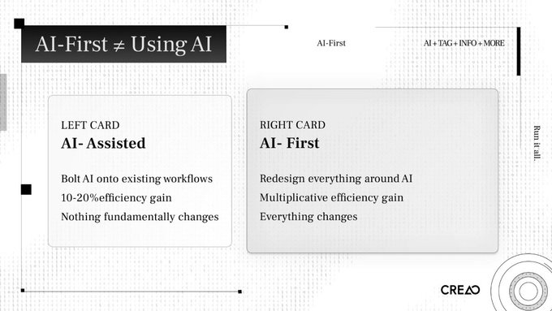
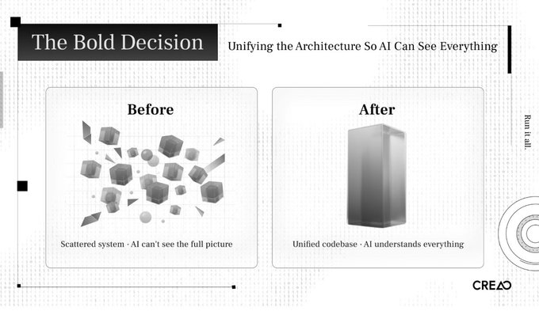
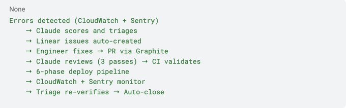
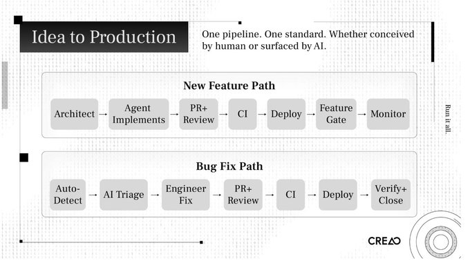
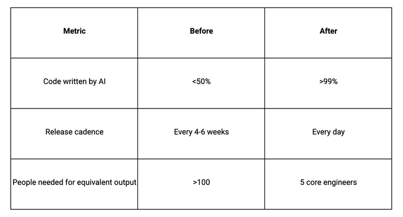

# 为什么你的“AI-First”战略可能大错特错 (Why Your “AI-First” Strategy Is Probably Wrong)

我们 99% 的生产环境代码是由 AI 编写的。上周二，我们在上午 10 点发布了一个新功能，中午 12 点进行 A/B 测试，到下午 3 点就把它毙掉了，因为数据显示它不行。我们在下午 5 点发布了一个更好的版本。在三个月前，这样一个循环需要花上六周时间。

我们并不是通过在 IDE 中添加 Copilot 做到这一点的。我们拆解了工程流程，并围绕 AI 重新构建了它。我们改变了计划、构建、测试、部署以及组织团队的方式。我们改变了公司里每个人的角色。

CREAO 是一个智能体 (agent) 平台。有 25 名员工，其中 10 名是工程师。我们在 2025 年 11 月开始构建智能体，两个月前，我从零开始彻底重组了整个产品架构和工程工作流。

OpenAI 在 2026 年 2 月发布了一个概念，准确地抓住了我们正在做的事情。他们称之为**框架工程 (harness engineering)**：工程团队的主要工作不再是编写代码，而是使智能体能够完成有用的工作。当出现故障时，解决方法永远不是“再努力试试”，而是：“缺失了什么能力，我们如何使其对智能体而言变得清晰且可执行？”

我们自己得出了这个结论，只是当时还没有给它命名。

大多数公司只是把 AI 嫁接到他们现有的流程上。工程师打开 Cursor；产品经理 (PM) 用 ChatGPT 起草规格说明；QA 用 AI 生成测试来进行实验。工作流本身保持不变。效率提高了 10% 到 20%。没有任何结构性的改变。

那叫做**AI 辅助 (AI-assisted)**。

**AI-First** 意味着你围绕“AI 是主要构建者”这一假设，重新设计你的流程、你的架构和你的组织。你不再问“AI 如何帮助我们的工程师？”，而是开始问：“我们该如何重构一切，让 AI 去进行构建，而工程师提供方向和判断？”

两者的差异是乘数级别的。

我看到有些团队自称 AI-first，却运行着同样的冲刺周期 (sprint cycles)，同样的 Jira 看板，同样的每周站会，同样的 QA 签字确认。他们只是在循环中加入了 AI，他们并没有重新设计这个循环。

这种做法的一种常见形式就是人们所说的 **vibe coding**。打开 Cursor，一直 prompt 直到跑通，提交，重复。那只能产出原型。一个生产系统需要稳定、可靠和安全。当 AI 编写代码时，你需要一个能够保证这些属性的系统。你构建系统，而 prompt 只是一次性的耗材。

去年，我观察了我们团队的工作方式，发现了三个会杀死我们的瓶颈。

## 产品管理瓶颈 (The Product Management Bottleneck)

我们的 PM 花费数周时间进行研究、设计和详细说明功能。几十年来，产品管理一直是这样运作的。但是智能体可以在两小时内实现一个功能。当构建时间从几个月坍缩到几个小时时，长达数周的计划周期就成了制约因素。

花几个月时间思考一件事，然后花两个小时构建它，这是说不通的。

PM 需要演变成具备产品思维的架构师，以迭代的速度工作，或者直接退出构建循环。设计需要通过快速的原型-发布-测试-迭代循环来进行，而不是通过在委员会中审查规范文档。

## QA 瓶颈 (The QA Bottleneck)

同样的动态。在智能体交付一个功能后，我们的 QA 团队要花几天时间测试边缘情况 (corner cases)。构建时间：两小时。测试时间：三天。

我们用 AI 构建的测试平台取代了手动 QA，这些平台专门用于测试 AI 编写的代码。验证必须以与实现相同的速度进行，否则你只是在旧瓶颈下游 10 英尺的地方建了一个新瓶颈。

## 人员编制瓶颈 (The Headcount Bottleneck)

做类似工作的竞争对手有 100 倍甚至更多的人。我们只有 25 人。我们不可能通过招聘来达到对等。我们必须通过重新设计来实现它。

有三个系统需要 AI 贯穿其中：我们如何设计产品、如何实现产品、如何测试产品。如果其中任何一个保持手动状态，它就会制约整个流水线。

我必须先修复代码库。

我们旧的架构分散在多个独立的系统中。单个更改可能需要触及三或四个仓库。从人类工程师的角度来看，这是可控的。但从 AI 智能体的角度来看，这是不透明的。智能体无法看到全貌。它无法推理跨服务的影响。它无法在本地运行集成测试。

我必须将所有代码统一到一个单体仓库 (monorepo) 中。原因之一：为了让 AI 能够看到一切。

这是实践中的框架工程 (harness engineering) 原则。你将系统中越多的部分提取成智能体可以检查、验证和修改的形式，你获得的杠杆作用就越大。支离破碎的代码库对智能体是隐形的。统一的代码库是清晰可读的。

我花了一个星期设计新系统：计划阶段、实现阶段、测试阶段、集成测试阶段。然后又花了一个星期使用智能体重新架构整个代码库。

CREAO 是一个智能体平台。我们使用我们自己的智能体重建了运行智能体的平台。如果产品能构建自己，它就奏效了。

这是我们的技术栈以及每个部分的作用。

## 基础设施：AWS

我们在 AWS 上运行自动扩缩容容器服务和断路器回滚 (circuit-breaker rollback)。如果部署后指标下降，系统会自行回滚。

CloudWatch 是中枢神经系统。所有服务都采用结构化日志记录，超过 25 个警报，自动化工作流每天查询自定义指标。基础设施的每一部分都暴露出结构化、可查询的信号。如果 AI 无法读取日志，它就无法诊断问题。

## CI/CD：GitHub Actions

每个代码更改都通过一个六阶段的流水线：

验证 CI → 构建并部署到 Dev 环境 → 测试 Dev 环境 → 部署到 Prod 环境 → 测试 Prod 环境 → 发布

每个拉取请求 (PR) 上的 CI 门控会强制执行类型检查、linting、单元和集成测试、Docker 构建、通过 Playwright 进行的端到端测试以及环境对等检查。没有哪个阶段是可选的。没有手动覆盖。流水线是确定性的，因此智能体可以预测结果并对故障进行推理。

## AI 代码审查：Claude

每个 pull request 都会触发三个平行的 AI 审查通道（使用 Claude Opus 4.6）：

*   通道 1：代码质量。逻辑错误、性能问题、可维护性。
*   通道 2：安全性。漏洞扫描、身份验证边界检查、注入风险。
*   通道 3：依赖扫描。供应链风险、版本冲突、许可问题。

这些是审查门控，而不是建议。它们与人工审查并行运行，大批量地捕捉人类遗漏的问题。当你每天部署 8 次时，没有哪个审阅者能在每个 PR 上保持注意力。

工程师还会在任何 GitHub issue 或 PR 中 `@claude`，以获取实施计划、调试会话或代码分析。智能体能看到整个 monorepo。上下文在对话中是连贯的。

## 自愈反馈循环 (The Self-Healing Feedback Loop)

这是核心。

每天早上 UTC 时间 9:00，会自动运行一个健康工作流。Claude Sonnet 4.6 查询 CloudWatch，分析所有服务的错误模式，并生成一份执行健康摘要，通过 Microsoft Teams 发送给团队。这不需要任何人去要求。

一小时后，分类引擎 (triage engine) 运行。它对来自 CloudWatch 和 Sentry 的生产错误进行聚类，在九个严重性维度上对每个集群进行评分，并在 Linear 中自动生成调查工单。每个工单包括日志样本、受影响的用户、受影响的端点以及建议的调查路径。

系统会进行去重。如果打开的问题涵盖了相同的错误模式，它会更新该问题。如果以前关闭的问题再次发生，它会检测到回归 (regression) 并重新打开它。

当工程师推送一个修复时，同样的流水线会处理它。三个 Claude 审查通道评估 PR。CI 进行验证。六阶段部署流水线将其推入开发和生产环境，并在每个阶段进行测试。部署后，分类引擎重新检查 CloudWatch。如果原来的错误得到解决，Linear 工单会自动关闭。

每个工具处理一个阶段。没有哪个工具试图包揽一切。每日循环创建了一个自愈循环，在这个循环中，错误被检测、分类、修复和验证，而且人工干预极少。

我曾对 Business Insider 的一名记者说：“AI 会提交 PR，人类只需要审查是否存在任何风险。”

## 功能开关和支持技术栈 (Feature Flags and the Supporting Stack)

Statsig 处理功能开关 (feature flags)。每个功能都在门控后面发布。推出模式：为团队启用，然后逐步按百分比推出，最后全面发布或终止。终止开关可立即关闭功能，无需部署。如果某个功能导致指标下降，我们会在几小时内将其撤下。糟糕的功能在发布当天就会死掉。A/B 测试也通过同一个系统运行。

Graphite 管理 PR 分支：合并队列 (merge queues) 变基到 main 分支，重新运行 CI，只有在全绿的情况下才合并。堆叠式 PR (Stacked PRs) 允许以高吞吐量进行渐进式审查。

Sentry 报告所有服务的结构化异常，由分类引擎将其与 CloudWatch 合并以提供跨工具的上下文。Linear 是面向人类的层：自动创建带有严重性分数、样本日志和建议调查的工单。去重可以防止噪音。后续验证会自动关闭已解决的问题。

## 新功能路径 (New Feature Path)

1.  架构师将任务定义为一个结构化的 prompt，包含代码库上下文、目标和约束条件。
2.  智能体分解任务，计划实施，编写代码，并生成它自己的测试。
3.  打开 PR。三个 Claude 审查通道对其进行评估。人类审阅者检查的是战略风险，而不是逐行检查正确性。
4.  CI 验证：类型检查、lint、单元测试、集成测试、端到端测试。
5.  Graphite 的合并队列进行 rebase，重新运行 CI，如果为绿则合并。
6.  六阶段部署流水线将其推送到 dev 和 prod 环境，并在每个阶段进行测试。
7.  为团队打开功能门。逐步按百分比推出。监控指标。
8.  如果任何指标下降，则使用终止开关。严重问题会触发断路器自动回滚。

## Bug 修复路径 (Bug Fix Path)

1.  CloudWatch 和 Sentry 检测到错误。
2.  Claude 分类引擎对严重性进行评分，创建一个具有完整调查上下文的 Linear issue。
3.  工程师进行调查。AI 已经完成了诊断。工程师验证并推送修复。
4.  相同的审查、CI、部署和监控流水线。
5.  分类引擎重新验证。如果解决，工单自动关闭。

两条路径使用相同的流水线。同一个系统。同一个标准。

在 14 天里，我们平均每天进行 3 到 8 次生产部署。在我们旧的模式下，整整两个星期可能连一次向生产环境的发布都做不到。

糟糕的功能在发布的当天就会被撤下。新功能在构思的当天就会上线。A/B 测试实时验证其影响。

人们以为我们是在用质量换取速度。但其实用户参与度上升了。支付转化率上升了。我们产生了比以前更好的结果，因为反馈循环更加紧密。当你每天发布时，你学到的东西肯定比你每月发布时学到的多。

未来将存在两种类型的工程师。

## 架构师 (The Architect)

只有一到两个人。他们设计教 AI 如何工作的标准操作程序 (SOP)。他们构建测试基础设施、集成系统、分类系统。他们决定架构和系统边界。他们为智能体定义什么是“好”。

这个角色需要深刻的批判性思维。你要批判 AI。你不能盲从它。当智能体提出一个计划时，架构师要找出漏洞。它漏掉了什么故障模式？它跨越了什么安全边界？它在积累什么技术债务？

我拥有物理学博士学位。博士学位教给我最有用的东西就是如何质疑假设、对论点进行压力测试，并寻找缺失的东西。批判 AI 的能力将比编写代码的能力更有价值。

这也是最难填补的角色。

## 操作员 (The Operator)

其他人都是操作员。工作仍然重要，但结构不同了。

AI 把任务分配给人类。分类系统发现 bug，创建工单，浮现诊断信息，并将其分配给正确的人。人类调查、验证并批准修复方案。AI 提交 PR。人类审查是否存在风险。

这些任务包括 bug 调查、UI 微调、CSS 改进、PR 审查、验证。它们需要技能和注意力。但它们不需要旧模式所要求的那种架构推理能力。

## 谁适应得最快

我注意到一个出乎意料的规律：初级工程师比高级工程师适应得更快。

缺乏传统实践束缚的初级工程师感到被赋能了。他们获得了可以放大其影响力的工具。他们不需要去忘掉十几年来养成的习惯。

拥有深厚传统实践的高级工程师度过的时期最艰难。他们两个月的工作量，AI 可以在一个小时内完成。在花费数年时间建立起一套罕见的技能后，这是一件很难接受的事情。

我不是在做评判。我只是在描述我所观察到的情况。在这场转型中，适应性比积累的技能更重要。

## 管理层坍缩 (Management Collapsed)

两个月前，我花了 60% 的时间来管理人员。对齐优先级、开会、给予反馈、指导工程师。

今天：低于 10%。

传统的 CTO 模式告诉你要赋能你的团队去做架构工作、培训他们、下放权力。但是如果系统只需要一两个架构师，我需要自己先去做。我从管理者变成了构建者。大多数日子我从早上 9 点写代码到凌晨 3 点。我设计系统的 SOP 和架构。我维护框架 (harness)。

压力更大了。但我很享受构建的过程，而不是对齐的过程。

## 争论变少，关系更好

我和联合创始人以及工程师的关系比以前更好了。

在转型之前，我与团队的大部分互动都是对齐会议。讨论权衡、辩论优先级、在技术决策上产生分歧。这些对话在传统模式下是必要的。但它们也是极其消耗精力的。

现在我仍然和我的团队交谈。但我们谈论其他事情。非工作话题。随意的闲聊。线下团建。我们相处得更好，因为我们不再为那些我们的系统可以轻松完成的工作而争吵。

## 不确定性是真实的

我不会假装每个人都很开心。

当我不再每天和人交谈时，一些团队成员感到不确定。CTO 不跟我说话是什么意思？在这个新世界里我的价值是什么？这些都是合理的担忧。

有些人花在辩论 AI 能否胜任他们工作上的时间，比实际去做工作的时间还多。转型期制造了焦虑。我对此没有一个完美的答案。

但我有一个原则：我们不会因为工程师引入了生产 bug 就解雇他们。我们会改进审查流程、加强测试、添加护栏。这同样适用于 AI。如果 AI 犯了错，我们会建立更好的验证、更清晰的约束、更强的可观测性。

我看到其他公司采用了 AI-first 的工程设计，但却将其他一切保持在手动状态。

如果工程团队在几个小时内就能交付功能，但市场营销团队却需要一周的时间来宣布，那么营销就是瓶颈。如果产品团队仍然按照每月的计划周期运行，计划就是瓶颈。

在 CREAO，我们将 AI 原生运营推入到了每个职能部门：

*   产品发布说明 (Release notes)：从更新日志和功能描述中由 AI 生成。
*   功能介绍视频：AI 生成的动态图形。
*   社交媒体每日推文：AI 策划并自动发布。
*   健康报告和分析摘要：由 AI 根据 CloudWatch 和生产数据库生成。

工程、产品、营销和增长在同一个 AI 原生工作流中运行。如果一个职能部门以智能体速度运行，而另一个以人类速度运行，那么人类速度的职能部门就会制约一切。

## 给工程师的建议

你的价值正在从代码产出转移到决策质量。快速编写代码的能力每个月都在贬值。而评估、批判和指导 AI 的能力却在升值。

产品感或品味很重要。你能看一眼生成的 UI 并在用户告诉你之前就知道它错了吗？你能看一眼架构提案并发现智能体漏掉的故障模式吗？

我告诉我们 19 岁的实习生：训练批判性思维。学会评估论点、寻找漏洞、质疑假设。了解什么是好的设计。这些技能会产生复利。

## 给 CTO 和创始人的建议

如果你的 PM 流程花费的时间比你的构建时间长，从那里开始。

在扩展智能体之前构建测试框架。没有快速验证的快速 AI，就是快速移动的技术债务。

从一名架构师开始。一个人构建系统并证明它有效。系统运行起来后，再让其他人入职操作员角色。

将 AI 原生推入所有职能部门。

做好遇到阻力的准备。有些人会抵制。

## 对行业而言

OpenAI、Anthropic 以及多个独立团队在相同的原则上达成了共识：结构化上下文、专业化智能体、持久内存以及执行循环。框架工程 (Harness engineering) 正在成为一种标准。

模型能力是推动这一切的时钟。我将 CREAO 的整个转变归功于过去两个月。Opus 4.5 做不到 Opus 4.6 能做的事。下一代模型将进一步加速这一进程。

我相信一人公司 (one-person companies) 将变得普遍。如果一个配备了智能体的架构师就能完成 100 个人的工作，许多公司将不需要第二名员工。

与我交谈过的大多数创始人和工程师仍在以传统方式运营。有些人正在考虑进行这种转变。真正做到的寥寥无几。

一位记者朋友告诉我，她就这个话题采访过大约五个人。她说我们比任何人都走得远：“我不认为有任何人像你这样，完全彻底地重建了他们的整个工作流。”

任何团队要做到这一点，工具都已经存在。我们的技术栈中没有任何东西是专有的。

竞争优势在于决定围绕这些工具重新设计一切，并愿意承担代价。这种代价是真实的：员工的不确定性，CTO 每天工作 18 个小时，高级工程师质疑他们的价值，以及在旧系统消失而新系统尚未得到验证的那两周。

我们承受了那个代价。两个月后，数字说明了一切。

我们构建了一个智能体平台。我们是用智能体构建它的。