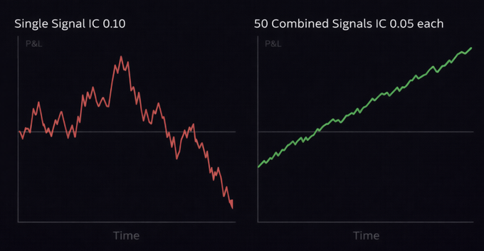
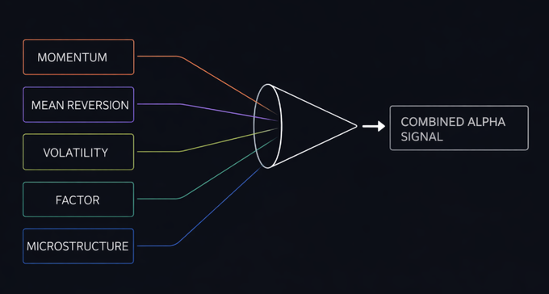
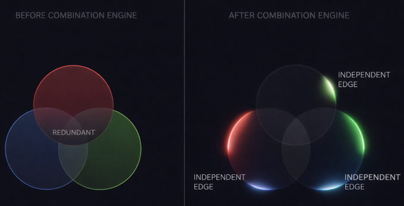
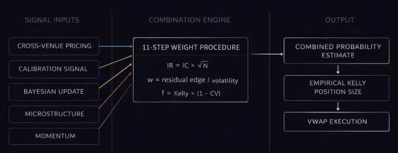

# 将 50 个弱信号组合成一个获胜交易背后的数学原理 (The Math Behind Combining 50 Weak Signals Into One Winning Trade)

我将为你拆解对冲基金 (hedge funds) 用来将 50 个弱信号转化为单一高确信度交易的数学原理。我还会分享完整的 11 步程序，以及你如何自己构建这个系统。让我们直入正题。

> 收藏这篇文章 - 我是 Roan，一名前端/后端开发人员，致力于系统设计、HFT（高频交易）风格的执行以及量化交易系统。我的工作重点是预测市场在负载下实际是如何表现的。如有任何建议、深入的合作或伙伴关系，欢迎私信。

我在基金听到的最有价值的话，并非来自某个模型、回测或研究论文。它来自我们的量化研究主管。他在系统化交易领域拥有二十年的经验。在我刚到基金不久的时候，他坐在我对面，看着我们在运行的系统，说了一句我几个月后才完全理解的话。

“你们正在试图寻找那个永远正确的单一信号。那个人是不存在的。真正获胜的交易台 (desk)，是那个能正确地将那些分别只有一点点正确的信号组合在一起的交易台。”

他所描述的东西有一个名字。**Alpha 组合 (Alpha combination)**。其背后的数学原理记录在涵盖所有主要资产类别、包含 550 多个公式的机构研究中。正是这个框架，将持续产生优势 (edge) 的交易台与那些对市场判断正确但仍亏钱的交易员区分开来。

这篇文章讲的就是这个框架。

在读完本文后，你将确切了解：为什么组合 50 个弱信号胜过寻找一个强信号，什么是主动管理基本定律 (Fundamental Law of Active Management) 以及它对你在任何市场中的优势意味着什么，机构交易台用来为他们堆栈中的每个信号分配数学上最优权重的完整 11 步程序，为什么这消除了系统化交易员在他们判断正确的交易中亏损的最常见原因，以及如何将整个框架具体应用到预测市场 (prediction markets) 中。

> 注意：如果你认真对待构建真正的系统化优势，请不要跳过任何一节。只有当你将所有五个部分结合在一起看时，这个框架才完全有意义。

每一个系统化交易员都曾在他们信号判断正确的交易中亏损过。这不是运气不好。当你依赖单一信号运作时，这是一种数学上的必然，理解其原因是一切后续内容的基石。

每一个信号都带有一个量化研究员称之为**信息系数 (information coefficient, IC)** 的指标。这是你的信号预测的内容与市场实际走向之间的相关性。信息系数为 1.0 的信号是完美的预测器。这不存在。信息系数为 0.0 的信号纯粹是噪音。大多数真实的机构信号，即那些在顶级交易台上用真实资金运行的信号，其 IC 值介于 0.05 到 0.15 之间。

慢慢读这句话。在机构规模上使用的最好的单个信号，绝大多数时候都是错的。不是有时。是大多数时候。这不是信号的失败。这是竞争性市场的本质，任何强大的优势都会吸引资本，直到优势被压缩。

改变机构交易方式的突破是这样的。当你组合 N 个信号，每个信号都带有一个虽小但为正的信息系数，并且这些信号彼此真正独立时，组合系统的性能与 N 的平方根成正比。这种关系被称为**主动管理基本定律**：

> IR = IC × √N

IR (Information Ratio) 是你组合系统的信息比率。可以把它想象成你完整信号堆栈经过风险调整后的优势。IC 是你各个信号的平均信息系数。N 是你要组合的独立信号的数量。

如果你 50 个信号中的每一个的 IC 都是 0.05，那么组合系统将提供：

> IR = 0.05 × √50 = 0.354

在 IC 为 0.05 的情况下组合 50 个信号的信息比率优势，与在 IC 为 0.10 的情况下运行单一信号的对比

将其与单独运行、IC 为 0.10 的单一信号进行比较。在单个信号强度只有一半的情况下，50 个信号的系统要强大三倍以上。这种数学关系是对冲基金雇佣数百名研究人员来构建数百个信号，而不是寻找一个完美指标的全部原因。

第二部分之前的作业：拿出你现在依赖的主要信号。诚实地估计它的信息系数是多少。如果你因为从未系统地测量过它而无法估计，那么这是你今天能给自己的最重要的答案。

在组合信号之前，你需要精确了解什么才算作一个信号。在机构量化框架中，信号是任何与未来价格或概率变动具有统计上可重复关系的、可测量的数据点。该信号不需要很强。它只需要在大量观察中，以一致的、可验证的方式比随机猜测稍微准确一点点即可。

以下是系统化交易台实际上在各个资产类别中使用的五个主要信号类别。

**价格和动量信号 (Price and momentum signals)。** 定义回溯期内的价格变动方向和速率。动量信号之所以起作用，是因为价格趋势在短期内由于对信息反应不足而持续，而在中期则由于过度反应而逆转。使用简单移动平均线计算预期收益：

> E(i) = (1/d) × 最近 d 个周期内收益 R(i,s) 的总和

关键参数是 d。太短，信号就是噪音。太长，它就会滞后于现实。机构交易台独立地为每个信号优化 d，而不是假设一个回溯期对所有信号都有效。

**均值回归信号 (Mean reversion signals)。** 资产偏离其预期公允价值的程度，基于与相关资产的横截面比较。均值回归起作用是因为同一行业的股票、同一事件的合约以及与同一标的挂钩的金融工具，预计将保持一致的相对定价。当这种关系破裂时，回归信号就会激活。

**波动率信号 (Volatility signals)。** 隐含波动率与实际波动率之间的差距。波动率风险溢价之所以存在，是因为波动率的卖家需要针对不利结果的风险获得补偿。当隐含波动率系统性地超过实际波动率时，这个差距就是一个可交易的信号。当它们收敛时，优势就被压缩了。

**因子信号 (Factor signals)。** 经过数十年研究记录的系统性收益溢价。价值 (Value)、动量 (momentum)、低波动率 (low volatility)、套利 (carry) 和质量 (quality) 是最确立的。每一个都代表了市场如何为风险定价时持续存在的行为或结构性低效。Fama-French 三因子模型的形式化：

> R(i) = α(i) + β1 × MKT + β2 × SMB + β3 × HML + ε(i)

其中 MKT 是市场超额收益，SMB 是小盘减大盘规模因子，HML 是高账面市值比减低账面市值比价值因子。每个 β 系数都是一个敏感度估计。每个因子都是一个具有自己独立信息系数的信号。

**微观结构信号 (Microstructure signals)。** 订单簿深度失衡、买卖价差动态以及成交量加权的交易侵略性。这些信号在比因子信号更短的视野内运作，并携带有关知情交易者在价格变动前如何定位的信息。有效价差 (Effective Spread) 指标：

> Effective Spread = 2 × |交易价格 − 中间价|

当它压缩时，它发出信息不对称低的信号。当它扩张时，它发出有人正在利用市场尚未定价的信息进行交易的信号。

馈入机构组合引擎的五个独立信号输入

这些信号中没有一个能单独足以形成系统性优势。它们只是原材料。第三部分是将它们转换为机构级产物的引擎。

这是将收集到的原始信号转换为最优加权的组合头寸的机构程序。每一步都很重要。其数学逻辑记录在同行评审的研究中，涵盖了所有主要资产类别的 151 种系统化交易策略。

你有 N 个信号。每个信号在 M 个时间段内生成了一个历史收益序列。该程序将这些收益序列转换为每个信号的单一最优权重。

**第 1 步：收集每个信号的已实现收益时间序列。**
对于每个信号 i 和每个历史时期 s，记录 R(i,s)。这是在时期 s 根据信号 i 采取行动所产生的历史损益。该收益序列是一切后续内容的原始输入。

**第 2 步：消除系统性漂移 (systematic drift)。计算序列去均值后的收益。**
> X(i,s) = R(i,s) 减去 R(i,s) 在所有 M 个时期内的均值

这使每个信号的收益序列都以零为中心。它消除了任何向上或向下的趋势，因为这种趋势会仅仅因为市场状态的原因，使呈趋势的信号看起来比稳定的信号更有价值，从而扭曲权重的计算。

**第 3 步：计算每个信号收益序列的样本方差。**
> σ(i)² = (1/M) × 所有时期 X(i,s)² 的总和

这告诉你每个信号的收益有多大的波动性。一个高方差的信号，即使其平均收益为正，也是嘈杂且不可预测的。一个低方差的信号是一致的。引擎使用这种差异在第 10 步自动惩罚不可靠的信号。

**第 4 步：用每个信号的标准差对去均值后的收益进行归一化。**
> Y(i,s) = X(i,s) / σ(i)

在这一步之后，不管原始数量级如何，每个信号都存在于同一尺度上。一个以百分点衡量的动量信号和一个以基点衡量的微观结构信号现在可以直接进行比较了。组合引擎可以将它们视为对等的。

**第 5 步：在 Y(i,s) 中只保留前 M 个时期。丢弃最近的观察值。**
这确保了权重的计算仅使用历史样本外数据 (out-of-sample data)，并且没有合并任何前瞻性信息，以避免对训练期产生过拟合。

**第 6 步：在每个时间段对归一化收益进行横截面去均值。**
> Λ(i,s) = Y(i,s) 减去在每个时期 s 内所有 N 个信号的 Y(j,s) 平均值

在每个时间点，你减去所有信号的平均性能。这消除了任何同时驱动所有信号向同一方向发展的全市场效应。留下的是独立于共享环境的、每个单独信号的特殊贡献。

**第 7 步：在 Λ(i,s) 中只保留 M 减 1 个时期。**
最后一步数据卫生处理，消除了横截面去均值序列中残留的任何前瞻性信息的可能性。

**第 8 步：使用 d 日移动平均计算每个信号的预期远期收益。**
> E(i) = (1/d) × 最近 d 个周期的 R(i,s) 总和
> 归一化: E_normalized(i) = E(i) / σ(i)

这是你对每个信号预期贡献的前瞻性估计，已缩放到与所有其他信号相同的单位。d 的选择决定了预期收益估计对近期表现的响应程度。

**第 9 步：计算去除与 Λ(i,s) 共享方差后每个信号预期收益的残差。**
使用单位权重，在没有截距的情况下，运行 E_normalized 对 Λ(i,s) 的回归。残差 ε(i) 代表了每个信号预期收益中真正独立的部分，不能被整个信号堆栈中共享的任何模式所解释。

这是关键的一步。你问的不是哪个信号具有最高的预期收益。你问的是哪个信号贡献了堆栈中其他信号尚未捕获的最多的独立前瞻性信息。

**第 10 步：设置每个信号的投资组合权重。**
> w(i) = η × ε(i) / σ(i)

权重与信号的独立优势估计成正比，与其波动率成反比。高独立优势和低噪音的信号获得更多权重。低独立优势和高噪音的信号获得较少权重。无需主观判断。

**第 11 步：归一化权重向量。**
设置 η，使所有权重的绝对值之和等于 1。完全配置。无意外杠杆。

第 1 步到第 11 步的输出是 N 个信号中每一个的权重 w(i)。当你想要任何金融工具上的组合头寸估计时，将每个信号的当前输出乘以其权重并求和。那个加权组合就是你的终极 alpha (mega-alpha)。从 50 个各自微弱的信号中涌现出的单一高确信度输出。

第四部分之前的快速检查：如果你在当前的信号堆栈上运行这个程序，你会对哪些信号获得了高权重，哪些信号获得了低权重感到惊讶吗？答案告诉你，你有多了解你正在运行的东西的独立性结构。

组合引擎解决了一个当一次只看一个信号时看不见、但一旦理解了数学就一目了然的问题。

单个信号的失败不仅仅是因为它们很嘈杂，还因为它们之间存在着你无法通过单独检查它们来发现的关联。一个动量信号和一个均值回归信号在性质上可能看起来是相反的。但在某些市场体制下，两者可能会同时朝同一方向对同一宏观经济新闻事件做出反应。如果你赋予它们相等的权重，你实际上是在加倍暴露于单一潜在原因的风险，而不是真正在两个独立的观点之间分散风险。

第 5 步和第 6 步中的横截面去均值识别并移除了这个共享组件。第 9 步中的回归隔离出了每个信号贡献的、且堆栈中没有其他东西能捕获的内容。由此产生的权重仅为每个信号携带的真正独立的信息赋予价值。

为什么信号相关性会破坏优势：组合引擎解决了隐藏的冗余问题

这就是为什么正确理解基本定律中的 N 如此重要的原因。IR = IC × √N 中的 N 并不是你的堆栈中信号的计数。它是考虑共享方差之后的**有效独立信号数量**。运行 50 个相关的信号，带给你的分散投资收益可能只有 10 到 15 个独立信号的水平。如果用由真正分离的信息源构建的信号运行组合引擎，并正确应用该程序，你就能获得全部 50 个信号的全部优势。

其在实践中的后果是重大的。一个认为自己正在运行 20 个独立信号的投资组合经理，可能实际运行的只有 6 个有效信号。由 20 个独立观点证明的头寸规模对 6 个观点来说太大了。这种杠杆错配是大多数系统性策略崩溃背后的机制，在这些崩溃中，交易员的方向判断是正确的，但规模却错了。

组合引擎强制进行诚实的核算。它向你展示了信号堆栈的有效独立性结构。它根据实际存在的内容而不是你认为存在的内容来调整权重大小。

那些在他们分析正确的交易中持续亏损的交易员，几乎总是在向他们未曾测量的相关性输钱。他们相信自己有三个独立的理由保持自信。其实他们只是把一个理由表达了三次，而头寸规模却定在了三个理由的级别。组合引擎在结构上消除了这种失败模式。

第 1 到第 4 部分中的所有内容都是在股票和多资产系统化交易的背景下构建的。只需进行一次替换，数学原理就能直接转移到预测市场中。你不是在组合关于预期收益的信号，而是在组合关于**预期概率**的信号。

预测市场堆栈中的每个信号产生的都是一个隐含概率估计，而不是收益估计。你的跨平台定价信号会根据 Polymarket 与 Betfair 或离岸博彩公司之间的价差隐含一个概率。你的校准信号根据 4 亿笔 Polymarket 交易中记录的历史结果率隐含一个概率。你的贝叶斯更新信号根据新证据隐含一个概率，处理公式为：

> P(H|E) = [P(E|H) × P(H)] / P(E)

你的微观结构信号使用 VPIN 和有效价差，根据知情订单流的方向隐含一个概率。你的动量信号根据价格在接近结算时的变动速度和方向隐含一个概率。

将这些隐含概率估计中的每一个都输入到第 3 部分中描述的完整的 11 步组合引擎中。输出是一个单一的组合概率估计，并根据每个信号的独立贡献为其分配了数学上最佳的权重。这个组合估计值与当前 Polymarket 价格之间的差距，就是你的优势 (edge)。

头寸规模的确定使用根据你的优势估计中的不确定性调整后的经验凯利判据 (empirical Kelly criterion)：

> f_empirical = f_kelly × (1 减去 CV_edge)

其中标准的 `f_kelly = (p × b 减去 q) / b`，而 `CV_edge` 是在历史收益的蒙特卡洛模拟中，你的优势估计的变异系数。运行 10,000 条路径模拟，并测量你的优势估计在这些路径上的变化程度，你就会得到 `CV_edge`。你的估计值变化越大，你就越要降低凯利比例。数学公式会自动根据你的实际确定程度与你感觉的确定程度进行调整。

完整的 Polymarket 流水线：

五个或更多输入信号各自产生一个隐含概率估计，反馈通过 11 步组合引擎产生一个单一加权的组合概率，与当前市场价格进行比较以计算优势，使用根据模拟得出的不确定性调整后的经验凯利判据来确定规模，通过 VWAP 优化来执行以最大程度地减少整个订单簿上的市场冲击，并实时监控 VPIN 扩张以指示知情交易者正在变得活跃。

完整的机构级 Polymarket 信号组合管道：从输入到执行

这个框架对于预测市场特别重要，因为你正在与之竞争的散户交易者几乎普遍运行着单一模型。单一数据源。单一概率估计。对 4 亿笔 Polymarket 交易的研究记录了由此产生的系统性错误定价。定价在 5% 到 15% 之间的市场，只有 4% 到 9% 的时间结果为 YES。这种差距之所以存在，是因为交易员在运行不完整的模型，而不是因为这些事件真的那么不可能发生。

组合引擎正是弥合单个模型与完整模型之间差距的框架。

每一个系统化交易员，无论是从事股票、期货还是预测市场，都面临着同样的结构性问题。单个信号是微弱的。寻找一个完美信号完全是错误的搜索方向。

主动管理基本定律在数学上证明了，组合许多弱的、独立的信号胜过寻找一个强信号。你的信息比率与你部署的真正独立的信号数量的平方根成正比。11 步 alpha 组合程序为你提供了计算最优权重的精确方法，这些权重反映了每个信号的独立贡献，惩罚了噪音，并消除了整个堆栈中的共享方差。

应用于预测市场，该框架将五个或更多隐含概率信号转换为单一组合估计值，它被证明比任何单独组成部分更准确。利用根据估计不确定性调整后的经验凯利判据来确定规模，它产生的头寸能正确反映你实际的自信程度，而不是你感觉的自信程度。

能维持最长复利的优势是建立在对你真正所知最诚实的模型之上的。这就是那个模型。

这是我想留给你思考的问题。如果结合了数百个信号的机构交易台，其信息系数仍然只能达到 0.05 到 0.15 之间，那这告诉你，那些声称能从单一模型中以高确信度持续挑选赢家的系统到底是怎么回事？在评论区留下你的答案。没有错误的答案，但会有非常发人深省的答案。