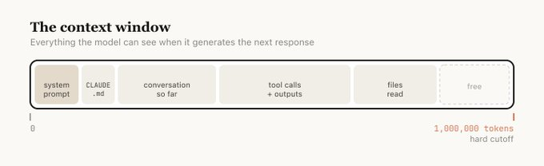
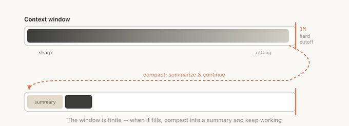
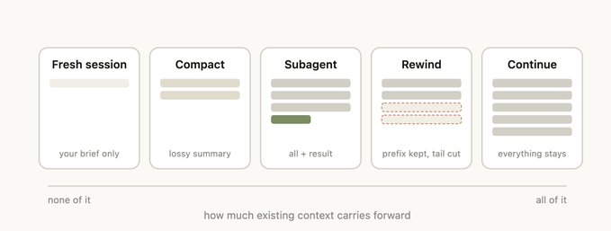
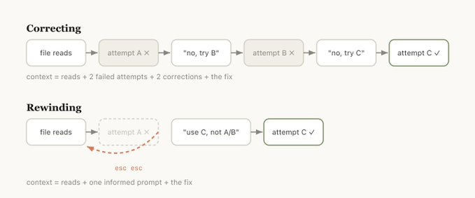
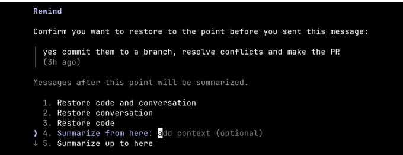
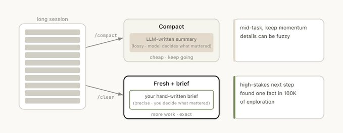
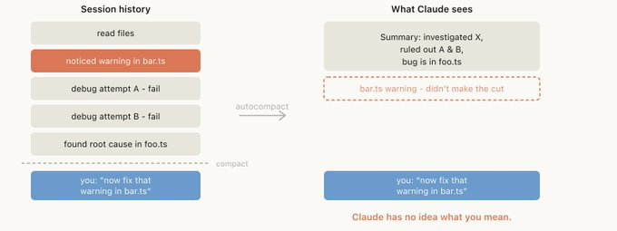
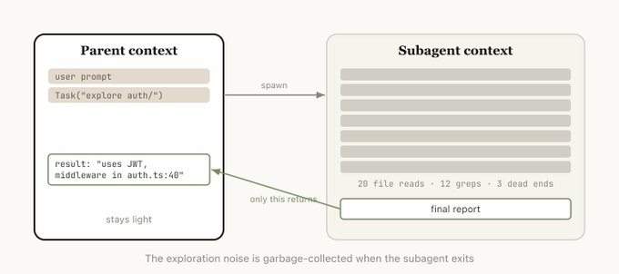
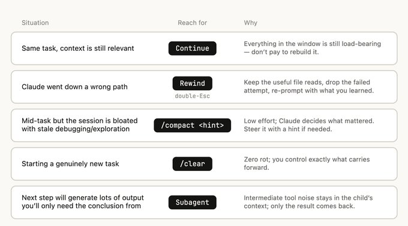

# 使用 Claude Code：会话管理与 100 万上下文 (Using Claude Code: Session Management & 1M Context)

在我最近与 Claude Code 用户的通话中，一个主题反复出现：100 万 token 的上下文窗口是一把双刃剑。

它让 Claude Code 能够更长时间地自主运行，更可靠地处理任务，但如果你不刻意管理你的会话，它也为“上下文污染 (context pollution)”打开了大门。

会话管理 (Session management) 比以往任何时候都更重要，而且似乎有很多关于它的问题。你是应该在终端里保持一个会话打开，还是两个？每次 prompt 都重新开始？你应该什么时候使用 compact (压缩)、rewind (倒带) 或 subagents (子智能体)？是什么导致了糟糕的 compact？

这里有惊人数量的细节，可以真正塑造你使用 Claude Code 的体验，而几乎所有这些细节都源于如何管理你的上下文窗口。

上下文窗口是模型在生成下一个响应时能够同时“看到”的一切。它包括你的系统提示词、到目前为止的对话、每个工具调用及其输出，以及被读取的每个文件。Claude Code 拥有 100 万个 token 的上下文窗口。

不幸的是，使用上下文是有轻微成本的，这通常被称为**上下文腐烂 (context rot)**。上下文腐烂是指模型性能随着上下文的增长而下降的现象，因为注意力被分散到了更多的 token 上，而且更旧、不相关的内容开始分散模型对当前任务的注意力。对于我们的 100 万上下文模型，我们观察到某种程度的上下文腐烂大约发生在 30 万到 40 万 tokens 左右，但这高度依赖于具体任务——并非死板的规则。

上下文窗口是一个硬性截断，所以当你接近上下文窗口的尾声时，你需要将你一直在从事的任务总结成一个较小的描述，然后在一个新的上下文窗口中继续工作，我们称之为**压缩 (compaction)**。你也可以自己手动触发压缩。

假设你刚让 Claude 做了一件事并且它完成了，现在你的上下文中包含了一些信息（工具调用、工具输出、你的指令），你对于接下来该做什么有数量惊人的选择：

*   **继续 (Continue)** — 在同一会话中发送另一条消息
*   **/rewind (Esc 键两次)** — 回跳到之前的某条消息，并从那里再次尝试
*   **/clear** — 开始一个新会话，通常带着你刚从学到的东西中提炼出的一份简报
*   **压缩 (Compact)** — 总结到目前为止的会话，并在该总结的基础上继续进行
*   **子智能体 (Subagents)** — 将下一块工作委托给一个拥有自己干净上下文的智能体，并且只将其结果拉回到当前会话

虽然最自然的做法就是继续，但其他四个选项的存在是为了帮助管理你的上下文。

新的 100 万上下文窗口意味着你现在可以更可靠地执行较长的任务，例如让它从零开始构建一个全栈应用。但仅仅因为你的模型还没有耗尽上下文，并不意味着你不应该开始一个新会话。

我们的普遍经验法则是，**当你开始一项新任务时，你也应该开始一个新会话。**

灰色地带是，当你可能想做相关任务，而部分上下文仍然必要，但并非全部必要时。

例如，为你刚刚实现的功能编写文档。虽然你可以开始一个新会话，但 Claude 将不得不重新阅读你刚刚实现的文件，这会更慢也更昂贵。由于编写文档可能不是一项对智能高度敏感的任务，为了不必再次重新读取相关文件而带来的效率提升，保留这些额外的上下文可能还是值得的。

如果我必须挑选一个标志着良好上下文管理习惯的操作，那就是 rewind (倒带)。

在 Claude Code 中，双击 `Esc`（或运行 `/rewind`）可以让你跳回之前的任何消息，并从那里重新 prompt。该点之后的消息将从上下文中被丢弃。

**Rewind 通常是更好的纠正方法。** 例如，Claude 读取了五个文件，尝试了一种方法，但没有奏效。你的直觉可能是输入“那不起作用，试试 X。”但更好的举措是倒带到刚好读取完文件之后，并用你刚学到的东西重新 prompt。“不要使用方法 A，foo 模块没有暴露那个接口——直接去用方法 B。”

你也可以使用“从这里总结 (summarize from here)”让 Claude 总结它的经验教训并创建一条交接消息，这有点像未来的 Claude 尝试了某个东西但没成功，然后给过去迭代版本的 Claude 留了一条口信。

一旦会话变得很长，你有两种方法可以减轻负担：`/compact` 或 `/clear`（然后重新开始）。它们感觉相似，但表现却大相径庭。

Compact 要求模型总结到目前为止的对话，然后用该总结替换历史记录。这是有损的，你是在信任 Claude 来决定什么是重要的，但你自己不需要写任何东西，而且 Claude 在包含重要经验教训或文件方面可能更全面。你也可以通过传递指令来引导它 (`/compact focus on the auth refactor, drop the test debugging`，压缩时专注于认证重构，丢弃测试调试的内容)。

使用 `/clear`，你写下重要的事情（“我们正在重构认证中间件，约束条件是 X，重要的文件是 A 和 B，我们已经排除了方法 Y”），然后干净地开始。这需要更多的工作，但产生的上下文都是你决定相关的。

如果你运行了许多长时间运行的会话，你可能会注意到有时候进行 compact 会非常糟糕。在这种情况下，我们经常发现，**当模型无法预测你的工作走向时，就会发生糟糕的压缩。**

例如，在一次漫长的调试会话后触发了自动压缩 (autocompact)，它总结了调查过程，然后你的下一条消息是“现在修复我们在某个文件里看到的那个警告”。

但是因为之前的会话专注于调试，那个其他警告可能已经被从总结中删除了。

这尤其困难，因为由于上下文腐烂，模型在压缩时正处于其最不聪明的状态。有了 100 万的上下文，你就有更多时间带着你想做的事情的描述来主动执行 `/compact`。

**子智能体 (Subagents) 是一种上下文管理的形式**，适用于当你预先知道一大块工作会产生大量你不再需要的中间输出时。

当 Claude 通过 Agent 工具生成一个子智能体时，该子智能体会获得它自己全新的上下文窗口。它可以做它需要做的所有工作，然后综合它的结果，这样只有最终报告会传回给父级。

我们使用的心理测试是：我还会需要这个工具的输出吗，还是只需要结论？

虽然 Claude Code 会自动调用子智能体，但你可能希望告诉它明确地这样做。例如，你可能想告诉它：

*   “启动一个子智能体，根据以下规范文件验证这项工作的结果”
*   “分离出一个子智能体去通读这个其他的代码库，并总结它是如何实现认证流程的，然后你自己以同样的方式实现它”
*   “分离出一个子智能体，根据我的 git 更改编写这个功能的文档”

总结一下，当 Claude 结束了一个回合而你准备发送一条新消息时，你就面临一个决策点。

随着时间的推移，我们期望 Claude 能够自己帮你处理这个问题，但就目前而言，这是你可以引导 Claude 输出的方法之一。

