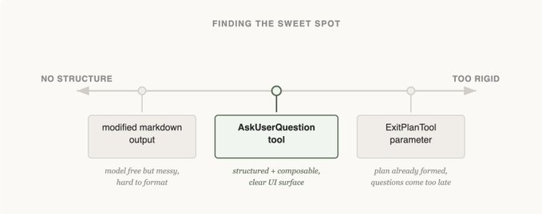

构建 agent harness 最难的部分之一，就是设计它的动作空间（action space）。

Claude 通过 Tool Calling 来行动，但在 Claude API 里，工具可以用很多方式构造：比如 bash、skills，以及最近的 code execution（关于 Claude API 的程序化 tool calling，可参考官方文档）。

在这么多选项下，你该如何设计 agent 的工具？只要一个 code execution 或 bash 工具就够了吗？如果你有 50 个工具，分别覆盖 agent 可能遇到的每一种场景，又会怎样？

为了站在模型视角思考，我常把它类比成解一道很难的数学题。你会希望自己拥有哪些工具？这其实取决于你自身的能力。

纸笔是最低配，但你会受限于手算。计算器更好，但你得会用它的高级功能。最快、最强的是电脑，但前提是你要会写代码并执行。

这对设计 agent 是个很有用的框架：你要给它“匹配其能力形状”的工具。那你怎么知道它到底有什么能力？去观察、读它的输出、做实验。你要学会“像 agent 一样看问题（see like an agent）”。

下面是我们在构建 Claude Code 过程中，通过持续观察 Claude 得到的一些经验。

在构建 AskUserQuestion 工具时，我们的目标是提升 Claude 的提问能力（通常叫 elicitation）。

Claude 当然可以直接用纯文本提问，但我们发现用户回答这些问题时总觉得“耗时偏高”，有不少不必要摩擦。如何降低摩擦、提高用户与 Claude 之间的沟通带宽？

我们最先尝试的是：给 ExitPlanTool 增加一个参数，把问题数组和 plan 一起输出。实现最简单，但会让 Claude 困惑：我们同时要求它给计划、又要求它针对计划提问题。那如果用户回答与计划冲突怎么办？Claude 需要调用 ExitPlanTool 两次吗？我们需要别的方案。

（关于为什么要做 ExitPlanTool，可参考相关文章）

接着我们试过修改 Claude 的输出指令，让它输出一种“稍微改造过的 markdown 提问格式”。例如让它输出带备选项的项目符号问题列表，然后我们解析并渲染成 UI。

这个改动最通用，Claude 看起来也基本能按格式输出，但不稳定：它会附加多余句子、漏掉选项，或者改用别的格式。

最后我们落地的方案是：做一个 Claude 可在任意时刻调用的工具，但在 plan mode 里重点提示它调用。工具触发后，我们弹出一个 modal 展示问题，并阻塞 agent 循环，直到用户作答。

这个工具让我们可以要求 Claude 产出结构化结果，也能确保它给用户多个选项。它还方便用户进行组合，比如在 Agent SDK 里调用，或者在 skills 中引用。

最关键的是，Claude 本身“愿意”调用这个工具，而且输出效果很好。工具设计得再漂亮，如果 Claude 不会用，也没意义。

这就是 Claude Code 里 elicitation 的终极形态吗？我们也不确定。你会在下一个例子看到：对一个模型有效的方式，不一定是另一个模型的最优解。

Claude Code 刚发布时，我们意识到模型需要 Todo list 来保持任务轨道。它可以在开始时写下 Todo，执行中逐项勾选。为此我们提供了 TodoWrite 工具，用于写入或更新 Todo 并展示给用户。

即便如此，我们还是经常看到 Claude 忘记自己要做什么。于是我们加了每 5 轮一次的系统提醒，反复提醒它目标。

但随着模型能力提升，它不仅不再需要这种 Todo 提醒，反而会被其限制。持续收到 Todo 提醒，会让 Claude 误以为必须死守列表，而不是主动调整。我们也看到 Opus 4.5 在 subagents 使用上明显更强，但这又引出问题：subagents 如何共享并协同一个 Todo 列表？

基于这些观察，我们把 TodoWrite 替换成了 Task Tool。Todo 的核心是“让模型别跑偏”；Task 的核心更偏向“让 agents 之间协作沟通”。Task 支持依赖关系、支持跨 subagents 共享更新，模型还可以修改和删除。

随着模型能力提升，那些曾经“必要”的工具，可能会开始束缚它。你需要不断复审对“需要哪些工具”的既有假设。这也是为什么最好只支持少量能力画像相近的模型。

对 Claude 来说，一组特别关键的工具是“搜索工具”，用于构建它自己的上下文。

Claude Code 初期，我们用 RAG 向量数据库给 Claude 找上下文。RAG 很强也很快，但它需要索引与部署，在不同环境中也可能比较脆弱。更重要的是，这些上下文是“被喂给 Claude”的，而不是 Claude 自己找出来的。

但如果 Claude 能搜网页，为什么不能搜你的代码库？给它一个 Grep 工具后，它就可以自己找文件、自己构建上下文。

这是我们看到的一个稳定趋势：Claude 越聪明，就越擅长在拥有合适工具时“自己搭建上下文”。

当我们引入 Agent Skills 时，我们把 progressive disclosure（渐进披露）这个理念正式化：让 agent 通过探索逐步发现相关上下文。

Claude 可以读 skill 文件，而 skill 文件又可以引用其他文件，模型可递归读取。实际上，skills 的常见用途之一，就是给 Claude 增加更多搜索能力，比如教它如何使用某个 API 或查询某个数据库。

一年时间里，Claude 从“几乎不会自行构建上下文”，进化到“可以跨多层文件做嵌套搜索，精准找到所需上下文”。

现在，progressive disclosure 已成为我们在“不新增工具”前提下扩展能力的常用手法。

Claude Code 目前大约有 ~20 个工具，我们始终在问自己：这些工具真的都需要吗？新增工具门槛很高，因为每多一个工具，模型就多一个需要权衡的选项。

举个例子，我们发现 Claude 对“如何使用 Claude Code”本身了解不够。比如你问它怎么添加 MCP、slash command 是什么，它未必答得上来。

我们可以把这些信息全塞进 system prompt，但用户其实很少问这类问题。这样做会带来 context rot，还会干扰 Claude Code 的主业：写代码。

所以我们再次使用 progressive disclosure：先给 Claude 文档链接，让它自己去加载并检索信息。这个方向可行，但我们发现 Claude 常常为了找答案把大量结果加载进上下文，而用户真正需要的只是最终答案。

于是我们做了 Claude Code Guide subagent。当用户问 Claude 关于它自己时，会提示它调用这个 subagent；该 subagent 拥有大量关于“如何高效搜文档、返回什么结果”的专门指令。

这还不完美，Claude 在回答“如何配置自己”时仍可能困惑，但已经比以前好很多。我们在不新增工具的情况下，扩展了 Claude 的动作空间。

如果你期待一套刚性的“工具设计铁律”，那这篇并不是。为模型设计工具，既是科学，也是艺术。它高度依赖你使用的模型、agent 的目标，以及它所处的运行环境。

多做实验，认真读输出，持续尝试新方法。像 agent 一样去看。
