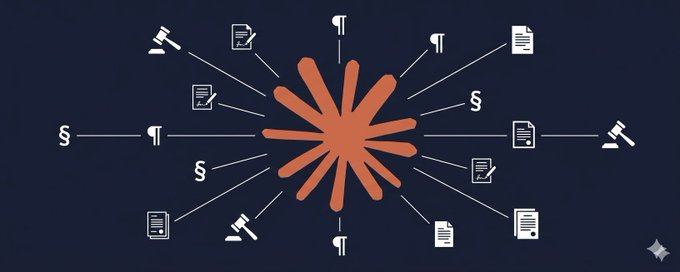

# The Claude-Native Law Firm

A few months ago, the night before a client’s acquisition was set to close, buyer’s counsel sent a letter demanding major last-minute changes: new escrow conditions, broader indemnification carve-outs, and revised closing deliverables. The message was implicit but clear: accept this, or we walk. It was 7 PM.

I uploaded the purchase agreement, disclosure schedules, and demand letter to Claude. In minutes, Claude mapped each proposed change to existing terms and surfaced what buyer’s counsel appeared to miss: two requested carve-outs conflicted with representations already confirmed in the disclosure schedules, and a third created an internal conflict in the fundamental reps section that would actually weaken the buyer’s own post-closing protections.

As negotiations continued into the night, I fed each new email to Claude. It tracked interactions across sections, flagged where a concession in one place would create exposure elsewhere, and helped shape a response that conceded what was reasonable and held firm where it mattered. By 11 PM we had clean counter-positions, each tied to the buyer’s own language. The deal closed the next morning on terms my client was happy with.

A three-associate team at a mid-size firm likely would have needed until morning for that analysis. I had the core of it in under two hours.

I run a two-person boutique firm handling startup formation, VC transactions, and regulatory work. We compete against firms with hundreds or thousands of lawyers. We are not supposed to move this way. But over the past year, one thing became obvious: a small firm built around AI doesn’t just keep pace with larger firms—it can move faster, produce more thorough work, and operate at a cost structure that was unrealistic 18 months ago.

The tool I built around is Claude by Anthropic. This is not theory. It is my day-to-day workflow for real legal work.

The market is crowded with legal-AI products: Harvey, Spellbook, CoCounsel, Luminance, and more. Their thesis is that lawyers need legal-specific AI. I’ve tested most of them. For a small-firm practitioner, a well-configured general-purpose AI is better. Not close.

Most legal products are wrappers around the same frontier models. Their pitch is familiar: we customize to your firm’s playbook, train on your templates, and build workflows around your brief bank or clause library. Some do this well enough. But the pitch often misses where the real leverage is.

A template library is not a moat. Every competent firm has similar NDAs, stock purchase agreements, offer letters. Templates are commodity inputs. The difference between excellent and mediocre lawyers has never been templates—it is judgment: spotting what’s buried in Section 14(c), knowing which indemnity fight matters, structuring advice so clients understand risk.

That judgment does not live at the “firm template” level. It lives with individual professionals.

When legal AI companies optimize for “firm playbooks,” they solve a secondary problem while missing the primary one. The real leverage is in instructions that shape thinking: what to look for, what to flag, how to weigh tradeoffs, how to format output, what tone to use with clients. Those instructions encode individual judgment. That is exactly what Claude’s skills system supports.

I built custom instruction files (“skills”) encoding my frameworks, formats, tone, and judgment. When I upload a contract, Claude does not apply a generic framework or even a “firm” framework—it applies mine, developed over years of practice.

There is another foundational point, especially for anyone who has lived in Microsoft Word. Claude is a frontier model heavily optimized for code. That matters for legal work because it can write code to manipulate the actual tools lawyers already use.

Lawyers lose countless hours to formatting friction: broken numbering, style conflicts, stale cross-references, versioned track-changes issues, painful citation cleanup. These are software problems. Claude solves software problems by writing software.

When I ask Claude to apply tracked changes, it can operate at the .docx XML level and write the precise markup Word expects, preserving formatting and attribution. When I ask for citation normalization, it can parse and reformat systematically in seconds.

This is a meaningful capability gap versus many legal wrappers. They often chat *about* documents. Claude can work *inside* documents. In practice that means moving from “this clause has an issue” to “here is the fixed clause, redline, and cover email draft.”

General-purpose frontier models also improve faster than vertical wrappers. On the frontier model, new capabilities arrive immediately. On wrappers, you wait for someone else’s roadmap.

My own practice is transactional, but the architecture generalizes. Litigators can build skills for depos, motion drafting, case-law synthesis, discovery. Tax lawyers can build structuring and opinion workflows. Family lawyers can build skills for asset tracing and custody analysis. The pattern is constant: start with a strong general model, teach it your practice, and compound your judgment.

Claude desktop has three modes, and learning mode selection was critical:

- **Chat**: conversational analysis and drafting with tight human control.
- **Cowork**: autonomous execution over folders and files; this is where major leverage appears.
- **Code**: full terminal/development mode; useful for building custom tooling.

I have a condition that makes long reading difficult, so I used Code mode to build a CLI that converts legal docs into spoken audio, including section-number handling and pipeline orchestration. Now I listen to contracts on commutes.

Anthropic’s skills framework was a turning point. Instead of manually re-prompting every time, I asked Claude to analyze months of our own work and identify high-impact repeatable workflows. It found recurrent friction points and proposed concrete skills.

After refinement, I packaged six production skills for Cowork:

1. Contract review
2. Tracked-changes editing
3. Contract drafting
4. Client communications
5. Legal research
6. Policy writing

Each one encodes accumulated professional judgment.

Firm-management implication: this is transferable. If I had 50 associates, I could deploy the same plugin everywhere. First drafts would start from a much higher baseline aligned with my analytical style. Attorney review remains mandatory, but review starts from better work.

Three concrete examples:

## 1) Tracked changes without opening Word

Counterparty sends a 40-page redline. I run contract review skill to classify severity, identify risk shifts, detect cross-clause tension, and suggest fallback language.

I apply my judgment, choose strategy-aware alternatives, then ask Claude to apply edits. Claude writes valid tracked changes in .docx with preserved formatting. I review, finalize, and send. Client communication draft follows in matching tone.

## 2) Research with verification controls

For a multi-agency regulatory question, my research skill runs parallel topical research, prioritizes primary authority, and forces a self-review pass before delivery: verify each citation, flag low-confidence claims, check internal consistency, and explicitly guard against hallucinated citations.

Result: a structured memo with practical recommendations delivered quickly, then attorney-reviewed and refined.

## 3) Real-time contract interpretation under pressure

In one dispute response, Claude mapped allegations in a demand letter to contract language and surfaced that two alleged breaches had already been modified by a side letter drafted by the other side’s own counsel. During drafting, it also caught a defense argument that could inadvertently concede a separate payment point elsewhere. I revised before sending.

Security and ethics questions always come up. The framework is familiar: treat AI providers as third-party technology vendors, perform reasonable diligence, configure retention/training settings appropriately, and supervise outputs. I also added an AI-use provision in engagement letters: AI as efficiency/quality enhancer, attorney supervision, confidentiality alignment, and client consent.

Technology competence requirements are expanding. In many contexts, refusing to understand these tools may become harder to defend than using them responsibly.

Most lawyers who test AI try a vague prompt like “review this contract,” get mediocre output, and conclude AI is overrated. The issue is usually not AI capability—it is instruction quality.

Compare:

- “review this contract”
- versus
- “review this services agreement from vendor perspective; identify risk shifts beyond market norms; check for missing core provisions; produce severity-rated issues and specific counter-language; account for limited leverage and prioritize what to fight versus concede.”

The second prompt often yields useful first-pass work. The first usually does not.

That gap—between “AI toy” and “AI transformed my practice”—is mostly instruction quality. Skills matter because they encode this once and run repeatedly.

Practical implications:

- **Staffing**: AI changes what junior labor is for; first-pass production shrinks, judgment and supervision grow.
- **Pricing**: more value per attorney hour supports alternative models (including subscription structures) for appropriate matters.
- **Judgment**: AI does not practice law; lawyers do. The winning pattern is high-leverage AI plus disciplined attorney oversight.

I don’t work for Anthropic. I’m a practicing lawyer who tested many tools and built around what worked best in my real workflow.

If you want to start, do this:

1. Install the desktop app.
2. Pick your most frequent task.
3. Write a detailed prompt describing exactly how you want it done.
4. Evaluate output quality.
5. Convert that workflow into your first skill.

Returns compound quickly.
