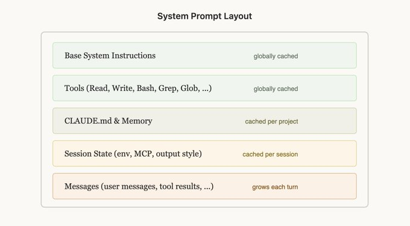
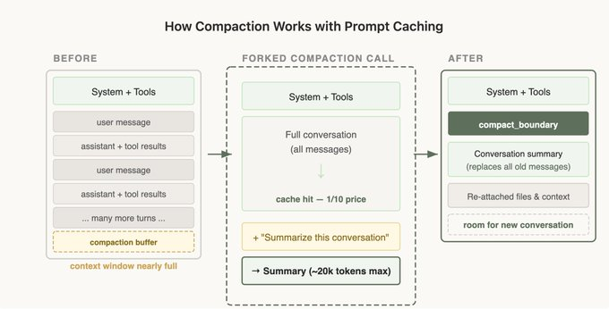

工程里常说一句话：“Cache Rules Everything Around Me（缓存决定一切）”，对 Agent 也是一样。

像 Claude Code 这种长时运行的 Agent 产品之所以在成本与延迟上可行，核心就在 **prompt caching**：复用前一轮计算结果，显著降低时延与费用。

那 prompt caching 到底是什么？如何工作？工程上怎么落地？

在 Claude Code 中，整个 harness 都围绕 prompt caching 设计。高缓存命中率可以降低成本，也能支持更宽松的订阅限额；因此团队会对命中率做告警，命中率过低会按事故（SEV）处理。

以下是他们在规模化优化中总结的（且常常反直觉的）经验。

## 1）Prompt caching 本质是“前缀匹配”

API 会从请求起始到每个 `cache_control` 断点做缓存。所以**顺序极其重要**：要让尽可能多请求共享同一前缀。

最佳实践：**静态内容在前，动态内容在后**。常见顺序：

1. 静态 system prompt + tools（全局缓存）
2. 项目上下文（项目级缓存）
3. 会话上下文（会话级缓存）
4. 对话消息

这样可以最大化跨会话缓存复用。

### 容易踩坑的破坏方式

- 在静态 system prompt 里加入精细时间戳
- 工具定义顺序非确定性变化
- 会话中途改工具参数（例如 AgentTool 可调用对象）

## 2）状态变化优先通过消息注入，而不是改前缀

时间、文件状态等信息会变化。直觉上你可能想直接改 prompt，但这通常会触发 cache miss，成本上升。

更好的方式：把更新放到后续消息里。Claude Code 会把这类增量信息放在下一轮消息中的 `<system-reminder>`，既让模型拿到新信息，又尽量保住缓存前缀。

## 3）缓存按模型隔离

Prompt cache 是模型级隔离的，这会带来反直觉成本结果。

例如：如果你已在 Opus 对话中积累了 100k token，此时即便问题很简单，切到 Haiku 也可能更贵，因为必须为 Haiku 重建缓存。

若必须切模型，优先用 **subagent handoff**：由当前模型先产出简洁交接消息，再交给另一个模型处理。

## 4）不要在会话中途改工具集

很多人会按“当前任务需要”动态增删工具，这很直观，但会破坏缓存。

因为工具定义属于缓存前缀的一部分，一旦增删工具，整段对话缓存都可能失效。

### Plan Mode：围绕缓存约束做产品设计

直觉实现：进入 plan mode 时切成只读工具集。问题：会打断缓存。

更优实现：

- 全程保持工具集不变
- 用 `EnterPlanMode` / `ExitPlanMode` 这类工具（或消息约束）表达状态切换
- 用指令约束行为，而不是改工具定义

额外好处：模型可在识别到复杂问题时自主进入 plan mode，且不破缓存。

### Tool Search：延迟加载，而不是移除

MCP 工具很多时，每轮都传完整 schema 很贵；但中途移除工具又会破缓存。

解决方案是 `defer_loading`：先发稳定的轻量 stub（仅名称 + `defer_loading: true`），模型需要时再通过 ToolSearch 拉取完整 schema。这样前缀稳定，成本可控。

## 5）Compaction 的缓存边界问题

Compaction 是上下文将满时对历史对话做总结再续聊。

如果你把 compaction 作为一个“不同 system prompt / 不同 tools 的独立调用”去做，就无法复用主对话缓存前缀，输入 token 会按全价计费。

### Cache-safe forking（缓存安全分叉）

做 compaction / summarization / side computation 时，应尽量保持与父会话同构：

- 相同 system prompt
- 相同 user/system context
- 相同 tool definitions
- 先放父会话历史
- 末尾追加 compaction 指令作为新用户消息

这样 API 看起来与父请求前缀几乎一致，绝大部分可命中缓存，仅新增 token 计费。

同时你要预留 **compaction buffer**，给 compact 指令与摘要输出留出窗口空间。

## 可执行原则（总结）

1. Prompt caching 是前缀匹配：前缀任何变动都会让后续失效。
2. 状态变化尽量走消息注入，不要频繁改 system prompt。
3. 不要中途改工具/模型；必要时用缓存安全的 handoff。
4. 像监控可用性一样监控缓存命中率；小幅下降也会显著影响成本与延迟。
5. 分叉任务（压缩/总结/技能执行）要共享父前缀。

Claude Code 从第一天就按 prompt caching 设计；做 Agent 产品也应如此。
