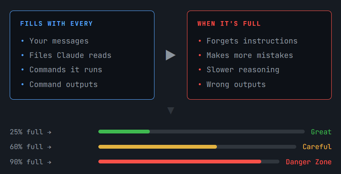
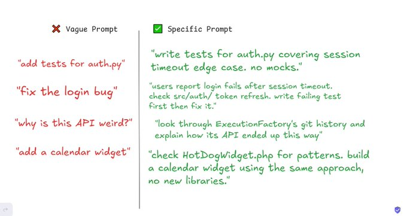
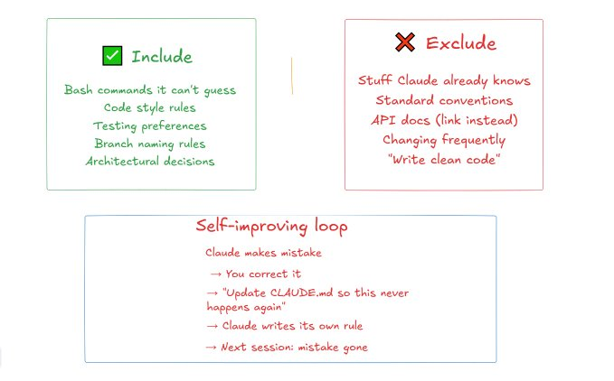
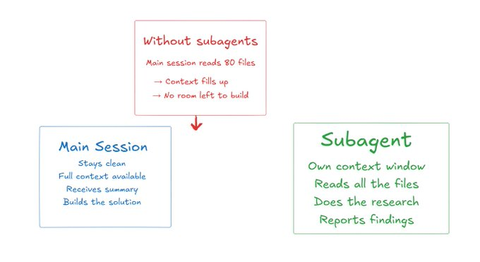
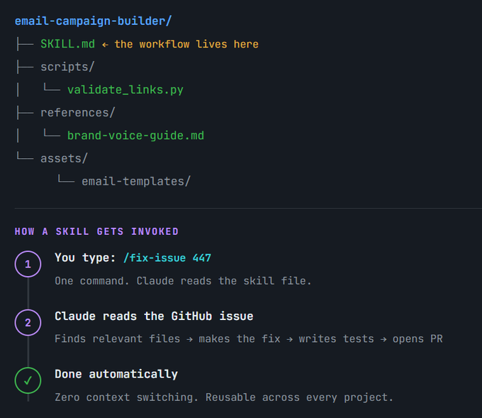

welcome back guys

last time i wrote a full breakdown of "Transformer Architecture" and the response was honestly insane

so many of you bookmarked it, shared it and messaged me saying it was the clearest explanation you had ever read

that kind of feedback means everything to me

for those of you who are new here, let me give you a quick picture of what this account is about

this is not a place where i post random AI news and call it content

every single article i post here has a purpose

from breaking down complex AI concepts into things a beginner can actually understand, to deep dives on tools you are using every day

so far i have covered things like Claude Skills, how to build your own skills from scratch, a beginner's guide to LangChain, MCP and more

7 to 8 long-form articles in and every single one has been worth your time

now here is something i never compromise on

if i do not know a topic well enough, i do not write about it

i do not care if 1000 people are asking for it

i will sit down, study it properly from credible sources, test it myself and only then explain it to you

because half-knowledge articles are everywhere and you deserve better than that

okay so today we are talking about Claude Code

specifically: the best practices that actually make Claude Code 100x more useful

and before you say "i already know Claude Code" this is not an intro article

you all know by now that Claude Code is every developer's favourite tool right now

as a software engineer i have personally been using it for close to 3 months

and i will be honest with you, i was not using it anywhere close to its full potential in the first few weeks

today i am going to share the practices that changed that

everything in this article is officially documented and also personally tested by me

i combined two sources: the official Anthropic best practices docs and the tips shared by Boris Cherny the actual person who built Claude Code

i read both of them fully so you do not have to

i will drop the source links at the end but after reading this article you genuinely will not need to go there

let's get into it

[](https://x.com/Meer_AIIT/article/2027509711722188976/media/2027484523131506688)

Before anything else you need to understand one thing.

Claude has a context window. Think of it like a whiteboard.

Every message you send. Every file Claude reads. Every command it runs. All of it gets written on that whiteboard. And once the whiteboard gets too full? Claude starts performing worse. It forgets earlier instructions. It makes mistakes it wouldn't normally make.

The whole point of using Claude Code well is managing that whiteboard.

Everything else in this article connects back to this one idea. Keep that in mind as you read.

scss

```
┌─────────────────────────────────┐
│           THE PROMPT            │
│  Task + Specific Test Cases     │
└────────────────┬────────────────┘
                 │
                 ▼
┌─────────────────────────────────┐
│           CLAUDE ACTS           │
│         (Writes Code)           │
└────────────────┬────────────────┘
                 │
                 ▼
┌─────────────────────────────────┐
│         SELF-VERIFICATION       │
│  (Runs Tests / Compares Visuals)│
└────────────────┬────────────────┘
                 │
        ┌────────┴────────┐
        ▼                 ▼
  ┌───────────┐     ┌───────────┐
  │   FAILS   │     │  PASSES   │
  │ (Rewrites)│     │ (Outputs) │
  └─────┬─────┘     └─────┬─────┘
        │                 │
        └───────◄─────────┘
```

This is the single biggest thing you can do to get better results.

Most people describe what they want and then just hope Claude gets it right.

That puts you in the position of catching every mistake yourself. And trust me, that gets exhausting fast.

Here is what works instead.

When you ask Claude to write a function that checks if an email is valid, don't just say "write an email validation function."

Say this instead:

> "Write a function that checks if an email is valid. Test it against these cases: hello@gmail.com should pass, hello@ should fail,

.com should fail. Run the tests after you write it."

Now Claude can check its own work. It doesn't need you to babysit every output.

The same idea works for visual things. If you want Claude to fix the design of a button on your website, paste a screenshot and say "make it look like this, then take a screenshot of the result and tell me what's different."

If you give Claude something to test against, you stop being the only feedback loop. That saves you hours.

scss

```
┌──────────────────────┐
│  STEP 1: PLAN MODE   │
│ (Read & Map files -  │
│  No code written)    │
└──────────┬───────────┘
           │
           ▼
┌──────────────────────┐
│ STEP 2: DRAFT PLAN   │
│ (Define files, steps,│
│  and edge cases)     │
└──────────┬───────────┘
           │
           ▼
┌──────────────────────┐
│ STEP 3: USER REVIEW  │
│ (Read & edit before  │
│  execution starts)   │
└──────────┬───────────┘
           │
           ▼
┌──────────────────────┐
│ STEP 4: NORMAL MODE  │
│ (Execute the built,  │
│  approved plan)      │
└──────────┬───────────┘
           │
           ▼
┌──────────────────────┐
│   STEP 5: COMMIT     │
│ (Save with a clear   │
│  commit message)     │
└──────────────────────┘
```

This one trips up almost everyone who is new to Claude Code.

You have an idea. You describe it. Claude starts writing code immediately. Fifteen minutes later you realize it solved the wrong problem entirely.

Sound familiar?

The fix is simple. Make Claude think before it acts.

Claude Code has something called Plan Mode. Before Claude touches a single file it reads things and maps things out. No writing. No changes. Just exploration.

Here is the workflow that actually works:

Step 1: Go into Plan Mode. Ask Claude to read the relevant files and understand how things connect.

Step 2: Ask Claude to write out a full plan. What files need to change? What's the order of operations? Where could things go wrong?

Step 3: Read the plan yourself. Edit it if something looks off.

Step 4: Switch back to normal mode and let Claude build from that plan.

Step 5: Ask Claude to commit the work with a clear message.

This takes maybe ten extra minutes at the start. It saves you from hours of corrections later.

Boris (the creator of Claude Code) said his team does this for every complex task. One person on his team even has one Claude write the plan and then spins up a second Claude to review it like a senior engineer would. That is how seriously they take this step.

[](https://x.com/Meer_AIIT/article/2027509711722188976/media/2027488196964294656)

Here is something worth knowing.

Claude can infer a lot from context. But it cannot read your mind.

When you say "add tests for my file" Claude will write tests. But they might test the wrong things. They might use mocking when you hate mocks. They might miss the one edge case that actually matters.

Compare these two prompts:

Vague: "add tests for

"

Specific: "write tests for

covering what happens when a user's session expires mid-request. don't use mocks. focus on the edge case where the token looks valid but is actually expired."

Same task. Totally different result.

You can also point Claude directly at where to look. Instead of asking "why does this function behave so strangely?" you can say "look through the git history of this file and figure out when this behavior was introduced and why."

That is the difference between Claude giving you a guess and Claude giving you an actual answer.

[](https://x.com/Meer_AIIT/article/2027509711722188976/media/2027491892007718912)

If you use Claude Code regularly and you haven't set up a

file yet, you are leaving a huge amount of value on the table.

is a file Claude reads at the start of every single session. Whatever you put in there shapes how Claude works with you every time.

Think about the instructions you find yourself repeating. Things like:

*   "Always use ES modules, not CommonJS"

*   "Don't use mocks in tests"

*   "When you finish a change always run the linter"

*   "Our branch naming format is feature/ticket-number"

Without

you type these things over and over. With

you say them once.

Boris shared a pattern his team uses that is genuinely useful. After Claude makes a mistake and you correct it, end the conversation with one extra line:

"Update your

so you don't make this mistake again."

Claude writes its own rule. Next session it follows that rule automatically. Over time your

becomes a living document that makes Claude better at working specifically with you.

One thing to watch out for though. Keep it short.

If your

becomes a 500-line document, Claude starts ignoring parts of it because too much is competing for attention. Every line in that file should answer one question: would Claude make a mistake if this line wasn't here? If the answer is no, cut it.

scss

```
┌───────────────────┐
                 │ THE MAIN WORKFLOW │
                 └─────────┬─────────┘
                           │
         ┌─────────────────┴─────────────────┐
         ▼                                   ▼
┌──────────────────┐               ┌──────────────────┐
│    SESSION A     │               │    SESSION B     │
│  (The Builder)   │               │ (The Verifier)   │
│                  │               │                  │
│ • Writes feature │   Outputs     │ • Reviews code   │
│      OR          ├───passed to──►│      OR          │
│ • Writes tests   │               │ • Writes code to │
│                  │               │   pass tests     │
└────────┬─────────┘               └─────────┬────────┘
         │                                   │
         └─────────────┐       ┌─────────────┘
                       ▼       ▼
                 ┌───────────────────┐
                 │ SUPERIOR CODEBASE │
                 │ (Faster Output)   │
                 └───────────────────┘
```

This one feels almost too obvious once you hear it but most people never think to do it.

You can have multiple Claude Code sessions running in parallel. Each one works on a different task simultaneously.

Boris said this is the single biggest productivity unlock his team found. Some people on his team run three to five parallel sessions at once using something called git work trees (separate working copies of your codebase that don't interfere with each other).

Here is a practical example of how this works.

Session A is writing a new feature. Session B is reviewing the code Session A just wrote. You feed Session B the output from Session A and ask it to look for edge cases and problems. Then you bring the feedback back to Session A.

One Claude writes. Another Claude reviews. You get better code faster than you would from a single session trying to do both.

You can also use this for testing. Have one session write the tests first. Then have another session write the code to pass those tests. It's the same idea behind test-driven development but Claude does all the heavy lifting.

[](https://x.com/Meer_AIIT/article/2027509711722188976/media/2027494049809362944)

Going back to the whiteboard idea from earlier.

When Claude investigates a problem it reads files. A lot of them sometimes. Each one fills up the whiteboard faster. By the time Claude finishes researching your codebase and starts writing code, the whiteboard is already half-full.

Subagents fix this.

A subagent is a separate Claude instance that runs its own investigation in its own context window. It reports back what it found without touching your main session's whiteboard.

The way you use it is simple. Just add "use subagents" to any research task.

"Use subagents to figure out how our payment flow handles failed transactions."

The subagent reads everything it needs to. Your main session stays clean. When you get the report back you still have plenty of space left to actually build something with it.

Boris's team routes permission requests through a subagent powered by Opus 4.5 that scans for anything suspicious and auto-approves the safe ones. That is how deep the rabbit hole goes once you start building with subagents.

[](https://x.com/Meer_AIIT/article/2027509711722188976/media/2027495347254398979)

If you do something more than once a day in Claude Code, turn it into a skill.

A skill is basically a saved workflow. You write out the steps once and give it a name. Next time you want to run it, you just call the name.

Boris's team has a skill set up for BigQuery. Anyone on the team can run analytics queries directly from Claude Code without writing a line of SQL. That skill gets reused across every project.

Here is a practical one you could set up today.

A /fix-issue skill that automatically:

> Reads the GitHub issue > Finds the relevant files in your codebase > Makes the fix > Writes and runs tests > Creates a pull request

You type /fix-issue 447 and Claude handles the whole thing. One command. Zero context switching.

The rule Boris uses: if his team does something more than once a day it becomes a skill. That is a good rule to steal.

scss

```
[ TRADITIONAL WAY ]                  [ THE CLAUDE WAY ]
                 │                                 │
                 ▼                                 ▼
       ┌───────────────────┐                ┌───────────────────┐
       │ User Interprets   │                │ Raw Data Dump     │
       │ the Bug           │                │ (Logs/Slack/CI)   │
       └─────────┬─────────┘                └─────────┬─────────┘
                 │                                    │
                 ▼                                    ▼
       ┌───────────────────┐                ┌───────────────────┐
       │ Descriptive Prompt│                │ Prompt: "Fix"     │
       └─────────┬─────────┘                └─────────┬─────────┘
                 │                                    │
                 ▼                                    ▼
       ┌───────────────────┐                ┌───────────────────┐
       │ Correction Loop / │                │ Claude Traces     │
       │ Guesswork         │                │ Data Autonomously │
       └─────────┬─────────┘                └─────────┬─────────┘
                 │                                    │
                 ▼                                    ▼
           [ SLOW FIX ]                         [ FAST FIX ]
```

Here is something that surprised me when I read it.

Claude Code is good at fixing bugs entirely on its own if you point it at the right information.

The boring way people do it: describe the bug in words. Watch Claude guess at what might be wrong. Correct it a few times. Eventually get a fix.

The fast way: give Claude the actual error information and get out of the way.

Boris's team has the Slack MCP connected. When a bug report comes in on Slack they paste the thread into Claude and say one word: "fix."

No description. No hand-holding. Claude reads the thread, finds the problem and fixes it.

Or they say "go fix the failing CI tests" and walk away. They don't tell Claude which tests. They don't explain why they're failing. Claude figures it out.

The key is giving Claude real information to work with. Slack threads, error logs, docker output. Not your interpretation of what went wrong. The raw data.

Claude is surprisingly capable at reading logs from distributed systems and tracing exactly where things break.

scss

```
┌─────────────────────────────────────────┐
│           POLLUTED SESSION              │
│ (Bug fix + random question + new topic) │
│           = Claude drifting             │
└────────────────────┬────────────────────┘
                     │
         ┌───────────┴───────────┐
         ▼                       ▼
┌─────────────────┐     ┌─────────────────┐
│     /clear      │     │    /compact     │
│  (Hard Reset)   │     │  (Soft Reset)   │
└────────┬────────┘     └────────┬────────┘
         │                       │
         ▼                       ▼
┌─────────────────┐     ┌─────────────────┐
│ Wipes whiteboard│     │ Keeps focused   │
│ entirely. Start │     │ topic, deletes  │
│ fresh prompt.   │     │ unrelated noise.│
└────────┬────────┘     └────────┬────────┘
         │                       │
         └───────────┬───────────┘
                     ▼
┌─────────────────────────────────────────┐
│        CLEAN / RESTORED SESSION         │
│         (High Performance Back)         │
└─────────────────────────────────────────┘
```

You have been working in a Claude session for an hour.

You fixed a bug. Then you asked an unrelated question about a different file. Then you went back to the bug. Then you asked something else entirely. Now the session is a mess of half-related conversations and Claude is starting to drift.

This is context pollution. And it kills performance.

The fix is brutal but it works: /clear

Just reset the context. Start fresh with a better prompt that includes what you learned.

Most people resist doing this because it feels like throwing away progress. But a clean session with a well-written prompt will outperform a messy three-hour session almost every time.

The rule worth following: if you have corrected Claude on the same thing twice and it still isn't getting it right, don't correct it a third time. Clear the context and write a sharper starting prompt instead.

There is also a softer version called /compact where you tell Claude what to remember from the session before it shrinks everything else down. Something like /compact focus on the payment integration changes keeps the important stuff while clearing out the noise.

scss

```
┌────────────────────────┐
│     CURRENT STATE      │
│[ Checkpoint Created ] │
└───────────┬────────────┘
            │
            ▼
┌────────────────────────┐
│  TRY RISKY APPROACH    │
│ (Heavy refactor, etc.) │
└───────────┬────────────┘
            │
      ┌─────┴─────┐
      ▼           ▼
  [ SUCCESS ]  [ FAILURE ]
      │           │
      ▼           ▼
 [ CONTINUE ] ┌────────────────────────┐
              │      REWIND TO         │
              │      CHECKPOINT        │
              │ (Undo code/chat or both│
              └───────────┬────────────┘
                          │
                          ▼
              ┌────────────────────────┐
              │  STATE RESTORED        │
              │ (Zero Damage Done)     │
              └────────────────────────┘
```

Every time Claude makes a change it creates a checkpoint. Like a save point.

If Claude goes in a direction you don't like you can rewind to any previous checkpoint. You can restore just the conversation. Just the code. Or both.

This changes how you should think about risk.

Instead of carefully planning every move before Claude takes it, you can just say "try this risky approach." If it works great. If it doesn't you rewind and try something else. No damage done.

Checkpoints survive even if you close your terminal. You can come back the next day and still rewind to a point from yesterday's session.

The one thing to know: checkpoints track what Claude changed not what other processes changed. It is not a replacement for git. Use both.

scss

```
┌──────────────────────────────────────────┐
│             INITIAL OUTPUT               │
│        (Mediocre fix / First pass)       │
└────────────────────┬─────────────────────┘
                     │
                     ▼
┌──────────────────────────────────────────┐
│             THE CHALLENGE                │
│             (Reverse Roles)              │
│                                          │
│ • "Scrap it, build the elegant version"  │
│ • "Grill me on these changes"            │
│ • "Prove to me this works behaviorally"  │
└────────────────────┬─────────────────────┘
                     │
                     ▼
┌──────────────────────────────────────────┐
│           SUPERIOR RESOLUTION            │
│    (Catches blind spots / Better code)   │
└──────────────────────────────────────────┘
```

Boris shared some prompting tricks his team uses that most people would never think to try.

After a fix that feels mediocre:

"You know everything now that went into this solution. Scrap it and build the elegant version."

This one is interesting because Claude sometimes takes a shortcut on the first pass. Asking for the elegant version after the fact often produces something genuinely better than what you would have gotten if you'd asked for it upfront.

When you want to test something before shipping:

"Grill me on these changes. Ask me every hard question. Don't open the PR until I pass your test."

You flip it around. Claude becomes the reviewer and you have to defend your own decisions. It is a weird thing to do but it catches problems you would have missed.

When you want proof something works:

"Prove to me this works. Show me the difference in behavior between main and my branch."

Don't just trust that the tests pass. Make Claude demonstrate the actual difference.

scss

```
[ INPUT METHOD ]
                │
      ┌─────────┴─────────┐
      ▼                   ▼
┌───────────┐       ┌───────────┐
│  TYPING   │       │   VOICE   │
│           │       │ DICTATION │
└─────┬─────┘       └─────┬─────┘
      │                   │
      ▼                   ▼
┌───────────┐       ┌───────────┐
│ • Slow    │       │ • Natural │
│ • Cut     │       │ • High    │
│   corners │       │   Detail  │
│ • Low     │       │ • Full    │
│   context │       │   context │
└─────┬─────┘       └─────┬─────┘
      │                   │
      ▼                   ▼
┌───────────┐       ┌───────────┐
│ MEDIOCRE  │       │ SUPERIOR  │
│  PROMPT   │       │  PROMPT   │
└───────────┘       └───────────┘
```

This one sounds completely unrelated to Claude Code but it genuinely matters.

When you type a prompt you tend to keep it short.

Typing is slow. You cut corners. You leave out context that would actually help Claude.

When you talk you naturally give more detail.

You explain the background. You mention the constraints. You describe what you actually want.

Boris's team uses voice dictation constantly.

On Mac you can enable it with a double tap of the Function key.

You speak naturally and it transcribes.

The prompts you get from talking are almost always better than the ones you get from typing because they have more of the context Claude needs to do the job right.

Try it once and you will probably not go back.

scss

```
┌───────────────────────────────────────────┐
│              UNFAMILIAR CODE              │
│       (New Codebase / Complex Logic)      │
└─────────────────────┬─────────────────────┘
                      │
                      ▼
┌───────────────────────────────────────────┐
│            LEARNING WORKFLOWS             │
│                                           │
│ ├─► Architecture Q&A ("How does X work?") │
│ ├─► Generate Visual HTML Slide Decks      │
│ ├─► Generate ASCII System Diagrams        │
│ └─► Spaced Repetition (Find knowledge gaps│
└─────────────────────┬─────────────────────┘
                      │
                      ▼
┌───────────────────────────────────────────┐
│            DEVELOPER LEVEL-UP             │
│     (Tool used as a Senior Engineer)      │
└───────────────────────────────────────────┘
```

People treat Claude Code as a tool for producing output. But it is also a genuinely good learning tool if you use it the right way.

When you join a new codebase you can ask Claude questions like:

> "How does logging work in this project?" > "What does this specific function actually do and why does it call this method instead of that one?" > "Walk me through what happens when a user logs in, from the first request to the session being created."

These are the questions you would normally ask a senior engineer. Claude answers them just as well and never gets annoyed when you ask the same thing twice.

Boris's team uses Claude to generate HTML slide decks that explain unfamiliar code visually. Claude can also draw ASCII diagrams of how different parts of a system connect. Both of these sound silly until you actually try them and realize how fast they make complex things clear.

There is also a spaced repetition trick where you explain your understanding of something to Claude and Claude asks follow-up questions to find where your understanding breaks down. It stores the gaps and comes back to them later. That is a whole learning workflow built entirely in Claude Code.

scss

```
┌────────────────────────────────────────────────────────┐
│               THE 4 DEADLY PATTERNS                    │
└──────────────────────────┬─────────────────────────────┘
                           │
    ┌────────────────┬─────┴──────┬────────────────┐
    ▼                ▼            ▼                ▼
┌───────┐       ┌────────┐    ┌────────┐      ┌────────┐
│KITCHEN│       │CORRECT.│    │BLOATED │      │INFINITE│
│ SINK  │       │  LOOP  │    │CLAUDE. │      │EXPLORE │
│       │       │        │    │   md   │      │        │
│Topic  │       │Failing │    │File is │      │No scope│
│drift  │       │>2 times│    │too long│      │defined │
└─┬─────┘       └───┬────┘    └───┬────┘      └───┬────┘
  │                 │             │               │
  ▼                 ▼             ▼               ▼
┌───────┐       ┌────────┐    ┌────────┐      ┌────────┐
│[FIX]: │       │[FIX]:  │    │[FIX]:  │      │[FIX]:  │
│Use    │       │Clear + │    │Delete  │      │Define  │
│/clear │       │write a │    │lines   │      │scope or│
│between│       │better  │    │that are│      │use Sub-│
│tasks  │       │prompt  │    │fluff   │      │agents  │
└───────┘       └────────┘    └────────┘      └────────┘
```

Here are the ways people waste hours without realizing what went wrong.

The kitchen sink session. You start with one task then drift to five different topics. The context gets full of stuff that has nothing to do with the current problem. Fix: clear between unrelated tasks.

The correction loop. Claude does something wrong. You correct it. Still wrong. You correct again. Still wrong. The context is now full of failed approaches and Claude is confused about what you actually want. Fix: after two failed corrections clear everything and write a better starting prompt.

The bloated

. Your instructions file is so long that Claude loses the important rules in the noise. Fix: if you can't answer "what mistake would Claude make without this line?" then delete the line.

The infinite exploration. You ask Claude to investigate something without giving it a scope. Claude reads hundreds of files and your context is gone before any building starts. Fix: give investigations a narrow scope or use subagents so the exploration happens in a separate context.
